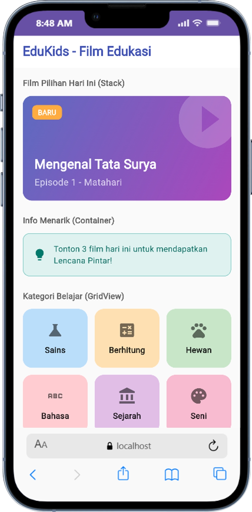
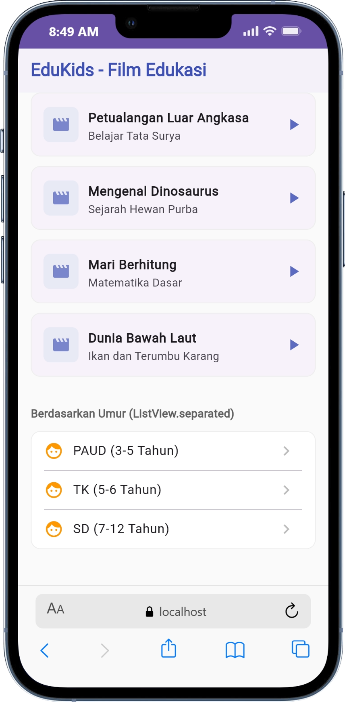
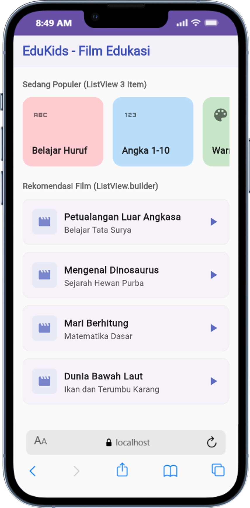

<h1 align="center">LAPORAN PRAKTIKUM</h1>
<h1 align="center">APLIKASI BERBASIS PLATFORM</h1>

<br>

<h2 align="center">MODUL 3-4</h2>
<h2 align="center">MOBILE</h2>

<br><br>

<p align="center">

</p>
<br><br><br>

<h2 align="center">Disusun Oleh :</h2>

<p align="center" style="font-size:28px;">
  <b>Nofita Fitriyani</b><br>
  <b>2311102001</b><br>
  <b>S1 IF-11-REG 01</b>
</p>
<br>
<h2 align="center">Dosen Pengampu :</h2>

<p align="center" style="font-size:28px;">
  <b>Dimas Fanny Hebrasianto Permadi, S.ST., M.Kom</b>
</p>
<br>
<h2 align="center">Asisten Praktikum :</h2>

<p align="center" style="font-size:28px;">
  <b>Apri Pandu Wicaksono</b><br>
  <b>Rangga Pradarrell Fathi</b>
</p>
<br>
<h1 align="center">LABORATORIUM HIGH PERFORMANCE</h1>
<h1 align="center">FAKULTAS INFORMATIKA</h1>
<h1 align="center">UNIVERSITAS TELKOM PURWOKERTO</h1>
<h1 align="center">TAHUN 2026</h1>

<hr>

### Dasar Teori
#### 1. Flutter
Flutter merupakan framework open-source yang dikembangkan oleh Google untuk membangun aplikasi mobile, web, dan desktop menggunakan satu basis kode (single codebase). Flutter menggunakan bahasa pemrograman Dart dan menerapkan konsep widget sebagai komponen utama dalam pembuatan antarmuka pengguna (UI).

Pada praktikum ini, Flutter digunakan untuk membuat tampilan aplikasi sederhana yang menampilkan berbagai jenis widget UI seperti Container, GridView, ListView, dan Stack. Implementasi widget tersebut dapat dilihat pada source code aplikasi edukasi anak yang dibuat menggunakan Flutter.

#### 2. widget
Widget adalah komponen dasar dalam Flutter yang digunakan untuk membangun tampilan aplikasi. Semua elemen pada Flutter seperti teks, tombol, gambar, hingga layout merupakan widget. Widget dapat disusun secara hierarkis untuk membentuk antarmuka aplikasi yang kompleks.

Contoh implementasi widget pada praktikum ini adalah penggunaan `MaterialApp, Scaffold, Container, GridView, dan ListView` dalam membangun tampilan aplikasi edukasi film anak.

#### 3. Container
Container merupakan widget pada Flutter yang digunakan untuk membuat sebuah kotak atau area tampilan. Widget ini dapat diberi warna, ukuran, padding, margin, border, maupun dekorasi lainnya.

Pada praktikum ini, Container digunakan untuk menampilkan informasi menarik berupa kotak berwarna teal yang berisi teks dan ikon.

Contoh implementasi:
```
Container(
  width: double.infinity,
  padding: const EdgeInsets.all(16),
  decoration: BoxDecoration(
    color: Colors.teal[50],
    borderRadius: BorderRadius.circular(12),
  ),
)
```
Implementasi tersebut menghasilkan tampilan kotak berwarna dengan sudut melengkung yang digunakan sebagai media informasi pada aplikasi.

#### 4. GridView
GridView adalah widget yang digunakan untuk menampilkan data dalam bentuk grid atau kisi-kisi. Widget ini cocok digunakan untuk menampilkan menu, kategori, maupun galeri gambar.

Pada praktikum ini, GridView digunakan untuk menampilkan 6 kategori pembelajaran seperti Sains, Berhitung, Hewan, Bahasa, Sejarah, dan Seni.

Contoh implementasi:
```
GridView.count(
  crossAxisCount: 3,
  children: List.generate(categories.length, (index) {
    return Container();
  }),
)
```
Properti `crossAxisCount: 3` menunjukkan bahwa setiap baris memiliki 3 kolom.

#### 5. ListView
ListView merupakan widget yang digunakan untuk menampilkan daftar item secara vertikal maupun horizontal. Widget ini sering digunakan untuk menampilkan data yang berulang.

Pada praktikum ini, ListView digunakan untuk menampilkan 3 item populer yaitu “Belajar Huruf”, “Angka 1-10”, dan “Warna Warni”.

Contoh implementasi:
```
ListView(
  scrollDirection: Axis.horizontal,
  children: [
    _buildPopularCard(...),
  ],
)
```
Implementasi tersebut menghasilkan daftar horizontal yang dapat digeser oleh pengguna.

#### 6. ListView.builder
ListView.builder adalah jenis ListView yang digunakan untuk membuat daftar secara dinamis berdasarkan data array. Widget ini lebih efisien karena item dibuat hanya ketika diperlukan.

Pada praktikum ini, ListView.builder digunakan untuk menampilkan daftar rekomendasi film berdasarkan data array filmList.
Contoh implementasi:
```
ListView.builder(
  itemCount: filmList.length,
  itemBuilder: (context, index) {
    return Card();
  },
)
```
Widget ini mempermudah pembuatan list dengan jumlah data yang banyak dan dinamis.

#### 7. ListView.separated
ListView.separated merupakan pengembangan dari ListView yang memungkinkan adanya garis pembatas atau separator antar item.

Pada praktikum ini, widget ini digunakan untuk menampilkan kategori umur dengan garis pemisah antar data.

Contoh implementasi:
```
ListView.separated(
  itemBuilder: (context, index) {
    return ListTile();
  },
  separatorBuilder: (context, index) {
    return const Divider();
  },
)
```
Widget Divider() digunakan sebagai garis pemisah antar item list.

#### 8. Stack
Stack merupakan widget Flutter yang digunakan untuk menampilkan beberapa widget secara bertumpuk (overlay). Widget yang berada di atas dapat diatur posisinya menggunakan Positioned.

Pada praktikum ini, Stack digunakan untuk membuat tampilan banner film pilihan dengan teks, ikon, dan label yang saling bertumpuk.

Contoh implementasi:
```
Stack(
  children: [
    Container(),
    Positioned(
      top: 16,
      left: 16,
      child: Container(),
    ),
  ],
)
```
Penggunaan Stack memungkinkan tampilan aplikasi menjadi lebih menarik dan interaktif.

### Source Code
```
import 'package:flutter/material.dart';

void main() {
  runApp(const EduKidsApp());
}

class EduKidsApp extends StatelessWidget {
  const EduKidsApp({super.key});

  @override
  Widget build(BuildContext context) {
    return MaterialApp(
      title: 'Film Edukasi Anak',
      debugShowCheckedModeBanner: false,
      theme: ThemeData(
        primarySwatch: Colors.indigo,
        scaffoldBackgroundColor: Colors.grey[50],
      ),
      home: const HomePage(),
    );
  }
}

class HomePage extends StatefulWidget {
  const HomePage({super.key});

  @override
  State<HomePage> createState() => _HomePageState();
}

class _HomePageState extends State<HomePage> {
  // Data array untuk ListView.builder
  final List<Map<String, String>> filmList = [
    {'title': 'Petualangan Luar Angkasa', 'subtitle': 'Belajar Tata Surya'},
    {'title': 'Mengenal Dinosaurus', 'subtitle': 'Sejarah Hewan Purba'},
    {'title': 'Mari Berhitung', 'subtitle': 'Matematika Dasar'},
    {'title': 'Dunia Bawah Laut', 'subtitle': 'Ikan dan Terumbu Karang'},
  ];

  // Data array untuk ListView.separated
  final List<String> ageCategories = [
    'PAUD (3-5 Tahun)',
    'TK (5-6 Tahun)',
    'SD (7-12 Tahun)',
  ];

  // Data array untuk GridView (Minimal 6 Item)
  final List<Map<String, dynamic>> categories = [
    {'title': 'Sains', 'icon': Icons.science, 'color': Colors.blue[100]},
    {'title': 'Berhitung', 'icon': Icons.calculate, 'color': Colors.orange[100]},
    {'title': 'Hewan', 'icon': Icons.pets, 'color': Colors.green[100]},
    {'title': 'Bahasa', 'icon': Icons.abc, 'color': Colors.red[100]},
    {'title': 'Sejarah', 'icon': Icons.account_balance, 'color': Colors.purple[100]},
    {'title': 'Seni', 'icon': Icons.palette, 'color': Colors.pink[100]},
  ];

  @override
  Widget build(BuildContext context) {
    return Scaffold(
      appBar: AppBar(
        title: const Text('EduKids - Film Edukasi', style: TextStyle(fontWeight: FontWeight.bold)),
        backgroundColor: Colors.white,
        foregroundColor: Colors.indigo,
        elevation: 0,
      ),
      body: SingleChildScrollView(
        padding: const EdgeInsets.all(16),
        child: Column(
          crossAxisAlignment: CrossAxisAlignment.start,
          children: [
            // ==========================================
            // 6. STACK (Tampilan Bertumpuk)
            // ==========================================
            const SectionTitle(title: 'Film Pilihan Hari Ini (Stack)'),
            SizedBox(
              width: double.infinity,
              height: 180,
              child: Stack(
                children: [
                  Container(
                    width: double.infinity,
                    height: 180,
                    decoration: BoxDecoration(
                      borderRadius: BorderRadius.circular(16),
                      gradient: LinearGradient(
                        colors: [Colors.indigo[400]!, Colors.purple[400]!],
                        begin: Alignment.topLeft,
                        end: Alignment.bottomRight,
                      ),
                    ),
                  ),
                  Positioned(
                    right: -20,
                    top: -20,
                    child: Icon(Icons.play_circle_filled, size: 120, color: Colors.white.withOpacity(0.2)),
                  ),
                  const Positioned(
                    bottom: 20,
                    left: 20,
                    child: Column(
                      crossAxisAlignment: CrossAxisAlignment.start,
                      children: [
                        Text(
                          'Mengenal Tata Surya',
                          style: TextStyle(color: Colors.white, fontSize: 22, fontWeight: FontWeight.bold),
                        ),
                        SizedBox(height: 4),
                        Text(
                          'Episode 1 - Matahari',
                          style: TextStyle(color: Colors.white70, fontSize: 16),
                        ),
                      ],
                    ),
                  ),
                  Positioned(
                    top: 16,
                    left: 16,
                    child: Container(
                      padding: const EdgeInsets.symmetric(horizontal: 10, vertical: 4),
                      decoration: BoxDecoration(
                        color: Colors.orangeAccent,
                        borderRadius: BorderRadius.circular(8),
                      ),
                      child: const Text('BARU', style: TextStyle(color: Colors.white, fontWeight: FontWeight.bold, fontSize: 12)),
                    ),
                  )
                ],
              ),
            ),
            const SizedBox(height: 24),

            // ==========================================
            // 1. CONTAINER (Kotak Berwarna)
            // ==========================================
            const SectionTitle(title: 'Info Menarik (Container)'),
            Container(
              width: double.infinity,
              padding: const EdgeInsets.all(16),
              decoration: BoxDecoration(
                color: Colors.teal[50],
                borderRadius: BorderRadius.circular(12),
                border: Border.all(color: Colors.teal[200]!),
              ),
              child: Row(
                children: [
                  Icon(Icons.lightbulb, color: Colors.teal[700]),
                  const SizedBox(width: 12),
                  Expanded(
                    child: Text(
                      'Tonton 3 film hari ini untuk mendapatkan Lencana Pintar!',
                      style: TextStyle(color: Colors.teal[800], fontSize: 14),
                    ),
                  ),
                ],
              ),
            ),
            const SizedBox(height: 24),

            // ==========================================
            // 2. GRIDVIEW (Minimal 6 Item)
            // ==========================================
            const SectionTitle(title: 'Kategori Belajar (GridView)'),
            GridView.count(
              crossAxisCount: 3,
              shrinkWrap: true,
              physics: const NeverScrollableScrollPhysics(),
              crossAxisSpacing: 12,
              mainAxisSpacing: 12,
              childAspectRatio: 1.1,
              children: List.generate(categories.length, (index) {
                return Container(
                  decoration: BoxDecoration(
                    color: categories[index]['color'],
                    borderRadius: BorderRadius.circular(16),
                  ),
                  child: Column(
                    mainAxisAlignment: MainAxisAlignment.center,
                    children: [
                      Icon(categories[index]['icon'], size: 32, color: Colors.black54),
                      const SizedBox(height: 8),
                      Text(
                        categories[index]['title'],
                        style: const TextStyle(fontWeight: FontWeight.bold, color: Colors.black87),
                      ),
                    ],
                  ),
                );
              }),
            ),
            const SizedBox(height: 24),

            // ==========================================
            // 3. LISTVIEW (3 Item - A, B, C)
            // ==========================================
            const SectionTitle(title: 'Sedang Populer (ListView 3 Item)'),
            SizedBox(
              height: 120,
              child: ListView(
                scrollDirection: Axis.horizontal,
                children: [
                  _buildPopularCard('Belajar Huruf', Colors.red[100]!, Icons.abc),
                  _buildPopularCard('Angka 1-10', Colors.blue[100]!, Icons.onetwothree),
                  _buildPopularCard('Warna Warni', Colors.green[100]!, Icons.color_lens),
                ],
              ),
            ),
            const SizedBox(height: 24),

            // ==========================================
            // 4. LISTVIEW.BUILDER (List dari data array)
            // ==========================================
            const SectionTitle(title: 'Rekomendasi Film (ListView.builder)'),
            ListView.builder(
              shrinkWrap: true,
              physics: const NeverScrollableScrollPhysics(),
              itemCount: filmList.length,
              itemBuilder: (context, index) {
                return Card(
                  margin: const EdgeInsets.only(bottom: 12),
                  elevation: 0,
                  shape: RoundedRectangleBorder(
                    borderRadius: BorderRadius.circular(12),
                    side: BorderSide(color: Colors.grey[200]!)
                  ),
                  child: ListTile(
                    contentPadding: const EdgeInsets.symmetric(horizontal: 16, vertical: 8),
                    leading: Container(
                      padding: const EdgeInsets.all(10),
                      decoration: BoxDecoration(
                        color: Colors.indigo[50],
                        borderRadius: BorderRadius.circular(8),
                      ),
                      child: Icon(Icons.movie, color: Colors.indigo[300]),
                    ),
                    title: Text(filmList[index]['title']!, style: const TextStyle(fontWeight: FontWeight.bold)),
                    subtitle: Text(filmList[index]['subtitle']!),
                    trailing: Icon(Icons.play_arrow, color: Colors.indigo[400]),
                  ),
                );
              },
            ),
            const SizedBox(height: 24),

            // ==========================================
            // 5. LISTVIEW.SEPARATED (List + Garis pembatas)
            // ==========================================
            const SectionTitle(title: 'Berdasarkan Umur (ListView.separated)'),
            Container(
              decoration: BoxDecoration(
                color: Colors.white,
                borderRadius: BorderRadius.circular(12),
                border: Border.all(color: Colors.grey[200]!),
              ),
              child: ListView.separated(
                shrinkWrap: true,
                physics: const NeverScrollableScrollPhysics(),
                itemCount: ageCategories.length,
                itemBuilder: (context, index) {
                  return ListTile(
                    leading: const Icon(Icons.face, color: Colors.orange),
                    title: Text(ageCategories[index], style: const TextStyle(fontWeight: FontWeight.w500)),
                    trailing: Icon(Icons.chevron_right, color: Colors.grey[400]),
                  );
                },
                separatorBuilder: (context, index) {
                  return const Divider(height: 1, indent: 16, endIndent: 16);
                },
              ),
            ),
            const SizedBox(height: 30),
          ],
        ),
      ),
    );
  }

  // Widget custom untuk dipakai di nomor 3 (ListView)
  Widget _buildPopularCard(String title, Color color, IconData icon) {
    return Container(
      width: 140,
      margin: const EdgeInsets.only(right: 16),
      decoration: BoxDecoration(
        color: color,
        borderRadius: BorderRadius.circular(16),
      ),
      padding: const EdgeInsets.all(16),
      child: Column(
        crossAxisAlignment: CrossAxisAlignment.start,
        mainAxisAlignment: MainAxisAlignment.spaceBetween,
        children: [
          Icon(icon, color: Colors.black54, size: 30),
          Text(
            title,
            style: const TextStyle(fontWeight: FontWeight.bold, fontSize: 16, color: Colors.black87),
          ),
        ],
      ),
    );
  }
}

// Widget untuk judul setiap bagian
class SectionTitle extends StatelessWidget {
  final String title;
  const SectionTitle({super.key, required this.title});

  @override
  Widget build(BuildContext context) {
    return Padding(
      padding: const EdgeInsets.only(bottom: 12),
      child: Text(
        title,
        style: TextStyle(fontSize: 14, fontWeight: FontWeight.bold, color: Colors.grey[700]),
      ),
    );
  }
}
```

### Output 




### Penjelasan Kode Program
#### Container
Source Code :
```
Container(
  width: double.infinity,
  padding: const EdgeInsets.all(16),
  decoration: BoxDecoration(
    color: Colors.teal[50],
    borderRadius: BorderRadius.circular(12),
    border: Border.all(color: Colors.teal[200]!),
  ),
)
```
Penjelasan :
Kode tersebut digunakan untuk membuat kotak berwarna sebagai tampilan informasi. Properti width: double.infinity membuat Container memenuhi lebar layar. padding digunakan untuk memberi jarak isi dari tepi kotak. Bagian decoration digunakan untuk mengatur warna latar, sudut melengkung, dan garis tepi.

#### GridView
Source Code :
```
GridView.count(
  crossAxisCount: 3,
  shrinkWrap: true,
  physics: const NeverScrollableScrollPhysics(),
  crossAxisSpacing: 12,
  mainAxisSpacing: 12,
  children: List.generate(categories.length, (index) {
    return Container(
      decoration: BoxDecoration(
        color: categories[index]['color'],
        borderRadius: BorderRadius.circular(16),
      ),
      child: Column(
        mainAxisAlignment: MainAxisAlignment.center,
        children: [
          Icon(categories[index]['icon']),
          Text(categories[index]['title']),
        ],
      ),
    );
  }),
)
```
Penjelasan :
Kode tersebut digunakan untuk menampilkan data dalam bentuk grid. Properti crossAxisCount: 3 berarti setiap baris terdiri dari 3 kolom. Data grid diambil dari array categories yang berisi minimal 6 item. Setiap item ditampilkan dalam bentuk Container berwarna, ikon, dan teks kategori.

#### ListView
Source Code :
```
ListView(
  scrollDirection: Axis.horizontal,
  children: [
    _buildPopularCard('Belajar Huruf', Colors.red[100]!, Icons.abc),
    _buildPopularCard('Angka 1-10', Colors.blue[100]!, Icons.onetwothree),
    _buildPopularCard('Warna Warni', Colors.green[100]!, Icons.color_lens),
  ],
)
```
Penjelasan :
Kode tersebut digunakan untuk menampilkan 3 item dalam bentuk daftar horizontal. Properti scrollDirection: Axis.horizontal membuat daftar dapat digeser ke samping. Tiga item yang ditampilkan adalah “Belajar Huruf”, “Angka 1-10”, dan “Warna Warni”.

#### ListView.builder
Source Code :
```
ListView.builder(
  shrinkWrap: true,
  physics: const NeverScrollableScrollPhysics(),
  itemCount: filmList.length,
  itemBuilder: (context, index) {
    return Card(
      child: ListTile(
        title: Text(filmList[index]['title']!),
        subtitle: Text(filmList[index]['subtitle']!),
      ),
    );
  },
)
```
Penjelasan :
Kode tersebut digunakan untuk menampilkan list berdasarkan data array filmList. Properti itemCount menentukan jumlah data yang akan ditampilkan. Bagian itemBuilder digunakan untuk membuat tampilan setiap item berdasarkan index. Dengan cara ini, list dapat dibuat secara dinamis sesuai jumlah data pada array.

#### ListView.separated
Source Code :
```
ListView.separated(
  shrinkWrap: true,
  physics: const NeverScrollableScrollPhysics(),
  itemCount: ageCategories.length,
  itemBuilder: (context, index) {
    return ListTile(
      leading: const Icon(Icons.face, color: Colors.orange),
      title: Text(ageCategories[index]),
      trailing: Icon(Icons.chevron_right),
    );
  },
  separatorBuilder: (context, index) {
    return const Divider(height: 1);
  },
)
```
Penjelasan :
Kode tersebut digunakan untuk menampilkan list kategori umur dengan garis pembatas antar item. Data yang ditampilkan berasal dari array ageCategories. Bagian separatorBuilder digunakan untuk menambahkan Divider() sebagai garis pemisah antar item.

#### Stack
Source Code :
```
Stack(
  children: [
    Container(
      width: double.infinity,
      height: 180,
      decoration: BoxDecoration(
        color: Colors.indigo,
        borderRadius: BorderRadius.circular(16),
      ),
    ),
    const Positioned(
      bottom: 20,
      left: 20,
      child: Text(
        'Mengenal Tata Surya',
        style: TextStyle(color: Colors.white),
      ),
    ),
    Positioned(
      top: 16,
      left: 16,
      child: Container(
        child: const Text('BARU'),
      ),
    ),
  ],
)
```
Penjelasan :
Kode tersebut digunakan untuk membuat tampilan bertumpuk. Container pertama berfungsi sebagai background. Widget Positioned digunakan untuk meletakkan teks dan label pada posisi tertentu di atas Container. Dengan Stack, beberapa widget dapat ditampilkan saling menumpuk dalam satu area.
