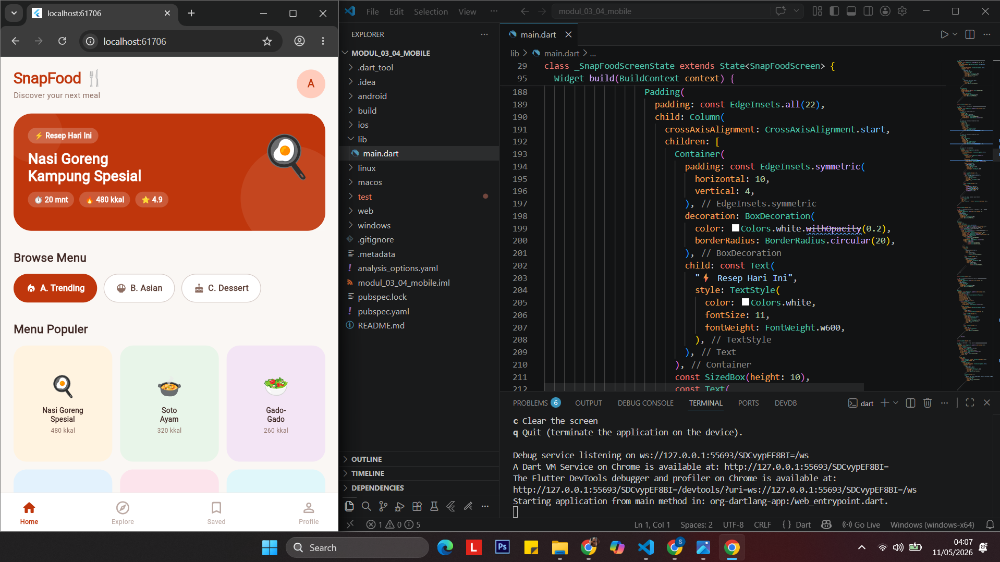

<<<<<<< HEAD
<div align="center">

## LAPORAN PRAKTIKUM <br> APLIKASI BERBASIS PLATFORM

### MODUL 3 & 4
### MOBILE

<br>
<br>


<br>
<br>

**Disusun oleh:**  
**Syafanida Khakiki**  
**2311102006**

<br>

**KELAS PS1IF-11-REG01**  
**Dosen: Dimas Fanny Hebrasianto Permadi, S.ST., M.Kom**

<br><br>

## PROGRAM STUDI S1 TEKNIK INFORMATIKA <br> FAKULTAS INFORMATIKA <br> UNIVERSITAS TELKOM PURWOKERTO <br> 2026 <br><br>

</div>

---

## 1. Dasar Teori

Flutter adalah framework UI open-source dari Google yang digunakan untuk membangun aplikasi mobile, web, dan desktop dari satu codebase. Flutter menggunakan bahasa pemrograman **Dart** dan merender antarmuka menggunakan mesin grafis sendiri (Skia/Impeller), sehingga tampilannya konsisten di berbagai platform.

### Widget di Flutter

Di Flutter, **semua elemen tampilan adalah widget**. Widget dapat bersifat:
- **Stateless Widget** — widget yang tidak memiliki state yang berubah, cocok untuk tampilan statis.
- **Stateful Widget** — widget yang memiliki state internal yang bisa berubah, digunakan untuk elemen interaktif.

### Widget Layout yang Digunakan

| Widget | Deskripsi |
|--------|-----------|
| **Container** | Widget serbaguna untuk mengatur ukuran, warna, padding, margin, dan dekorasi kotak. |
| **Stack** | Menumpuk beberapa widget di atas satu sama lain. Berguna untuk membuat banner berlapis. |
| **GridView** | Menampilkan widget dalam tata letak grid (baris dan kolom). `GridView.count` mengatur jumlah kolom secara langsung. |
| **ListView** | Menampilkan daftar item secara horizontal atau vertikal yang dapat di-scroll. |
| **ListView.builder** | Versi efisien dari ListView yang membangun item secara lazy (hanya item yang terlihat). Cocok untuk data dinamis dari array. |
| **ListView.separated** | Mirip `ListView.builder` namun dengan pemisah (separator/divider) antar item. |

### Scaffold & Material Design

`Scaffold` adalah widget dasar yang menyediakan struktur visual aplikasi Material Design, meliputi `AppBar`, `body`, `BottomNavigationBar`, dan `FloatingActionButton`. Flutter menggunakan **Material 3** (M3) sebagai standar desain terbaru dengan sistem warna adaptif berbasis `colorSchemeSeed`.

---

## 2. Hasil Praktikum

### Deskripsi Aplikasi

Aplikasi yang dibuat adalah **SnapFood** — sebuah aplikasi food discovery bergaya Pinterest yang memungkinkan pengguna menjelajahi menu makanan populer, melihat daftar chef unggulan, serta mengecek bahan masakan yang sedang trending. Tema yang digunakan adalah kuliner dengan warna dominan burnt orange dan coklat hangat.

---

### Langkah-Langkah Pembuatan

**1.** Buka **Visual Studio Code** dan pastikan extension **Flutter** dan **Dart** sudah terpasang. Verifikasi instalasi Flutter dengan menjalankan perintah berikut di terminal:

```bash
flutter doctor
```

**2.** Buat project Flutter baru melalui menu **View → Command Palette → Flutter: New Project → Application**, pilih folder tujuan, beri nama project `snap_food`, lalu tekan Enter dan tunggu hingga proses selesai.

**3.** Setelah project selesai dibuat, buka file `lib/main.dart`, lalu hapus semua kode yang ada.

**4.** Tambahkan kode berikut secara lengkap pada `lib/main.dart`:

```dart
import 'package:flutter/material.dart';

void main() => runApp(const SnapFoodApp());

class SnapFoodApp extends StatelessWidget {
  const SnapFoodApp({super.key});

  @override
  Widget build(BuildContext context) {
    return MaterialApp(
      debugShowCheckedModeBanner: false,
      theme: ThemeData(
        useMaterial3: true,
        colorSchemeSeed: Colors.deepOrange,
        fontFamily: 'Georgia',
      ),
      home: const SnapFoodScreen(),
    );
  }
}

class SnapFoodScreen extends StatefulWidget {
  const SnapFoodScreen({super.key});

  @override
  State<SnapFoodScreen> createState() => _SnapFoodScreenState();
}

class _SnapFoodScreenState extends State<SnapFoodScreen> {
  int _selectedCategory = 0;

  // Data untuk ListView (kategori horizontal) — 3 item A, B, C
  final List<Map<String, dynamic>> categories = const [
    {"label": "A. Trending", "icon": Icons.local_fire_department},
    {"label": "B. Asian",    "icon": Icons.rice_bowl},
    {"label": "C. Dessert",  "icon": Icons.cake},
  ];

  // Data untuk ListView.builder (chef highlights)
  final List<Map<String, dynamic>> chefs = const [
    {"name": "Chef Arya",  "specialty": "Nusantara Fusion", "rating": "4.9"},
    {"name": "Chef Mira",  "specialty": "Modern Pastry",    "rating": "4.8"},
    {"name": "Chef Budi",  "specialty": "Street Food",      "rating": "4.7"},
    {"name": "Chef Laras", "specialty": "Vegan Cuisine",    "rating": "4.6"},
  ];

  // Data untuk ListView.separated (bahan trending)
  final List<String> ingredients = const [
    "Tempe Orek",
    "Rendang Sapi",
    "Ayam Geprek",
  ];

  // Data untuk GridView — 6 item makanan
  final List<Map<String, dynamic>> foods = const [
    {"name": "Nasi Goreng\nSpesial", "emoji": "🍳", "cal": "480 kkal", "color": Color(0xFFFFF3E0)},
    {"name": "Soto\nAyam",           "emoji": "🍲", "cal": "320 kkal", "color": Color(0xFFE8F5E9)},
    {"name": "Gado-\nGado",          "emoji": "🥗", "cal": "260 kkal", "color": Color(0xFFF3E5F5)},
    {"name": "Mie\nAyam",            "emoji": "🍜", "cal": "390 kkal", "color": Color(0xFFE3F2FD)},
    {"name": "Martabak\nManis",      "emoji": "🥞", "cal": "520 kkal", "color": Color(0xFFFCE4EC)},
    {"name": "Es\nDawet",            "emoji": "🧃", "cal": "180 kkal", "color": Color(0xFFE0F7FA)},
  ];

  @override
  Widget build(BuildContext context) {
    return Scaffold(
      backgroundColor: const Color(0xFFFAF7F4),
      body: SafeArea(
        child: SingleChildScrollView(
          child: Column(
            crossAxisAlignment: CrossAxisAlignment.start,
            children: [

              // ─── HEADER ───────────────────────────────────────
              Padding(
                padding: const EdgeInsets.fromLTRB(20, 16, 20, 0),
                child: Row(
                  mainAxisAlignment: MainAxisAlignment.spaceBetween,
                  children: [
                    Column(
                      crossAxisAlignment: CrossAxisAlignment.start,
                      children: const [
                        Text("SnapFood 🍴",
                            style: TextStyle(
                                fontSize: 24,
                                fontWeight: FontWeight.w900,
                                color: Color(0xFFBF360C),
                                letterSpacing: -0.5)),
                        Text("Discover your next meal",
                            style: TextStyle(fontSize: 12, color: Color(0xFF8D6E63))),
                      ],
                    ),
                    CircleAvatar(
                      radius: 22,
                      backgroundColor: const Color(0xFFFFCCBC),
                      child: const Text("A",
                          style: TextStyle(
                              fontWeight: FontWeight.bold,
                              color: Color(0xFFBF360C))),
                    ),
                  ],
                ),
              ),

              const SizedBox(height: 20),

              // ─── 1. STACK — Hero Banner ─────────────────────────
              Padding(
                padding: const EdgeInsets.symmetric(horizontal: 20),
                child: Stack(
                  children: [
                    Container(
                      height: 180,
                      width: double.infinity,
                      decoration: BoxDecoration(
                        color: const Color(0xFFBF360C),
                        borderRadius: BorderRadius.circular(28),
                      ),
                    ),
                    Positioned(
                      right: -30, bottom: -30,
                      child: Container(
                        width: 160, height: 160,
                        decoration: BoxDecoration(
                          shape: BoxShape.circle,
                          color: Colors.white.withOpacity(0.08),
                        ),
                      ),
                    ),
                    Positioned(
                      left: -15, top: -15,
                      child: Container(
                        width: 90, height: 90,
                        decoration: BoxDecoration(
                          shape: BoxShape.circle,
                          color: Colors.white.withOpacity(0.06),
                        ),
                      ),
                    ),
                    Padding(
                      padding: const EdgeInsets.all(22),
                      child: Column(
                        crossAxisAlignment: CrossAxisAlignment.start,
                        children: [
                          Container(
                            padding: const EdgeInsets.symmetric(horizontal: 10, vertical: 4),
                            decoration: BoxDecoration(
                              color: Colors.white.withOpacity(0.2),
                              borderRadius: BorderRadius.circular(20),
                            ),
                            child: const Text("⚡ Resep Hari Ini",
                                style: TextStyle(
                                    color: Colors.white,
                                    fontSize: 11,
                                    fontWeight: FontWeight.w600)),
                          ),
                          const SizedBox(height: 10),
                          const Text("Nasi Goreng\nKampung Spesial",
                              style: TextStyle(
                                  color: Colors.white,
                                  fontSize: 22,
                                  fontWeight: FontWeight.w800,
                                  height: 1.2)),
                          const SizedBox(height: 12),
                          Row(
                            children: [
                              _statBadge("⏱ 20 mnt"),
                              const SizedBox(width: 8),
                              _statBadge("🔥 480 kkal"),
                              const SizedBox(width: 8),
                              _statBadge("⭐ 4.9"),
                            ],
                          )
                        ],
                      ),
                    ),
                    const Positioned(
                      right: 20, top: 20,
                      child: Text("🍳", style: TextStyle(fontSize: 64)),
                    ),
                  ],
                ),
              ),

              const SizedBox(height: 28),

              // ─── 2. LISTVIEW (Horizontal) — Kategori A, B, C ──────
              const Padding(
                padding: EdgeInsets.only(left: 20, bottom: 12),
                child: Text("Browse Menu",
                    style: TextStyle(
                        fontSize: 18, fontWeight: FontWeight.w800, color: Color(0xFF3E2723))),
              ),
              SizedBox(
                height: 44,
                child: ListView(
                  scrollDirection: Axis.horizontal,
                  padding: const EdgeInsets.symmetric(horizontal: 20),
                  children: List.generate(categories.length, (i) {
                    final isSelected = _selectedCategory == i;
                    return GestureDetector(
                      onTap: () => setState(() => _selectedCategory = i),
                      child: AnimatedContainer(
                        duration: const Duration(milliseconds: 200),
                        margin: const EdgeInsets.only(right: 10),
                        padding: const EdgeInsets.symmetric(horizontal: 18),
                        decoration: BoxDecoration(
                          color: isSelected ? const Color(0xFFBF360C) : Colors.white,
                          borderRadius: BorderRadius.circular(22),
                          border: Border.all(
                            color: isSelected
                                ? const Color(0xFFBF360C)
                                : const Color(0xFFD7CCC8),
                          ),
                        ),
                        child: Row(
                          children: [
                            Icon(categories[i]['icon'],
                                size: 16,
                                color: isSelected ? Colors.white : const Color(0xFF8D6E63)),
                            const SizedBox(width: 6),
                            Text(categories[i]['label'],
                                style: TextStyle(
                                    fontWeight: FontWeight.w600,
                                    fontSize: 13,
                                    color: isSelected ? Colors.white : const Color(0xFF5D4037))),
                          ],
                        ),
                      ),
                    );
                  }),
                ),
              ),

              const SizedBox(height: 28),

              // ─── 3. GRIDVIEW — 6 Makanan Popular ─────────────────
              const Padding(
                padding: EdgeInsets.only(left: 20, bottom: 12),
                child: Text("Menu Populer",
                    style: TextStyle(
                        fontSize: 18, fontWeight: FontWeight.w800, color: Color(0xFF3E2723))),
              ),
              Padding(
                padding: const EdgeInsets.symmetric(horizontal: 20),
                child: GridView.count(
                  shrinkWrap: true,
                  physics: const NeverScrollableScrollPhysics(),
                  crossAxisCount: 3,
                  mainAxisSpacing: 12,
                  crossAxisSpacing: 12,
                  childAspectRatio: 0.85,
                  children: foods.map((food) {
                    return Container(
                      decoration: BoxDecoration(
                        color: food['color'],
                        borderRadius: BorderRadius.circular(20),
                      ),
                      child: Column(
                        mainAxisAlignment: MainAxisAlignment.center,
                        children: [
                          Text(food['emoji'], style: const TextStyle(fontSize: 32)),
                          const SizedBox(height: 6),
                          Text(food['name'],
                              textAlign: TextAlign.center,
                              style: const TextStyle(
                                  fontSize: 11,
                                  fontWeight: FontWeight.w700,
                                  color: Color(0xFF3E2723),
                                  height: 1.3)),
                          const SizedBox(height: 4),
                          Text(food['cal'],
                              style: const TextStyle(fontSize: 9.5, color: Color(0xFF8D6E63))),
                        ],
                      ),
                    );
                  }).toList(),
                ),
              ),

              const SizedBox(height: 28),

              // ─── 4. CONTAINER — Promo Banner ──────────────────────
              Padding(
                padding: const EdgeInsets.symmetric(horizontal: 20),
                child: Container(
                  width: double.infinity,
                  padding: const EdgeInsets.all(18),
                  decoration: BoxDecoration(
                    color: const Color(0xFFFFF8E1),
                    borderRadius: BorderRadius.circular(20),
                    border: Border.all(color: const Color(0xFFFFCC80), width: 1.5),
                  ),
                  child: Row(
                    children: [
                      const Text("🎉", style: TextStyle(fontSize: 36)),
                      const SizedBox(width: 14),
                      Expanded(
                        child: Column(
                          crossAxisAlignment: CrossAxisAlignment.start,
                          children: const [
                            Text("Promo Hari Ini!",
                                style: TextStyle(
                                    fontWeight: FontWeight.w800,
                                    fontSize: 15,
                                    color: Color(0xFFE65100))),
                            SizedBox(height: 4),
                            Text(
                                "Diskon 30% untuk semua menu dessert. Berlaku hingga pukul 20.00.",
                                style: TextStyle(
                                    fontSize: 12,
                                    color: Color(0xFF795548),
                                    height: 1.4)),
                          ],
                        ),
                      )
                    ],
                  ),
                ),
              ),

              const SizedBox(height: 28),

              // ─── 5. LISTVIEW.BUILDER — Top Chefs ─────────────────
              const Padding(
                padding: EdgeInsets.only(left: 20, bottom: 12),
                child: Text("Top Chefs",
                    style: TextStyle(
                        fontSize: 18, fontWeight: FontWeight.w800, color: Color(0xFF3E2723))),
              ),
              ListView.builder(
                shrinkWrap: true,
                physics: const NeverScrollableScrollPhysics(),
                padding: const EdgeInsets.symmetric(horizontal: 20),
                itemCount: chefs.length,
                itemBuilder: (context, index) {
                  final chef = chefs[index];
                  return Container(
                    margin: const EdgeInsets.only(bottom: 10),
                    padding: const EdgeInsets.all(14),
                    decoration: BoxDecoration(
                      color: Colors.white,
                      borderRadius: BorderRadius.circular(18),
                      border: Border.all(color: const Color(0xFFEFEBE9)),
                    ),
                    child: Row(
                      children: [
                        CircleAvatar(
                          radius: 24,
                          backgroundColor: const Color(0xFFFFCCBC),
                          child: Text(
                            chef['name'].toString().split(' ')[1][0],
                            style: const TextStyle(
                                fontWeight: FontWeight.bold,
                                fontSize: 18,
                                color: Color(0xFFBF360C)),
                          ),
                        ),
                        const SizedBox(width: 14),
                        Expanded(
                          child: Column(
                            crossAxisAlignment: CrossAxisAlignment.start,
                            children: [
                              Text(chef['name'],
                                  style: const TextStyle(
                                      fontWeight: FontWeight.w700,
                                      fontSize: 14,
                                      color: Color(0xFF3E2723))),
                              Text(chef['specialty'],
                                  style: const TextStyle(
                                      fontSize: 12, color: Color(0xFF8D6E63))),
                            ],
                          ),
                        ),
                        Container(
                          padding: const EdgeInsets.symmetric(horizontal: 10, vertical: 5),
                          decoration: BoxDecoration(
                            color: const Color(0xFFFFF3E0),
                            borderRadius: BorderRadius.circular(12),
                          ),
                          child: Row(
                            children: [
                              const Icon(Icons.star_rounded,
                                  size: 14, color: Color(0xFFFF6F00)),
                              const SizedBox(width: 3),
                              Text(chef['rating'],
                                  style: const TextStyle(
                                      fontWeight: FontWeight.w700,
                                      fontSize: 12,
                                      color: Color(0xFFE65100))),
                            ],
                          ),
                        )
                      ],
                    ),
                  );
                },
              ),

              const SizedBox(height: 28),

              // ─── 6. LISTVIEW.SEPARATED — Bahan Trending ───────────
              const Padding(
                padding: EdgeInsets.only(left: 20, bottom: 12),
                child: Text("Bahan Trending",
                    style: TextStyle(
                        fontSize: 18, fontWeight: FontWeight.w800, color: Color(0xFF3E2723))),
              ),
              Padding(
                padding: const EdgeInsets.symmetric(horizontal: 20),
                child: Container(
                  decoration: BoxDecoration(
                    color: Colors.white,
                    borderRadius: BorderRadius.circular(20),
                    border: Border.all(color: const Color(0xFFEFEBE9)),
                  ),
                  child: ListView.separated(
                    shrinkWrap: true,
                    physics: const NeverScrollableScrollPhysics(),
                    itemCount: ingredients.length,
                    separatorBuilder: (_, __) => const Divider(
                        height: 1, indent: 56, endIndent: 16, color: Color(0xFFF5F5F5)),
                    itemBuilder: (context, index) {
                      return ListTile(
                        contentPadding:
                            const EdgeInsets.symmetric(horizontal: 16, vertical: 4),
                        leading: Container(
                          width: 36, height: 36,
                          alignment: Alignment.center,
                          decoration: BoxDecoration(
                            color: const Color(0xFFFBE9E7),
                            borderRadius: BorderRadius.circular(10),
                          ),
                          child: Text(
                            ["🫘", "🥩", "🍗"][index],
                            style: const TextStyle(fontSize: 18),
                          ),
                        ),
                        title: Text(ingredients[index],
                            style: const TextStyle(
                                fontWeight: FontWeight.w600,
                                fontSize: 14,
                                color: Color(0xFF3E2723))),
                        subtitle: Text("${(index + 1) * 234} resep",
                            style: const TextStyle(
                                fontSize: 11, color: Color(0xFF8D6E63))),
                        trailing: const Icon(Icons.trending_up_rounded,
                            color: Color(0xFFE64A19), size: 20),
                      );
                    },
                  ),
                ),
              ),

              const SizedBox(height: 30),
            ],
          ),
        ),
      ),

      // Bottom Navigation Bar
      bottomNavigationBar: Container(
        decoration: const BoxDecoration(
          color: Colors.white,
          border: Border(top: BorderSide(color: Color(0xFFEFEBE9))),
        ),
        child: SafeArea(
          child: Padding(
            padding: const EdgeInsets.symmetric(horizontal: 30, vertical: 10),
            child: Row(
              mainAxisAlignment: MainAxisAlignment.spaceBetween,
              children: [
                _navItem(Icons.home_rounded,             "Home",    true),
                _navItem(Icons.explore_outlined,         "Explore", false),
                _navItem(Icons.bookmark_border_rounded,  "Saved",   false),
                _navItem(Icons.person_outline_rounded,   "Profile", false),
              ],
            ),
          ),
        ),
      ),
    );
  }

  Widget _statBadge(String label) {
    return Container(
      padding: const EdgeInsets.symmetric(horizontal: 9, vertical: 4),
      decoration: BoxDecoration(
        color: Colors.white.withOpacity(0.18),
        borderRadius: BorderRadius.circular(20),
      ),
      child: Text(label,
          style: const TextStyle(
              color: Colors.white, fontSize: 11, fontWeight: FontWeight.w600)),
    );
  }

  Widget _navItem(IconData icon, String label, bool active) {
    return Column(
      mainAxisSize: MainAxisSize.min,
      children: [
        Icon(icon,
            size: 24,
            color: active ? const Color(0xFFBF360C) : const Color(0xFFBCAAA4)),
        const SizedBox(height: 2),
        Text(label,
            style: TextStyle(
                fontSize: 10,
                fontWeight: active ? FontWeight.w700 : FontWeight.w400,
                color: active ? const Color(0xFFBF360C) : const Color(0xFFBCAAA4))),
      ],
    );
  }
}
```

**5.** Jalankan aplikasi di Chrome (tampilan mobile) dengan perintah berikut di terminal:

```bash
flutter run -d chrome
```

Atau jalankan di emulator Android dengan:

```bash
flutter run
```

---

### Output:

> 📸 *Tambahkan screenshot hasil tampilan aplikasi di sini*



---

## 3. Penjelasan Widget yang Digunakan

### 3.1 Container — Promo Banner

`Container` digunakan untuk membuat kotak dekoratif berisi informasi promo. Widget ini mendukung properti `color`, `padding`, `decoration` (untuk `borderRadius` dan `border`), serta `width`.

```dart
Container(
  width: double.infinity,
  padding: const EdgeInsets.all(18),
  decoration: BoxDecoration(
    color: const Color(0xFFFFF8E1),
    borderRadius: BorderRadius.circular(20),
    border: Border.all(color: const Color(0xFFFFCC80), width: 1.5),
  ),
  child: ...,
)
```

---

### 3.2 Stack — Hero Banner Bertumpuk

`Stack` digunakan pada hero banner untuk menumpuk beberapa layer: background kotak merah, dua lingkaran dekorasi semi-transparan, teks konten, dan emoji makanan. Setiap layer diposisikan menggunakan `Positioned`.

```dart
Stack(
  children: [
    Container(...),           // Layer 1: background
    Positioned(...),          // Layer 2: lingkaran besar
    Positioned(...),          // Layer 3: lingkaran kecil
    Padding(child: Column()), // Layer 4: teks
    Positioned(child: Text("🍳")), // Layer 5: emoji
  ],
)
```

---

### 3.3 GridView — Menu Populer (6 Item)

`GridView.count` digunakan untuk menampilkan 6 kartu menu makanan dalam tata letak 3 kolom. Properti `shrinkWrap: true` dan `NeverScrollableScrollPhysics` digunakan agar GridView tidak berkonflik dengan `SingleChildScrollView` di atasnya.

```dart
GridView.count(
  shrinkWrap: true,
  physics: const NeverScrollableScrollPhysics(),
  crossAxisCount: 3,
  mainAxisSpacing: 12,
  crossAxisSpacing: 12,
  childAspectRatio: 0.85,
  children: foods.map((food) => ...).toList(),
)
```

---

### 3.4 ListView — Kategori Horizontal (A, B, C)

`ListView` dengan `scrollDirection: Axis.horizontal` digunakan untuk menampilkan 3 chip kategori yang dapat di-scroll secara horizontal. Item diklik menggunakan `GestureDetector` dan `setState` untuk mengubah tampilan aktif.

```dart
ListView(
  scrollDirection: Axis.horizontal,
  children: List.generate(categories.length, (i) {
    return GestureDetector(
      onTap: () => setState(() => _selectedCategory = i),
      child: AnimatedContainer(...),
    );
  }),
)
```

---

### 3.5 ListView.builder — Top Chefs

`ListView.builder` digunakan untuk merender daftar 4 chef secara dinamis dari array `chefs`. Widget ini efisien karena hanya membangun item yang diperlukan, bukan seluruh list sekaligus.

```dart
ListView.builder(
  shrinkWrap: true,
  physics: const NeverScrollableScrollPhysics(),
  itemCount: chefs.length,
  itemBuilder: (context, index) {
    final chef = chefs[index];
    return Container(...); // kartu chef
  },
)
```

---

### 3.6 ListView.separated — Bahan Trending

`ListView.separated` digunakan untuk menampilkan 3 bahan masakan trending dengan garis pemisah `Divider` di antara setiap item. `separatorBuilder` mendefinisikan tampilan pemisah tersebut.

```dart
ListView.separated(
  shrinkWrap: true,
  physics: const NeverScrollableScrollPhysics(),
  itemCount: ingredients.length,
  separatorBuilder: (_, __) => const Divider(
      height: 1, indent: 56, endIndent: 16),
  itemBuilder: (context, index) {
    return ListTile(...);
  },
)
```

---

## 4. Kesimpulan

Pada praktikum Modul 3 & 4 ini telah berhasil dibuat aplikasi **SnapFood** menggunakan Flutter dengan tema food discovery. Semua widget yang diwajibkan telah diimplementasikan, yaitu `Container`, `Stack`, `GridView`, `ListView`, `ListView.builder`, dan `ListView.separated`. Masing-masing widget memiliki kegunaan yang berbeda dalam membangun antarmuka yang kaya dan responsif. Penggunaan `StatefulWidget` memungkinkan interaksi dinamis seperti pergantian kategori aktif pada filter horizontal. Flutter terbukti mampu menghasilkan tampilan mobile yang modern dan menarik hanya dengan satu codebase Dart.
=======
# Modul_03-04_Mobile-
Kumpulkan tugas sesuai dengan ketentuan seperti biasa
>>>>>>> ac7fd59ca70531748cd9bfe2d364639992dfdc6d
