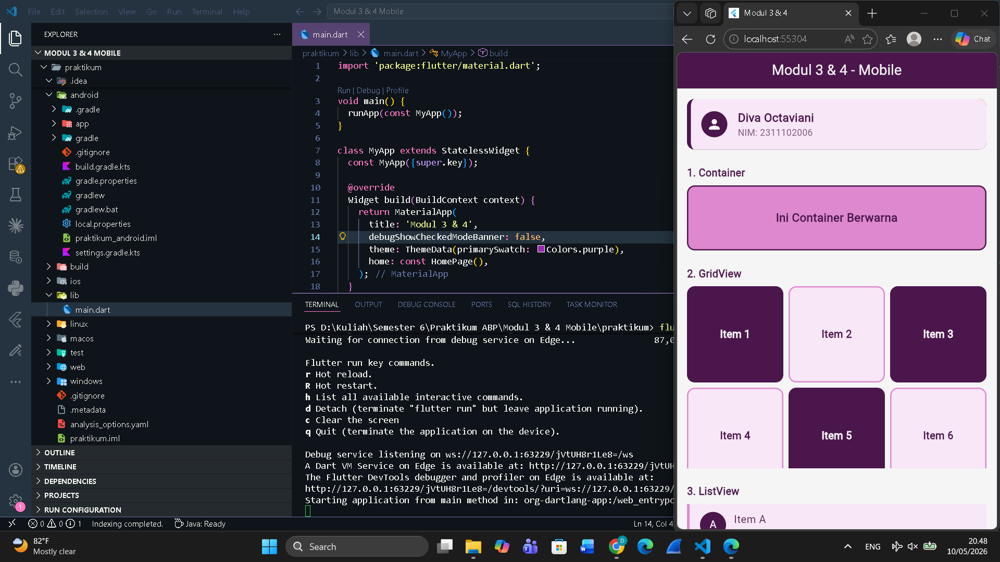
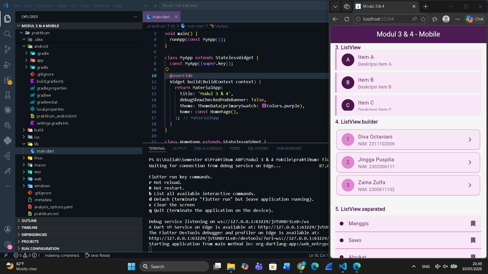
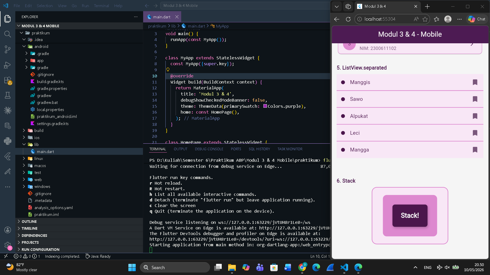

<div align="center">

## LAPORAN PRAKTIKUM <br> APLIKASI BERBASIS PLATFORM

<br>

### MODUL 3 & 4
### MOBILE

<br>
<br>


<br>
<br>
<br>

**Disusun oleh:**

**Diva Octaviani**  
**2311102006**

<br>

**KELAS PS1IF-11-REG01**

**Dosen: Dimas Fanny Hebrasianto Permadi, S.ST., M.Kom**

<br><br>

## PROGRAM STUDI S1 TEKNIK INFORMATIKA <br> FAKULTAS INFORMATIKA <br> UNIVERSITAS TELKOM PURWOKERTO <br> 2026 <br><br>

</div>

---

## 1. Dasar Teori

Flutter menyediakan berbagai widget layout yang fleksibel untuk membangun antarmuka aplikasi mobile. Widget-widget ini dibagi menjadi dua kategori utama: widget tunggal dan widget multi-child.

**Container** adalah widget serbaguna yang dapat menampung satu child widget dan mendukung kustomisasi seperti warna, border, padding, margin, dan border radius. Container sering digunakan sebagai pembungkus elemen UI agar tampilan lebih terstruktur.

**GridView** adalah widget scrollable yang menampilkan child widget dalam susunan grid dua dimensi. `GridView.count` memungkinkan penentuan jumlah kolom secara langsung melalui parameter `crossAxisCount`, cocok untuk tampilan galeri atau menu berbasis grid.

**ListView** adalah widget scrollable yang menampilkan child widget secara berurutan dalam satu arah (vertikal maupun horizontal). Flutter menyediakan beberapa varian ListView:
- `ListView` biasa untuk jumlah item yang sedikit dan sudah diketahui.
- `ListView.builder` untuk daftar panjang atau dinamis, karena hanya merender item yang terlihat di layar (*lazy loading*).
- `ListView.separated` mirip dengan `ListView.builder`, namun menambahkan separator (pemisah) antar item secara otomatis menggunakan `separatorBuilder`.

**Stack** adalah widget yang memungkinkan penumpukan beberapa child widget secara berlapis (z-axis). Widget yang didefinisikan lebih akhir akan tampil di atas. Stack sering digunakan untuk membuat efek overlay, badge, atau tampilan bertumpuk.

---

## 2. Hasil Praktikum

### Langkah-Langkah:

**1.** Buka Visual Studio Code dan buat project Flutter baru melalui **View → Command Palette → Flutter: New Project → Application**, pilih folder tujuan, beri nama project misal `praktikum`, lalu tekan Enter.

**2.** Setelah project selesai dibuat, buka file `lib/main.dart` dan hapus semua kode bawaan.

**3.** Tambahkan kode berikut pada `main.dart` — bagian `MyApp` sebagai entry point aplikasi:

```dart
import 'package:flutter/material.dart';

void main() {
  runApp(const MyApp());
}

class MyApp extends StatelessWidget {
  const MyApp({super.key});

  @override
  Widget build(BuildContext context) {
    return MaterialApp(
      title: 'Modul 3 & 4',
      debugShowCheckedModeBanner: false,
      theme: ThemeData(primarySwatch: Colors.purple),
      home: const HomePage(),
    );
  }
}
```

**4.** Buat widget `HomePage` sebagai halaman utama dengan `Scaffold` dan `SingleChildScrollView` agar seluruh konten dapat di-scroll:

```dart
class HomePage extends StatelessWidget {
  const HomePage({super.key});

  @override
  Widget build(BuildContext context) {
    return Scaffold(
      backgroundColor: const Color(0xFFF5F5F5),
      appBar: AppBar(
        title: const Text('Modul 3 & 4 - Mobile'),
        centerTitle: true,
        backgroundColor: const Color(0xFF4B164C),
        foregroundColor: const Color(0xFFF5F5F5),
      ),
      body: SingleChildScrollView(
        padding: const EdgeInsets.all(16),
        child: Column(
          crossAxisAlignment: CrossAxisAlignment.start,
          children: [
            // widget-widget ditambahkan di sini
          ],
        ),
      ),
    );
  }
}
```

**5.** Tambahkan widget **Container** untuk menampilkan kotak berwarna dengan border dan teks di tengah:

```dart
Container(
  width: double.infinity,
  height: 100,
  decoration: BoxDecoration(
    color: const Color(0xFFDD88CF),
    border: Border.all(color: const Color(0xFF4B164C), width: 2),
    borderRadius: BorderRadius.circular(12),
  ),
  alignment: Alignment.center,
  child: const Text(
    'Ini Container Berwarna',
    style: TextStyle(
      color: Color(0xFF4B164C),
      fontSize: 18,
      fontWeight: FontWeight.bold,
    ),
  ),
),
```

**6.** Tambahkan **GridView** dengan 6 item menggunakan `GridView.count`, item genap dan ganjil diberi warna berbeda:

```dart
SizedBox(
  height: 280,
  child: GridView.count(
    crossAxisCount: 3,
    crossAxisSpacing: 8,
    mainAxisSpacing: 8,
    children: List.generate(6, (index) {
      bool isFilled = index % 2 == 0;
      return Container(
        decoration: BoxDecoration(
          color: isFilled ? const Color(0xFF4B164C) : const Color(0xFFF8E7F6),
          border: isFilled ? null : Border.all(color: const Color(0xFFDD88CF), width: 2),
          borderRadius: BorderRadius.circular(12),
        ),
        alignment: Alignment.center,
        child: Text(
          'Item ${index + 1}',
          style: TextStyle(
            color: isFilled ? const Color(0xFFF5F5F5) : const Color(0xFF4B164C),
            fontWeight: FontWeight.bold,
          ),
        ),
      );
    }),
  ),
),
```

**7.** Tambahkan **ListView** statis dengan 3 item (A, B, C) menggunakan `ListTile`:

```dart
SizedBox(
  height: 180,
  child: ListView(
    children: const [
      ListTile(
        leading: CircleAvatar(
          backgroundColor: Color(0xFF4B164C),
          foregroundColor: Color(0xFFF5F5F5),
          child: Text('A'),
        ),
        title: Text('Item A', style: TextStyle(color: Color(0xFF4B164C))),
        subtitle: Text('Deskripsi item A', style: TextStyle(color: Color(0xFF7A577C))),
        tileColor: Color(0xFFF8E7F6),
        shape: Border(left: BorderSide(color: Color(0xFFDD88CF), width: 4)),
      ),
      // Item B dan C mengikuti pola yang sama
    ],
  ),
),
```

**8.** Tambahkan **ListView.builder** yang merender daftar mahasiswa dari array data secara dinamis:

```dart
SizedBox(
  height: 220,
  child: ListView.builder(
    itemCount: mahasiswa.length,
    itemBuilder: (context, index) {
      return Card(
        color: const Color(0xFFF8E7F6),
        shape: RoundedRectangleBorder(
          side: const BorderSide(color: Color(0xFFDD88CF)),
          borderRadius: BorderRadius.circular(10),
        ),
        child: ListTile(
          leading: CircleAvatar(
            backgroundColor: const Color(0xFFDD88CF),
            foregroundColor: const Color(0xFF4B164C),
            child: Text('${index + 1}'),
          ),
          title: Text(mahasiswa[index]['nama']!, style: const TextStyle(color: Color(0xFF4B164C))),
          subtitle: Text(mahasiswa[index]['nim']!, style: const TextStyle(color: Color(0xFF7A577C))),
          trailing: const Icon(Icons.arrow_forward_ios, size: 16, color: Color(0xFF4B164C)),
        ),
      );
    },
  ),
),
```

**9.** Tambahkan **ListView.separated** yang menampilkan daftar buah dengan garis pemisah antar item:

```dart
SizedBox(
  height: 300,
  child: ListView.separated(
    itemCount: buah.length,
    separatorBuilder: (context, index) => const Divider(
      color: Color(0xFFDD88CF),
      thickness: 2,
      height: 1,
    ),
    itemBuilder: (context, index) {
      return Container(
        padding: const EdgeInsets.all(14),
        color: const Color(0xFFF8E7F6),
        child: Row(
          children: [
            Container(
              width: 12, height: 12,
              decoration: const BoxDecoration(color: Color(0xFF4B164C), shape: BoxShape.circle),
            ),
            const SizedBox(width: 16),
            Text(buah[index], style: const TextStyle(color: Color(0xFF4B164C), fontSize: 16)),
            const Spacer(),
            const Icon(Icons.bookmark, color: Color(0xFF7A577C)),
          ],
        ),
      );
    },
  ),
),
```

**10.** Tambahkan **Stack** dengan tiga kotak bertumpuk untuk menampilkan efek layer:

```dart
Center(
  child: SizedBox(
    width: 240,
    height: 180,
    child: Stack(
      alignment: Alignment.center,
      children: [
        Container(
          width: 240, height: 180,
          decoration: BoxDecoration(
            color: const Color(0xFFF8E7F6),
            border: Border.all(color: const Color(0xFFDD88CF), width: 2),
            borderRadius: BorderRadius.circular(16),
          ),
        ),
        Container(
          width: 170, height: 130,
          decoration: BoxDecoration(color: const Color(0xFFDD88CF), borderRadius: BorderRadius.circular(12)),
        ),
        Container(
          width: 110, height: 70,
          decoration: BoxDecoration(
            color: const Color(0xFF4B164C),
            borderRadius: BorderRadius.circular(8),
          ),
          alignment: Alignment.center,
          child: const Text('Stack!', style: TextStyle(color: Color(0xFFF5F5F5), fontSize: 20, fontWeight: FontWeight.bold)),
        ),
      ],
    ),
  ),
),
```

**11.** Tambahkan data array di luar class untuk digunakan oleh `ListView.builder` dan `ListView.separated`:

```dart
final List<Map<String, String>> mahasiswa = [
  {'nama': 'Diva Octaviani', 'nim': 'NIM: 2311102006'},
  {'nama': 'Jingga Puspita', 'nim': 'NIM: 2302006111'},
  {'nama': 'Zaina Zulfa', 'nim': 'NIM: 2300611102'},
];

final List<String> buah = ['Manggis', 'Sawo', 'Alpukat', 'Leci', 'Mangga'];
```

**12.** Jalankan aplikasi dengan perintah `flutter run` di terminal, lalu pilih platform yang diinginkan.

### Output:





