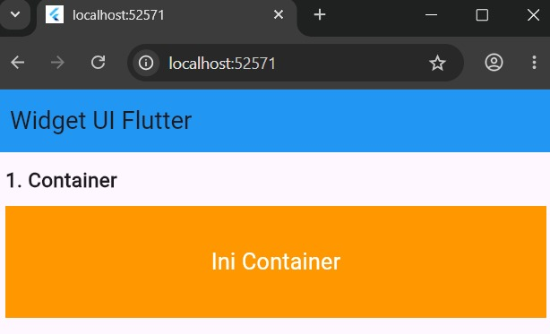
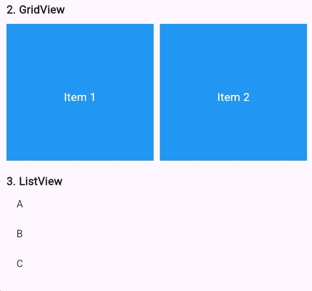
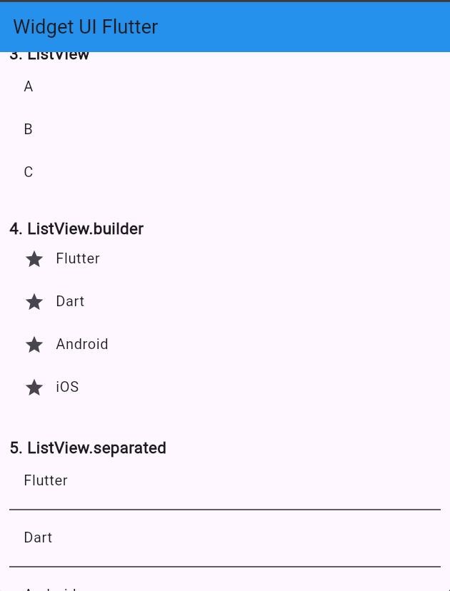
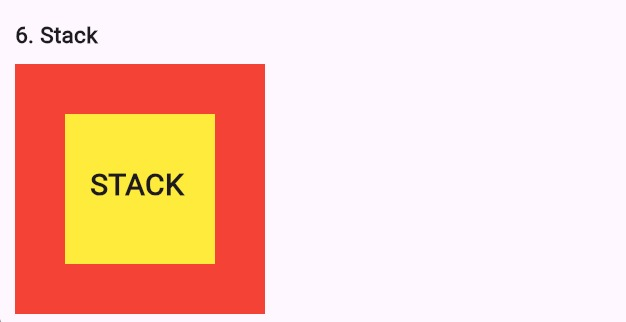

<div align="center">
  <br />
  <h1>LAPORAN PRAKTIKUM<br>APLIKASI BERBASIS PLATFORM</h1>
  <br />
  <h3>Modul 03 04 Mobile</h3>
  <br />
  
  <br />
  <br />
  <br />
  <h3>Disusun Oleh :</h3>
  <p>
    <strong>Nadhif Atha Zaki</strong><br>
    <strong>2311102007</strong><br>
    <strong>S1 IF-11-01</strong>
  </p>
  <br />
  <h3>Dosen Pengampu :</h3>
  <p>
    <strong>Dimas Fanny Hebrasianto Permadi, S.ST., M.Kom</strong>
  </p>
  <br />
  <br />
  <h4>Asisten Praktikum :</h4>
  <strong>Apri Pandu Wicaksono</strong> <br>
  <strong>Rangga Pradarrell Fathi</strong>
  <br />
  <br />
  <br />
  <br />
  <h3>LABORATORIUM HIGH PERFORMANCE <br> FAKULTAS INFORMATIKA <br> UNIVERSITAS TELKOM PURWOKERTO <br> 2026</h3>
</div>

---

## DASAR TEORI

Flutter merupakan framework open-source yang dikembangkan oleh Google untuk membangun aplikasi mobile, web, dan desktop menggunakan satu basis kode (single codebase). Flutter menggunakan bahasa pemrograman Dart dan menyediakan berbagai widget untuk membangun tampilan antarmuka aplikasi secara fleksibel dan responsif.

Flutter memiliki keunggulan pada performa yang cepat, tampilan UI modern, fitur hot reload, serta kemampuan cross-platform sehingga developer dapat membuat aplikasi Android dan iOS secara bersamaan.

---

## PENJELASAN SOURCE CODE

### 1. Import Library Flutter

```dart
import 'package:flutter/material.dart';
```

Kode tersebut digunakan untuk mengimpor library Material Design Flutter agar dapat menggunakan widget seperti Scaffold, AppBar, Container, ListView, dan lainnya.

### 2. Fungsi Main

```dart
void main() {
  runApp(MyApp());
}
```

Fungsi `main()` merupakan titik awal program Flutter yang menjalankan widget utama `MyApp`.

### 3. Widget MyApp

```dart
class MyApp extends StatelessWidget {
  final List<String> data = ["Flutter", "Dart", "Android", "iOS", "Widget"];
  ...
}
```

Widget ini berfungsi sebagai root aplikasi. Di dalamnya juga dideklarasikan variabel `data` berupa `List<String>` yang berisi 5 item teknologi, yaitu: Flutter, Dart, Android, iOS, dan Widget. Data ini digunakan pada widget `ListView.builder` dan `ListView.separated`.

### 4. Penggunaan SingleChildScrollView

```dart
SingleChildScrollView(
  child: Padding(
    padding: EdgeInsets.all(12),
    ...
  ),
)
```

Widget ini digunakan agar halaman dapat di-scroll secara vertikal karena memuat banyak widget di dalamnya. Seluruh konten dibungkus dengan `Padding` sebesar 12 pixel di semua sisi.

### 5. Penggunaan List Data

```dart
final List<String> data = ["Flutter", "Dart", "Android", "iOS", "Widget"];
```

Data array bertipe `List<String>` dideklarasikan langsung di dalam kelas `MyApp` dan digunakan pada `ListView.builder` serta `ListView.separated` untuk menampilkan item secara dinamis.

---

## SCREENSHOT HASIL

### 1. Tampilan Widget Container


### 2. Tampilan GridView dan ListView



### 3. Tampilan Stack


---

## PENJELASAN SINGKAT TIAP WIDGET

### 1. Container

Container digunakan untuk membuat kotak atau area tertentu pada tampilan aplikasi. Widget ini dapat diberikan warna, ukuran, margin, padding, alignment, dan dekorasi lainnya.

Pada program ini, Container dibuat dengan tinggi 100, lebar penuh (`double.infinity`), warna oranye, dan teks "Ini Container" berwarna putih yang diposisikan di tengah menggunakan `Alignment.center`.

```dart
Container(
  height: 100,
  width: double.infinity,
  alignment: Alignment.center,
  color: Colors.orange,
  child: Text(
    "Ini Container",
    style: TextStyle(color: Colors.white, fontSize: 20),
  ),
),
```

### 2. GridView

GridView digunakan untuk menampilkan data dalam bentuk grid atau kisi-kisi.

Pada program ini, `GridView.count` menampilkan 6 item kotak berwarna biru dalam susunan **2 kolom** (`crossAxisCount: 2`), dengan spasi antar kolom dan baris sebesar 10 pixel. `NeverScrollableScrollPhysics()` digunakan agar GridView tidak scroll secara mandiri karena sudah dibungkus `SingleChildScrollView`.

```dart
GridView.count(
  crossAxisCount: 2,
  crossAxisSpacing: 10,
  mainAxisSpacing: 10,
  physics: NeverScrollableScrollPhysics(),
  children: List.generate(6, (index) {
    return Container(
      alignment: Alignment.center,
      color: Colors.blue,
      child: Text("Item ${index + 1}", ...),
    );
  }),
),
```

### 3. ListView

ListView digunakan untuk menampilkan daftar data secara vertikal.

Pada program ini, `ListView` menampilkan 3 item statis menggunakan `ListTile` dengan judul A, B, dan C, dibatasi tingginya dengan `Container` setinggi 150 pixel.

```dart
ListView(
  children: [
    ListTile(title: Text("A")),
    ListTile(title: Text("B")),
    ListTile(title: Text("C")),
  ],
),
```

### 4. ListView.builder

`ListView.builder` digunakan untuk membuat list secara dinamis berdasarkan jumlah data tertentu secara efisien.

Pada program ini, data dari variabel `data` (berisi 5 item: Flutter, Dart, Android, iOS, Widget) ditampilkan secara dinamis. Setiap item dilengkapi ikon bintang (`Icons.star`) di bagian leading.

```dart
ListView.builder(
  itemCount: data.length,
  itemBuilder: (context, index) {
    return ListTile(
      leading: Icon(Icons.star),
      title: Text(data[index]),
    );
  },
),
```

### 5. ListView.separated

`ListView.separated` digunakan untuk membuat list yang memiliki pemisah antar item.

Pada program ini, data yang sama dengan `ListView.builder` ditampilkan dan setiap item dipisahkan menggunakan `Divider` berwarna hitam.

```dart
ListView.separated(
  itemCount: data.length,
  separatorBuilder: (context, index) {
    return Divider(color: Colors.black);
  },
  itemBuilder: (context, index) {
    return ListTile(title: Text(data[index]));
  },
),
```

### 6. Stack

Stack digunakan untuk menampilkan widget secara bertumpuk (overlay).

Pada program ini, Stack menumpuk tiga elemen: sebuah `Container` merah berukuran 200x200 sebagai latar, sebuah `Container` kuning berukuran 120x120 yang diposisikan dengan `Positioned` (top: 40, left: 40), dan teks "STACK" yang diposisikan di atas keduanya (top: 80, left: 60).

```dart
Stack(
  children: [
    Container(width: 200, height: 200, color: Colors.red),
    Positioned(
      top: 40,
      left: 40,
      child: Container(width: 120, height: 120, color: Colors.yellow),
    ),
    Positioned(
      top: 80,
      left: 60,
      child: Text("STACK", style: TextStyle(fontSize: 24, fontWeight: FontWeight.bold)),
    ),
  ],
),
```

---

## KESIMPULAN

Berdasarkan praktikum yang telah dilakukan, dapat disimpulkan bahwa Flutter menyediakan berbagai widget yang mempermudah pengembangan antarmuka aplikasi mobile. Widget seperti Container, GridView, ListView, dan Stack dapat digunakan untuk membuat tampilan aplikasi yang menarik dan interaktif.

Penggunaan Flutter juga mempermudah pengembangan aplikasi karena mendukung konsep widget-based UI serta fitur hot reload yang membantu proses pengembangan menjadi lebih cepat dan efisien.

---
