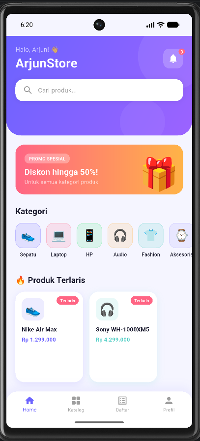
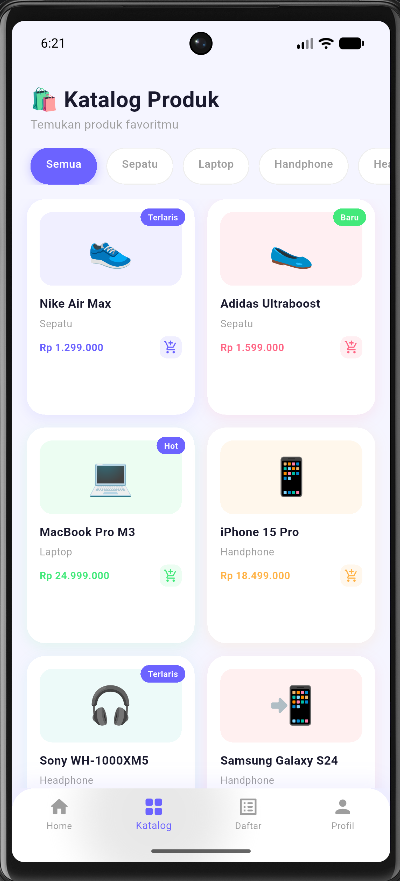
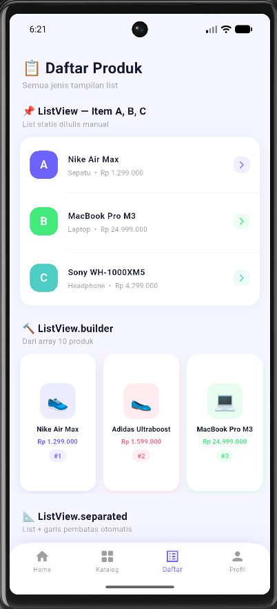
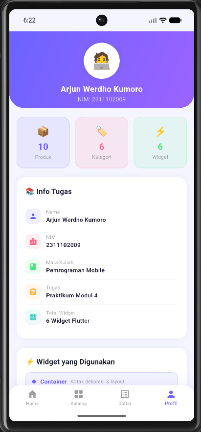

   
  <h1>LAPORAN PRAKTIKUM  APLIKASI BERBASIS PLATFORM</h1>
   
  <h3>MODUL 03-04 - Mobile   Pengenalan Flutter</h3>
   
  
   
   
   
  <h3>Disusun Oleh :</h3>
  

    <strong>Arjun Werdho Kumoro</strong> 
    <strong>2311102009</strong> 
    <strong>IF-11-REG01</strong>
  

   
  <h3>Dosen Pengampu :</h3>
  

    <strong>Dimas Fanny Hebrasianto Permadi, S.ST., M.Kom</strong>
  

   
  <h4>Asisten Praktikum :</h4>
  <strong>Apri Pandu Wicaksono</strong> 
  <strong>Rangga Pradarrell Fathi</strong>
    
  <h3>LABORATORIUM HIGH PERFORMANCE FAKULTAS INFORMATIKA UNIVERSITAS TELKOM PURWOKERTO 2026</h3>

---

## 📋 Daftar Isi

- [Deskripsi Proyek](#-deskripsi-proyek)
- [Ketentuan Tugas](#-ketentuan-tugas)
- [Struktur Aplikasi](#-struktur-aplikasi)
- [Penjelasan Widget](#-penjelasan-widget)
  - [Container](#1-container)
  - [Stack](#2-stack)
  - [GridView](#3-gridview)
  - [ListView](#4-listview)
  - [ListView.builder](#5-listviewbuilder)
  - [ListView.separated](#6-listviewseparated)
- [Screenshot](#-screenshot)
- [Cara Menjalankan](#-cara-menjalankan)

---

## 📱 Deskripsi Proyek

**ArjunStore** adalah aplikasi e-commerce sederhana berbasis Flutter yang menampilkan katalog produk dengan berbagai macam widget UI. Aplikasi ini memiliki 4 halaman utama yang dinavigasi menggunakan `BottomNavigationBar`:

| Halaman | Ikon | Keterangan |
|---------|------|------------|
| **Home** | 🏠 | Banner promo, kategori, dan produk terlaris |
| **Katalog** | 🔲 | Grid produk dengan filter kategori |
| **Daftar** | 📋 | Berbagai jenis tampilan ListView |
| **Profil** | 👤 | Informasi mahasiswa dan ringkasan tugas |

---

### Tampilan Home

### Tampilan Katalog

### Tampilan Daftar

### Tampilan Profile

