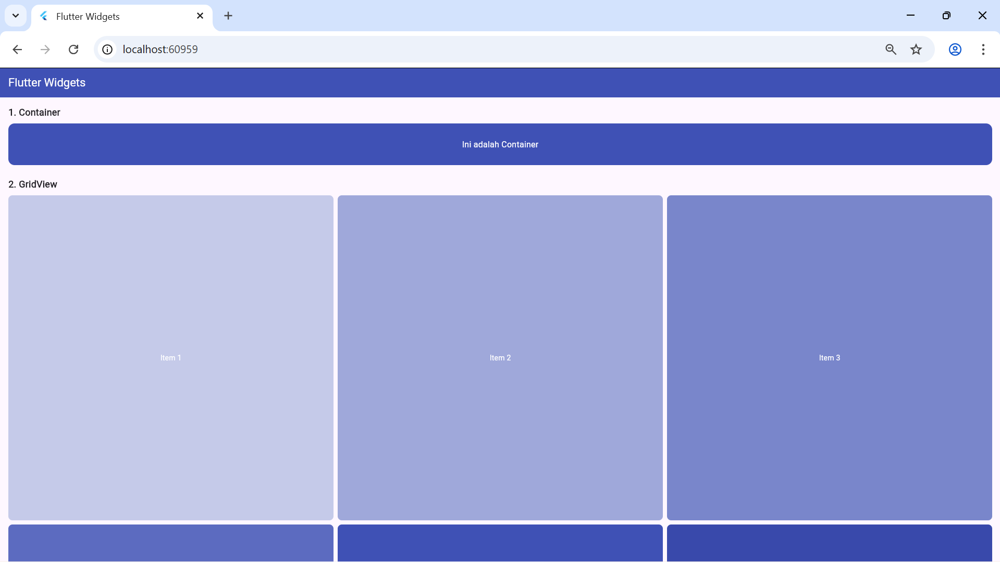
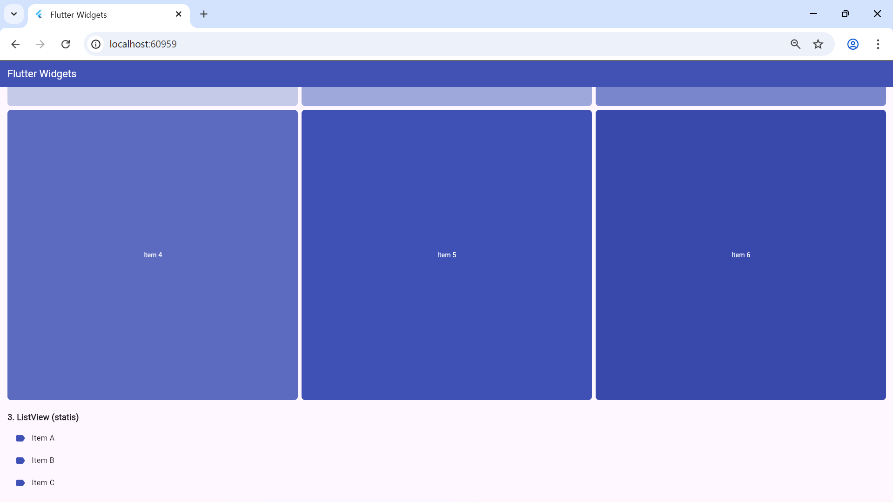
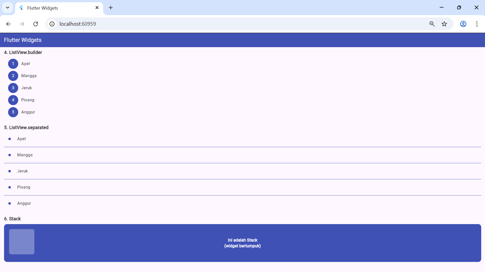

<div align="center">
  <br />
  <h1>LAPORAN PRAKTIKUM <br>APLIKASI BERBASIS PLATFORM</h1>
  <br />
  <h2> Mobile <br> Flutter Widgets </h2>
  <br />
  <br />
   
  <br />
  <br />
  <br />
  <h3>Disusun Oleh :</h3>
  <p>
    <strong>Annisa Al Jauhar</strong><br>
    <strong>2311102014</strong><br>
    <strong>S1 IF-11-REG 01</strong>
  </p>
  <br />
  <h3>Dosen Pengampu :</h3>
  <p>
    <strong>Dimas Fanny Hebrasianto Permadi, S.ST., M.Kom</strong>
  </p>
  <br />
  <br />
  <h4>Asisten Praktikum :</h4>
    <strong> Apri Pandu Wicaksono </strong> <br>
    <strong>Rangga Pradarrell Fathi</strong>
  <br />
  <h2>LABORATORIUM HIGH PERFORMANCE
 <br>FAKULTAS INFORMATIKA <br>UNIVERSITAS TELKOM PURWOKERTO <br>2026</h2>
</div>

---

# 1. Dasar Teori

Flutter adalah framework open-source dari Google untuk membangun aplikasi mobile, web, dan desktop dengan satu codebase menggunakan bahasa Dart. Flutter membangun UI menggunakan konsep **widget tree**, di mana semua elemen tampilan merupakan widget yang tersusun secara hierarkis.

Pada modul ini dipelajari beberapa widget dasar Flutter yang sering digunakan dalam membangun tampilan aplikasi, yaitu:

- **Container** — Widget serbaguna untuk membuat kotak dengan warna, ukuran, padding, margin, dan dekorasi yang dapat dikustomisasi.
- **GridView** — Widget untuk menampilkan item dalam bentuk grid (baris dan kolom). Menggunakan `GridView.count` untuk menentukan jumlah kolom.
- **ListView** — Widget untuk menampilkan daftar item secara vertikal. Terdapat tiga varian yang dipelajari yaitu ListView statis, ListView.builder, dan ListView.separated.
- **ListView.builder** — Varian ListView yang membangun item secara dinamis dari sebuah array data. Lebih efisien karena hanya merender item yang terlihat di layar.
- **ListView.separated** — Varian ListView.builder yang menambahkan widget pemisah (separator) antar setiap item, biasanya berupa `Divider`.
- **Stack** — Widget yang menumpuk beberapa widget di atas satu sama lain seperti layer. Widget yang ditulis terakhir akan berada di posisi paling atas.

---

# 2. Screenshot Tampilan (Hasil)

## Container & GridView (Item 1–3)
<p>

</p>

Gambar di atas menampilkan dua widget pertama. **Container** ditampilkan sebagai kotak berwarna indigo dengan teks "Ini adalah Container" di tengahnya. Di bawahnya terdapat **GridView** dengan 3 kolom yang menampilkan Item 1 hingga Item 3 dengan warna indigo bertingkat dari terang ke gelap.

---

## GridView (Item 4–6) & ListView Statis
<p>

</p>

Gambar di atas menampilkan lanjutan **GridView** yaitu Item 4, 5, dan 6 dengan warna indigo yang lebih gelap. Di bawahnya terdapat **ListView statis** yang menampilkan tiga item tetap yaitu Item A, Item B, dan Item C masing-masing dengan ikon label berwarna indigo di sebelah kiri.

---

## ListView.builder, ListView.separated & Stack
<p>

</p>

Gambar di atas menampilkan tiga widget terakhir. **ListView.builder** menampilkan daftar nama buah (Apel, Mangga, Jeruk, Pisang, Anggur) secara dinamis dari array dengan nomor urut di sebelah kiri. **ListView.separated** menampilkan daftar buah yang sama namun dengan garis pemisah (Divider) berwarna indigo antar itemnya. **Stack** ditampilkan sebagai kotak indigo dengan kotak transparan di pojok kiri atas dan teks "Ini adalah Stack (widget bertumpuk)" di tengahnya, menunjukkan konsep penumpukan layer.

---

# 3. Penjelasan Widget

### 1. Container
Container adalah widget kotak serbaguna yang dapat diatur ukuran, warna, padding, margin, dan dekorasinya menggunakan `BoxDecoration`. Pada praktikum ini, Container diberi warna indigo, sudut membulat dengan `borderRadius`, dan teks di tengah menggunakan widget `Center`.

```dart
Container(
  width: double.infinity,
  height: 80,
  decoration: BoxDecoration(
    color: Colors.indigo,
    borderRadius: BorderRadius.circular(12),
  ),
  child: const Center(
    child: Text('Ini adalah Container'),
  ),
),
```

---

### 2. GridView
GridView menampilkan item dalam susunan grid (baris dan kolom). `GridView.count` digunakan dengan `crossAxisCount: 3` untuk membuat 3 kolom. `shrinkWrap: true` dan `NeverScrollableScrollPhysics` digunakan agar GridView tidak scroll sendiri di dalam SingleChildScrollView.

```dart
GridView.count(
  crossAxisCount: 3,
  shrinkWrap: true,
  physics: const NeverScrollableScrollPhysics(),
  children: List.generate(6, (index) {
    return Container(
      child: Center(child: Text('Item ${index + 1}')),
    );
  }),
),
```

---

### 3. ListView (Statis)
ListView statis menampilkan daftar item yang sudah ditentukan langsung di dalam `children`. Digunakan untuk menampilkan 3 item tetap (A, B, C) menggunakan widget `ListTile` yang memiliki `leading` untuk ikon dan `title` untuk teks.

```dart
ListView(
  shrinkWrap: true,
  physics: const NeverScrollableScrollPhysics(),
  children: const [
    ListTile(leading: Icon(Icons.label), title: Text('Item A')),
    ListTile(leading: Icon(Icons.label), title: Text('Item B')),
    ListTile(leading: Icon(Icons.label), title: Text('Item C')),
  ],
),
```

---

### 4. ListView.builder
ListView.builder membangun item secara dinamis berdasarkan data dari array. Parameter `itemCount` menentukan jumlah item, dan `itemBuilder` membangun tampilan tiap item berdasarkan index. Lebih efisien untuk data dalam jumlah banyak karena hanya merender item yang tampil di layar.

```dart
ListView.builder(
  shrinkWrap: true,
  physics: const NeverScrollableScrollPhysics(),
  itemCount: buah.length,
  itemBuilder: (context, index) {
    return ListTile(
      leading: CircleAvatar(child: Text('${index + 1}')),
      title: Text(buah[index]),
    );
  },
),
```

---

### 5. ListView.separated
ListView.separated sama seperti ListView.builder namun menambahkan widget pemisah antar item melalui parameter `separatorBuilder`. Pada praktikum ini digunakan widget `Divider` berwarna indigo sebagai garis pemisah antar item.

```dart
ListView.separated(
  shrinkWrap: true,
  physics: const NeverScrollableScrollPhysics(),
  itemCount: buah.length,
  separatorBuilder: (context, index) => const Divider(color: Colors.indigo),
  itemBuilder: (context, index) {
    return ListTile(title: Text(buah[index]));
  },
),
```

---

### 6. Stack
Stack menumpuk beberapa widget di atas satu sama lain seperti layer. Urutan penulisan menentukan posisi — widget terakhir berada paling atas. Widget `Positioned` digunakan untuk mengatur posisi layer tertentu secara spesifik di dalam Stack.

```dart
Stack(
  children: [
    Container(color: Colors.indigo),        // layer bawah
    Positioned(
      top: 20, left: 20,
      child: Container(color: Colors.white30), // layer tengah
    ),
    const Center(child: Text('Ini adalah Stack')), // layer atas
  ],
),
```