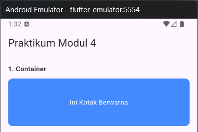
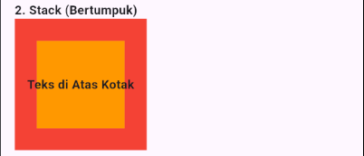
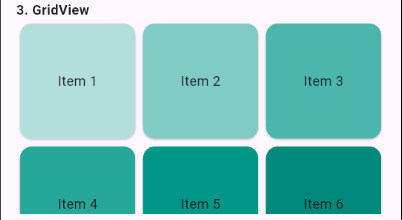
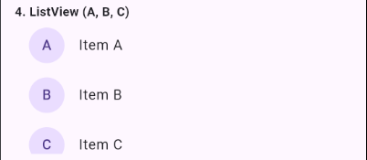
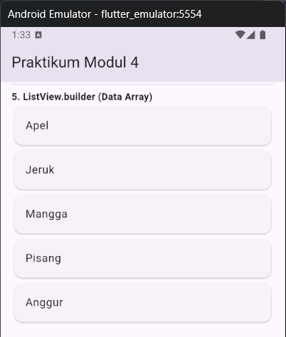
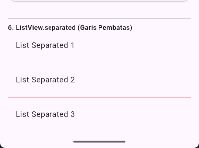

<div align="center">

# LAPORAN PRAKTIKUM
# APLIKASI BERBASIS PLATFORM

---

## MODUL 3 & 4
## FLUTTER (MOBILE)

---


---

**Disusun Oleh :**

**SHERINE NAURA EARLY GUNAWAN**

**2311102020**

**S1 IF-11-REG01**

---

**Dosen Pengampu :**

Dimas Fanny Hebrasianto Permadi, S.ST., M.Kom

---

**PROGRAM STUDI S1 INFORMATIKA**

**FAKULTAS INFORMATIKA**

**UNIVERSITAS TELKOM PURWOKERTO**

**2025/2026**

</div>

---

## 1. Dasar Teori
Flutter adalah sebuah framework sumber terbuka (open-source) yang dikembangkan oleh Google untuk membangun antarmuka pengguna (UI) aplikasi yang dikompilasi secara natif. Flutter memungkinkan pengembang untuk membuat aplikasi berkualitas tinggi untuk berbagai platform seperti Android, iOS, Web, dan Desktop hanya dengan menggunakan satu basis kode tunggal.

Dalam Flutter, hampir semua elemen antarmuka disebut sebagai Widget. Widget merupakan elemen dasar pembentuk UI yang bersifat deklaratif dan disusun secara hierarkis (struktur pohon). Widget mengelola konfigurasi dan state yang menentukan bagaimana antarmuka ditampilkan pada layar perangkat. Berikut beberapa widget yang diimplementasikan dalam praktikum ini:
- **Container**: adalah widget fundamental yang berfungsi sebagai wadah untuk melakukan manipulasi pada layout, penataan posisi, dan dekorasi visual. Widget ini menggabungkan beberapa fungsi dasar seperti padding, margin, constraints, alignment, serta decoration (warna, border, dan border radius) ke dalam satu komponen tunggal.
- **Stack**: merupakan widget layouting yang memungkinkan penumpukan beberapa widget secara berlapis pada sumbu Z (kedalaman). Berbeda dengan Column atau Row yang bersifat linier, Stack memungkinkan elemen-elemen untuk saling menindih, yang umum digunakan untuk menempatkan teks di atas gambar atau menciptakan desain antarmuka yang berlapis-lapis.
- **GridView**: adalah widget yang merepresentasikan struktur data dalam format dua dimensi yang terdiri dari baris dan kolom. Widget ini sangat efektif untuk mendistribusikan konten secara merata dalam bentuk kisi-kisi (grids), baik secara statis maupun dinamis.
- **ListView**: Digunakan untuk mendefinisikan daftar item yang jumlahnya terbatas dan bersifat konstan.
- **ListView.builder**: Menggunakan metode on-demand rendering, di mana item hanya akan dibangun saat masuk ke dalam viewport layar. Metode ini sangat krusial dalam optimasi memori untuk dataset yang besar atau dinamis.
- **ListView.separated**: Merupakan ekstensi dari tipe builder yang menyediakan fungsi tambahan berupa `separatorBuilder`. Fungsi ini secara otomatis menyisipkan widget pemisah di antara setiap elemen daftar untuk meningkatkan estetika dan keterbacaan antarmuka.
---

## 2. Source Code
```dart
import 'package:flutter/material.dart';

void main() {
  runApp(const MyApp());
}

class MyApp extends StatelessWidget {
  const MyApp({super.key});

  @override
  Widget build(BuildContext context) {
    return MaterialApp(
      debugShowCheckedModeBanner: false,
      home: const PraktikumWidget(),
    );
  }
}

class PraktikumWidget extends StatelessWidget {
  const PraktikumWidget({super.key});

  @override
  Widget build(BuildContext context) {
    final List<String> items = ['Apel', 'Jeruk', 'Mangga', 'Pisang', 'Anggur'];

    return Scaffold(
      appBar: AppBar(title: const Text("Praktikum Modul 4")),
      body: SingleChildScrollView(
        child: Padding(
          padding: const EdgeInsets.all(16.0),
          child: Column(
            crossAxisAlignment: CrossAxisAlignment.start,
            children: [
              const Text(
                "1. Container",
                style: TextStyle(fontWeight: FontWeight.bold),
              ),
              Container(
                height: 100,
                width: double.infinity,
                margin: const EdgeInsets.symmetric(vertical: 10),
                decoration: BoxDecoration(
                  color: Colors.blueAccent,
                  borderRadius: BorderRadius.circular(10),
                ),
                child: const Center(
                  child: Text(
                    "Ini Kotak Berwarna",
                    style: TextStyle(color: Colors.white),
                  ),
                ),
              ),
              const Divider(),
              const Text(
                "2. Stack (Bertumpuk)",
                style: TextStyle(fontWeight: FontWeight.bold),
              ),
              Stack(
                alignment: Alignment.center,
                children: [
                  Container(width: 150, height: 150, color: Colors.red),
                  Container(width: 100, height: 100, color: Colors.orange),
                  const Text(
                    "Teks di Atas Kotak",
                    style: TextStyle(fontWeight: FontWeight.bold),
                  ),
                ],
              ),
              const Divider(),
              const Text(
                "3. GridView",
                style: TextStyle(fontWeight: FontWeight.bold),
              ),
              SizedBox(
                height: 200,
                child: GridView.count(
                  crossAxisCount: 3,
                  shrinkWrap: true,
                  physics: const NeverScrollableScrollPhysics(),
                  children: List.generate(6, (index) {
                    return Card(
                      color: Colors.teal[100 * (index + 1)],
                      child: Center(child: Text("Item ${index + 1}")),
                    );
                  }),
                ),
              ),
              const Divider(),
              const Text(
                "4. ListView (A, B, C)",
                style: TextStyle(fontWeight: FontWeight.bold),
              ),
              SizedBox(
                height: 150,
                child: ListView(
                  children: const [
                    ListTile(
                      leading: CircleAvatar(child: Text("A")),
                      title: Text("Item A"),
                    ),
                    ListTile(
                      leading: CircleAvatar(child: Text("B")),
                      title: Text("Item B"),
                    ),
                    ListTile(
                      leading: CircleAvatar(child: Text("C")),
                      title: Text("Item C"),
                    ),
                  ],
                ),
              ),
              const Divider(),
              const Text(
                "5. ListView.builder (Data Array)",
                style: TextStyle(fontWeight: FontWeight.bold),
              ),
              ListView.builder(
                shrinkWrap: true,
                physics: const NeverScrollableScrollPhysics(),
                itemCount: items.length,
                itemBuilder: (context, index) {
                  return Card(child: ListTile(title: Text(items[index])));
                },
              ),
              const Divider(),
              const Text(
                "6. ListView.separated (Garis Pembatas)",
                style: TextStyle(fontWeight: FontWeight.bold),
              ),
              ListView.separated(
                shrinkWrap: true,
                physics: const NeverScrollableScrollPhysics(),
                itemCount: 3,
                separatorBuilder: (context, index) =>
                    const Divider(color: Colors.red),
                itemBuilder: (context, index) {
                  return ListTile(title: Text("List Separated ${index + 1}"));
                },
              ),
            ],
          ),
        ),
      ),
    );
  }
}
```
---

## 3. Hasil
a. Container

Container merupakan widget fundamental yang berfungsi sebagai wadah (box) untuk melakukan styling pada elemen di dalamnya. Pada praktikum ini, Container diimplementasikan untuk mengatur dimensi (tinggi dan lebar), warna latar belakang melalui properti color, serta manipulasi bentuk sudut menggunakan properti borderRadius pada objek BoxDecoration.
```dart
              style: TextStyle(fontWeight: FontWeight.bold),
              ),
              Container(
                height: 100,
                width: double.infinity,
                margin: const EdgeInsets.symmetric(vertical: 10),
                decoration: BoxDecoration(
                  color: Colors.blueAccent,
                  borderRadius: BorderRadius.circular(10),
                ),
                child: const Center(
                  child: Text(
                    "Ini Kotak Berwarna",
                    style: TextStyle(color: Colors.white),
                  ),
                ),
              ),
              const Divider(),
              const Text(
```

b. Stack

Stack digunakan untuk menempatkan beberapa widget secara bertumpuk (berlapis) berdasarkan sumbu Z (kedalaman). Objek yang didefinisikan pertama kali akan berada di lapisan paling bawah, sementara objek terakhir berada di lapisan paling atas. Implementasi ini memungkinkan pembuatan UI yang kompleks di mana elemen teks dapat diletakkan di atas elemen visual lainnya.
```dart
style: TextStyle(fontWeight: FontWeight.bold),
              ),
              Stack(
                alignment: Alignment.center,
                children: [
                  Container(width: 150, height: 150, color: Colors.red),
                  Container(width: 100, height: 100, color: Colors.orange),
                  const Text(
                    "Teks di Atas Kotak",
                    style: TextStyle(fontWeight: FontWeight.bold),
                  ),
                ],
              ),
              const Divider(),
              const Text(
```

c. GridView

GridView adalah widget yang merepresentasikan tata letak elemen dalam bentuk baris dan kolom (multi-dimensional). Pada laporan ini, digunakan metode <GridView.count> dengan parameter `crossAxisCount: 3`, yang secara sistematis membagi area layar menjadi tiga kolom vertikal untuk menampilkan enam item komponen secara responsif.
```dart
style: TextStyle(fontWeight: FontWeight.bold),
              ),
              SizedBox(
                height: 200,
                child: GridView.count(
                  crossAxisCount: 3,
                  shrinkWrap: true,
                  physics: const NeverScrollableScrollPhysics(),
                  children: List.generate(6, (index) {
                    return Card(
                      color: Colors.teal[100 * (index + 1)],
                      child: Center(child: Text("Item ${index + 1}")),
                    );
                  }),
                ),
              ),
              const Divider(),
              const Text(
```

d. ListView

ListView merupakan widget yang dapat di scroll (gulir) yang menyusun elemen secara linier. Implementasi ListView statis digunakan ketika jumlah data telah diketahui secara pasti dan berjumlah sedikit.
```dart
style: TextStyle(fontWeight: FontWeight.bold),
              ),
              SizedBox(
                height: 150,
                child: ListView(
                  children: const [
                    ListTile(
                      leading: CircleAvatar(child: Text("A")),
                      title: Text("Item A"),
                    ),
                    ListTile(
                      leading: CircleAvatar(child: Text("B")),
                      title: Text("Item B"),
                    ),
                    ListTile(
                      leading: CircleAvatar(child: Text("C")),
                      title: Text("Item C"),
                    ),
                  ],
                ),
              ),
              const Divider(),
              const Text(
```

f. ListView_Builder

ListView.builder merupakan fungsi konstruktor yang digunakan untuk membuat daftar secara dinamis berdasarkan data array atau koleksi tertentu. Widget ini memiliki keunggulan dalam hal efisiensi memori karena hanya akan melakukan rendering pada item yang terlihat di layar. Di sini, widget mengambil referensi data dari variabel array `items` yang berisi nama-nama buah.
```dart
style: TextStyle(fontWeight: FontWeight.bold),
              ),
              ListView.builder(
                shrinkWrap: true,
                physics: const NeverScrollableScrollPhysics(),
                itemCount: items.length,
                itemBuilder: (context, index) {
                  return Card(child: ListTile(title: Text(items[index])));
                },
              ),
              const Divider(),
              const Text(
```

g. ListView_Separated

ListView.separated memiliki mekanisme kerja yang serupa dengan `ListView.builder`, namun dilengkapi dengan parameter `separatorBuilder`. Fitur ini memungkinkan pengembang untuk menyisipkan widget pemisah (seperti garis atau spasi) secara otomatis di antara setiap item tanpa perlu menambahkannya secara manual ke dalam array data.
```dart
style: TextStyle(fontWeight: FontWeight.bold),
              ),
              ListView.separated(
                shrinkWrap: true,
                physics: const NeverScrollableScrollPhysics(),
                itemCount: 3,
                separatorBuilder: (context, index) =>
                    const Divider(color: Colors.red),
                itemBuilder: (context, index) {
                  return ListTile(title: Text("List Separated ${index + 1}"));
                },
              ),
```

---

<div align="center">
</div>