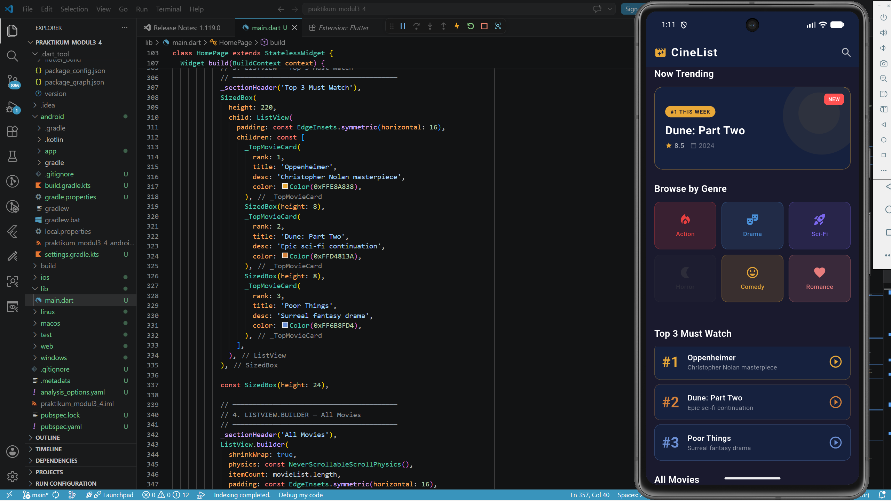
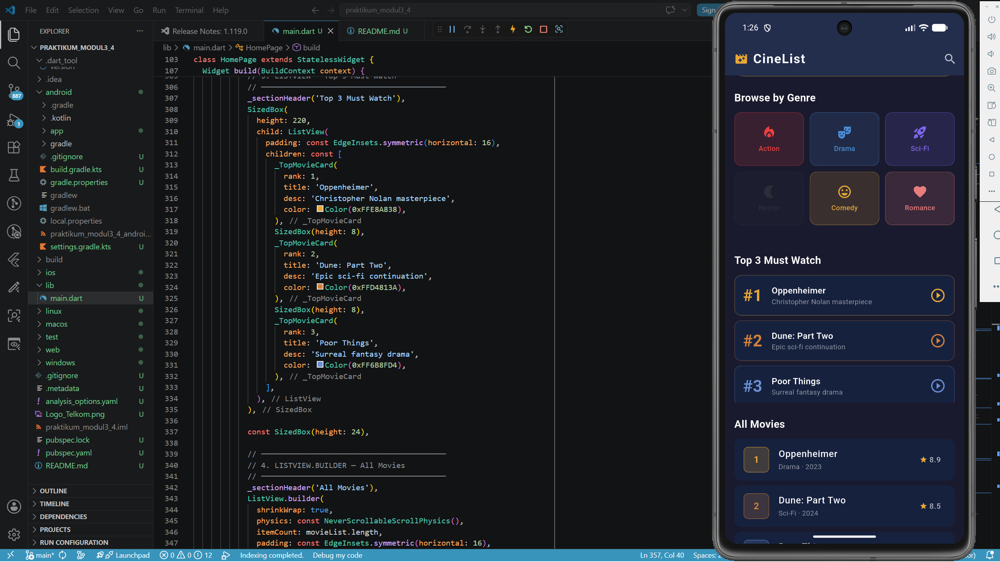
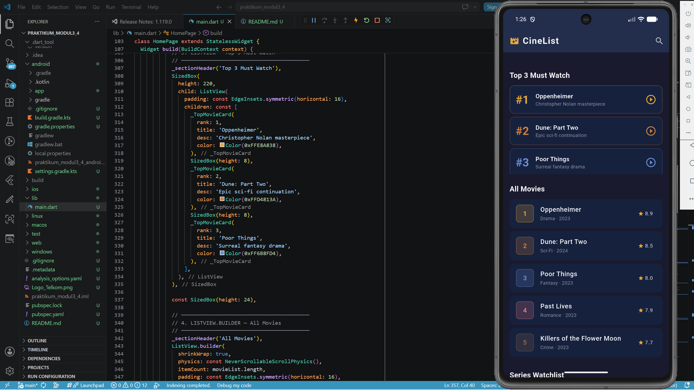
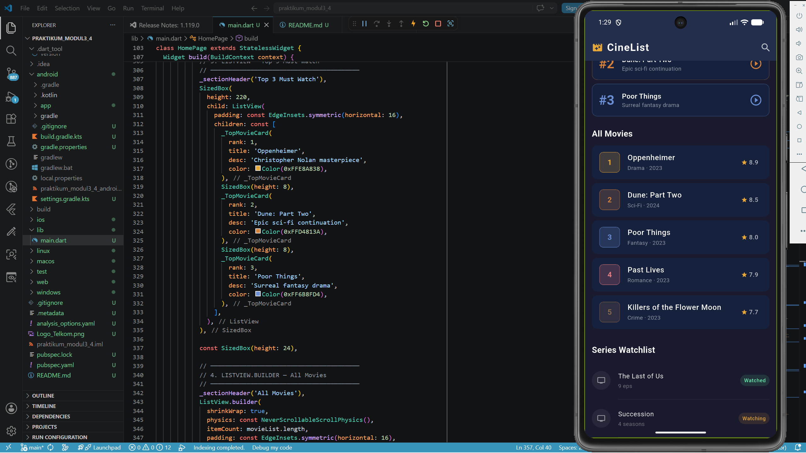
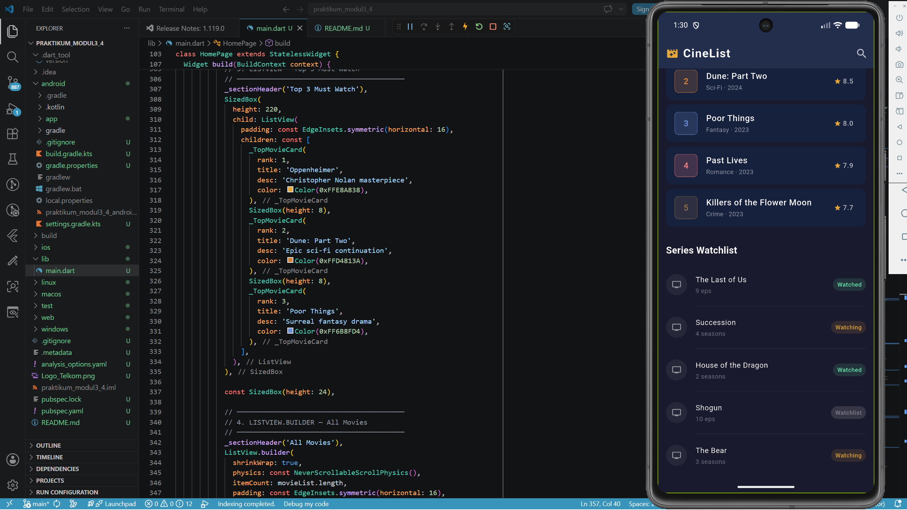

# LAPORAN PRAKTIKUM
# APLIKASI BERBASIS PLATFORM

## MODUL 3 & 4 — MOBILE

---

**Disusun Oleh :**

| | |
|---|---|
| **Nama** | Reli Gita Nurhidayati |
| **NIM** | 2311102025 |
| **Kelas** | S1 IF-11-REG01 |

**Dosen Pengampu :**
Dimas Fanny Hebrasianto Permadi, S.ST., M.Kom

**Asisten Praktikum :**
Apri Pandu Wicaksono · Rangga Pradarrell Fathi

---

**LABORATORIUM HIGH PERFORMANCE**
**FAKULTAS INFORMATIKA**
**TELKOM UNIVERSITY PURWOKERTO**
**2026**

---

## 📋 Daftar Isi

- [A. Dasar Teori](#a-dasar-teori)
- [B. Deskripsi Tugas](#b-deskripsi-tugas)
- [C. Kode Program](#c-kode-program)
- [D. Hasil Tampilan](#d-hasil-tampilan)
- [E. Kesimpulan](#e-kesimpulan)
- [F. Referensi](#f-referensi)

---

## A. Dasar Teori

Flutter adalah framework UI open-source yang dikembangkan oleh Google untuk membangun aplikasi mobile, web, dan desktop dari satu codebase menggunakan bahasa pemrograman Dart. Flutter menggunakan konsep **widget** sebagai komponen dasar pembentuk antarmuka pengguna.

Pada modul ini dipelajari enam widget UI Flutter yang umum digunakan:

### 1. Container
Container adalah widget serbaguna yang digunakan untuk mengatur tata letak, ukuran, warna, padding, margin, dan dekorasi elemen UI. Container dapat menggunakan \`BoxDecoration\` untuk memberikan warna latar, border, sudut melengkung (\`borderRadius\`), dan efek bayangan (\`boxShadow\`).

### 2. GridView
GridView adalah widget yang menampilkan daftar item dalam bentuk susunan grid (baris dan kolom). \`GridView.count\` memungkinkan penentuan jumlah kolom secara langsung melalui properti \`crossAxisCount\`. Parameter \`shrinkWrap\` dan \`NeverScrollableScrollPhysics\` digunakan agar GridView tidak scroll secara mandiri ketika berada di dalam \`SingleChildScrollView\`.

### 3. ListView
ListView adalah widget scroll yang menyusun anak-anaknya secara linier (vertikal atau horizontal). ListView statis cocok digunakan untuk menampilkan daftar item yang jumlahnya tetap dan sudah diketahui sebelumnya.

### 4. ListView.builder
\`ListView.builder\` digunakan untuk membangun list secara dinamis dari sebuah array atau list data. Widget ini efisien karena hanya merender item yang terlihat di layar (**lazy rendering**). Parameter \`itemCount\` menentukan jumlah item, dan \`itemBuilder\` dipanggil untuk setiap indeks.

### 5. ListView.separated
\`ListView.separated\` bekerja seperti \`ListView.builder\` dengan tambahan parameter \`separatorBuilder\` yang memungkinkan penambahan widget pemisah (seperti \`Divider\`) di antara setiap item list. Ini menghasilkan tampilan list yang lebih rapi dan terstruktur.

### 6. Stack
Stack adalah widget yang memungkinkan penumpukan beberapa widget di atas satu sama lain secara berlapis (Z-axis). Widget \`Positioned\` digunakan di dalam Stack untuk mengatur posisi absolut setiap layer. Urutan \`children\` menentukan hierarki tampilan — widget yang disebut lebih akhir akan tampil paling atas.

---

## B. Deskripsi Tugas

Pada praktikum Modul 4 ini, mahasiswa diminta untuk membuat satu project Flutter yang menampilkan beberapa widget UI. Project yang dibuat adalah aplikasi **CineList** — aplikasi daftar film dan series bertema dark mode cinema yang mengimplementasikan seluruh widget yang dipersyaratkan.

**Widget yang diimplementasikan:**

| No | Widget | Implementasi dalam Project |
|----|--------|---------------------------|
| 1 | \`Container\` | Banner "Now Trending" dengan BoxDecoration |
| 2 | \`GridView\` | 6 genre film (Action, Drama, Sci-Fi, Horror, Comedy, Romance) |
| 3 | \`ListView\` | Top 3 Must Watch (statis) |
| 4 | \`ListView.builder\` | All Movies dari array \`movieList\` |
| 5 | \`ListView.separated\` | Series Watchlist dengan Divider pemisah |
| 6 | \`Stack\` | Lapisan dekoratif + konten + badge NEW pada banner |

---

## C. Kode Program

### 1. Container (Kotak Berwarna)

\`\`\`dart
Container(
  margin: const EdgeInsets.symmetric(horizontal: 16),
  height: 160,
  decoration: BoxDecoration(
    color: const Color(0xFF16213E),
    borderRadius: BorderRadius.circular(16),
    border: Border.all(
      color: const Color(0xFFE8A838).withOpacity(0.4)),
  ),
  child: Stack( ... ),
)
\`\`\`

**Penjelasan:**
Widget \`Container\` digunakan sebagai banner "Now Trending" dengan \`BoxDecoration\` yang mengatur warna latar gelap (\`0xFF16213E\`), sudut melengkung 16 piksel, dan border berwarna emas transparan. Container ini sekaligus menjadi wrapper untuk widget \`Stack\` di dalamnya.

---

### 2. GridView (6 Item Genre)

\`\`\`dart
GridView.count(
  crossAxisCount: 3,
  shrinkWrap: true,
  physics: const NeverScrollableScrollPhysics(),
  crossAxisSpacing: 10,
  mainAxisSpacing: 10,
  children: genres.map((g) => _genreCard(
    label: g['label'],
    icon: g['icon'],
    color: g['color'],
  )).toList(),
)
\`\`\`

**Penjelasan:**
\`GridView.count\` dengan \`crossAxisCount: 3\` membuat tampilan 3 kolom berisi 6 genre film. Penggunaan \`shrinkWrap: true\` dan \`NeverScrollableScrollPhysics()\` mencegah konflik scroll dengan \`SingleChildScrollView\` pembungkusnya.

---

### 3. ListView (3 Item Statis)

\`\`\`dart
ListView(
  padding: const EdgeInsets.symmetric(horizontal: 16),
  children: const [
    _TopMovieCard(rank: 1, title: 'Oppenheimer',
      desc: 'Christopher Nolan masterpiece',
      color: Color(0xFFE8A838)),
    _TopMovieCard(rank: 2, title: 'Dune: Part Two',
      desc: 'Epic sci-fi continuation',
      color: Color(0xFFD4813A)),
    _TopMovieCard(rank: 3, title: 'Poor Things',
      desc: 'Surreal fantasy drama',
      color: Color(0xFF6B8FD4)),
  ],
)
\`\`\`

**Penjelasan:**
\`ListView\` statis berisi 3 widget \`_TopMovieCard\` yang menampilkan Top 3 Must Watch. Setiap card menampilkan nomor ranking berwarna, judul film, deskripsi singkat, dan ikon play. Cocok untuk daftar yang isinya tidak berubah.

---

### 4. ListView.builder (Dari Data Array)

\`\`\`dart
const List<Movie> movieList = [
  Movie(title: 'Oppenheimer', genre: 'Drama',
        rating: 8.9, year: '2023', color: Color(0xFFE8A838)),
  Movie(title: 'Dune: Part Two', genre: 'Sci-Fi',
        rating: 8.5, year: '2024', color: Color(0xFFD4813A)),
  // ...
];

ListView.builder(
  shrinkWrap: true,
  physics: const NeverScrollableScrollPhysics(),
  itemCount: movieList.length,
  itemBuilder: (context, index) {
    final movie = movieList[index];
    return ListTile(
      title: Text(movie.title),
      subtitle: Text('\${movie.genre} · \${movie.year}'),
      trailing: Row(children: [
        const Icon(Icons.star, color: Color(0xFFE8A838)),
        Text(movie.rating.toString()),
      ]),
    );
  },
)
\`\`\`

**Penjelasan:**
\`ListView.builder\` membangun list secara dinamis dari array \`movieList\`. Hanya merender item yang terlihat di layar (lazy rendering). \`itemCount\` diset ke \`movieList.length\` sehingga otomatis menyesuaikan jumlah data. Setiap item menampilkan nomor, judul, genre, tahun, dan rating bintang.

---

### 5. ListView.separated (List + Garis Pembatas)

\`\`\`dart
ListView.separated(
  shrinkWrap: true,
  physics: const NeverScrollableScrollPhysics(),
  itemCount: 5,
  separatorBuilder: (_, __) => Divider(
    color: Colors.white.withOpacity(0.06),
    height: 1,
    indent: 56,
  ),
  itemBuilder: (context, index) {
    return ListTile(
      leading: CircleAvatar(child: const Icon(Icons.tv)),
      title: Text(series[index]['title']!),
      subtitle: Text(series[index]['ep']!),
      trailing: Container(
        child: Text(series[index]['status']!,
          style: TextStyle(color: statusColor)),
      ),
    );
  },
)
\`\`\`

**Penjelasan:**
\`ListView.separated\` menampilkan 5 series dengan garis pemisah (\`Divider\`) tipis di antara setiap item. Setiap item memiliki status badge berwarna: **Watched** (hijau), **Watching** (emas), **Watchlist** (abu).

---

### 6. Stack (Tampilan Bertumpuk)

\`\`\`dart
Stack(
  children: [
    // Layer 1: Lingkaran dekoratif background
    Positioned(
      right: -20, top: -20,
      child: Container(
        width: 150, height: 150,
        decoration: const BoxDecoration(
          color: Color(0x12E8A838),
          shape: BoxShape.circle,
        ),
      ),
    ),
    // Layer 2: Konten utama
    Padding(
      padding: const EdgeInsets.all(20),
      child: Column(
        crossAxisAlignment: CrossAxisAlignment.start,
        children: [
          Container(child: const Text('#1 THIS WEEK')),
          const Text('Dune: Part Two'),
          Row(children: [
            const Icon(Icons.star, color: Color(0xFFE8A838)),
            const Text('8.5'),
          ]),
        ],
      ),
    ),
    // Layer 3: Badge NEW di pojok kanan atas
    Positioned(
      top: 12, right: 12,
      child: Container(child: const Text('NEW')),
    ),
  ],
)
\`\`\`

**Penjelasan:**
\`Stack\` digunakan pada banner "Now Trending" untuk menumpuk 3 layer: (1) lingkaran dekoratif semi-transparan sebagai elemen visual background, (2) konten teks utama di tengah, dan (3) badge "NEW" berwarna merah di pojok kanan atas menggunakan \`Positioned\`. Layer terakhir selalu tampil di atas.

---

## D. Hasil Tampilan

### Tampilan Utama — Container + Stack

### Browse by Genre — GridView

### Top 3 Must Watch — ListView

### All Movies — ListView.builder

### Series Watchlist — ListView.separated

---

## E. Kesimpulan

Berdasarkan praktikum Modul 3 & 4 yang telah dilakukan, dapat disimpulkan beberapa hal sebagai berikut:

1. **Container** merupakan widget dasar Flutter yang sangat fleksibel untuk mengatur tampilan kotak dengan dekorasi warna, border, sudut melengkung, dan bayangan.

2. **GridView.count** memudahkan pembuatan tampilan grid dengan jumlah kolom yang ditentukan, cocok untuk menampilkan kategori atau galeri item secara terstruktur.

3. **ListView** cocok untuk daftar item statis yang jumlahnya tetap, sedangkan **ListView.builder** lebih efisien untuk data dinamis dari array karena menggunakan lazy rendering.

4. **ListView.separated** memberikan tampilan list yang lebih rapi dengan adanya garis pemisah otomatis di antara setiap item menggunakan widget \`Divider\`.

5. **Stack** memungkinkan penumpukan widget secara berlapis menggunakan Z-axis, sangat berguna untuk membuat tampilan overlay seperti badge, watermark, atau konten bertumpuk.

6. Kombinasi keenam widget tersebut dapat menghasilkan tampilan aplikasi mobile yang menarik, responsif, dan terstruktur dengan baik dalam satu project Flutter.

---

## F. Referensi

- Flutter Documentation. (2024). *Widget catalog*. https://docs.flutter.dev/ui/widgets
- Flutter Documentation. (2024). *Container class*. https://api.flutter.dev/flutter/widgets/Container-class.html
- Flutter Documentation. (2024). *ListView class*. https://api.flutter.dev/flutter/widgets/ListView-class.html
- Flutter Documentation. (2024). *GridView class*. https://api.flutter.dev/flutter/widgets/GridView-class.html
- Flutter Documentation. (2024). *Stack class*. https://api.flutter.dev/flutter/widgets/Stack-class.html
