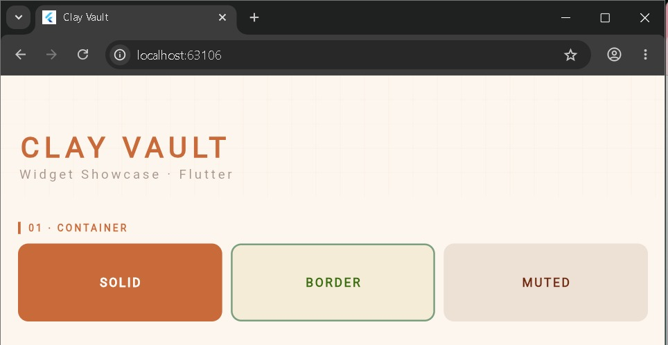
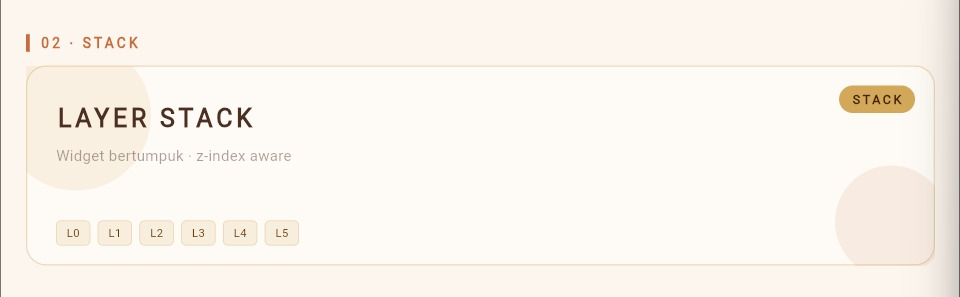
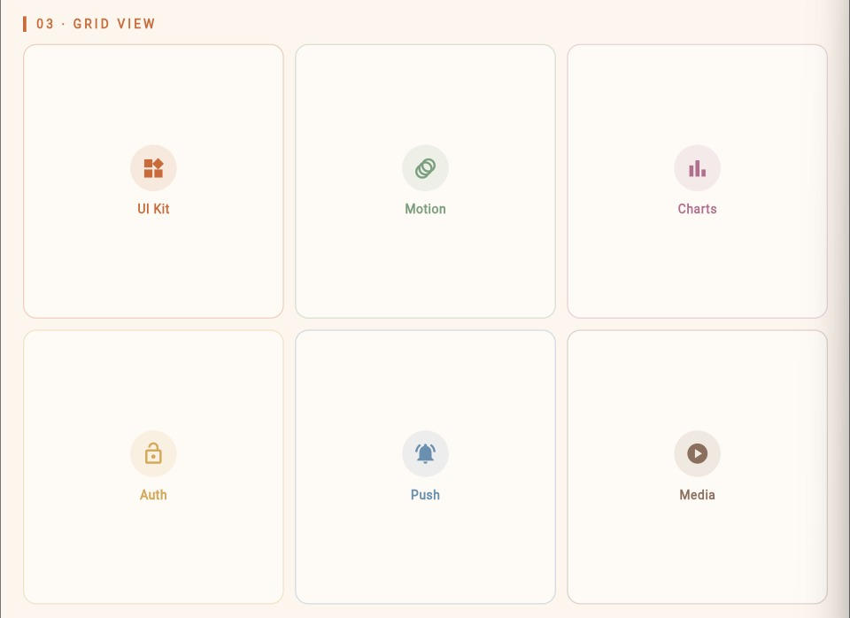
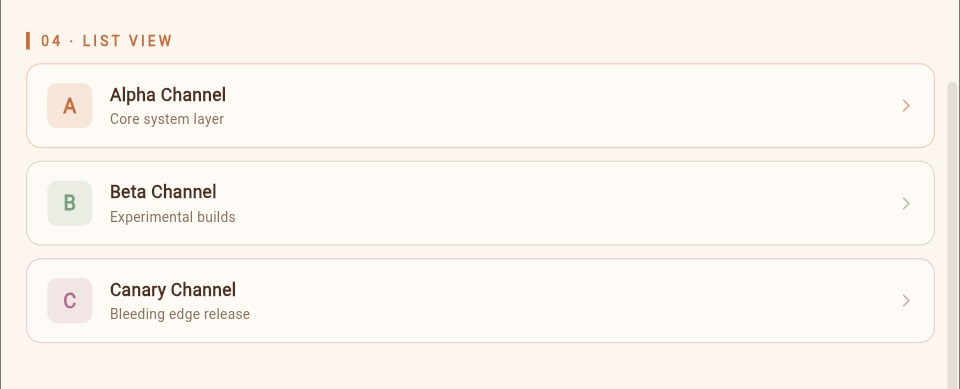
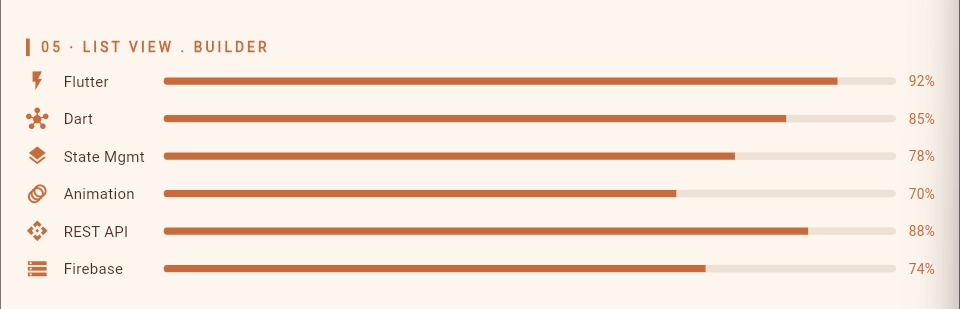
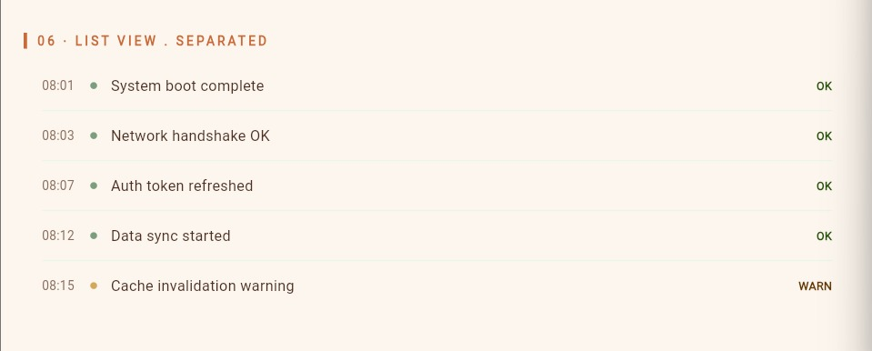

<div align="center">
  <br />
  <h1>LAPORAN PRAKTIKUM <br>APLIKASI BERBASIS PLATFORM</h1>
  <br />
  <h2>Mobile <br> Flutter Widgets</h2>
  <br /><br />
  
  <br /><br /><br />
  <h3>Disusun Oleh :</h3>
  <p>
    <strong>Tegar Bangkit Wijaya</strong><br>
    <strong>2311102027</strong><br>
    <strong>S1 IF-11-REG 01</strong>
  </p>
  <br />
  <h3>Dosen Pengampu :</h3>
  <p>
    <strong>Dimas Fanny Hebrasianto Permadi, S.ST., M.Kom</strong>
  </p>
  <br /><br />
  <h4>Asisten Praktikum :</h4>
  <strong>Apri Pandu Wicaksono</strong><br>
  <strong>Rangga Pradarrell Fathi</strong>
  <br />
  <h2>LABORATORIUM HIGH PERFORMANCE <br>FAKULTAS INFORMATIKA <br>UNIVERSITAS TELKOM PURWOKERTO <br>2026</h2>
</div>

---

# 1. Dasar Teori

Flutter adalah framework open-source dari Google untuk membangun aplikasi mobile, web, dan desktop dengan satu codebase menggunakan bahasa Dart. Flutter membangun UI menggunakan konsep **widget tree**, di mana semua elemen tampilan merupakan widget yang tersusun secara hierarkis.

Pada modul ini dipelajari beberapa widget dasar Flutter yang sering digunakan dalam membangun tampilan aplikasi, yaitu:

- **Container** — Widget serbaguna untuk membuat kotak dengan warna, ukuran, padding, margin, dan dekorasi yang dapat dikustomisasi.
- **GridView** — Widget untuk menampilkan item dalam bentuk grid (baris dan kolom). Menggunakan `SliverGrid` dengan `SliverGridDelegateWithFixedCrossAxisCount` untuk menentukan jumlah kolom.
- **ListView** — Widget untuk menampilkan daftar item secara vertikal. Terdapat tiga varian yang dipelajari yaitu ListView statis, ListView.builder, dan ListView.separated.
- **ListView.builder** — Varian ListView yang membangun item secara dinamis dari sebuah array data. Lebih efisien karena hanya merender item yang terlihat di layar.
- **ListView.separated** — Varian ListView.builder yang menambahkan widget pemisah (separator) antar setiap item berupa garis tipis.
- **Stack** — Widget yang menumpuk beberapa widget di atas satu sama lain seperti layer. Widget yang ditulis terakhir akan berada di posisi paling atas.

---

# 2. Screenshot Tampilan (Hasil)

## Container

<p>
  
</p>

Gambar di atas menampilkan widget **Container** dalam tiga varian tampilan. **SOLID** menampilkan kotak dengan warna terracotta penuh. **BORDER** menampilkan kotak dengan latar cream dan outline sage green. **MUTED** menampilkan kotak dengan warna earth tone netral. Ketiga Container disusun dalam Row dengan proporsi yang sama menggunakan `Expanded`.

---

## Stack

<p>
  
</p>

Gambar di atas menampilkan widget **Stack** dengan konsep penumpukan layer. Terdapat 6 layer yang ditumpuk: layer background card, dua lingkaran dekoratif (kiri atas dan kanan bawah), teks judul dan subjudul, badge label di pojok kanan atas, serta chip-chip layer (L0–L5) di bagian bawah. Setiap layer diatur posisinya menggunakan widget `Positioned`.

---

## GridView

<p>
  
</p>

Gambar di atas menampilkan **GridView** dengan 6 item yang tersusun dalam 3 kolom dan 2 baris. Setiap item menampilkan ikon dan label dengan warna aksen yang berbeda: UI Kit (terracotta), Motion (sage green), Charts (mauve), Auth (gold), Push (slate blue), dan Media (warm brown). GridView diimplementasikan menggunakan `SliverGrid` di dalam `CustomScrollView`.

---

## ListView Statis (A, B, C)

<p>
  
</p>

Gambar di atas menampilkan **ListView statis** dengan 3 item tetap: Alpha Channel (A), Beta Channel (B), dan Canary Channel (C). Setiap item memiliki tag huruf berwarna, judul, subjudul, dan ikon panah. ListView ini menggunakan `shrinkWrap: true` dan `NeverScrollableScrollPhysics` karena berada di dalam `CustomScrollView`.

---

## ListView.builder

<p>
  
</p>

Gambar di atas menampilkan **ListView.builder** yang membangun item secara dinamis dari array data skill Flutter. Terdapat 6 item (Flutter, Dart, State Mgmt, Animation, REST API, Firebase) yang masing-masing menampilkan ikon, nama skill, progress bar berwarna terracotta, dan persentase. Widget ini diimplementasikan sebagai `SliverList` dengan `SliverChildBuilderDelegate` untuk efisiensi rendering.

---

## ListView.separated

<p>
  
</p>

Gambar di atas menampilkan **ListView.separated** berisi 5 entri log sistem dengan garis pemisah tipis antar item. Setiap baris menampilkan timestamp, dot indikator berwarna, pesan log, dan status (OK/WARN). Garis pemisah dibuat menggunakan `separatorBuilder` yang mengembalikan Container dengan tinggi 1px. Item terakhir berstatus WARN ditandai dengan warna gold sebagai pembeda.

---

# 3. Penjelasan Widget

### 1. Container

Container adalah widget kotak serbaguna yang dapat diatur ukuran, warna, padding, margin, dan dekorasinya menggunakan `BoxDecoration`. Pada praktikum ini, Container dibuat dalam tiga varian: solid color (terracotta), border dengan outline (sage green), dan muted color (earth tone).

```dart
// Container solid
Container(
  height: 90,
  decoration: BoxDecoration(
    borderRadius: BorderRadius.circular(12),
    color: const Color(0xFFC96A3A),
  ),
  child: const Center(
    child: Text(
      'SOLID',
      style: TextStyle(
        fontFamily: 'monospace',
        fontWeight: FontWeight.w900,
        letterSpacing: 2,
        color: Colors.white,
      ),
    ),
  ),
),

// Container border
Container(
  height: 90,
  decoration: BoxDecoration(
    borderRadius: BorderRadius.circular(12),
    color: const Color(0xFFF5ECD7),
    border: Border.all(color: const Color(0xFF7A9E7E), width: 2),
  ),
  child: const Center(
    child: Text('BORDER', ...),
  ),
),
```

---

### 2. GridView

GridView menampilkan item dalam susunan grid (baris dan kolom). Pada praktikum ini digunakan `SliverGrid` di dalam `CustomScrollView` dengan `SliverGridDelegateWithFixedCrossAxisCount` untuk mengatur 3 kolom. `crossAxisSpacing` dan `mainAxisSpacing` digunakan untuk memberi jarak antar item.

```dart
SliverGrid(
  delegate: SliverChildBuilderDelegate(
    (context, index) {
      final item = _gridItems[index];
      return _GridCard(
        label: item['label'] as String,
        icon: item['icon'] as IconData,
        accent: item['color'] as Color,
      );
    },
    childCount: _gridItems.length,
  ),
  gridDelegate: const SliverGridDelegateWithFixedCrossAxisCount(
    crossAxisCount: 3,
    crossAxisSpacing: 10,
    mainAxisSpacing: 10,
    childAspectRatio: 0.95,
  ),
),
```

---

### 3. ListView (Statis)

ListView statis menampilkan daftar item yang sudah ditentukan langsung di dalam `children`. Digunakan untuk menampilkan 3 item tetap (A, B, C) dengan `shrinkWrap: true` dan `NeverScrollableScrollPhysics` agar tidak berkonflik dengan scroll utama.

```dart
ListView(
  shrinkWrap: true,
  physics: const NeverScrollableScrollPhysics(),
  children: _channels.map((ch) {
    return _ChannelTile(
      tag: ch['tag'] as String,
      title: ch['title'] as String,
      sub: ch['sub'] as String,
      accent: ch['color'] as Color,
    );
  }).toList(),
),
```

---

### 4. ListView.builder

ListView.builder membangun item secara dinamis berdasarkan data dari array `_skills`. Diimplementasikan sebagai `SliverList` dengan `SliverChildBuilderDelegate` di dalam `CustomScrollView`. Lebih efisien untuk list panjang karena hanya merender item yang tampil di layar (*lazy loading*).

```dart
SliverList(
  delegate: SliverChildBuilderDelegate(
    (context, index) {
      final skill = _skills[index];
      return _SkillRow(
        icon: skill['icon'] as IconData,
        label: skill['label'] as String,
        level: skill['level'] as double,
      );
    },
    childCount: _skills.length,
  ),
),
```

---

### 5. ListView.separated

ListView.separated sama seperti ListView.builder namun menambahkan widget pemisah antar item melalui parameter `separatorBuilder`. Pada praktikum ini digunakan Container dengan tinggi 1px dan warna semi-transparan sebagai garis pemisah yang elegan.

```dart
ListView.separated(
  shrinkWrap: true,
  physics: const NeverScrollableScrollPhysics(),
  itemCount: _logs.length,
  separatorBuilder: (_, __) => Container(
    height: 1,
    color: const Color(0xFF7A9E7E).withOpacity(0.15),
    margin: const EdgeInsets.symmetric(horizontal: 16),
  ),
  itemBuilder: (context, index) {
    final log = _logs[index];
    return _LogTile(
      time: log['time'] as String,
      msg: log['msg'] as String,
      ok: log['ok'] as bool,
    );
  },
),
```

---

### 6. Stack

Stack menumpuk beberapa widget di atas satu sama lain seperti layer. Urutan penulisan menentukan posisi — widget terakhir berada paling atas. Widget `Positioned` digunakan untuk mengatur posisi tiap layer secara spesifik menggunakan koordinat `top`, `left`, `right`, dan `bottom`.

```dart
Stack(
  children: [
    // Layer 0 – background card
    Container(
      decoration: BoxDecoration(
        borderRadius: BorderRadius.circular(16),
        color: const Color(0xFFFEFAF5),
        border: Border.all(color: const Color(0xFFD4A85A).withOpacity(0.4)),
      ),
    ),
    // Layer 1 – dekoratif circle kiri
    Positioned(
      left: -20, top: -20,
      child: Container(
        width: 120, height: 120,
        decoration: BoxDecoration(
          shape: BoxShape.circle,
          color: const Color(0xFFD4A85A).withOpacity(0.12),
        ),
      ),
    ),
    // Layer 2 – dekoratif circle kanan
    Positioned(
      right: -10, bottom: -10,
      child: Container(width: 90, height: 90, ...),
    ),
    // Layer 3 – teks utama
    Positioned(
      left: 24, top: 28,
      child: Column(children: [Text('LAYER STACK'), Text('subtitle')]),
    ),
    // Layer 4 – badge
    Positioned(
      right: 16, top: 16,
      child: Container(child: Text('STACK')),
    ),
    // Layer 5 – chips L0–L5
    Positioned(
      left: 24, bottom: 16,
      child: Row(children: [...chips]),
    ),
  ],
),
```