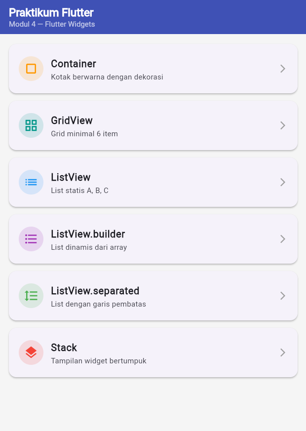
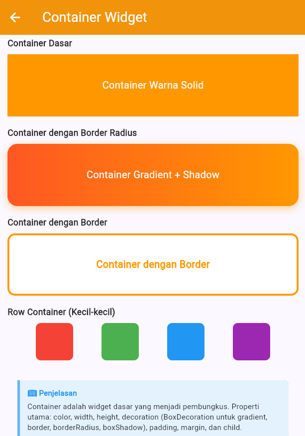
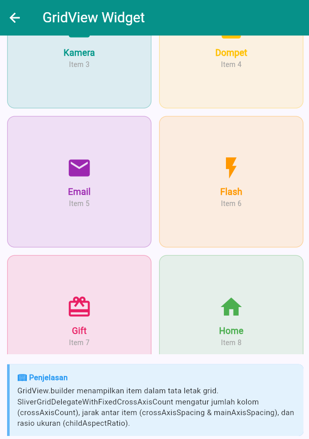

<div align="center">
  <br />

  <h1>LAPORAN PRAKTIKUM <br>
  APLIKASI BERBASIS PLATFORM
  </h1>

  <br />

  <h3>MODUL 3 & 4 <br>
  MOBILE
  </h3>

  <br />

  


  <br />
  <br />
  <br />

  <h3>Disusun Oleh :</h3>

  <p>
    <strong>Kanasya Abdi Aziz</strong><br>
    <strong>2311102140</strong><br>
    <strong>S1 IF-11-01</strong>
  </p>

  <br />

  <h3>Dosen Pengampu :</h3>

  <p>
    <strong>Dimas Fanny Hebrasianto Permadi, S.ST., M.Kom</strong>
  </p>
  
  <br />
  <br />
    <h4>Asisten Praktikum :</h4>
    <strong>Apri Pandu Wicaksono </strong> <br>
    <strong>Rangga Pradarrell Fathi</strong>
  <br />

  <h3>LABORATORIUM HIGH PERFORMANCE
 <br>FAKULTAS INFORMATIKA <br>UNIVERSITAS TELKOM PURWOKERTO <br>2026</h3>
</div>

<hr>

## 💻 Source Code

### Struktur Project

```
flutter_widget_demo/
├── lib/
│   └── main.dart          ← semua kode widget ada di sini
├── test/
│   └── widget_test.dart   ← test file
├── pubspec.yaml
```

### `lib/main.dart`

```dart
import 'package:flutter/material.dart';

void main() {
  runApp(const MyApp());
}

class MyApp extends StatelessWidget {
  const MyApp({super.key});

  @override
  Widget build(BuildContext context) {
    return MaterialApp(
      title: 'Flutter Widget Demo',
      debugShowCheckedModeBanner: false,
      theme: ThemeData(
        colorScheme: ColorScheme.fromSeed(seedColor: Colors.indigo),
        useMaterial3: true,
      ),
      home: const HomePage(),
    );
  }
}

// ─────────────────────────────────────────
// Data untuk ListView.builder
// ─────────────────────────────────────────
final List<Map<String, dynamic>> buahList = [
  {'nama': 'Apel', 'emoji': '🍎', 'warna': Colors.red},
  {'nama': 'Pisang', 'emoji': '🍌', 'warna': Colors.yellow},
  {'nama': 'Anggur', 'emoji': '🍇', 'warna': Colors.purple},
  {'nama': 'Mangga', 'emoji': '🥭', 'warna': Colors.orange},
  {'nama': 'Semangka', 'emoji': '🍉', 'warna': Colors.green},
];

// ─────────────────────────────────────────
// HomePage — semua widget di satu halaman
// ─────────────────────────────────────────
class HomePage extends StatelessWidget {
  const HomePage({super.key});

  @override
  Widget build(BuildContext context) {
    return Scaffold(
      backgroundColor: const Color(0xFFF3F4F8),
      appBar: AppBar(
        title: const Text(
          '🧩 Flutter Widget Demo',
          style: TextStyle(fontWeight: FontWeight.bold),
        ),
        backgroundColor: Colors.indigo,
        foregroundColor: Colors.white,
        elevation: 2,
      ),
      body: SingleChildScrollView(
        padding: const EdgeInsets.all(16),
        child: Column(
          crossAxisAlignment: CrossAxisAlignment.start,
          children: [
            // ══════════════════════════════
            // 1. CONTAINER
            // ══════════════════════════════
            _sectionTitle('1. Container'),
            const SizedBox(height: 8),
            Row(
              mainAxisAlignment: MainAxisAlignment.spaceEvenly,
              children: [
                Container(
                  width: 90,
                  height: 90,
                  decoration: BoxDecoration(
                    color: Colors.indigo,
                    borderRadius: BorderRadius.circular(12),
                    boxShadow: [
                      BoxShadow(
                        color: Colors.indigo.withOpacity(0.4),
                        blurRadius: 8,
                        offset: const Offset(2, 4),
                      )
                    ],
                  ),
                  child: const Center(
                    child: Text('Kotak\nBiru',
                        textAlign: TextAlign.center,
                        style: TextStyle(color: Colors.white, fontWeight: FontWeight.bold)),
                  ),
                ),
                Container(
                  width: 90,
                  height: 90,
                  decoration: BoxDecoration(
                    gradient: const LinearGradient(
                      colors: [Colors.orange, Colors.pink],
                      begin: Alignment.topLeft,
                      end: Alignment.bottomRight,
                    ),
                    borderRadius: BorderRadius.circular(50),
                  ),
                  child: const Center(
                    child: Text('Gradient\nBulat',
                        textAlign: TextAlign.center,
                        style: TextStyle(color: Colors.white, fontWeight: FontWeight.bold)),
                  ),
                ),
                Container(
                  width: 90,
                  height: 90,
                  decoration: BoxDecoration(
                    color: Colors.teal,
                    border: Border.all(color: Colors.teal.shade900, width: 3),
                    borderRadius: BorderRadius.circular(8),
                  ),
                  child: const Center(
                    child: Text('Border\nTeal',
                        textAlign: TextAlign.center,
                        style: TextStyle(color: Colors.white, fontWeight: FontWeight.bold)),
                  ),
                ),
              ],
            ),

            const SizedBox(height: 24),

            // ══════════════════════════════
            // 2. GRIDVIEW
            // ══════════════════════════════
            _sectionTitle('2. GridView (6 item)'),
            const SizedBox(height: 8),
            GridView.count(
              crossAxisCount: 3,
              shrinkWrap: true,
              physics: const NeverScrollableScrollPhysics(),
              crossAxisSpacing: 10,
              mainAxisSpacing: 10,
              childAspectRatio: 1.1,
              children: [
                _gridItem('📱 App', Colors.blue),
                _gridItem('🎵 Musik', Colors.purple),
                _gridItem('📷 Foto', Colors.green),
                _gridItem('🗺️ Maps', Colors.orange),
                _gridItem('⚙️ Setting', Colors.grey),
                _gridItem('💬 Chat', Colors.pink),
              ],
            ),

            const SizedBox(height: 24),

            // ══════════════════════════════
            // 3. LISTVIEW (3 item statis)
            // ══════════════════════════════
            _sectionTitle('3. ListView (A, B, C)'),
            const SizedBox(height: 8),
            Container(
              height: 165,
              decoration: BoxDecoration(
                color: Colors.white,
                borderRadius: BorderRadius.circular(12),
                boxShadow: [BoxShadow(color: Colors.black12, blurRadius: 6)],
              ),
              child: ListView(
                children: const [
                  ListTile(
                    leading: CircleAvatar(
                        backgroundColor: Colors.indigo,
                        child: Text('A', style: TextStyle(color: Colors.white))),
                    title: Text('Item A'),
                    subtitle: Text('Deskripsi item pertama'),
                  ),
                  Divider(height: 1),
                  ListTile(
                    leading: CircleAvatar(
                        backgroundColor: Colors.teal,
                        child: Text('B', style: TextStyle(color: Colors.white))),
                    title: Text('Item B'),
                    subtitle: Text('Deskripsi item kedua'),
                  ),
                  Divider(height: 1),
                  ListTile(
                    leading: CircleAvatar(
                        backgroundColor: Colors.orange,
                        child: Text('C', style: TextStyle(color: Colors.white))),
                    title: Text('Item C'),
                    subtitle: Text('Deskripsi item ketiga'),
                  ),
                ],
              ),
            ),

            const SizedBox(height: 24),

            // ══════════════════════════════
            // 4. LISTVIEW.BUILDER
            // ══════════════════════════════
            _sectionTitle('4. ListView.builder (dari array)'),
            const SizedBox(height: 8),
            Container(
              height: 260,
              decoration: BoxDecoration(
                color: Colors.white,
                borderRadius: BorderRadius.circular(12),
                boxShadow: [BoxShadow(color: Colors.black12, blurRadius: 6)],
              ),
              child: ListView.builder(
                itemCount: buahList.length,
                itemBuilder: (context, index) {
                  final item = buahList[index];
                  return ListTile(
                    leading: Container(
                      width: 40,
                      height: 40,
                      decoration: BoxDecoration(
                        color: (item['warna'] as Color).withOpacity(0.2),
                        shape: BoxShape.circle,
                      ),
                      child: Center(
                          child: Text(item['emoji'],
                              style: const TextStyle(fontSize: 20))),
                    ),
                    title: Text(item['nama'],
                        style: const TextStyle(fontWeight: FontWeight.w600)),
                    subtitle: Text('Buah ke-${index + 1}'),
                    trailing: const Icon(Icons.chevron_right),
                  );
                },
              ),
            ),

            const SizedBox(height: 24),

            // ══════════════════════════════
            // 5. LISTVIEW.SEPARATED
            // ══════════════════════════════
            _sectionTitle('5. ListView.separated (+ garis pembatas)'),
            const SizedBox(height: 8),
            Container(
              height: 220,
              decoration: BoxDecoration(
                color: Colors.white,
                borderRadius: BorderRadius.circular(12),
                boxShadow: [BoxShadow(color: Colors.black12, blurRadius: 6)],
              ),
              child: ListView.separated(
                itemCount: 4,
                separatorBuilder: (context, index) => const Divider(
                  color: Colors.indigo,
                  thickness: 1.2,
                  indent: 16,
                  endIndent: 16,
                ),
                itemBuilder: (context, index) {
                  final labels = ['Senin', 'Selasa', 'Rabu', 'Kamis'];
                  final icons = [
                    Icons.looks_one,
                    Icons.looks_two,
                    Icons.looks_3,
                    Icons.looks_4
                  ];
                  return ListTile(
                    leading: Icon(icons[index], color: Colors.indigo),
                    title: Text('Hari ${labels[index]}'),
                    subtitle: const Text('Jadwal tersedia'),
                    trailing: Chip(
                      label: const Text('Aktif',
                          style: TextStyle(fontSize: 12, color: Colors.white)),
                      backgroundColor: Colors.indigo,
                      padding: EdgeInsets.zero,
                    ),
                  );
                },
              ),
            ),

            const SizedBox(height: 24),

            // ══════════════════════════════
            // 6. STACK
            // ══════════════════════════════
            _sectionTitle('6. Stack (tampilan bertumpuk)'),
            const SizedBox(height: 8),
            Center(
              child: SizedBox(
                width: double.infinity,
                height: 200,
                child: Stack(
                  children: [
                    // Layer 1 — kotak besar background
                    Container(
                      width: double.infinity,
                      height: 200,
                      decoration: BoxDecoration(
                        gradient: const LinearGradient(
                          colors: [Color(0xFF3949AB), Color(0xFF1E88E5)],
                          begin: Alignment.topLeft,
                          end: Alignment.bottomRight,
                        ),
                        borderRadius: BorderRadius.circular(16),
                      ),
                    ),
                    // Layer 2 — lingkaran dekoratif
                    Positioned(
                      top: -20,
                      right: -20,
                      child: Container(
                        width: 120,
                        height: 120,
                        decoration: BoxDecoration(
                          color: Colors.white.withOpacity(0.15),
                          shape: BoxShape.circle,
                        ),
                      ),
                    ),
                    // Layer 3 — lingkaran kecil
                    Positioned(
                      bottom: 10,
                      left: 20,
                      child: Container(
                        width: 60,
                        height: 60,
                        decoration: BoxDecoration(
                          color: Colors.white.withOpacity(0.1),
                          shape: BoxShape.circle,
                        ),
                      ),
                    ),
                    // Layer 4 — teks di tengah
                    const Center(
                      child: Column(
                        mainAxisAlignment: MainAxisAlignment.center,
                        children: [
                          Icon(Icons.layers, color: Colors.white, size: 40),
                          SizedBox(height: 8),
                          Text(
                            'Stack Widget',
                            style: TextStyle(
                              color: Colors.white,
                              fontSize: 24,
                              fontWeight: FontWeight.bold,
                            ),
                          ),
                          Text(
                            'Layer ditumpuk di atas layer',
                            style: TextStyle(
                              color: Colors.white70,
                              fontSize: 14,
                            ),
                          ),
                        ],
                      ),
                    ),
                    // Layer 5 — badge di pojok kiri atas
                    Positioned(
                      top: 12,
                      left: 12,
                      child: Container(
                        padding: const EdgeInsets.symmetric(
                            horizontal: 10, vertical: 4),
                        decoration: BoxDecoration(
                          color: Colors.orange,
                          borderRadius: BorderRadius.circular(20),
                        ),
                        child: const Text('NEW',
                            style: TextStyle(
                                color: Colors.white,
                                fontSize: 11,
                                fontWeight: FontWeight.bold)),
                      ),
                    ),
                  ],
                ),
              ),
            ),

            const SizedBox(height: 32),
            Center(
              child: Text(
                '✅ Semua widget berhasil ditampilkan!',
                style: TextStyle(
                  color: Colors.indigo.shade700,
                  fontWeight: FontWeight.bold,
                  fontSize: 14,
                ),
              ),
            ),
            const SizedBox(height: 16),
          ],
        ),
      ),
    );
  }

  // Helper: judul section
  Widget _sectionTitle(String title) {
    return Container(
      padding: const EdgeInsets.symmetric(horizontal: 12, vertical: 6),
      decoration: BoxDecoration(
        color: Colors.indigo,
        borderRadius: BorderRadius.circular(8),
      ),
      child: Text(
        title,
        style: const TextStyle(
          color: Colors.white,
          fontWeight: FontWeight.bold,
          fontSize: 14,
        ),
      ),
    );
  }

  // Helper: item grid
  Widget _gridItem(String label, Color color) {
    return Container(
      decoration: BoxDecoration(
        color: color.withOpacity(0.15),
        borderRadius: BorderRadius.circular(12),
        border: Border.all(color: color.withOpacity(0.4)),
      ),
      child: Column(
        mainAxisAlignment: MainAxisAlignment.center,
        children: [
          Text(label.split(' ')[0], style: const TextStyle(fontSize: 24)),
          const SizedBox(height: 4),
          Text(
            label.split(' ')[1],
            style: TextStyle(
                fontSize: 12, color: color, fontWeight: FontWeight.w600),
          ),
        ],
      ),
    );
  }
}
```

## Penjelasan Widget

### 1. Container

```dart
import 'package:flutter/material.dart';
import 'package:flutter_test/flutter_test.dart';

import 'package:flutter_widget_demo/main.dart';

void main() {
  testWidgets('Counter increments smoke test', (WidgetTester tester) async {
    // Build our app and trigger a frame.
    await tester.pumpWidget(const MyApp());

    // Verify that our counter starts at 0.
    expect(find.text('0'), findsOneWidget);
    expect(find.text('1'), findsNothing);

    // Tap the '+' icon and trigger a frame.
    await tester.tap(find.byIcon(Icons.add));
    await tester.pump();

    // Verify that our counter has incremented.
    expect(find.text('0'), findsNothing);
    expect(find.text('1'), findsOneWidget);
  });
}
```

**Container** widget kotak Flutter yang dapat disesuaikan dengan ukuran, warna, padding, margin, dan dekorasi. Warna background pastel dan sudut membulat ("borderRadius") diatur dengan menggunakan properti "dekorasi" dengan "BoxDecoration". Pada contoh ini, tiga botol diletakkan satu sama lain dalam "Row", masing-masing berwarna pastel (pink, hijau mint, dan peach) dan dilengkapi dengan emoji.

---

### 2. GridView

```dart
GridView.count(
  crossAxisCount: 3,
  shrinkWrap: true,
  physics: const NeverScrollableScrollPhysics(),
  crossAxisSpacing: 10,
  mainAxisSpacing: 10,
  childAspectRatio: 1.1,
  children: [
    _gridItem('📱 App', Colors.blue),
  ],
)
```

**GridView** digunakan untuk menyusun widget dalam bentuk baris dan kolom. Menggunakan GridView.count dengan crossAxisCount: 3 membuat tata letak 3 kolom yang rapi. Penggunaan shrinkWrap: true dan NeverScrollableScrollPhysics() sangat penting agar GridView dapat diletakkan di dalam SingleChildScrollView tanpa menyebabkan error konflik scrolling.

---

### 3. ListView

```dart
ListView(
  children: const [
    ListTile(
      leading: CircleAvatar(backgroundColor: Colors.indigo, ...),
      title: Text('Item A'),
      subtitle: Text('Deskripsi item pertama'),
    ),
    Divider(height: 1),
    // ... item lainnya
  ],
)
```

**ListView** menampilkan kumpulan widget secara berurutan (vertikal atau horizontal). Dalam contoh ini, ListView membungkus beberapa widget ListTile statis. ListTile adalah widget standar Flutter yang memudahkan pembuatan daftar dengan ikon di kiri (leading), judul, dan subjudul.

---

### 4. ListView.builder

```dart
ListView.builder(
  itemCount: buahList.length,
  itemBuilder: (context, index) {
    final item = buahList[index];
    return ListTile(
      leading: Container(
        decoration: BoxDecoration(
          color: (item['warna'] as Color).withOpacity(0.2),
          shape: BoxShape.circle,
        ),
        child: Center(child: Text(item['emoji'])),
      ),
      title: Text(item['nama']),
      subtitle: Text('Buah ke-${index + 1}'),
    );
  },
)
```

**ListView.builder** adalah cara efisien untuk membuat daftar berdasarkan data array (buahList). Berbeda dengan ListView biasa, builder hanya merender item yang terlihat di layar (lazy loading). Kode ini secara dinamis mengambil data nama, emoji, dan warna dari list untuk setiap barisnya.

### 5. ListView.separated

```dart
ListView.separated(
  itemCount: 4,
  separatorBuilder: (context, index) => const Divider(
    color: Colors.indigo,
    thickness: 1.2,
    indent: 16,
    endIndent: 16,
  ),
  itemBuilder: (context, index) {
    // ... render item hari
  },
)
```

**ListView.separated** memiliki fungsi yang mirip dengan builder, namun menyertakan separatorBuilder. Widget ini digunakan untuk menyisipkan pemisah otomatis antar item. Pada laporan ini, digunakan untuk membuat daftar jadwal harian yang dipisahkan oleh garis Divider berwarna indigo yang rapi.

### 6. Stack

```dart
Stack(
  children: [
    // Layer 1: Background Gradient
    Container(decoration: BoxDecoration(gradient: ...)),
    // Layer 2: Lingkaran Dekoratif
    Positioned(right: -20, top: -20, child: _circleDecoration(...)),
    // Layer 3: Teks Utama
    const Positioned(top: 40, left: 24, child: Text('Flutter Stack', ...)),
    // Layer 4: Floating Badge
    Positioned(right: 20, bottom: 20, child: _floatingBadge(...)),
  ],
)
```

**Stack** memungkinkan penumpukan widget secara berlapis. Widget yang ditulis paling bawah dalam kode akan muncul di lapisan paling atas pada layar. Widget Positioned digunakan untuk mengatur koordinat elemen secara spesifik di dalam area Stack, seperti meletakkan lingkaran dekoratif atau badge di pojok tertentu.

---

## Screenshot Hasil




