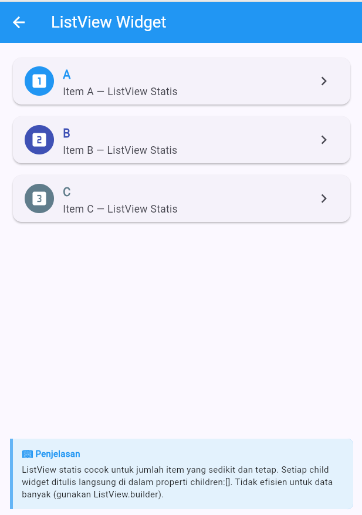
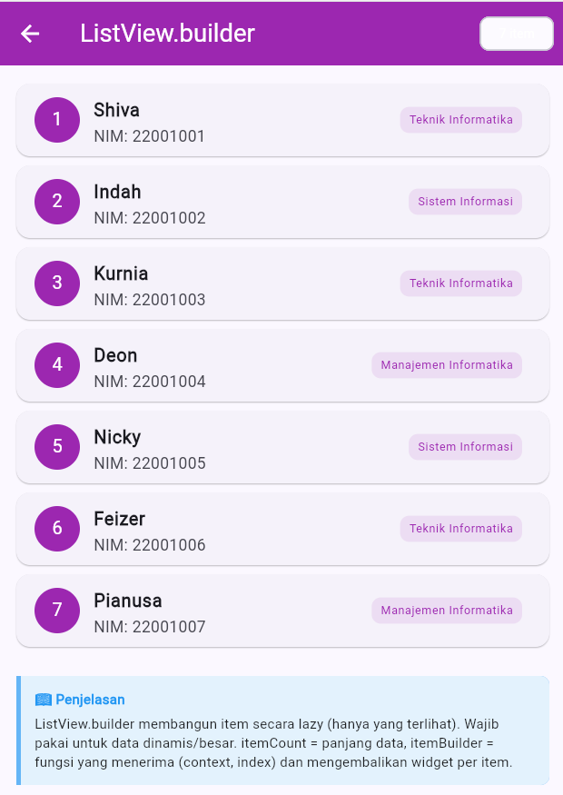
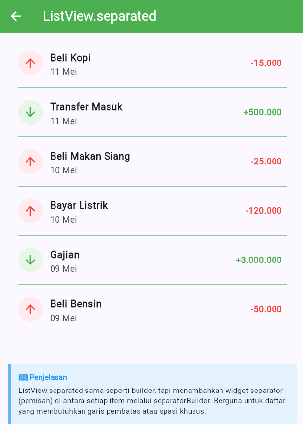
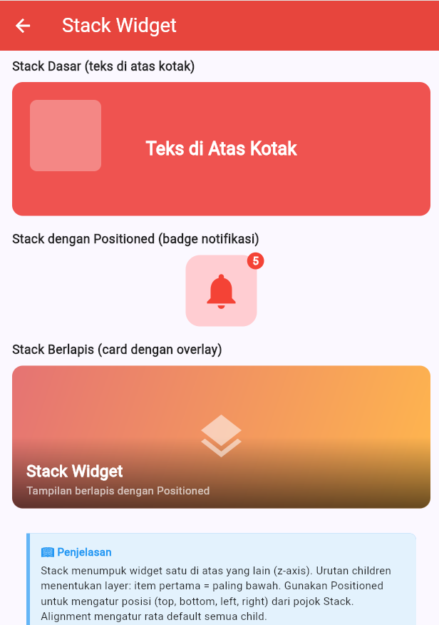

<div align="center">
  <br />

  <h1>LAPORAN PRAKTIKUM <br>
  APLIKASI BERBASIS PLATFORM
  </h1>

  <br />

  <h3>MODUL 3 & 4 <br>
  MOBILE
  </h3>

  <br />

  


  <br />
  <br />
  <br />

  <h3>Disusun Oleh :</h3>

  <p>
    <strong>Shiva Indah Kurnia</strong><br>
    <strong>2311102035</strong><br>
    <strong>S1 IF-11-01</strong>
  </p>

  <br />

  <h3>Dosen Pengampu :</h3>

  <p>
    <strong>Dimas Fanny Hebrasianto Permadi, S.ST., M.Kom</strong>
  </p>
  
  <br />
  <br />
    <h4>Asisten Praktikum :</h4>
    <strong>Apri Pandu Wicaksono </strong> <br>
    <strong>Rangga Pradarrell Fathi</strong>
  <br />

  <h3>LABORATORIUM HIGH PERFORMANCE
 <br>FAKULTAS INFORMATIKA <br>UNIVERSITAS TELKOM PURWOKERTO <br>2026</h3>
</div>

<hr>

## 💻 Source Code

### Struktur Project

```
modul4/
├── lib/
│   └── main.dart        ← semua kode widget ada di sini
├── test/
│   └── widget_test.dart ← test file
├── pubspec.yaml
└── README.md
```

### `lib/main.dart`

```dart
import 'package:flutter/material.dart';

void main() {
  runApp(const MyApp());
}

class MyApp extends StatelessWidget {
  const MyApp({super.key});

  @override
  Widget build(BuildContext context) {
    return MaterialApp(
      title: 'Praktikum Modul 4',
      debugShowCheckedModeBanner: false,
      theme: ThemeData(
        colorScheme: ColorScheme.fromSeed(seedColor: Colors.indigo),
        useMaterial3: true,
      ),
      home: const HomePage(),
    );
  }
}

// ============================================================
// HOME PAGE — navigasi ke semua widget
// ============================================================
class HomePage extends StatelessWidget {
  const HomePage({super.key});

  @override
  Widget build(BuildContext context) {
    final List<Map<String, dynamic>> menu = [
      {
        'title': 'Container',
        'subtitle': 'Kotak berwarna dengan dekorasi',
        'icon': Icons.crop_square,
        'color': Colors.orange,
        'page': const ContainerPage(),
      },
      {
        'title': 'GridView',
        'subtitle': 'Grid minimal 6 item',
        'icon': Icons.grid_view,
        'color': Colors.teal,
        'page': const GridViewPage(),
      },
      {
        'title': 'ListView',
        'subtitle': 'List statis A, B, C',
        'icon': Icons.list,
        'color': Colors.blue,
        'page': const ListViewPage(),
      },
      {
        'title': 'ListView.builder',
        'subtitle': 'List dinamis dari array',
        'icon': Icons.format_list_bulleted,
        'color': Colors.purple,
        'page': const ListViewBuilderPage(),
      },
      {
        'title': 'ListView.separated',
        'subtitle': 'List dengan garis pembatas',
        'icon': Icons.format_line_spacing,
        'color': Colors.green,
        'page': const ListViewSeparatedPage(),
      },
      {
        'title': 'Stack',
        'subtitle': 'Tampilan widget bertumpuk',
        'icon': Icons.layers,
        'color': Colors.red,
        'page': const StackPage(),
      },
    ];

    return Scaffold(
      backgroundColor: const Color(0xFFF5F5F5),
      appBar: AppBar(
        backgroundColor: Colors.indigo,
        foregroundColor: Colors.white,
        title: const Column(
          crossAxisAlignment: CrossAxisAlignment.start,
          children: [
            Text(
              'Praktikum Flutter',
              style: TextStyle(fontSize: 18, fontWeight: FontWeight.bold),
            ),
            Text(
              'Modul 4 — Flutter Widgets',
              style: TextStyle(fontSize: 12, color: Colors.white70),
            ),
          ],
        ),
      ),
      body: ListView.builder(
        padding: const EdgeInsets.all(16),
        itemCount: menu.length,
        itemBuilder: (context, index) {
          final item = menu[index];
          return Card(
            margin: const EdgeInsets.only(bottom: 12),
            elevation: 2,
            shape:
                RoundedRectangleBorder(borderRadius: BorderRadius.circular(12)),
            child: ListTile(
              contentPadding:
                  const EdgeInsets.symmetric(horizontal: 16, vertical: 8),
              leading: CircleAvatar(
                backgroundColor: (item['color'] as Color).withOpacity(0.15),
                child: Icon(item['icon'] as IconData,
                    color: item['color'] as Color),
              ),
              title: Text(item['title'] as String,
                  style: const TextStyle(fontWeight: FontWeight.bold)),
              subtitle: Text(item['subtitle'] as String,
                  style: const TextStyle(fontSize: 12)),
              trailing: const Icon(Icons.arrow_forward_ios,
                  size: 16, color: Colors.grey),
              onTap: () => Navigator.push(
                context,
                MaterialPageRoute(builder: (_) => item['page'] as Widget),
              ),
            ),
          );
        },
      ),
    );
  }
}

// ============================================================
// 1. CONTAINER PAGE
// ============================================================
class ContainerPage extends StatelessWidget {
  const ContainerPage({super.key});

  @override
  Widget build(BuildContext context) {
    return Scaffold(
      appBar: AppBar(
        title: const Text('Container Widget'),
        backgroundColor: Colors.orange,
        foregroundColor: Colors.white,
      ),
      body: SingleChildScrollView(
        padding: const EdgeInsets.all(16),
        child: Column(
          crossAxisAlignment: CrossAxisAlignment.start,
          children: [
            _sectionTitle('Container Dasar'),
            // Container 1 — warna solid
            Container(
              width: double.infinity,
              height: 100,
              color: Colors.orange,
              child: const Center(
                child: Text(
                  'Container Warna Solid',
                  style: TextStyle(color: Colors.white, fontSize: 16),
                ),
              ),
            ),
            const SizedBox(height: 16),

            _sectionTitle('Container dengan Border Radius'),
            // Container 2 — rounded + shadow
            Container(
              width: double.infinity,
              height: 100,
              decoration: BoxDecoration(
                gradient: const LinearGradient(
                  colors: [Colors.deepOrange, Colors.orange],
                ),
                borderRadius: BorderRadius.circular(16),
                boxShadow: [
                  BoxShadow(
                    color: Colors.orange.withOpacity(0.4),
                    blurRadius: 10,
                    offset: const Offset(0, 4),
                  ),
                ],
              ),
              child: const Center(
                child: Text(
                  'Container Gradient + Shadow',
                  style: TextStyle(color: Colors.white, fontSize: 16),
                ),
              ),
            ),
            const SizedBox(height: 16),

            _sectionTitle('Container dengan Border'),
            // Container 3 — border
            Container(
              width: double.infinity,
              height: 100,
              decoration: BoxDecoration(
                color: Colors.white,
                border: Border.all(color: Colors.orange, width: 3),
                borderRadius: BorderRadius.circular(12),
              ),
              child: const Center(
                child: Text(
                  'Container dengan Border',
                  style: TextStyle(
                      color: Colors.orange,
                      fontSize: 16,
                      fontWeight: FontWeight.bold),
                ),
              ),
            ),
            const SizedBox(height: 16),

            _sectionTitle('Row Container (Kecil-kecil)'),
            // Container 4 — row of small containers
            Row(
              mainAxisAlignment: MainAxisAlignment.spaceEvenly,
              children: [
                Colors.red,
                Colors.green,
                Colors.blue,
                Colors.purple,
              ]
                  .map(
                    (c) => Container(
                      width: 60,
                      height: 60,
                      decoration: BoxDecoration(
                        color: c,
                        borderRadius: BorderRadius.circular(8),
                      ),
                    ),
                  )
                  .toList(),
            ),
            const SizedBox(height: 16),
            _penjelasan(
              'Container adalah widget dasar yang menjadi pembungkus. '
              'Properti utama: color, width, height, decoration (BoxDecoration '
              'untuk gradient, border, borderRadius, boxShadow), padding, margin, dan child.',
            ),
          ],
        ),
      ),
    );
  }
}

// ============================================================
// 2. GRIDVIEW PAGE
// ============================================================
class GridViewPage extends StatelessWidget {
  const GridViewPage({super.key});

  final List<Map<String, dynamic>> _items = const [
    {'label': 'Apel', 'icon': Icons.local_florist, 'color': Colors.red},
    {'label': 'Buku', 'icon': Icons.menu_book, 'color': Colors.blue},
    {'label': 'Kamera', 'icon': Icons.camera_alt, 'color': Colors.teal},
    {'label': 'Dompet', 'icon': Icons.account_balance_wallet, 'color': Colors.amber},
    {'label': 'Email', 'icon': Icons.email, 'color': Colors.purple},
    {'label': 'Flash', 'icon': Icons.flash_on, 'color': Colors.orange},
    {'label': 'Gift', 'icon': Icons.card_giftcard, 'color': Colors.pink},
    {'label': 'Home', 'icon': Icons.home, 'color': Colors.green},
  ];

  @override
  Widget build(BuildContext context) {
    return Scaffold(
      appBar: AppBar(
        title: const Text('GridView Widget'),
        backgroundColor: Colors.teal,
        foregroundColor: Colors.white,
      ),
      body: Column(
        children: [
          Expanded(
            child: GridView.builder(
              padding: const EdgeInsets.all(16),
              // crossAxisCount = jumlah kolom
              gridDelegate: const SliverGridDelegateWithFixedCrossAxisCount(
                crossAxisCount: 2,       // 2 kolom
                crossAxisSpacing: 12,    // jarak horizontal
                mainAxisSpacing: 12,     // jarak vertikal
                childAspectRatio: 1.1,   // rasio lebar:tinggi tiap item
              ),
              itemCount: _items.length,
              itemBuilder: (context, index) {
                final item = _items[index];
                return Container(
                  decoration: BoxDecoration(
                    color: (item['color'] as Color).withOpacity(0.12),
                    borderRadius: BorderRadius.circular(12),
                    border: Border.all(
                        color: (item['color'] as Color).withOpacity(0.3)),
                  ),
                  child: Column(
                    mainAxisAlignment: MainAxisAlignment.center,
                    children: [
                      Icon(item['icon'] as IconData,
                          size: 40, color: item['color'] as Color),
                      const SizedBox(height: 8),
                      Text(
                        item['label'] as String,
                        style: TextStyle(
                          fontWeight: FontWeight.bold,
                          color: item['color'] as Color,
                        ),
                      ),
                      Text(
                        'Item ${index + 1}',
                        style:
                            const TextStyle(fontSize: 11, color: Colors.grey),
                      ),
                    ],
                  ),
                );
              },
            ),
          ),
          _penjelasan(
            'GridView.builder menampilkan item dalam tata letak grid. '
            'SliverGridDelegateWithFixedCrossAxisCount mengatur jumlah kolom (crossAxisCount), '
            'jarak antar item (crossAxisSpacing & mainAxisSpacing), '
            'dan rasio ukuran (childAspectRatio).',
          ),
        ],
      ),
    );
  }
}

// ============================================================
// 3. LISTVIEW PAGE (statis)
// ============================================================
class ListViewPage extends StatelessWidget {
  const ListViewPage({super.key});

  @override
  Widget build(BuildContext context) {
    return Scaffold(
      appBar: AppBar(
        title: const Text('ListView Widget'),
        backgroundColor: Colors.blue,
        foregroundColor: Colors.white,
      ),
      body: Column(
        children: [
          Expanded(
            // ListView statis: setiap child ditulis langsung
            child: ListView(
              padding: const EdgeInsets.all(16),
              children: [
                _staticListTile('A', 'Item A — ListView Statis', Colors.blue,
                    Icons.looks_one),
                const SizedBox(height: 8),
                _staticListTile('B', 'Item B — ListView Statis', Colors.indigo,
                    Icons.looks_two),
                const SizedBox(height: 8),
                _staticListTile('C', 'Item C — ListView Statis',
                    Colors.blueGrey, Icons.looks_3),
              ],
            ),
          ),
          _penjelasan(
            'ListView statis cocok untuk jumlah item yang sedikit dan tetap. '
            'Setiap child widget ditulis langsung di dalam properti children:[]. '
            'Tidak efisien untuk data banyak (gunakan ListView.builder).',
          ),
        ],
      ),
    );
  }

  Widget _staticListTile(
      String label, String subtitle, Color color, IconData icon) {
    return Card(
      elevation: 2,
      shape: RoundedRectangleBorder(borderRadius: BorderRadius.circular(12)),
      child: ListTile(
        leading: CircleAvatar(
          backgroundColor: color,
          child: Icon(icon, color: Colors.white),
        ),
        title: Text(label,
            style: TextStyle(fontWeight: FontWeight.bold, color: color)),
        subtitle: Text(subtitle),
        trailing: const Icon(Icons.chevron_right),
      ),
    );
  }
}

// ============================================================
// 4. LISTVIEW.BUILDER PAGE
// ============================================================
class ListViewBuilderPage extends StatelessWidget {
  const ListViewBuilderPage({super.key});

  // Data array
  static const List<Map<String, String>> _mahasiswa = [
    {'nama': 'Shiva', 'nim': '22001001', 'prodi': 'Teknik Informatika'},
    {'nama': 'Indah', 'nim': '22001002', 'prodi': 'Sistem Informasi'},
    {'nama': 'Kurnia', 'nim': '22001003', 'prodi': 'Teknik Informatika'},
    {'nama': 'Deon', 'nim': '22001004', 'prodi': 'Manajemen Informatika'},
    {'nama': 'Nicky', 'nim': '22001005', 'prodi': 'Sistem Informasi'},
    {'nama': 'Feizer', 'nim': '22001006', 'prodi': 'Teknik Informatika'},
    {'nama': 'Pianusa', 'nim': '22001007', 'prodi': 'Manajemen Informatika'},
  ];

  @override
  Widget build(BuildContext context) {
    return Scaffold(
      appBar: AppBar(
        title: const Text('ListView.builder'),
        backgroundColor: Colors.purple,
        foregroundColor: Colors.white,
        actions: [
          Padding(
            padding: const EdgeInsets.only(right: 12),
            child: Chip(
              label: Text('${_mahasiswa.length} item',
                  style: const TextStyle(fontSize: 11)),
              backgroundColor: Colors.white24,
              labelStyle: const TextStyle(color: Colors.white),
            ),
          ),
        ],
      ),
      body: Column(
        children: [
          Expanded(
            // ListView.builder: efisien, hanya render item yang terlihat
            child: ListView.builder(
              padding: const EdgeInsets.all(16),
              itemCount: _mahasiswa.length,
              itemBuilder: (context, index) {
                final mhs = _mahasiswa[index];
                return Card(
                  margin: const EdgeInsets.only(bottom: 8),
                  shape: RoundedRectangleBorder(
                      borderRadius: BorderRadius.circular(12)),
                  child: ListTile(
                    leading: CircleAvatar(
                      backgroundColor: Colors.purple,
                      child: Text(
                        '${index + 1}',
                        style: const TextStyle(color: Colors.white),
                      ),
                    ),
                    title: Text(mhs['nama']!,
                        style: const TextStyle(fontWeight: FontWeight.bold)),
                    subtitle: Text('NIM: ${mhs['nim']}'),
                    trailing: Container(
                      padding: const EdgeInsets.symmetric(
                          horizontal: 8, vertical: 4),
                      decoration: BoxDecoration(
                        color: Colors.purple.withOpacity(0.1),
                        borderRadius: BorderRadius.circular(8),
                      ),
                      child: Text(
                        mhs['prodi']!,
                        style: const TextStyle(
                            fontSize: 10, color: Colors.purple),
                      ),
                    ),
                  ),
                );
              },
            ),
          ),
          _penjelasan(
            'ListView.builder membangun item secara lazy (hanya yang terlihat). '
            'Wajib pakai untuk data dinamis/besar. '
            'itemCount = panjang data, itemBuilder = fungsi yang menerima (context, index) '
            'dan mengembalikan widget per item.',
          ),
        ],
      ),
    );
  }
}

// ============================================================
// 5. LISTVIEW.SEPARATED PAGE
// ============================================================
class ListViewSeparatedPage extends StatelessWidget {
  const ListViewSeparatedPage({super.key});

  static const List<Map<String, dynamic>> _transaksi = [
    {'nama': 'Beli Kopi', 'jumlah': -15000, 'tanggal': '11 Mei'},
    {'nama': 'Transfer Masuk', 'jumlah': 500000, 'tanggal': '11 Mei'},
    {'nama': 'Beli Makan Siang', 'jumlah': -25000, 'tanggal': '10 Mei'},
    {'nama': 'Bayar Listrik', 'jumlah': -120000, 'tanggal': '10 Mei'},
    {'nama': 'Gajian', 'jumlah': 3000000, 'tanggal': '09 Mei'},
    {'nama': 'Beli Bensin', 'jumlah': -50000, 'tanggal': '09 Mei'},
  ];

  @override
  Widget build(BuildContext context) {
    return Scaffold(
      appBar: AppBar(
        title: const Text('ListView.separated'),
        backgroundColor: Colors.green,
        foregroundColor: Colors.white,
      ),
      body: Column(
        children: [
          Expanded(
            child: ListView.separated(
              padding: const EdgeInsets.all(16),
              itemCount: _transaksi.length,
              // separatorBuilder: widget yang muncul DI ANTARA item
              separatorBuilder: (context, index) => const Divider(
                color: Colors.green,
                thickness: 1,
                indent: 16,
                endIndent: 16,
              ),
              itemBuilder: (context, index) {
                final tx = _transaksi[index];
                final isPositive = (tx['jumlah'] as int) > 0;
                return ListTile(
                  leading: CircleAvatar(
                    backgroundColor:
                        isPositive ? Colors.green.shade50 : Colors.red.shade50,
                    child: Icon(
                      isPositive
                          ? Icons.arrow_downward
                          : Icons.arrow_upward,
                      color: isPositive ? Colors.green : Colors.red,
                    ),
                  ),
                  title: Text(tx['nama'] as String,
                      style:
                          const TextStyle(fontWeight: FontWeight.w600)),
                  subtitle: Text(tx['tanggal'] as String),
                  trailing: Text(
                    '${isPositive ? '+' : ''}${(tx['jumlah'] as int).toString().replaceAllMapped(RegExp(r'(\d{1,3})(?=(\d{3})+(?!\d))'), (m) => '${m[1]}.')}',
                    style: TextStyle(
                      color: isPositive ? Colors.green : Colors.red,
                      fontWeight: FontWeight.bold,
                      fontSize: 14,
                    ),
                  ),
                );
              },
            ),
          ),
          _penjelasan(
            'ListView.separated sama seperti builder, tapi menambahkan widget '
            'separator (pemisah) di antara setiap item melalui separatorBuilder. '
            'Berguna untuk daftar yang membutuhkan garis pembatas atau spasi khusus.',
          ),
        ],
      ),
    );
  }
}

// ============================================================
// 6. STACK PAGE
// ============================================================
class StackPage extends StatelessWidget {
  const StackPage({super.key});

  @override
  Widget build(BuildContext context) {
    return Scaffold(
      appBar: AppBar(
        title: const Text('Stack Widget'),
        backgroundColor: Colors.red,
        foregroundColor: Colors.white,
      ),
      body: SingleChildScrollView(
        padding: const EdgeInsets.all(16),
        child: Column(
          crossAxisAlignment: CrossAxisAlignment.start,
          children: [
            _sectionTitle('Stack Dasar (teks di atas kotak)'),
            // Stack 1 — teks di atas container
            SizedBox(
              width: double.infinity,
              height: 150,
              child: Stack(
                children: [
                  // Layer 1 (bawah) — kotak merah
                  Container(
                    width: double.infinity,
                    height: 150,
                    decoration: BoxDecoration(
                      color: Colors.red.shade400,
                      borderRadius: BorderRadius.circular(12),
                    ),
                  ),
                  // Layer 2 — kotak putih transparan
                  Positioned(
                    top: 20,
                    left: 20,
                    child: Container(
                      width: 80,
                      height: 80,
                      decoration: BoxDecoration(
                        color: Colors.white.withOpacity(0.3),
                        borderRadius: BorderRadius.circular(8),
                      ),
                    ),
                  ),
                  // Layer 3 (atas) — teks di tengah
                  const Center(
                    child: Text(
                      'Teks di Atas Kotak',
                      style: TextStyle(
                        color: Colors.white,
                        fontSize: 20,
                        fontWeight: FontWeight.bold,
                      ),
                    ),
                  ),
                ],
              ),
            ),
            const SizedBox(height: 16),

            _sectionTitle('Stack dengan Positioned (badge notifikasi)'),
            // Stack 2 — badge di pojok ikon
            Center(
              child: Stack(
                clipBehavior: Clip.none,
                children: [
                  Container(
                    width: 80,
                    height: 80,
                    decoration: BoxDecoration(
                      color: Colors.red.shade100,
                      borderRadius: BorderRadius.circular(16),
                    ),
                    child: const Icon(Icons.notifications,
                        size: 48, color: Colors.red),
                  ),
                  // Badge notifikasi di pojok kanan atas
                  Positioned(
                    top: -8,
                    right: -8,
                    child: Container(
                      padding: const EdgeInsets.all(6),
                      decoration: const BoxDecoration(
                        color: Colors.red,
                        shape: BoxShape.circle,
                      ),
                      child: const Text(
                        '5',
                        style: TextStyle(
                            color: Colors.white,
                            fontSize: 12,
                            fontWeight: FontWeight.bold),
                      ),
                    ),
                  ),
                ],
              ),
            ),
            const SizedBox(height: 16),

            _sectionTitle('Stack Berlapis (card dengan overlay)'),
            // Stack 3 — gambar + overlay gelap + teks
            SizedBox(
              width: double.infinity,
              height: 160,
              child: Stack(
                fit: StackFit.expand,
                children: [
                  // Layer 1 — background gradient
                  Container(
                    decoration: BoxDecoration(
                      borderRadius: BorderRadius.circular(12),
                      gradient: LinearGradient(
                        begin: Alignment.topLeft,
                        end: Alignment.bottomRight,
                        colors: [
                          Colors.red.shade300,
                          Colors.orange.shade300,
                        ],
                      ),
                    ),
                  ),
                  // Layer 2 — overlay gelap di bawah
                  Positioned(
                    bottom: 0,
                    left: 0,
                    right: 0,
                    child: Container(
                      height: 80,
                      decoration: BoxDecoration(
                        borderRadius: const BorderRadius.only(
                          bottomLeft: Radius.circular(12),
                          bottomRight: Radius.circular(12),
                        ),
                        gradient: LinearGradient(
                          begin: Alignment.topCenter,
                          end: Alignment.bottomCenter,
                          colors: [
                            Colors.transparent,
                            Colors.black.withOpacity(0.6),
                          ],
                        ),
                      ),
                    ),
                  ),
                  // Layer 3 — ikon di tengah atas
                  const Align(
                    alignment: Alignment.center,
                    child: Icon(Icons.layers, size: 60, color: Colors.white54),
                  ),
                  // Layer 4 — teks di bawah
                  const Positioned(
                    bottom: 12,
                    left: 16,
                    child: Column(
                      crossAxisAlignment: CrossAxisAlignment.start,
                      children: [
                        Text(
                          'Stack Widget',
                          style: TextStyle(
                            color: Colors.white,
                            fontSize: 18,
                            fontWeight: FontWeight.bold,
                          ),
                        ),
                        Text(
                          'Tampilan berlapis dengan Positioned',
                          style:
                              TextStyle(color: Colors.white70, fontSize: 12),
                        ),
                      ],
                    ),
                  ),
                ],
              ),
            ),
            const SizedBox(height: 12),
            _penjelasan(
              'Stack menumpuk widget satu di atas yang lain (z-axis). '
              'Urutan children menentukan layer: item pertama = paling bawah. '
              'Gunakan Positioned untuk mengatur posisi (top, bottom, left, right) '
              'dari pojok Stack. Alignment mengatur rata default semua child.',
            ),
          ],
        ),
      ),
    );
  }
}

// ============================================================
// HELPER WIDGETS
// ============================================================
Widget _sectionTitle(String title) {
  return Padding(
    padding: const EdgeInsets.only(bottom: 8),
    child: Text(
      title,
      style: const TextStyle(
          fontSize: 14, fontWeight: FontWeight.bold, color: Colors.black87),
    ),
  );
}

Widget _penjelasan(String text) {
  return Container(
    width: double.infinity,
    margin: const EdgeInsets.all(16),
    padding: const EdgeInsets.all(12),
    decoration: BoxDecoration(
      color: Colors.blue.shade50,
      border: Border(left: BorderSide(color: Colors.blue.shade300, width: 4)),
      borderRadius: const BorderRadius.only(
        topRight: Radius.circular(8),
        bottomRight: Radius.circular(8),
      ),
    ),
    child: Column(
      crossAxisAlignment: CrossAxisAlignment.start,
      children: [
        const Text('📖 Penjelasan',
            style: TextStyle(
                fontWeight: FontWeight.bold,
                fontSize: 12,
                color: Colors.blue)),
        const SizedBox(height: 4),
        Text(text,
            style: const TextStyle(fontSize: 12, color: Colors.black87)),
      ],
    ),
  );
}
```

## Penjelasan Widget

### 1. Container

```dart
Container(
  width: double.infinity,
  height: 100,
  decoration: BoxDecoration(
    gradient: LinearGradient(
      colors: [Colors.deepOrange, Colors.orange],
    ),
    borderRadius: BorderRadius.circular(16),
    boxShadow: [
      BoxShadow(
        color: Colors.orange.withOpacity(0.4),
        blurRadius: 10,
        offset: Offset(0, 4),
      ),
    ],
  ),
  child: Center(
    child: Text(
      'Container Gradient + Shadow',
      style: TextStyle(color: Colors.white, fontSize: 16),
    ),
  ),
)
```

**Container** adalah widget kotak serbaguna yang berfungsi sebagai pembungkus widget lain. Container dapat dikustomisasi dengan ukuran, warna, padding, margin, dan dekorasi. Dekorasi lanjutan seperti gradient, border, border radius, dan box shadow dapat ditambahkan melalui BoxDecoration.

---

### 2. GridView

```dart
GridView.builder(
  padding: EdgeInsets.all(16),
  gridDelegate: SliverGridDelegateWithFixedCrossAxisCount(
    crossAxisCount: 2,      // jumlah kolom
    crossAxisSpacing: 12,   // jarak horizontal antar item
    mainAxisSpacing: 12,    // jarak vertikal antar item
    childAspectRatio: 1.1,  // rasio lebar:tinggi tiap item
  ),
  itemCount: items.length,
  itemBuilder: (context, index) {
    return Container(
      decoration: BoxDecoration(
        color: Colors.teal.withOpacity(0.12),
        borderRadius: BorderRadius.circular(12),
      ),
      child: Column(
        mainAxisAlignment: MainAxisAlignment.center,
        children: [
          Icon(items[index]['icon'], size: 40, color: Colors.teal),
          Text(items[index]['label']),
        ],
      ),
    );
  },
)
```

**GridView** adalah widget yang menampilkan item-item dalam tata letak berbentuk grid (baris dan kolom). GridView.builder digunakan untuk membuat grid secara dinamis dari data array. SliverGridDelegateWithFixedCrossAxisCount digunakan untuk mengatur jumlah kolom, jarak antar item, dan rasio ukuran tiap item.

---

### 3. ListView

```dart
ListView(
  padding: EdgeInsets.all(16),
  children: [
    ListTile(
      leading: CircleAvatar(
        backgroundColor: Colors.blue,
        child: Icon(Icons.looks_one, color: Colors.white),
      ),
      title: Text('A', style: TextStyle(fontWeight: FontWeight.bold)),
      subtitle: Text('Item A — ListView Statis'),
    ),
    ListTile(
      leading: CircleAvatar(
        backgroundColor: Colors.indigo,
        child: Icon(Icons.looks_two, color: Colors.white),
      ),
      title: Text('B', style: TextStyle(fontWeight: FontWeight.bold)),
      subtitle: Text('Item B — ListView Statis'),
    ),
    ListTile(
      leading: CircleAvatar(
        backgroundColor: Colors.blueGrey,
        child: Icon(Icons.looks_3, color: Colors.white),
      ),
      title: Text('C', style: TextStyle(fontWeight: FontWeight.bold)),
      subtitle: Text('Item C — ListView Statis'),
    ),
  ],
)
```

**ListView** statis digunakan untuk menampilkan daftar item yang jumlahnya sedikit dan tetap. Semua widget child ditulis langsung di dalam properti children: []. Cocok digunakan ketika item tidak terlalu banyak dan tidak berubah-ubah.

---

### 4. ListView.builder

```dart
final List<Map<String, String>> mahasiswa = [
  {'nama': 'Andi Pratama', 'nim': '22001001', 'prodi': 'Teknik Informatika'},
  {'nama': 'Budi Santoso', 'nim': '22001002', 'prodi': 'Sistem Informasi'},
  {'nama': 'Citra Dewi',   'nim': '22001003', 'prodi': 'Teknik Informatika'},
];

ListView.builder(
  padding: EdgeInsets.all(16),
  itemCount: mahasiswa.length,
  itemBuilder: (context, index) {
    final mhs = mahasiswa[index];
    return Card(
      margin: EdgeInsets.only(bottom: 8),
      child: ListTile(
        leading: CircleAvatar(
          backgroundColor: Colors.purple,
          child: Text('${index + 1}',
              style: TextStyle(color: Colors.white)),
        ),
        title: Text(mhs['nama']!,
            style: TextStyle(fontWeight: FontWeight.bold)),
        subtitle: Text('NIM: ${mhs['nim']}'),
        trailing: Text(mhs['prodi']!,
            style: TextStyle(fontSize: 10, color: Colors.purple)),
      ),
    );
  },
)
```

**ListView.builder** membangun item secara lazy, artinya hanya item yang terlihat di layar saja yang di-render. Ini membuat ListView.builder jauh lebih efisien dibanding ListView biasa untuk data yang banyak atau berasal dari array/database/API. Membutuhkan dua properti utama yaitu itemCount (panjang data) dan itemBuilder (fungsi yang mengembalikan widget per item).

### 5. ListView.separated

```dart
ListView.separated(
  padding: EdgeInsets.all(16),
  itemCount: transaksi.length,
  separatorBuilder: (context, index) => Divider(
    color: Colors.green,
    thickness: 1,
    indent: 16,
    endIndent: 16,
  ),
  itemBuilder: (context, index) {
    final tx = transaksi[index];
    final isPositive = tx['jumlah'] > 0;
    return ListTile(
      leading: CircleAvatar(
        backgroundColor:
            isPositive ? Colors.green.shade50 : Colors.red.shade50,
        child: Icon(
          isPositive ? Icons.arrow_downward : Icons.arrow_upward,
          color: isPositive ? Colors.green : Colors.red,
        ),
      ),
      title: Text(tx['nama']),
      subtitle: Text(tx['tanggal']),
      trailing: Text(
        '${isPositive ? '+' : ''}${tx['jumlah']}',
        style: TextStyle(
          color: isPositive ? Colors.green : Colors.red,
          fontWeight: FontWeight.bold,
        ),
      ),
    );
  },
)
```

**ListView.separated** bekerja sama seperti ListView.builder, namun menambahkan widget pemisah (separator) di antara setiap item melalui separatorBuilder. Widget pemisah yang umum digunakan adalah Divider. Sangat berguna untuk tampilan daftar yang memerlukan garis pembatas atau spasi khusus antar item.

### 6. Stack

```dart
Stack(
  clipBehavior: Clip.none,
  children: [
    // Layer 1 (bawah) — background
    Container(
      width: double.infinity,
      height: 150,
      decoration: BoxDecoration(
        color: Colors.red.shade400,
        borderRadius: BorderRadius.circular(12),
      ),
    ),
    // Layer 2 — kotak putih transparan (Positioned)
    Positioned(
      top: 20,
      left: 20,
      child: Container(
        width: 80,
        height: 80,
        decoration: BoxDecoration(
          color: Colors.white.withOpacity(0.3),
          borderRadius: BorderRadius.circular(8),
        ),
      ),
    ),
    // Layer 3 (atas) — teks di tengah
    Center(
      child: Text(
        'Teks di Atas Kotak',
        style: TextStyle(
          color: Colors.white,
          fontSize: 20,
          fontWeight: FontWeight.bold,
        ),
      ),
    ),
  ],
)
```

**Stack** adalah widget yang menumpuk widget-widget lain satu di atas yang lain pada sumbu Z. Urutan children menentukan layer: item pertama berada di paling bawah, item terakhir berada di paling atas. Widget Positioned digunakan untuk mengatur posisi child di dalam Stack berdasarkan jarak dari tepi (top, bottom, left, right). Stack sering digunakan untuk membuat badge notifikasi, overlay teks di atas gambar, dan efek tumpuk lainnya.

---

## Screenshot Hasil









