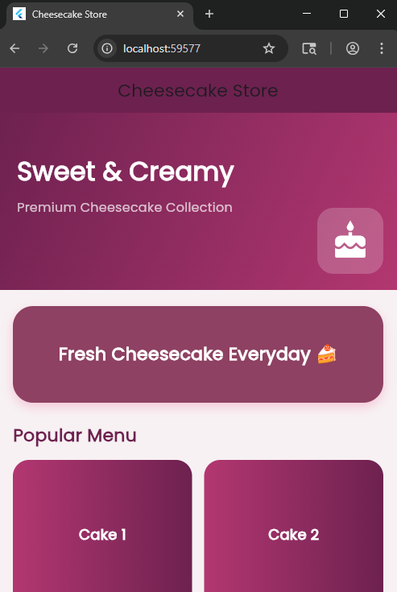
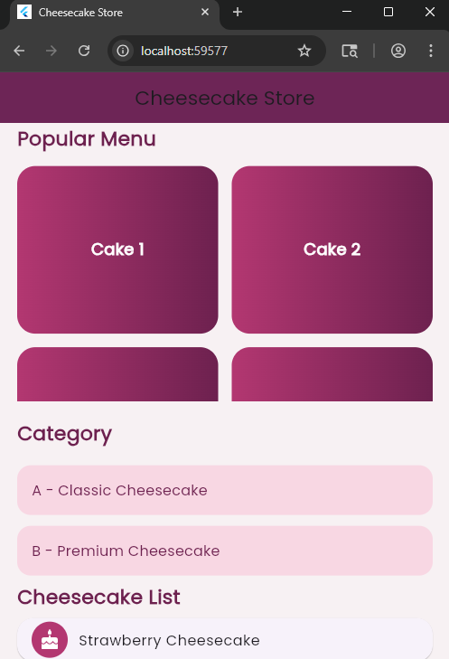
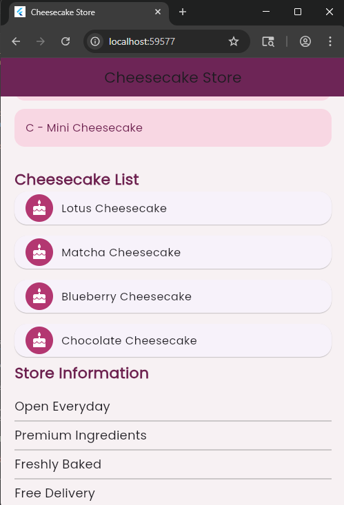

<div align="center">
  <br />
  <h1>LAPORAN PRAKTIKUM <br>APLIKASI BERBASIS PLATFORM</h1>
  <br />
  <h3>MODUL 3 & 4</h3>
  <br />
  <br />
   
  <br />
  <br />
  <br />
  <h3>Disusun Oleh :</h3>
  <p>
    <strong>Nabila Shasya Sabrina</strong><br>
    <strong>2311102039</strong><br>
    <strong>S1 IF-11-01</strong>
  </p>
  <br />
  <h3>Dosen Pengampu :</h3>
  <p>
    <strong>Dimas Fanny Hebrasianto Permadi, S.ST., M.Kom</strong>
  </p>
  <br />
  <br />
    <h4>Asisten Praktikum :</h4>
    <strong> Apri Pandu Wicaksono </strong> <br>
    <strong>Rangga Pradarrell Fathi</strong>
  <br />
  <h3>LABORATORIUM HIGH PERFORMANCE
 <br>FAKULTAS INFORMATIKA <br>UNIVERSITAS TELKOM PURWOKERTO <br>2026</h3>
</div>

---

## 1. Dasar Teori

Flutter menyediakan berbagai widget layout yang fleksibel untuk membangun antarmuka aplikasi mobile. Widget-widget tersebut dibagi menjadi dua jenis utama, yaitu widget single-child dan multi-child.
Container merupakan widget serbaguna yang digunakan untuk menampung satu child widget. Widget ini mendukung berbagai pengaturan tampilan seperti warna, border, padding, margin, hingga border radius. Container biasanya dipakai sebagai pembungkus komponen UI agar tampilan aplikasi menjadi lebih rapi dan terorganisir.
GridView adalah widget scrollable yang berfungsi menampilkan widget dalam bentuk grid dua dimensi. Salah satu jenisnya, yaitu GridView.count, memungkinkan developer menentukan jumlah kolom secara langsung melalui parameter crossAxisCount. Widget ini cocok digunakan untuk menampilkan galeri, menu, atau daftar produk berbentuk grid.
ListView merupakan widget scrollable yang menampilkan item secara berurutan, baik secara vertikal maupun horizontal. Flutter menyediakan beberapa jenis ListView, di antaranya:
-ListView biasa, digunakan untuk jumlah item yang sedikit dan sudah diketahui sebelumnya.
-ListView.builder, digunakan untuk data yang banyak atau bersifat dinamis karena hanya merender item yang tampil di layar sehingga lebih efisien.
-ListView.separated, hampir sama dengan ListView.builder, tetapi memiliki tambahan separatorBuilder untuk membuat garis atau pemisah antar item secara otomatis.
Stack adalah widget yang digunakan untuk menumpuk beberapa child widget dalam satu area secara berlapis pada sumbu z. Child widget yang ditulis paling akhir akan tampil di bagian paling atas. Stack sering dimanfaatkan untuk membuat tampilan overlay, badge, maupun desain elemen yang saling bertumpuk.

---

## 2. Hasil Praktikum

**Langkah-langkah:**
1. Buka Visual Studio Code dan buat project Flutter baru melalui View → Command Palette → Flutter: New Project → Application, pilih folder tujuan, beri nama project shasya_cheesecake, lalu tekan Enter.

2. Setelah project selesai dibuat, buka file lib/main.dart dan hapus semua kode bawaan.

3. Tambahkan kode berikut pada main.dart

```
import 'package:flutter/material.dart';
import 'package:google_fonts/google_fonts.dart';

void main() {
  runApp(const CheesecakeApp());
}

class CheesecakeApp extends StatelessWidget {
  const CheesecakeApp({super.key});

  @override
  Widget build(BuildContext context) {
    return MaterialApp(
      debugShowCheckedModeBanner: false,
      title: 'Cheesecake Store',
      theme: ThemeData(
        textTheme: GoogleFonts.poppinsTextTheme(),
      ),
      home: const HomePage(),
    );
  }
}

class HomePage extends StatelessWidget {
  const HomePage({super.key});

  final List<String> cheesecakeList = const [
    "Strawberry Cheesecake",
    "Lotus Cheesecake",
    "Matcha Cheesecake",
    "Blueberry Cheesecake",
    "Chocolate Cheesecake",
  ];

  @override
  Widget build(BuildContext context) {
    return Scaffold(
      backgroundColor: const Color(0xfff7f1f3),
      appBar: AppBar(
        title: const Text("Cheesecake Store"),
        centerTitle: true,
        elevation: 0,
        backgroundColor: const Color(0xff6D214F),
      ),

      body: SingleChildScrollView(
        child: Column(
          crossAxisAlignment: CrossAxisAlignment.start,
          children: [

            // STACK
            Stack(
              children: [
                Container(
                  height: 220,
                  width: double.infinity,
                  decoration: const BoxDecoration(
                    gradient: LinearGradient(
                      colors: [
                        Color(0xff6D214F),
                        Color(0xffB33771),
                      ],
                      begin: Alignment.topLeft,
                      end: Alignment.bottomRight,
                    ),
                  ),
                ),

                Positioned(
                  top: 50,
                  left: 25,
                  child: Column(
                    crossAxisAlignment: CrossAxisAlignment.start,
                    children: const [
                      Text(
                        "Sweet & Creamy",
                        style: TextStyle(
                          fontSize: 32,
                          color: Colors.white,
                          fontWeight: FontWeight.bold,
                        ),
                      ),

                      SizedBox(height: 10),

                      Text(
                        "Premium Cheesecake Collection",
                        style: TextStyle(
                          fontSize: 16,
                          color: Colors.white70,
                        ),
                      ),
                    ],
                  ),
                ),

                Positioned(
                  right: 20,
                  bottom: 20,
                  child: Container(
                    padding: const EdgeInsets.all(16),
                    decoration: BoxDecoration(
                      color: Colors.white.withOpacity(0.2),
                      borderRadius: BorderRadius.circular(20),
                    ),
                    child: const Icon(
                      Icons.cake,
                      color: Colors.white,
                      size: 50,
                    ),
                  ),
                ),
              ],
            ),

            const SizedBox(height: 20),

            // CONTAINER
            Padding(
              padding: const EdgeInsets.symmetric(horizontal: 20),
              child: Container(
                height: 120,
                width: double.infinity,
                decoration: BoxDecoration(
                  color: const Color(0xff8E4162),
                  borderRadius: BorderRadius.circular(25),
                  boxShadow: [
                    BoxShadow(
                      color: Colors.pink.withOpacity(0.2),
                      blurRadius: 10,
                      offset: const Offset(0, 5),
                    ),
                  ],
                ),
                child: const Center(
                  child: Text(
                    "Fresh Cheesecake Everyday 🍰",
                    style: TextStyle(
                      color: Colors.white,
                      fontSize: 22,
                      fontWeight: FontWeight.w600,
                    ),
                  ),
                ),
              ),
            ),

            const SizedBox(height: 25),

            // GRIDVIEW
            const Padding(
              padding: EdgeInsets.symmetric(horizontal: 20),
              child: Text(
                "Popular Menu",
                style: TextStyle(
                  fontSize: 22,
                  fontWeight: FontWeight.bold,
                  color: Color(0xff6D214F),
                ),
              ),
            ),

            const SizedBox(height: 15),

            SizedBox(
              height: 260,
              child: GridView.count(
                physics: const NeverScrollableScrollPhysics(),
                crossAxisCount: 2,
                padding: const EdgeInsets.symmetric(horizontal: 20),
                crossAxisSpacing: 15,
                mainAxisSpacing: 15,
                childAspectRatio: 1.2,
                children: List.generate(
                  6,
                  (index) => Container(
                    decoration: BoxDecoration(
                      borderRadius: BorderRadius.circular(20),
                      gradient: const LinearGradient(
                        colors: [
                          Color(0xffB33771),
                          Color(0xff6D214F),
                        ],
                      ),
                    ),
                    child: Center(
                      child: Text(
                        "Cake ${index + 1}",
                        style: const TextStyle(
                          color: Colors.white,
                          fontSize: 18,
                          fontWeight: FontWeight.w600,
                        ),
                      ),
                    ),
                  ),
                ),
              ),
            ),

            const SizedBox(height: 20),

            // LISTVIEW BIASA
            const Padding(
              padding: EdgeInsets.symmetric(horizontal: 20),
              child: Text(
                "Category",
                style: TextStyle(
                  fontSize: 22,
                  fontWeight: FontWeight.bold,
                  color: Color(0xff6D214F),
                ),
              ),
            ),

            SizedBox(
              height: 150,
              child: ListView(
                padding: const EdgeInsets.all(20),
                children: [
                  itemList("A - Classic Cheesecake"),
                  itemList("B - Premium Cheesecake"),
                  itemList("C - Mini Cheesecake"),
                ],
              ),
            ),

            // LISTVIEW BUILDER
            const Padding(
              padding: EdgeInsets.symmetric(horizontal: 20),
              child: Text(
                "Cheesecake List",
                style: TextStyle(
                  fontSize: 22,
                  fontWeight: FontWeight.bold,
                  color: Color(0xff6D214F),
                ),
              ),
            ),

            SizedBox(
              height: 250,
              child: ListView.builder(
                itemCount: cheesecakeList.length,
                itemBuilder: (context, index) {
                  return Card(
                    margin: const EdgeInsets.symmetric(
                      horizontal: 20,
                      vertical: 8,
                    ),
                    shape: RoundedRectangleBorder(
                      borderRadius: BorderRadius.circular(18),
                    ),
                    child: ListTile(
                      leading: const CircleAvatar(
                        backgroundColor: Color(0xffB33771),
                        child: Icon(
                          Icons.cake,
                          color: Colors.white,
                        ),
                      ),
                      title: Text(cheesecakeList[index]),
                    ),
                  );
                },
              ),
            ),

            // LISTVIEW SEPARATED
            const Padding(
              padding: EdgeInsets.symmetric(horizontal: 20),
              child: Text(
                "Store Information",
                style: TextStyle(
                  fontSize: 22,
                  fontWeight: FontWeight.bold,
                  color: Color(0xff6D214F),
                ),
              ),
            ),

            SizedBox(
              height: 180,
              child: ListView.separated(
                itemCount: 4,
                padding: const EdgeInsets.all(20),
                separatorBuilder: (context, index) {
                  return const Divider(
                    color: Colors.grey,
                    thickness: 1,
                  );
                },
                itemBuilder: (context, index) {
                  List<String> info = [
                    "Open Everyday",
                    "Premium Ingredients",
                    "Freshly Baked",
                    "Free Delivery",
                  ];

                  return Text(
                    info[index],
                    style: const TextStyle(
                      fontSize: 18,
                    ),
                  );
                },
              ),
            ),
          ],
        ),
      ),
    );
  }

  Widget itemList(String text) {
    return Padding(
      padding: const EdgeInsets.only(bottom: 12),
      child: Container(
        padding: const EdgeInsets.all(16),
        decoration: BoxDecoration(
          color: const Color(0xffF8D7E3),
          borderRadius: BorderRadius.circular(15),
        ),
        child: Text(
          text,
          style: const TextStyle(
            fontSize: 16,
            color: Color(0xff6D214F),
            fontWeight: FontWeight.w500,
          ),
        ),
      ),
    );
  }
}
```
---

## 3. Penjelasan setiap widget
1. Container

Digunakan untuk membuat kotak berwarna, memberi padding, margin, dan dekorasi.

2. GridView

Digunakan untuk menampilkan data dalam bentuk grid/kotak. Pada project ini terdapat 6 menu cheesecake.

3. ListView

Digunakan untuk membuat list sederhana berisi item A, B, dan C.

4. ListView.builder

Digunakan untuk membuat list secara dinamis dari data array (cheesecakeList).

5. ListView.separated

Digunakan untuk membuat list dengan garis pembatas (Divider) antar item.

6. Stack

Digunakan untuk membuat tampilan bertumpuk, seperti text di atas background gradient.

---

## 4. Screenshot Hasil




