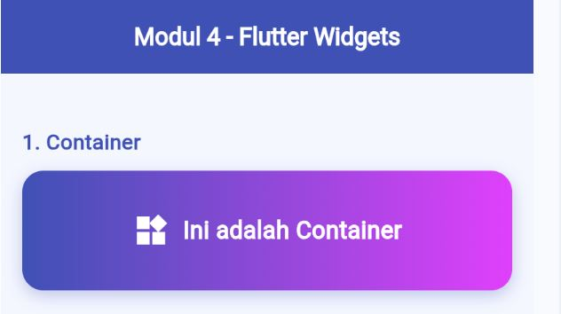
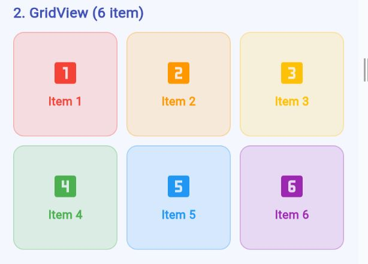
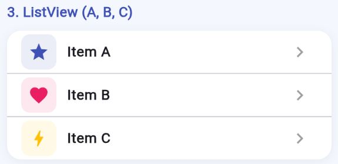
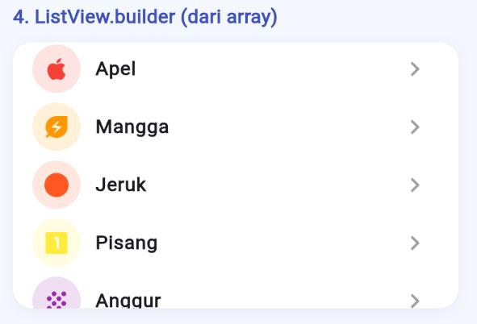
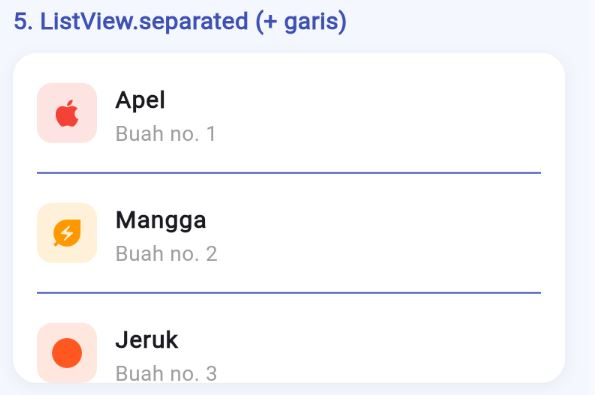
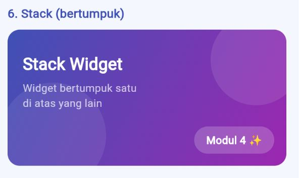

<div align="center">
  <br />
  <h1>LAPORAN PRAKTIKUM<br>APLIKASI BERBASIS PLATFORM</h1>
  <br />
  <h3>Modul 03 04 Mobile</h3>
  <br />
  
  <br />
  <br />
  <br />
  <h3>Disusun Oleh :</h3>
  <p>
    <strong>Raihan Ramadhan</strong><br>
    <strong>2311102040</strong><br>
    <strong>S1 IF-11-01</strong>
  </p>
  <br />
  <h3>Dosen Pengampu :</h3>
  <p>
    <strong>Dimas Fanny Hebrasianto Permadi, S.ST., M.Kom</strong>
  </p>
  <br />
  <br />
  <h4>Asisten Praktikum :</h4>
  <strong>Apri Pandu Wicaksono</strong> <br>
  <strong>Rangga Pradarrell Fathi</strong>
  <br />
  <br />
  <br />
  <br />
  <h3>LABORATORIUM HIGH PERFORMANCE <br> FAKULTAS INFORMATIKA <br> UNIVERSITAS TELKOM PURWOKERTO <br> 2026</h3>
</div>

---
# Dasar Teori Widget Flutter - Modul 4

## Pendahuluan

Flutter adalah framework open-source dari Google untuk membangun aplikasi mobile, web, dan desktop menggunakan satu codebase. Flutter menggunakan bahasa pemrograman **Dart** dan memiliki konsep utama yaitu **"Everything is a Widget"** — artinya semua elemen tampilan di Flutter adalah widget.

---

## 1. Container

Container adalah widget serbaguna yang digunakan untuk menampilkan kotak dengan berbagai kustomisasi tampilan. Container dapat diatur ukuran, warna, padding, margin, border radius, shadow, hingga gradient. Container sering digunakan sebagai "pembungkus" widget lain.

### Properti Utama

| Properti | Fungsi |
|---|---|
| `width` & `height` | Mengatur ukuran kotak |
| `decoration` | Mengatur warna, gradient, border, shadow |
| `alignment` | Mengatur posisi child di dalam container |
| `padding` | Jarak antara konten dan batas dalam container |
| `margin` | Jarak antara container dan widget di luarnya |

### Contoh Kode

```dart
Container(
  width: double.infinity,
  height: 90,
  decoration: BoxDecoration(
    gradient: LinearGradient(
      colors: [Colors.indigo, Colors.purpleAccent],
    ),
    borderRadius: BorderRadius.circular(16),
  ),
  alignment: Alignment.center,
  child: Text('Ini adalah Container'),
)
```

---

## 2. GridView

GridView adalah widget yang menampilkan item dalam bentuk grid (baris dan kolom). Cocok digunakan untuk menampilkan koleksi item seperti foto, produk, atau menu.

### Jenis GridView

| Jenis | Keterangan |
|---|---|
| `GridView.count` | Jumlah kolom ditentukan langsung lewat `crossAxisCount` |
| `GridView.builder` | Untuk data dinamis/banyak, dibuat secara lazy |
| `GridView.extent` | Lebar maksimal tiap item ditentukan |

### Properti Utama

| Properti | Fungsi |
|---|---|
| `crossAxisCount` | Jumlah kolom dalam grid |
| `shrinkWrap` | Menyesuaikan tinggi grid dengan kontennya |
| `crossAxisSpacing` | Jarak horizontal antar item |
| `mainAxisSpacing` | Jarak vertikal antar item |
| `physics` | Mengatur perilaku scroll |

### Contoh Kode

```dart
GridView.count(
  crossAxisCount: 3,
  shrinkWrap: true,
  physics: NeverScrollableScrollPhysics(),
  crossAxisSpacing: 10,
  mainAxisSpacing: 10,
  children: List.generate(6, (i) => Container(
    color: Colors.blue,
    child: Text('Item ${i + 1}'),
  )),
)
```

---

## 3. ListView

ListView adalah widget untuk menampilkan daftar item yang dapat di-scroll secara vertikal maupun horizontal. Terdapat beberapa jenis ListView yang digunakan sesuai kebutuhan.

---

### 3a. ListView (Statis)

Digunakan untuk menampilkan item yang sudah ditentukan langsung di dalam kode. Cocok untuk data yang sedikit dan tetap.

```dart
ListView(
  children: [
    ListTile(title: Text('Item A')),
    ListTile(title: Text('Item B')),
    ListTile(title: Text('Item C')),
  ],
)
```

---

### 3b. ListView.builder (Dinamis)

Digunakan untuk menampilkan list dari data array secara efisien. Item dibuat secara **lazy** — hanya item yang terlihat di layar yang dirender, sehingga lebih hemat memori untuk data yang banyak.

### Properti Utama

| Properti | Fungsi |
|---|---|
| `itemCount` | Jumlah total item yang akan ditampilkan |
| `itemBuilder` | Fungsi yang membangun tampilan tiap item |

```dart
ListView.builder(
  itemCount: dataArray.length,
  itemBuilder: (context, index) {
    return ListTile(
      title: Text(dataArray[index]),
    );
  },
)
```

---

### 3c. ListView.separated (Dengan Pemisah)

Sama seperti `ListView.builder`, namun ditambah widget pemisah (separator) antar item. Pemisah bisa berupa `Divider`, garis, spasi, atau widget apapun.

### Properti Utama

| Properti | Fungsi |
|---|---|
| `itemCount` | Jumlah total item |
| `itemBuilder` | Fungsi pembangun tiap item |
| `separatorBuilder` | Fungsi pembangun pemisah antar item |

```dart
ListView.separated(
  itemCount: dataArray.length,
  separatorBuilder: (context, index) => Divider(),
  itemBuilder: (context, index) {
    return ListTile(
      title: Text(dataArray[index]),
    );
  },
)
```

---

## 4. Stack

Stack adalah widget yang menumpuk beberapa widget satu di atas yang lain seperti layer. Widget pertama berada paling bawah, widget terakhir berada paling atas. Biasanya dikombinasikan dengan widget `Positioned` untuk mengatur posisi tiap layer secara bebas.

### Properti Utama

| Properti | Fungsi |
|---|---|
| `children` | List widget yang akan ditumpuk |
| `alignment` | Alignment default untuk semua child |
| `fit` | Cara child mengisi ruang Stack |

### Properti Positioned

| Properti | Fungsi |
|---|---|
| `top` | Jarak dari atas |
| `bottom` | Jarak dari bawah |
| `left` | Jarak dari kiri |
| `right` | Jarak dari kanan |

### Contoh Kode

```dart
Stack(
  children: [
    Container(
      width: double.infinity,
      height: 180,
      color: Colors.indigo,
    ),
    Positioned(
      bottom: 16,
      right: 16,
      child: Text(
        'Teks di atas Stack',
        style: TextStyle(color: Colors.white),
      ),
    ),
  ],
)
```

### Kegunaan Umum Stack
- Banner dengan teks di atas gambar
- Badge notifikasi di atas ikon
- Card dengan overlay warna
- Tampilan profil dengan foto dan nama

---

## 5. Struktur Umum Aplikasi Flutter

| Widget | Fungsi |
|---|---|
| `MaterialApp` | Root aplikasi, mengatur tema global dan routing |
| `Scaffold` | Kerangka halaman (AppBar, body, floatingActionButton, dll) |
| `AppBar` | Header/navigasi bar di bagian atas halaman |
| `SingleChildScrollView` | Membuat konten bisa di-scroll ketika melebihi layar |
| `Column` | Menyusun widget secara vertikal |
| `Row` | Menyusun widget secara horizontal |
| `SizedBox` | Memberi jarak kosong antar widget |
| `ListTile` | Item list siap pakai dengan leading, title, subtitle, trailing |

---

## Screnshoot Hasil
### 1. Tampilan Widget Container


### 2. Grid View 6 item


### 3. ListView A,B,C


### 4. ListView Builder


### 5. ListViewSeparated


### 6. Stack


## Penjelasan
1. Container
Container digunakan untuk menampilkan kotak berwarna gradient indigo-purple dengan sudut melengkung (border radius) dan bayangan (shadow). Widget ini berfungsi sebagai elemen dekoratif sekaligus pembungkus teks dan ikon di dalamnya.
2. GridView
GridView menampilkan 6 item dalam susunan grid 3 kolom menggunakan GridView.count. Setiap item berupa kotak berwarna berbeda dengan ikon angka, menunjukkan cara menampilkan koleksi item secara terstruktur.
3. ListView
ListView menampilkan 3 item tetap (Item A, Item B, Item C) secara statis langsung di dalam kode. Setiap item menggunakan ListTile dengan ikon berbeda-beda di sebelah kiri.
4. ListView.builder
ListView.builder membangun daftar item secara dinamis dari array berisi nama buah (Apel, Mangga, Jeruk, Pisang, Anggur). Item dirender otomatis menggunakan itemBuilder sehingga lebih efisien dibanding ListView statis.
5. ListView.separated
ListView.separated menampilkan data buah yang sama seperti ListView.builder, namun setiap item dipisahkan oleh garis Divider berwarna indigo. Tampilan lebih rapi karena ada pemisah yang jelas antar item.
6. Stack
Stack digunakan untuk membuat card berlapis dengan gradient indigo-purple sebagai latar belakang, lingkaran dekoratif semi-transparan sebagai layer tengah, dan teks serta badge yang diposisikan bebas menggunakan Positioned sebagai layer paling atas.

## Referensi

- Flutter Documentation: https://docs.flutter.dev
- Flutter Widget Catalog: https://docs.flutter.dev/ui/widgets
- Dart Language: https://dart.dev