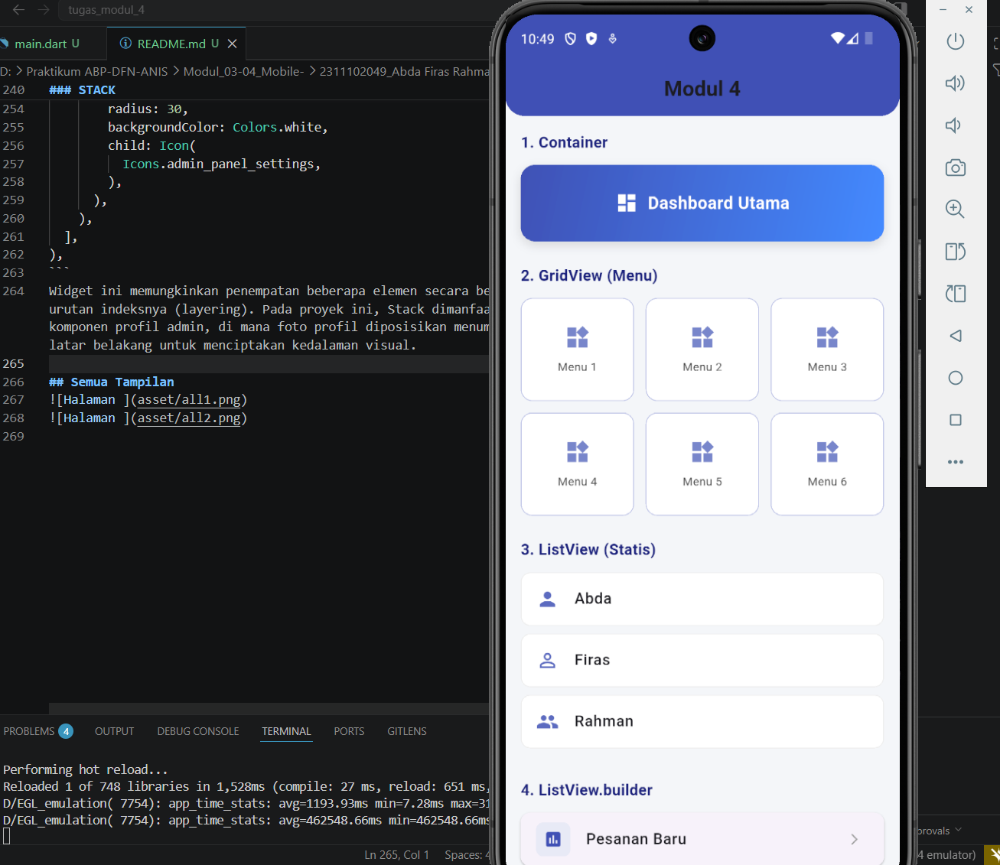
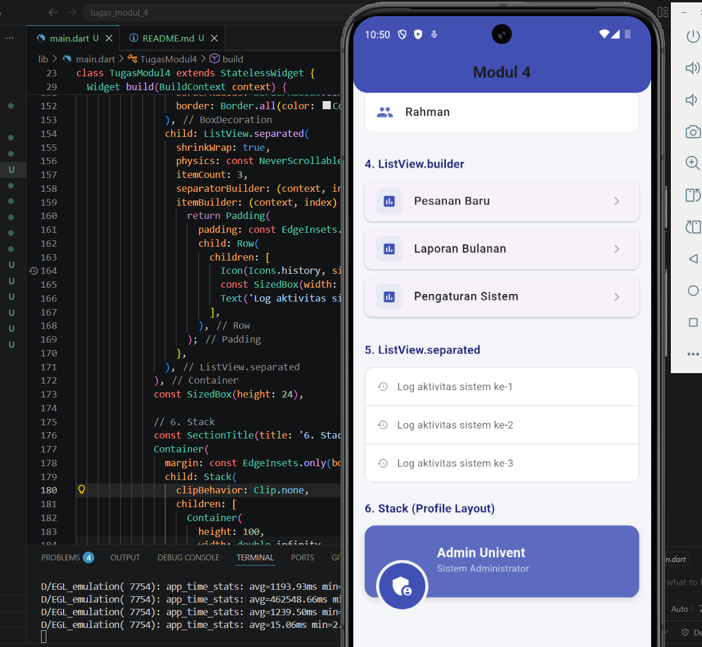

<div align="center">
  <br />

  <h1>LAPORAN PRAKTIKUM <br>
  APLIKASI BERBASIS PLATFORM
  </h1>

  <br />

  <h3>Modul 3-4 Flutter</h3>
Widget UI
  <br>
  
  </h3>

  <br />

  <p align="center">

</p>

  <br />
  <br />
  <br />

  <h3>Disusun Oleh :</h3>

  <p>
    <strong>Abda Firas Rahman </strong><br>
    <strong>2311102049</strong><br>
    <strong>S1 IF-11-REG01</strong>
  </p>

  <br />

  <h3>Dosen Pengampu :</h3>

  <p>
    <strong>Dimas Fanny Hebrasianto Permadi, S.ST., M.Kom</strong>
  </p>
  
  <br />
  <br />
    <h4>Asisten Praktikum :</h4>
    <strong>Apri Pandu Wicaksono </strong> <br>
    <strong>Rangga Pradarrell Fathi</strong>
  <br />

  <h3>LABORATORIUM HIGH PERFORMANCE
 <br>FAKULTAS INFORMATIKA <br>UNIVERSITAS TELKOM PURWOKERTO <br>2026</h3>
</div>

<hr>

### Dasar Teori
Flutter merupakan framework modern yang menggunakan bahasa pemrograman Dart dengan konsep utama bahwa seluruh tampilan antarmuka dibangun menggunakan widget. Dalam proses pengembangan aplikasi pengaturan layout menjadi aspek penting untuk menciptakan tampilan yang terstruktur, responsif, dan nyaman digunakan. Oleh karena itu, pemahaman terhadap widget dasar seperti Container, GridView, ListView, hingga Stack sangat diperlukan agar pengembang mampu menyusun antarmuka aplikasi secara efektif dan efisien.

Pada implementasinya Container digunakan sebagai elemen pembungkus untuk mengatur ukuran, warna, dekorasi, dan jarak antar komponen sehingga tampilan aplikasi menjadi lebih rapi. Selanjutnya GridView dimanfaatkan untuk menyusun beberapa menu dalam bentuk grid atau susunan baris dan kolom agar penggunaan ruang layar menjadi lebih optimal. Selain itu ListView digunakan untuk menampilkan data dalam bentuk daftar vertikal, baik secara statis maupun dinamis. Untuk data yang bersifat dinamis dan jumlahnya lebih banyak digunakan ListView.builder karena mampu membangun item hanya ketika diperlukan sehingga performa aplikasi tetap terjaga. Sedangkan ListView.separated digunakan ketika diperlukan pemisah antar item agar tampilan data lebih jelas dan terorganisir.

Selain widget penyusun data, Flutter juga menyediakan widget Stack yang memungkinkan beberapa elemen ditampilkan secara bertumpuk dalam satu area layout. Widget ini sangat berguna untuk membuat desain antarmuka yang lebih fleksibel dan modern seperti tampilan profil pengguna atau dashboard. Dengan memahami penggunaan keenam widget tersebut pengembang dapat membangun aplikasi Flutter yang tidak hanya fungsional tetapi juga memiliki tampilan menarik, performa yang optimal, serta struktur kode yang lebih rapi dan mudah dikembangkan kembali.

### CONTAINER
```dart
Container(
  height: 80,
  width: double.infinity,
  decoration: BoxDecoration(
    gradient: const LinearGradient(
      colors: [Colors.indigo, Colors.blueAccent],
      begin: Alignment.topLeft,
      end: Alignment.bottomRight,
    ),
    borderRadius: BorderRadius.circular(15),
    boxShadow: const [
      BoxShadow(
        color: Colors.black12,
        blurRadius: 8,
        offset: Offset(0, 4),
      ),
    ],
  ),
  child: const Center(
    child: Text(
      'Dashboard Utama',
      style: TextStyle(color: Colors.white),
    ),
  ),
),
```
Widget ini berfungsi sebagai elemen pembungkus (wrapper) universal yang digunakan untuk mengatur dimensi, margin, padding, serta dekorasi visual. Dalam proyek ini, Container diimplementasikan untuk menciptakan area dashboard dengan kustomisasi gradient warna dan box shadow guna meningkatkan estetika antarmuka.

### GRIDVIEW
```dart
              const SectionTitle(title: '2. GridView (Menu)'),
              GridView.count(
                crossAxisCount: 3,
                shrinkWrap: true,
                physics: const NeverScrollableScrollPhysics(),
                mainAxisSpacing: 12,
                crossAxisSpacing: 12,
                childAspectRatio: 1.1,
                children: List.generate(6, (index) {
                  return Container(
                    decoration: BoxDecoration(
                      color: Colors.white,
                      borderRadius: BorderRadius.circular(12),
                      border: Border.all(color: Colors.indigo.shade100, width: 1),
                    ),
                    child: Column(
                      mainAxisAlignment: MainAxisAlignment.center,
                      children: [
                        Icon(Icons.widgets, color: Colors.indigo[300], size: 28),
                        const SizedBox(height: 8),
                        Text('Menu ${index + 1}', style: TextStyle(fontSize: 12, color: Colors.grey[800])),
                      ],
                    ),
                  );
                }),
              ),
              const SizedBox(height: 24),
```
Widget ini digunakan untuk menyajikan data dalam bentuk matriks dua dimensi atau grid. Saya mengaturnya dengan jumlah kolom statis (crossAxisCount) untuk menampung 6 item menu secara simetris, sehingga pemanfaatan ruang layar menjadi lebih efisien dan terorganisir.

### LISTVIEW
```dart
ListView(
  shrinkWrap: true,
  physics: const NeverScrollableScrollPhysics(),
  children: const [
    CustomListTile(
      title: 'Abda',
      icon: Icons.person,
    ),
    CustomListTile(
      title: 'Firas',
      icon: Icons.person_outline,
    ),
    CustomListTile(
      title: 'Rahman',
      icon: Icons.people,
    ),
  ],
),
const SizedBox(height: 24),
```
Variasi dari ListView yang digunakan untuk menangani dataset dinamis. Widget ini membangun elemen hanya pada saat dibutuhkan (on-demand), di mana dalam tugas ini digunakan untuk mengiterasi data dari sebuah array secara otomatis sehingga penggunaan memori lebih optimal.

### LISTVIEW.BUILDER
```dart
ListView.builder(
  shrinkWrap: true,
  physics: const NeverScrollableScrollPhysics(),
  itemCount: dataArray.length,
  itemBuilder: (context, index) {
    return Card(
      elevation: 1,
      margin: const EdgeInsets.only(bottom: 10),
      shape: RoundedRectangleBorder(
        borderRadius: BorderRadius.circular(10),
      ),
      child: ListTile(
        leading: Container(
          padding: const EdgeInsets.all(8),
          decoration: BoxDecoration(
            color: Colors.indigo.shade50,
            borderRadius: BorderRadius.circular(8),
          ),
          child: const Icon(
            Icons.insert_chart,
            color: Colors.indigo,
            size: 20,
          ),
        ),
        title: Text(
          dataArray[index],
          style: const TextStyle(
            fontWeight: FontWeight.w500,
          ),
        ),
        trailing: const Icon(
          Icons.arrow_forward_ios,
          size: 14,
          color: Colors.grey,
        ),
      ),
    );
  },
),

const SizedBox(height: 24),
```
variasi dari ListView yang digunakan untuk menangani dataset dinamis dalam jumlah besar. Widget ini membangun elemen hanya pada saat dibutuhkan (on-demand), di mana dalam tugas ini digunakan untuk mengiterasi data dari sebuah array secara otomatis sehingga penggunaan memori lebih optimal.

### LISTVIEW.SEPARATED
```dart
Container(
  decoration: BoxDecoration(
    color: Colors.white,
    borderRadius: BorderRadius.circular(12),
    border: Border.all(
      color: Colors.grey.shade300,
    ),
  ),
  child: ListView.separated(
    shrinkWrap: true,
    physics: const NeverScrollableScrollPhysics(),
    itemCount: 3,
    separatorBuilder: (context, index) => Divider(
      height: 1,
      color: Colors.grey.shade300,
    ),
    itemBuilder: (context, index) {
      return Padding(
        padding: const EdgeInsets.symmetric(
          vertical: 16,
          horizontal: 16,
        ),
        child: Row(
          children: [
            Icon(
              Icons.history,
              size: 16,
              color: Colors.grey[500],
            ),
            const SizedBox(width: 12),
            Text(
              'Log aktivitas sistem ke-${index + 1}',
              style: TextStyle(
                color: Colors.grey[700],
              ),
            ),
          ],
        ),
      );
    },
  ),
),
const SizedBox(height: 24),
```
Widget ini memiliki mekanisme yang mirip dengan builder, namun dilengkapi dengan properti separatorBuilder. Properti ini berfungsi untuk menyisipkan widget pembatas atau garis pemisah (divider) di antara setiap item secara sistematis untuk memperjelas batas visual antar data.

### STACK
```dart
Stack(
  clipBehavior: Clip.none,
  children: [
    Container(
      height: 100,
      width: double.infinity,
      color: Colors.indigo,
    ),
    Positioned(
      bottom: -20,
      left: 16,
      child: CircleAvatar(
        radius: 30,
        backgroundColor: Colors.white,
        child: Icon(
          Icons.admin_panel_settings,
        ),
      ),
    ),
  ],
),
```
Widget ini memungkinkan penempatan beberapa elemen secara bertumpuk berdasarkan urutan indeksnya (layering). Pada proyek ini, Stack dimanfaatkan untuk membangun komponen profil admin, di mana foto profil diposisikan menumpuk di atas elemen latar belakang untuk menciptakan kedalaman visual.

## Semua Tampilan


