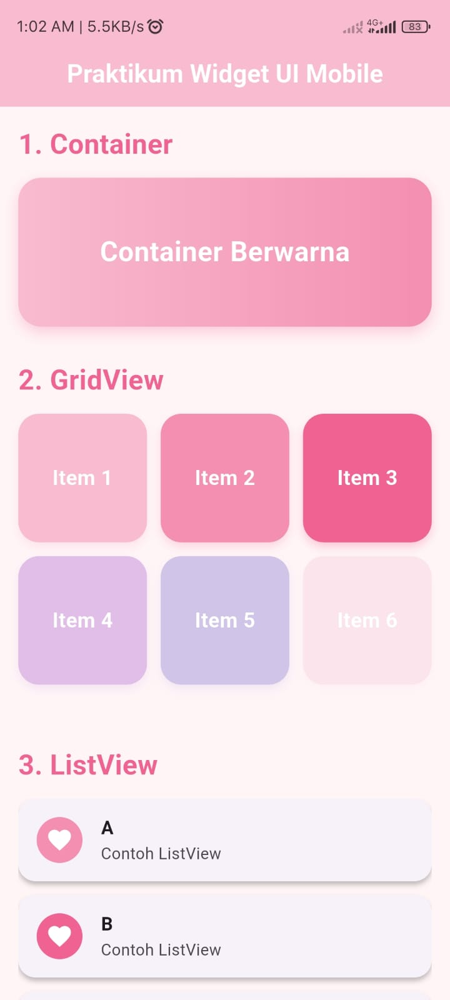
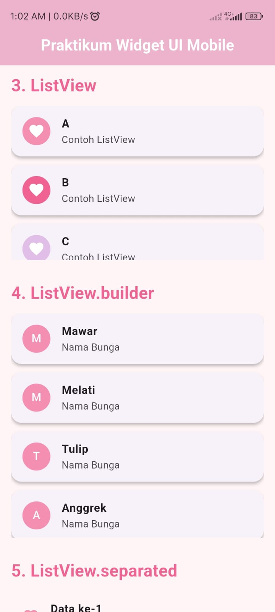
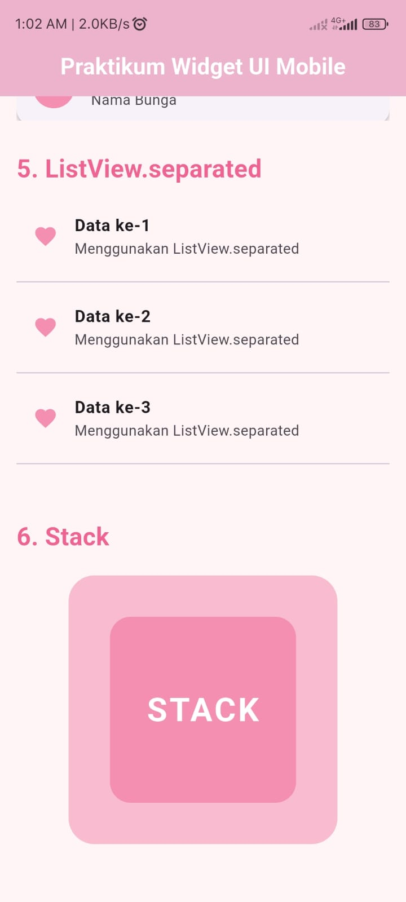

<div align="center">
  <br />
  <h1>LAPORAN PRAKTIKUM<br>APLIKASI BERBASIS PLATFORM</h1>
  <br />
  <h3>Modul 03 04 Mobile</h3>
  <br />
  
  <br />
  <br />
  <br />
  <h3>Disusun Oleh :</h3>
  <p>
    <strong>Nia Novela Ariandini</strong><br>
    <strong>2311102057</strong><br>
    <strong>S1 IF-11-01</strong>
  </p>
  <br />
  <h3>Dosen Pengampu :</h3>
  <p>
    <strong>Dimas Fanny Hebrasianto Permadi, S.ST., M.Kom</strong>
  </p>
  <br />
  <br />
  <h4>Asisten Praktikum :</h4>
  <strong>Apri Pandu Wicaksono</strong> <br>
  <strong>Rangga Pradarrell Fathi</strong>
  <br />
  <br />
  <br />
  <br />
  <h3>LABORATORIUM HIGH PERFORMANCE <br> FAKULTAS INFORMATIKA <br> UNIVERSITAS TELKOM PURWOKERTO <br> 2026</h3>
</div>

---

## DASAR TEORI

Flutter adalah framework UI open-source yang dikembangkan oleh Google untuk membuat aplikasi berbasis mobile, web, maupun desktop menggunakan satu source code yang sama. Flutter menggunakan bahasa pemrograman Dart dan menerapkan konsep widget sebagai komponen utama dalam membangun antarmuka aplikasi.

Framework Flutter memiliki berbagai kelebihan seperti proses pengembangan yang cepat melalui fitur hot reload, tampilan antarmuka yang modern, performa yang baik, serta dukungan cross-platform sehingga aplikasi dapat dijalankan pada Android dan iOS tanpa perlu membuat kode terpisah.

---

## PENJELASAN SOURCE CODE

### 1. Import Library Flutter

```dart
import 'package:flutter/material.dart';
```

Kode tersebut digunakan untuk memanggil library Material Design milik Flutter agar dapat menggunakan berbagai widget bawaan seperti Scaffold, AppBar, Container, GridView, ListView, dan widget lainnya.

### 2. Fungsi Main

```dart
void main() {
  runApp(const MyApp());
}
```

Fungsi `main()` merupakan bagian awal yang dijalankan ketika aplikasi dibuka. Pada bagian ini widget `MyApp` dijalankan sebagai tampilan utama aplikasi Flutter.

### 3. Widget MyApp

```dart
class MyApp extends StatelessWidget
```

Widget `MyApp` berfungsi sebagai root widget yang mengatur konfigurasi aplikasi seperti tema, judul aplikasi, dan halaman utama yang akan ditampilkan.

Pada program ini tema aplikasi menggunakan nuansa soft pink.

### 4. Widget HomePage

```dart
class HomePage extends StatelessWidget
```

Widget `HomePage` digunakan untuk menampilkan seluruh komponen UI pada praktikum, mulai dari Container, GridView, ListView, ListView.builder, ListView.separated, hingga Stack.

### 5. Penggunaan SingleChildScrollView

```dart
SingleChildScrollView(
```

Widget `SingleChildScrollView` digunakan agar tampilan aplikasi dapat digulir ke bawah karena terdapat banyak komponen widget yang ditampilkan dalam satu halaman.

### 6. Penggunaan List Data

```dart
List<String> mahasiswa = [
  "Mawar",
  "Melati",
  "Tulip",
  "Anggrek",
  "Lili",
  "Sakura",
];
```

List data digunakan pada `ListView.builder` untuk menampilkan daftar nama bunga secara otomatis dan dinamis berdasarkan isi array.

---

## SCREENSHOT HASIL

### 1. Tampilan Widget Container


### 2. Tampilan GridView dan ListView


### 3. Tampilan Stack


---

## PENJELASAN SINGKAT TIAP WIDGET

### 1. Container

Widget `Container` digunakan untuk membuat area atau kotak dengan berbagai pengaturan seperti warna, ukuran, border radius, dan dekorasi lainnya.

Pada aplikasi ini Container digunakan untuk membuat kotak dengan warna gradasi soft pink dan tulisan di bagian tengah.

### 2. GridView

`GridView` digunakan untuk menampilkan data dalam bentuk grid atau susunan kotak.

Pada program ini GridView menampilkan 6 item dengan warna berbeda yang tersusun dalam 3 kolom.

### 3. ListView

`ListView` digunakan untuk membuat daftar data secara vertikal.

Pada aplikasi ini ListView digunakan untuk menampilkan item A, B, dan C dengan ikon berbentuk hati dan warna bernuansa pink.

### 4. ListView.builder

`ListView.builder` digunakan untuk menghasilkan list secara otomatis berdasarkan jumlah data yang tersedia.

Pada program ini ListView.builder digunakan untuk menampilkan daftar nama bunga seperti Mawar, Melati, Tulip, dan lainnya dari sebuah array.

### 5. ListView.separated

`ListView.separated` digunakan untuk membuat daftar item yang dipisahkan menggunakan garis pembatas atau separator.

Pada aplikasi ini setiap item dipisahkan menggunakan widget `Divider`.

### 6. Stack

`Stack` digunakan untuk menampilkan beberapa widget secara bertumpuk.

Pada program ini Stack digunakan untuk menumpuk dua Container berwarna soft pink dan sebuah teks di bagian tengah sehingga menghasilkan tampilan layer bertingkat.
