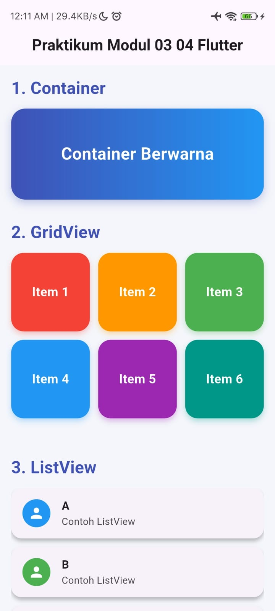
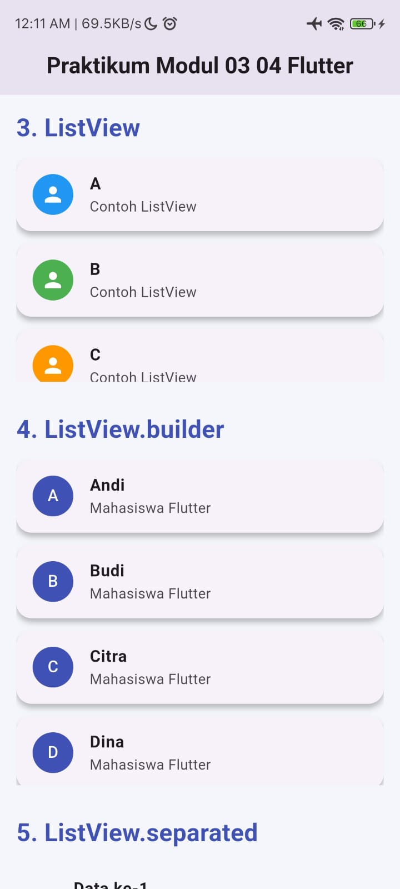
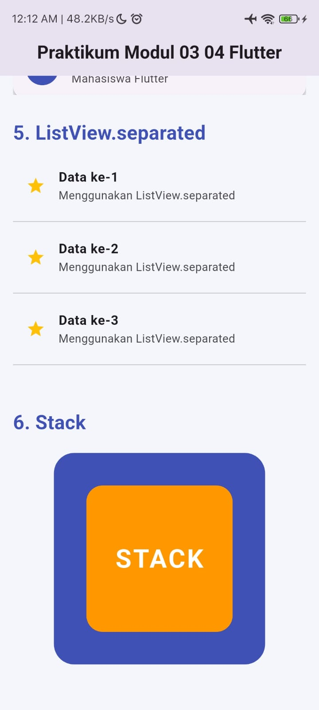

<div align="center">
  <br />
  <h1>LAPORAN PRAKTIKUM<br>APLIKASI BERBASIS PLATFORM</h1>
  <br />
  <h3>Modul 03 04 Mobile</h3>
  <br />
  
  <br />
  <br />
  <br />
  <h3>Disusun Oleh :</h3>
  <p>
    <strong>Muhammad Hamzah Haifan Ma'ruf</strong><br>
    <strong>2311102091</strong><br>
    <strong>S1 IF-11-01</strong>
  </p>
  <br />
  <h3>Dosen Pengampu :</h3>
  <p>
    <strong>Dimas Fanny Hebrasianto Permadi, S.ST., M.Kom</strong>
  </p>
  <br />
  <br />
  <h4>Asisten Praktikum :</h4>
  <strong>Apri Pandu Wicaksono</strong> <br>
  <strong>Rangga Pradarrell Fathi</strong>
  <br />
  <br />
  <br />
  <br />
  <h3>LABORATORIUM HIGH PERFORMANCE <br> FAKULTAS INFORMATIKA <br> UNIVERSITAS TELKOM PURWOKERTO <br> 2026</h3>
</div>

---

## DASAR TEORI

Flutter merupakan framework open-source yang dikembangkan oleh Google untuk membangun aplikasi mobile, web, dan desktop menggunakan satu basis kode (single codebase). Flutter menggunakan bahasa pemrograman Dart dan menyediakan berbagai widget untuk membangun tampilan antarmuka aplikasi secara fleksibel dan responsif.

Flutter memiliki keunggulan pada performa yang cepat, tampilan UI modern, fitur hot reload, serta kemampuan cross-platform sehingga developer dapat membuat aplikasi Android dan iOS secara bersamaan.

---

## PENJELASAN SOURCE CODE

### 1. Import Library Flutter

```dart
import 'package:flutter/material.dart';
```

Kode tersebut digunakan untuk mengimpor library Material Design Flutter agar dapat menggunakan widget seperti Scaffold, AppBar, Container, ListView, dan lainnya.

### 2. Fungsi Main

```dart
void main() {
  runApp(const MyApp());
}
```

Fungsi main() merupakan titik awal program Flutter yang menjalankan widget utama MyApp.

### 3. Widget MyApp

```dart
class MyApp extends StatelessWidget
```

Widget ini digunakan sebagai root aplikasi dan mengatur tema serta halaman utama aplikasi.

### 4. Widget HomePage

```dart
class HomePage extends StatelessWidget
```

Widget HomePage berisi seluruh tampilan praktikum seperti Container, GridView, ListView, dan Stack.

### 5. Penggunaan SingleChildScrollView

```dart
SingleChildScrollView(
```

Widget ini digunakan agar halaman dapat discroll ke bawah karena memiliki banyak komponen widget.

### 6. Penggunaan List Data

```dart
List<String> mahasiswa = [
  "Andi",
  "Budi",
  "Citra",
  "Dina",
  "Eko",
];
```

Data array digunakan pada ListView.builder untuk membuat list secara dinamis.

---

## SCREENSHOT HASIL

### 1. Tampilan Widget Container


### 2. Tampilan GridView dan ListView


### 3. Tampilan Stack


---

## PENJELASAN SINGKAT TIAP WIDGET

### 1. Container

Container digunakan untuk membuat kotak atau area tertentu pada tampilan aplikasi. Widget ini dapat diberikan warna, ukuran, margin, padding, dan dekorasi lainnya.

Pada program ini Container digunakan untuk membuat kotak berwarna dengan teks di tengah.

### 2. GridView

GridView digunakan untuk menampilkan data dalam bentuk grid atau kisi-kisi.

Pada program ini GridView menampilkan 6 item berbentuk kotak dengan susunan 3 kolom.

### 3. ListView

ListView digunakan untuk menampilkan daftar data secara vertikal.

Pada program ini ListView digunakan untuk menampilkan data A, B, dan C.

### 4. ListView.builder

ListView.builder digunakan untuk membuat list secara dinamis berdasarkan jumlah data tertentu.

Pada program ini data mahasiswa ditampilkan dari array List<String>.

### 5. ListView.separated

ListView.separated digunakan untuk membuat list yang memiliki garis pembatas antar item.

Pada program ini setiap item dipisahkan menggunakan Divider.

### 6. Stack

Stack digunakan untuk menampilkan widget secara bertumpuk.

Pada program ini Stack digunakan untuk menumpuk beberapa Container dan Text.

---

## KESIMPULAN

Berdasarkan praktikum yang telah dilakukan, dapat disimpulkan bahwa Flutter menyediakan berbagai widget yang mempermudah pengembangan antarmuka aplikasi mobile. Widget seperti Container, GridView, ListView, dan Stack dapat digunakan untuk membuat tampilan aplikasi yang menarik dan interaktif.

Penggunaan Flutter juga mempermudah pengembangan aplikasi karena mendukung konsep widget-based UI serta fitur hot reload yang membantu proses pengembangan menjadi lebih cepat dan efisien.

---

