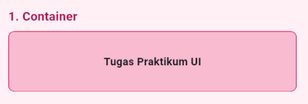
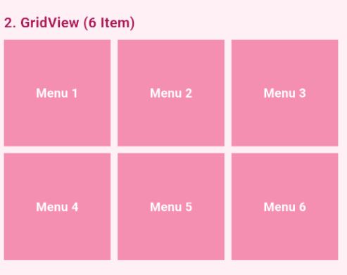
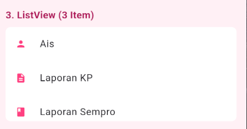
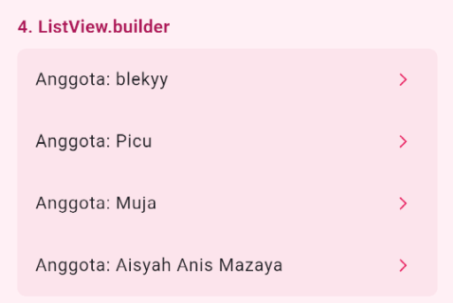
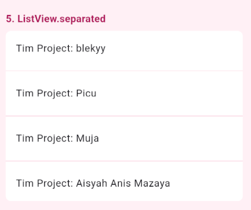
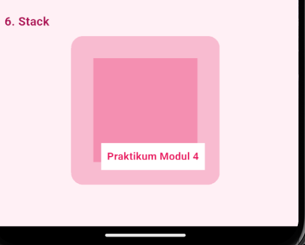
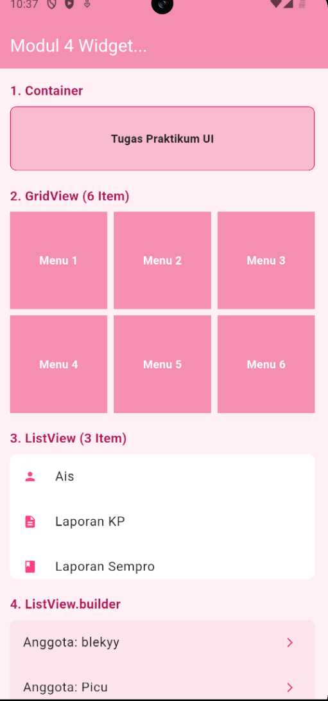
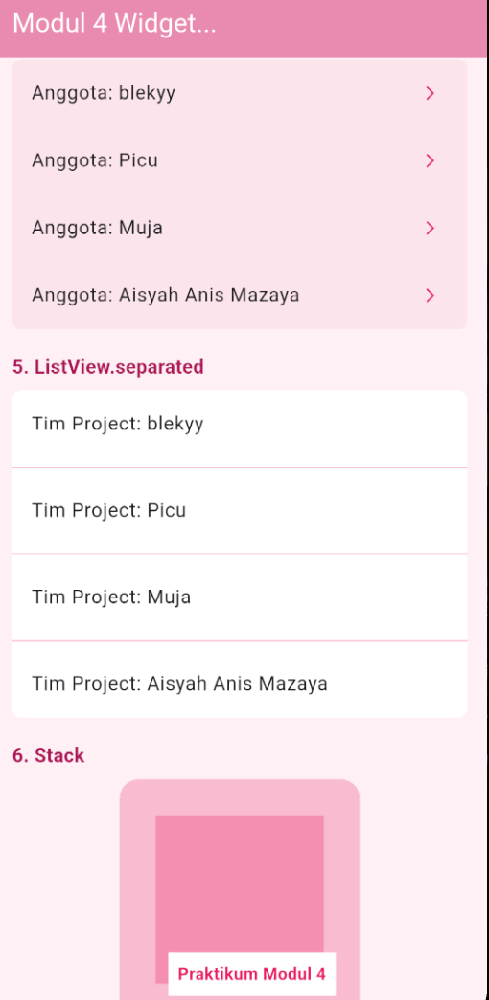

<div align="center">
  <br />

  <h1>LAPORAN PRAKTIKUM <br>
  APLIKASI BERBASIS PLATFORM
  </h1>

  <br />

  <h3>Modul 3-4 Flutter</h3>
Widget UI
  <br>
  
  </h3>

  <br />

  <p align="center">

</p>

  <br />
  <br />
  <br />

  <h3>Disusun Oleh :</h3>

  <p>
    <strong>Aisyah Anis Mazaya </strong><br>
    <strong>2311102095</strong><br>
    <strong>S1 IF-11-REG01</strong>
  </p>

  <br />

  <h3>Dosen Pengampu :</h3>

  <p>
    <strong>Dimas Fanny Hebrasianto Permadi, S.ST., M.Kom</strong>
  </p>
  
  <br />
  <br />
    <h4>Asisten Praktikum :</h4>
    <strong>Apri Pandu Wicaksono </strong> <br>
    <strong>Rangga Pradarrell Fathi</strong>
  <br />

  <h3>LABORATORIUM HIGH PERFORMANCE
 <br>FAKULTAS INFORMATIKA <br>UNIVERSITAS TELKOM PURWOKERTO <br>2026</h3>
</div>

<hr>

### Dasar Teori
Pertukaran Data Asinkron Menggunakan AJAX
Sistem mengimplementasikan teknologi AJAX untuk memfasilitasi pertukaran data antara server dan browser secara asinkron di latar belakang. Mekanisme ini memungkinkan pembaruan konten halaman web secara dinamis tanpa perlu melakukan pemuatan ulang (reload) secara keseluruhan, sehingga menciptakan antarmuka yang lebih responsif, cepat, dan efisien bagi pengguna.

Manajemen Database dan Automasi Pengisian Data (Seeder)
Penyimpanan informasi dikelola melalui basis data terstruktur untuk menjamin integritas data. Dalam proses pengembangannya, sistem menggunakan fitur Database Seeding untuk mengautomasi pengisian data awal melalui skrip kode. Hal ini meminimalkan input manual yang repetitif, mempercepat fase pengujian, serta memastikan ketersediaan data contoh yang konsisten sesuai dengan skema tabel yang dirancang.

Arsitektur Pemrograman Berbasis Objek dan Model Data
Pengembangan aplikasi menggunakan pendekatan pemrograman berbasis objek, di mana setiap entitas database direpresentasikan melalui sebuah Model. Arsitektur ini memudahkan pengelolaan logika sistem dan manipulasi data secara lebih terorganisir. Dengan memisahkan antara struktur data dan logika pemrosesan, sistem menjadi lebih modular, aman dari celah keamanan dasar, dan mudah untuk dikembangkan di masa mendatang.

Antarmuka Responsif dan Pengalaman Pengguna (UI/UX)
Perancangan antarmuka dititikberatkan pada fleksibilitas tata letak agar tampilan aplikasi tetap optimal saat diakses melalui berbagai perangkat, baik ponsel maupun komputer. Fokus utama dari desain ini adalah memberikan navigasi yang intuitif dan visual yang konsisten, sehingga administrator dapat mengelola konten portofolio dengan mudah melalui panel kendali yang terstruktur secara logis.


## Container

Widget ini berfungsi sebagai pembungkus utama yang sangat fleksibel. Di dalam kode Container menggunakan untuk membuat kotak dekorasi yang memiliki warna latar belakang, garis tepi (border), serta mengatur jarak isi agar terlihat rapih.

## GridView

GridView digunakan untuk menyusun elemen dalam bentuk kotak-kotak atau grid. Pada tugas ini saya memakai GridView.count dengan pengaturan 3 kolom agar item menu yang ditampilkan terlihat teratur secara baris dan kolom.

## ListView

ListView adalah widget standar untuk membuat daftar yang dapat digulung (scrollable) secara linier. Widget ini paling cocok digunakan untuk daftar yang jumlah itemnya sedikit dan bersifat statis (tetap) seperti daftar informasi profil atau menu sederhana.

## ListView.builder

ListView.builder merupakan versi yang lebih efisien dari ListView biasa. Widget ini hanya akan membangun atau me-render item yang sedang terlihat di layar saja sehingga sangat menghemat memori (resource) saat menampilkan data yang diambil dari sebuah array atau daftar yang panjang.

## ListView.separated

Fungsi widget ini hampir sama dengan tipe builder, namun memiliki fitur tambahan untuk menyisipkan pemisah secara otomatis di antara item. Saya menggunakan nya agar di antara setiap nama tim terdapat garis pembatas (divider) yang konsisten tanpa harus menambahkan komponen garis secara manual satu per satu.

## Stack

Stack memungkinkan kita untuk menumpuk satu widget di atas widget lainnya seperti lapisan (layer). Widget yang ditulis lebih dulu akan berada di posisi paling bawah, dan widget setelahnya akan muncul di depannya. Ini sangat berguna untuk membuat tampilan teks atau ikon yang menimpa sebuah gambar atau kotak.

## Semua Tampilan



### Code Program
```dart
import 'package:flutter/material.dart';

void main() {
  runApp(const MyApp());
}

class MyApp extends StatelessWidget {
  const MyApp({super.key});

  @override
  Widget build(BuildContext context) {
    return MaterialApp(
      title: 'modul 4',
      debugShowCheckedModeBanner: false,
      theme: ThemeData(
        primarySwatch: Colors.pink,
        scaffoldBackgroundColor: const Color(0xFFFFF0F5),
      ),
      home: const ModulEmpatScreen(),
    );
  }
}

class ModulEmpatScreen extends StatelessWidget {
  const ModulEmpatScreen({super.key});

  @override
  Widget build(BuildContext context) {
    final List<String> arrayData = [
      'blekyy',
      'Picu',
      'Muja',
      'Aisyah Anis Mazaya',
    ];

    return Scaffold(
      appBar: AppBar(
        title: const Text('Modul 4 Widget...'),
        backgroundColor: Colors.pink[200],
        foregroundColor: Colors.white,
      ),
      body: SingleChildScrollView(
        padding: const EdgeInsets.all(16.0),
        child: Column(
          crossAxisAlignment: CrossAxisAlignment.start,
          children: [
            // 1. WIDGET CONTAINER
            const SectionTitle(title: '1. Container'),
            Container(
              width: double.infinity,
              height: 80,
              decoration: BoxDecoration(
                color: Colors.pink[100],
                borderRadius: BorderRadius.circular(8),
                border: Border.all(color: Colors.pink, width: 1),
              ),
              alignment: Alignment.center,
              child: const Text(
                'Tugas Praktikum UI',
                style: TextStyle(fontWeight: FontWeight.bold),
              ),
            ),
            const SizedBox(height: 20),

            // 2. WIDGET GRIDVIEW
            const SectionTitle(title: '2. GridView (6 Item)'),
            GridView.count(
              crossAxisCount: 3,
              shrinkWrap: true,
              physics: const NeverScrollableScrollPhysics(),
              mainAxisSpacing: 8,
              crossAxisSpacing: 8,
              children: List.generate(6, (index) {
                return Container(
                  color: Colors.pink[200],
                  alignment: Alignment.center,
                  child: Text(
                    'Menu ${index + 1}',
                    style: const TextStyle(
                      color: Colors.white,
                      fontWeight: FontWeight.bold,
                    ),
                  ),
                );
              }),
            ),
            const SizedBox(height: 20),

            // 3. WIDGET LISTVIEW (STATIS)
            const SectionTitle(title: '3. ListView (3 Item)'),
            Container(
              height: 155,
              decoration: BoxDecoration(
                color: Colors.white,
                borderRadius: BorderRadius.circular(8),
              ),
              child: ListView(
                physics: const NeverScrollableScrollPhysics(),
                children: const [
                  ListTile(
                    title: Text('Ais'),
                    leading: Icon(
                      Icons.person,
                      color: Colors.pinkAccent,
                      size: 18,
                    ),
                  ),
                  ListTile(
                    title: Text('Laporan KP'),
                    leading: Icon(
                      Icons.description,
                      color: Colors.pinkAccent,
                      size: 18,
                    ),
                  ),
                  ListTile(
                    title: Text('Laporan Sempro'),
                    leading: Icon(
                      Icons.book,
                      color: Colors.pinkAccent,
                      size: 18,
                    ),
                  ),
                ],
              ),
            ),
            const SizedBox(height: 20),

            // 4. WIDGET LISTVIEW.BUILDER
            const SectionTitle(title: '4. ListView.builder'),
            Container(
              decoration: BoxDecoration(
                color: Colors.pink[50],
                borderRadius: BorderRadius.circular(8),
              ),
              child: ListView.builder(
                shrinkWrap: true,
                physics: const NeverScrollableScrollPhysics(),
                itemCount: arrayData.length,
                itemBuilder: (context, index) {
                  return ListTile(
                    title: Text('Anggota: ${arrayData[index]}'),
                    trailing: const Icon(
                      Icons.arrow_forward_ios,
                      size: 14,
                      color: Colors.pink,
                    ),
                  );
                },
              ),
            ),
            const SizedBox(height: 20),

            // 5. WIDGET LISTVIEW.SEPARATED
            const SectionTitle(title: '5. ListView.separated'),
            Container(
              decoration: BoxDecoration(
                color: Colors.white,
                borderRadius: BorderRadius.circular(8),
              ),
              child: ListView.separated(
                shrinkWrap: true,
                physics: const NeverScrollableScrollPhysics(),
                itemCount: arrayData.length,
                separatorBuilder: (context, index) =>
                    Divider(color: Colors.pink[100], thickness: 1),
                itemBuilder: (context, index) {
                  return ListTile(
                    title: Text('Tim Project: ${arrayData[index]}'),
                  );
                },
              ),
            ),
            const SizedBox(height: 20),

            // 6. WIDGET STACK
            const SectionTitle(title: '6. Stack'),
            Center(
              child: Stack(
                alignment: Alignment.center,
                children: [
                  Container(
                    width: 200,
                    height: 200,
                    decoration: BoxDecoration(
                      color: Colors.pink[100],
                      borderRadius: BorderRadius.circular(16),
                    ),
                  ),
                  Container(width: 140, height: 140, color: Colors.pink[200]),
                  Positioned(
                    bottom: 20,
                    right: 20,
                    child: Container(
                      padding: const EdgeInsets.all(8),
                      color: Colors.white,
                      child: const Text(
                        'Praktikum Modul 4',
                        style: TextStyle(
                          fontWeight: FontWeight.bold,
                          color: Colors.pink,
                        ),
                      ),
                    ),
                  ),
                ],
              ),
            ),
            const SizedBox(height: 40),
          ],
        ),
      ),
    );
  }
}

class SectionTitle extends StatelessWidget {
  final String title;
  const SectionTitle({super.key, required this.title});

  @override
  Widget build(BuildContext context) {
    return Padding(
      padding: const EdgeInsets.only(bottom: 8.0),
      child: Text(
        title,
        style: TextStyle(
          fontSize: 16,
          fontWeight: FontWeight.bold,
          color: Colors.pink[800],
        ),
      ),
    );
  }
}

```