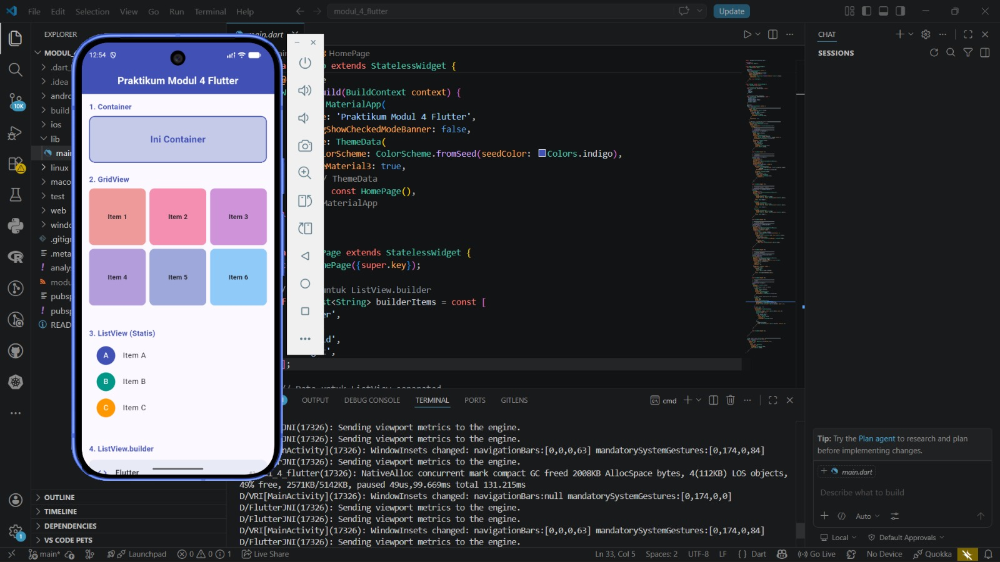
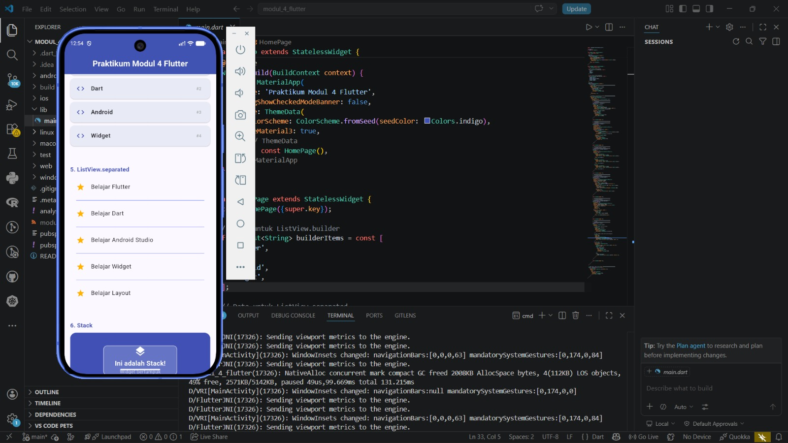

<div align="center">
  <br />
  <h1>LAPORAN PRAKTIKUM <br>APLIKASI BERBASIS PLATFORM</h1>
  <br />
  <h2>MODUL 4 FLUTTER <br>WIDGET</h2>
  <br /><br />

  

  <br /><br /><br />

  <h3>Disusun Oleh :</h3>

  <p>
    <strong>Rafaldo Al Maqdis</strong><br>
    <strong>2311102099</strong><br>
    <strong>S1 IF-11-REG 01</strong>
  </p>

  <br />

  <h3>Dosen Pengampu :</h3>

  <p>
    <strong>Dimas Fanny Hebrasianto Permadi, S.ST., M.Kom</strong>
  </p>

  <br /><br />

  <h4>Asisten Praktikum :</h4>

  <p>
    <strong>Apri Pandu Wicaksono</strong><br>
    <strong>Rangga Pradarrell Fathi</strong>
  </p>

  <br />

  <h2>
  LABORATORIUM HIGH PERFORMANCE <br>
  FAKULTAS INFORMATIKA <br>
  UNIVERSITAS TELKOM PURWOKERTO <br>
  2026
  </h2>
</div>

---
## 1. Pendahuluan

Flutter merupakan framework yang digunakan untuk membangun aplikasi multiplatform dengan satu basis kode. Dalam pengembangan aplikasi Flutter, tampilan antarmuka dibangun menggunakan susunan widget. Widget menjadi komponen utama yang membentuk elemen visual seperti teks, tombol, daftar, kotak, ikon, layout, hingga struktur halaman aplikasi.

Pada praktikum ini, fokus utama kegiatan adalah mencoba membuat beberapa widget UI dasar pada Flutter. Widget yang digunakan antara lain `Container`, `GridView`, `ListView`, `ListView.builder`, `ListView.separated`, dan `Stack`. Selain itu, aplikasi juga menggunakan beberapa widget pendukung seperti `MaterialApp`, `Scaffold`, `AppBar`, `SingleChildScrollView`, `Column`, `Text`, `Card`, `ListTile`, `CircleAvatar`, `Icon`, `Divider`, dan `SizedBox`.

Praktikum ini bertujuan agar mahasiswa dapat memahami cara menyusun antarmuka aplikasi Flutter, mengatur layout secara vertikal, menampilkan daftar data, membuat tampilan berbentuk grid, serta memahami konsep tumpukan widget menggunakan `Stack`.

---

## 2. Tujuan Praktikum

Tujuan dari praktikum ini adalah sebagai berikut:

1. Memahami konsep dasar pembuatan antarmuka aplikasi menggunakan Flutter.
2. Mengetahui fungsi beberapa widget UI dasar pada Flutter.
3. Mampu membuat tampilan aplikasi menggunakan `Container`, `GridView`, `ListView`, dan `Stack`.
4. Mampu menggunakan `SingleChildScrollView` agar halaman dapat digulir.
5. Mampu membedakan penggunaan `ListView` statis, `ListView.builder`, dan `ListView.separated`.
6. Mampu menyusun widget secara terstruktur menggunakan `Column`.

---

## 3. Dasar Teori

### 3.1 Flutter

Flutter adalah framework UI yang digunakan untuk membangun aplikasi pada berbagai platform, seperti Android, iOS, web, dan desktop. Flutter menggunakan bahasa pemrograman Dart dan memiliki pendekatan pengembangan berbasis widget. Dengan pendekatan ini, setiap bagian tampilan aplikasi disusun dari kumpulan widget yang saling berkaitan.

Dalam Flutter, tampilan aplikasi dibangun melalui struktur yang disebut *widget tree*. Widget paling luar biasanya menjadi akar aplikasi, kemudian di dalamnya terdapat widget lain sebagai anak. Semakin dalam struktur widget, semakin spesifik pula bagian tampilan yang dibentuk.

### 3.2 Dart

Dart adalah bahasa pemrograman yang digunakan dalam pengembangan aplikasi Flutter. Dart mendukung konsep pemrograman berorientasi objek sehingga cocok digunakan untuk menyusun aplikasi yang terstruktur. Pada Flutter, Dart digunakan untuk menulis logika aplikasi sekaligus membangun tampilan antarmuka.

Kode Flutter umumnya dimulai dari fungsi `main()`. Fungsi ini menjadi titik awal aplikasi ketika dijalankan. Di dalam fungsi `main()`, biasanya terdapat pemanggilan `runApp()` untuk menjalankan widget utama aplikasi.

### 3.3 Widget

Widget adalah komponen dasar dalam Flutter. Hampir semua bagian tampilan Flutter merupakan widget, mulai dari teks, ikon, gambar, tombol, halaman, hingga layout. Widget dapat digunakan untuk menampilkan data, mengatur posisi, memberi warna, membuat daftar, atau membentuk struktur halaman.

Pada praktikum ini, beberapa widget utama yang digunakan adalah:

- `Container`, digunakan untuk membuat kotak atau area tampilan yang dapat diberi ukuran, warna, border, dan radius.
- `GridView`, digunakan untuk menampilkan data dalam bentuk grid atau kisi.
- `ListView`, digunakan untuk menampilkan data dalam bentuk daftar vertikal.
- `ListView.builder`, digunakan untuk membuat daftar secara dinamis berdasarkan jumlah data.
- `ListView.separated`, digunakan untuk membuat daftar dengan pemisah antar item.
- `Stack`, digunakan untuk menumpuk beberapa widget dalam satu area.
- `SingleChildScrollView`, digunakan agar halaman dapat digulir ketika isi melebihi tinggi layar.

### 3.4 StatelessWidget

`StatelessWidget` adalah jenis widget yang tampilannya tidak berubah selama aplikasi berjalan. Widget ini cocok digunakan untuk tampilan statis atau tampilan yang tidak membutuhkan perubahan data secara langsung. Pada praktikum ini, class `MyApp` dan `HomePage` menggunakan `StatelessWidget` karena tampilan yang dibuat tidak memiliki proses perubahan state.

### 3.5 MaterialApp

`MaterialApp` adalah widget utama yang biasanya digunakan pada aplikasi Flutter berbasis Material Design. Widget ini berfungsi sebagai pembungkus aplikasi dan dapat mengatur beberapa konfigurasi seperti judul aplikasi, tema, halaman awal, dan pengaturan banner debug.

Pada praktikum ini, `MaterialApp` digunakan untuk menentukan judul aplikasi, menonaktifkan banner debug, mengatur tema warna, dan menampilkan halaman utama melalui properti `home`.

### 3.6 Scaffold

`Scaffold` adalah widget yang menyediakan kerangka dasar halaman aplikasi. Dengan `Scaffold`, pengembang dapat membuat struktur halaman yang terdiri dari `AppBar`, `body`, drawer, floating action button, dan elemen lain. Pada praktikum ini, `Scaffold` digunakan untuk menampilkan `AppBar` dan isi halaman utama pada bagian `body`.

### 3.7 AppBar

`AppBar` digunakan untuk membuat bagian atas aplikasi. Biasanya `AppBar` berisi judul halaman atau menu navigasi. Pada praktikum ini, `AppBar` diberi warna indigo, judul "Praktikum Modul 4 Flutter", dan posisi teks judul dibuat berada di tengah.

### 3.8 SingleChildScrollView

`SingleChildScrollView` adalah widget yang digunakan agar suatu halaman dapat digulir. Widget ini penting ketika isi halaman cukup panjang dan tidak dapat ditampilkan seluruhnya dalam satu layar. Pada praktikum ini, `SingleChildScrollView` membungkus `Column` yang berisi beberapa bagian widget UI.

### 3.9 Column

`Column` digunakan untuk menyusun widget secara vertikal dari atas ke bawah. Pada praktikum ini, `Column` digunakan untuk menempatkan setiap bagian widget secara berurutan, mulai dari `Container`, `GridView`, `ListView`, `ListView.builder`, `ListView.separated`, hingga `Stack`.

### 3.10 Container

`Container` adalah widget serbaguna yang dapat digunakan untuk membuat area tampilan dengan ukuran, warna, margin, padding, border, dan dekorasi tertentu. Pada praktikum ini, `Container` digunakan untuk membuat kotak dengan warna indigo muda, border indigo, sudut melengkung, serta teks di bagian tengah.

### 3.11 GridView

`GridView` digunakan untuk menampilkan item dalam bentuk grid. Pada praktikum ini, `GridView.count` digunakan dengan jumlah kolom sebanyak tiga. Data grid dibuat menggunakan `List.generate()` sehingga item dapat dihasilkan secara otomatis dari indeks tertentu.

### 3.12 ListView

`ListView` digunakan untuk menampilkan daftar item secara vertikal. Pada praktikum ini terdapat tiga jenis penggunaan `ListView`, yaitu `ListView` statis, `ListView.builder`, dan `ListView.separated`.

`ListView` statis digunakan ketika jumlah item sudah diketahui dan ditulis langsung di dalam kode. `ListView.builder` digunakan ketika item dibuat berdasarkan data list, sehingga lebih efisien untuk jumlah data yang banyak. `ListView.separated` digunakan ketika setiap item dalam daftar perlu diberi pemisah seperti garis `Divider`.

### 3.13 Stack

`Stack` adalah widget yang digunakan untuk menumpuk beberapa widget dalam satu area. Widget yang diletakkan lebih awal berada di lapisan bawah, sedangkan widget berikutnya berada di lapisan atas. Pada praktikum ini, `Stack` digunakan untuk membuat tampilan kotak besar berwarna indigo, kotak transparan di tengah, ikon, dan teks yang saling bertumpuk.

---

### 4.1 Menulis Struktur Dasar Aplikasi

Struktur dasar aplikasi dimulai dengan mengimpor package Material Flutter, kemudian membuat fungsi `main()` dan menjalankan class utama `MyApp`.

```dart
import 'package:flutter/material.dart';

void main() {
  runApp(const MyApp());
}
```

Kode tersebut menunjukkan bahwa aplikasi Flutter dijalankan melalui fungsi `runApp()` dengan `MyApp` sebagai widget utama.

### 4.2 Membuat Class MyApp

Class `MyApp` dibuat dengan turunan `StatelessWidget`. Di dalamnya terdapat widget `MaterialApp` yang menjadi pembungkus utama aplikasi.

```dart
class MyApp extends StatelessWidget {
  const MyApp({super.key});

  @override
  Widget build(BuildContext context) {
    return MaterialApp(
      title: 'Praktikum Modul 4 Flutter',
      debugShowCheckedModeBanner: false,
      theme: ThemeData(
        colorScheme: ColorScheme.fromSeed(seedColor: Colors.indigo),
        useMaterial3: true,
      ),
      home: const HomePage(),
    );
  }
}
```

Pada kode tersebut, `debugShowCheckedModeBanner` diberi nilai `false` agar label debug tidak ditampilkan. Tema aplikasi dibuat menggunakan warna dasar indigo. Halaman utama aplikasi diarahkan ke class `HomePage`.

### 4.3 Membuat Data List

Pada class `HomePage`, dibuat dua buah data list. Data pertama digunakan untuk `ListView.builder`, sedangkan data kedua digunakan untuk `ListView.separated`.

```dart
final List<String> builderItems = const [
  'Flutter',
  'Dart',
  'Android',
  'Widget',
];

final List<String> separatedItems = const [
  'Belajar Flutter',
  'Belajar Dart',
  'Belajar Android Studio',
  'Belajar Widget',
  'Belajar Layout',
];
```

Data list ini digunakan agar tampilan daftar dapat dibuat secara lebih dinamis.

### 4.4 Membuat Struktur Halaman dengan Scaffold

Halaman utama dibuat menggunakan `Scaffold`. Pada bagian atas halaman terdapat `AppBar`, sedangkan bagian isi halaman diletakkan pada properti `body`.

```dart
return Scaffold(
  appBar: AppBar(
    backgroundColor: Colors.indigo,
    title: const Text(
      'Praktikum Modul 4 Flutter',
      style: TextStyle(
        color: Colors.white,
        fontWeight: FontWeight.bold,
      ),
    ),
    centerTitle: true,
  ),
  body: SingleChildScrollView(
    padding: const EdgeInsets.all(16.0),
    child: Column(
      crossAxisAlignment: CrossAxisAlignment.start,
      children: [
        // Isi widget diletakkan di sini
      ],
    ),
  ),
);
```

Pada kode tersebut, `SingleChildScrollView` digunakan agar seluruh konten dapat digulir. Widget `Column` digunakan untuk menyusun seluruh bagian secara vertikal.

### 4.5 Membuat Widget Container

Bagian pertama pada halaman adalah `Container`. Widget ini diberi ukuran tinggi, warna, border, radius, dan teks di bagian tengah.

```dart
Container(
  width: double.infinity,
  height: 100,
  decoration: BoxDecoration(
    color: Colors.indigo.shade100,
    border: Border.all(color: Colors.indigo, width: 2),
    borderRadius: BorderRadius.circular(12),
  ),
  alignment: Alignment.center,
  child: const Text(
    'Ini Container',
    style: TextStyle(
      fontSize: 20,
      fontWeight: FontWeight.bold,
      color: Colors.indigo,
    ),
  ),
),
```

`width: double.infinity` membuat `Container` memenuhi lebar layar. Properti `decoration` digunakan untuk memberikan warna, garis tepi, dan sudut melengkung.

### 4.6 Membuat Widget GridView

Bagian kedua adalah `GridView`. Widget ini digunakan untuk menampilkan enam item dalam bentuk grid dengan tiga kolom.

```dart
GridView.count(
  crossAxisCount: 3,
  shrinkWrap: true,
  physics: const NeverScrollableScrollPhysics(),
  crossAxisSpacing: 8,
  mainAxisSpacing: 8,
  children: List.generate(6, (index) {
    return Container(
      decoration: BoxDecoration(
        color: Colors.primaries[index % Colors.primaries.length].shade200,
        borderRadius: BorderRadius.circular(10),
      ),
      alignment: Alignment.center,
      child: Text(
        'Item ${index + 1}',
        style: const TextStyle(
          fontWeight: FontWeight.bold,
          fontSize: 14,
        ),
      ),
    );
  }),
),
```

Properti `crossAxisCount: 3` digunakan untuk menentukan jumlah kolom. Properti `shrinkWrap: true` digunakan agar tinggi `GridView` menyesuaikan isi. Properti `NeverScrollableScrollPhysics()` digunakan karena halaman sudah memiliki scroll utama dari `SingleChildScrollView`.

### 4.7 Membuat ListView Statis

Bagian ketiga adalah `ListView` statis. Item daftar ditulis langsung menggunakan beberapa `ListTile`.

```dart
ListView(
  shrinkWrap: true,
  physics: const NeverScrollableScrollPhysics(),
  children: const [
    ListTile(
      leading: CircleAvatar(
        backgroundColor: Colors.indigo,
        child: Text('A', style: TextStyle(color: Colors.white)),
      ),
      title: Text('Item A'),
    ),
    ListTile(
      leading: CircleAvatar(
        backgroundColor: Colors.teal,
        child: Text('B', style: TextStyle(color: Colors.white)),
      ),
      title: Text('Item B'),
    ),
    ListTile(
      leading: CircleAvatar(
        backgroundColor: Colors.orange,
        child: Text('C', style: TextStyle(color: Colors.white)),
      ),
      title: Text('Item C'),
    ),
  ],
),
```

Pada bagian ini, setiap item menggunakan `ListTile`. Bagian kiri item menggunakan `CircleAvatar`, sedangkan bagian utama item menggunakan `title`.

### 4.8 Membuat ListView.builder

Bagian keempat adalah `ListView.builder`. Widget ini digunakan untuk membuat daftar berdasarkan data yang terdapat pada `builderItems`.

```dart
ListView.builder(
  shrinkWrap: true,
  physics: const NeverScrollableScrollPhysics(),
  itemCount: builderItems.length,
  itemBuilder: (context, index) {
    return Card(
      color: Colors.indigo.shade50,
      margin: const EdgeInsets.symmetric(vertical: 4),
      child: ListTile(
        leading: const Icon(Icons.code, color: Colors.indigo),
        title: Text(
          builderItems[index],
          style: const TextStyle(fontWeight: FontWeight.w600),
        ),
        trailing: Text(
          '#${index + 1}',
          style: const TextStyle(color: Colors.grey),
        ),
      ),
    );
  },
),
```

`itemCount` menentukan jumlah item yang ditampilkan. `itemBuilder` berfungsi membuat tampilan item berdasarkan indeks. Dengan cara ini, daftar dapat dibuat lebih fleksibel karena data berasal dari list.

### 4.9 Membuat ListView.separated

Bagian kelima adalah `ListView.separated`. Widget ini digunakan untuk membuat daftar dengan pemisah antar-item.

```dart
ListView.separated(
  shrinkWrap: true,
  physics: const NeverScrollableScrollPhysics(),
  itemCount: separatedItems.length,
  separatorBuilder: (context, index) => const Divider(
    color: Colors.indigoAccent,
    thickness: 1,
    indent: 16,
    endIndent: 16,
  ),
  itemBuilder: (context, index) {
    return ListTile(
      leading: Icon(
        Icons.star,
        color: Colors.amber.shade600,
      ),
      title: Text(separatedItems[index]),
    );
  },
),
```

`separatorBuilder` digunakan untuk membuat pemisah antar-item. Pada kode ini, pemisah yang digunakan adalah `Divider` berwarna indigo.

### 4.10 Membuat Widget Stack

Bagian keenam adalah `Stack`. Widget ini digunakan untuk membuat tampilan yang terdiri dari beberapa lapisan.

```dart
Stack(
  alignment: Alignment.center,
  children: [
    Container(
      width: double.infinity,
      height: 150,
      decoration: BoxDecoration(
        color: Colors.indigo,
        borderRadius: BorderRadius.circular(16),
      ),
    ),
    Container(
      width: 200,
      height: 80,
      decoration: BoxDecoration(
        color: Colors.white.withOpacity(0.2),
        borderRadius: BorderRadius.circular(10),
        border: Border.all(color: Colors.white54, width: 1.5),
      ),
    ),
    const Column(
      mainAxisSize: MainAxisSize.min,
      children: [
        Icon(Icons.layers, color: Colors.white, size: 32),
        SizedBox(height: 4),
        Text(
          'Ini adalah Stack!',
          style: TextStyle(
            color: Colors.white,
            fontSize: 18,
            fontWeight: FontWeight.bold,
          ),
        ),
        Text(
          'Widget bertumpuk',
          style: TextStyle(color: Colors.white70, fontSize: 13),
        ),
      ],
    ),
  ],
),
```

Pada kode tersebut, lapisan pertama adalah `Container` besar berwarna indigo. Lapisan kedua adalah `Container` transparan. Lapisan ketiga adalah `Column` berisi ikon dan teks. Semua widget disusun bertumpuk dengan posisi tengah menggunakan `alignment: Alignment.center`.

### 4.11 Membuat Helper Section Title

Untuk membuat judul pada setiap bagian, dibuat fungsi `_sectionTitle()`. Fungsi ini mengembalikan widget `Padding` yang berisi `Text`.

```dart
Widget _sectionTitle(String title) {
  return Padding(
    padding: const EdgeInsets.only(bottom: 8.0),
    child: Text(
      title,
      style: const TextStyle(
        fontSize: 16,
        fontWeight: FontWeight.bold,
        color: Colors.indigo,
      ),
    ),
  );
}
```

Fungsi ini membuat kode lebih rapi karena penulisan judul bagian tidak perlu diulang secara manual.

---

## 5. Source Code Lengkap

Berikut adalah kode lengkap pada file `lib/main.dart`.

```dart
import 'package:flutter/material.dart';

void main() {
  runApp(const MyApp());
}

class MyApp extends StatelessWidget {
  const MyApp({super.key});

  @override
  Widget build(BuildContext context) {
    return MaterialApp(
      title: 'Praktikum Modul 4 Flutter',
      debugShowCheckedModeBanner: false,
      theme: ThemeData(
        colorScheme: ColorScheme.fromSeed(seedColor: Colors.indigo),
        useMaterial3: true,
      ),
      home: const HomePage(),
    );
  }
}

class HomePage extends StatelessWidget {
  const HomePage({super.key});

  final List<String> builderItems = const [
    'Flutter',
    'Dart',
    'Android',
    'Widget',
  ];

  final List<String> separatedItems = const [
    'Belajar Flutter',
    'Belajar Dart',
    'Belajar Android Studio',
    'Belajar Widget',
    'Belajar Layout',
  ];

  @override
  Widget build(BuildContext context) {
    return Scaffold(
      appBar: AppBar(
        backgroundColor: Colors.indigo,
        title: const Text(
          'Praktikum Modul 4 Flutter',
          style: TextStyle(
            color: Colors.white,
            fontWeight: FontWeight.bold,
          ),
        ),
        centerTitle: true,
      ),
      body: SingleChildScrollView(
        padding: const EdgeInsets.all(16.0),
        child: Column(
          crossAxisAlignment: CrossAxisAlignment.start,
          children: [
            _sectionTitle('1. Container'),
            Container(
              width: double.infinity,
              height: 100,
              decoration: BoxDecoration(
                color: Colors.indigo.shade100,
                border: Border.all(color: Colors.indigo, width: 2),
                borderRadius: BorderRadius.circular(12),
              ),
              alignment: Alignment.center,
              child: const Text(
                'Ini Container',
                style: TextStyle(
                  fontSize: 20,
                  fontWeight: FontWeight.bold,
                  color: Colors.indigo,
                ),
              ),
            ),

            const SizedBox(height: 24),

            _sectionTitle('2. GridView'),
            GridView.count(
              crossAxisCount: 3,
              shrinkWrap: true,
              physics: const NeverScrollableScrollPhysics(),
              crossAxisSpacing: 8,
              mainAxisSpacing: 8,
              children: List.generate(6, (index) {
                return Container(
                  decoration: BoxDecoration(
                    color: Colors.primaries[index % Colors.primaries.length]
                        .shade200,
                    borderRadius: BorderRadius.circular(10),
                  ),
                  alignment: Alignment.center,
                  child: Text(
                    'Item ${index + 1}',
                    style: const TextStyle(
                      fontWeight: FontWeight.bold,
                      fontSize: 14,
                    ),
                  ),
                );
              }),
            ),

            const SizedBox(height: 24),

            _sectionTitle('3. ListView (Statis)'),
            ListView(
              shrinkWrap: true,
              physics: const NeverScrollableScrollPhysics(),
              children: const [
                ListTile(
                  leading: CircleAvatar(
                    backgroundColor: Colors.indigo,
                    child: Text('A', style: TextStyle(color: Colors.white)),
                  ),
                  title: Text('Item A'),
                ),
                ListTile(
                  leading: CircleAvatar(
                    backgroundColor: Colors.teal,
                    child: Text('B', style: TextStyle(color: Colors.white)),
                  ),
                  title: Text('Item B'),
                ),
                ListTile(
                  leading: CircleAvatar(
                    backgroundColor: Colors.orange,
                    child: Text('C', style: TextStyle(color: Colors.white)),
                  ),
                  title: Text('Item C'),
                ),
              ],
            ),

            const SizedBox(height: 24),

            _sectionTitle('4. ListView.builder'),
            ListView.builder(
              shrinkWrap: true,
              physics: const NeverScrollableScrollPhysics(),
              itemCount: builderItems.length,
              itemBuilder: (context, index) {
                return Card(
                  color: Colors.indigo.shade50,
                  margin: const EdgeInsets.symmetric(vertical: 4),
                  child: ListTile(
                    leading: const Icon(Icons.code, color: Colors.indigo),
                    title: Text(
                      builderItems[index],
                      style: const TextStyle(fontWeight: FontWeight.w600),
                    ),
                    trailing: Text(
                      '#${index + 1}',
                      style: const TextStyle(color: Colors.grey),
                    ),
                  ),
                );
              },
            ),

            const SizedBox(height: 24),

            _sectionTitle('5. ListView.separated'),
            ListView.separated(
              shrinkWrap: true,
              physics: const NeverScrollableScrollPhysics(),
              itemCount: separatedItems.length,
              separatorBuilder: (context, index) => const Divider(
                color: Colors.indigoAccent,
                thickness: 1,
                indent: 16,
                endIndent: 16,
              ),
              itemBuilder: (context, index) {
                return ListTile(
                  leading: Icon(
                    Icons.star,
                    color: Colors.amber.shade600,
                  ),
                  title: Text(separatedItems[index]),
                );
              },
            ),

            const SizedBox(height: 24),

            _sectionTitle('6. Stack'),
            Stack(
              alignment: Alignment.center,
              children: [
                Container(
                  width: double.infinity,
                  height: 150,
                  decoration: BoxDecoration(
                    color: Colors.indigo,
                    borderRadius: BorderRadius.circular(16),
                  ),
                ),
                Container(
                  width: 200,
                  height: 80,
                  decoration: BoxDecoration(
                    color: Colors.white.withOpacity(0.2),
                    borderRadius: BorderRadius.circular(10),
                    border: Border.all(color: Colors.white54, width: 1.5),
                  ),
                ),
                const Column(
                  mainAxisSize: MainAxisSize.min,
                  children: [
                    Icon(Icons.layers, color: Colors.white, size: 32),
                    SizedBox(height: 4),
                    Text(
                      'Ini adalah Stack!',
                      style: TextStyle(
                        color: Colors.white,
                        fontSize: 18,
                        fontWeight: FontWeight.bold,
                      ),
                    ),
                    Text(
                      'Widget bertumpuk',
                      style: TextStyle(color: Colors.white70, fontSize: 13),
                    ),
                  ],
                ),
              ],
            ),

            const SizedBox(height: 32),
          ],
        ),
      ),
    );
  }

  Widget _sectionTitle(String title) {
    return Padding(
      padding: const EdgeInsets.only(bottom: 8.0),
      child: Text(
        title,
        style: const TextStyle(
          fontSize: 16,
          fontWeight: FontWeight.bold,
          color: Colors.indigo,
        ),
      ),
    );
  }
}
```

---

## 6. Hasil Praktikum

Setelah kode dijalankan, aplikasi menampilkan halaman dengan judul pada `AppBar` dan beberapa bagian widget UI. Tampilan aplikasi dapat digulir dari atas ke bawah karena menggunakan `SingleChildScrollView`.

Bagian pertama menampilkan `Container` berbentuk kotak dengan warna indigo muda. Bagian kedua menampilkan `GridView` berisi enam item dalam tiga kolom. Bagian ketiga menampilkan `ListView` statis dengan tiga item. Bagian keempat menampilkan `ListView.builder` yang mengambil data dari list `builderItems`. Bagian kelima menampilkan `ListView.separated` yang memiliki pemisah berupa garis antar-item. Bagian terakhir menampilkan `Stack` yang memperlihatkan beberapa widget bertumpuk.

Kode untuk memasukkan screenshot hasil program:






---

## 7. Pembahasan

Pada praktikum ini, aplikasi Flutter dibuat menggunakan struktur dasar `MaterialApp`, `Scaffold`, dan `HomePage`. `MaterialApp` berfungsi sebagai pembungkus aplikasi, sedangkan `Scaffold` digunakan sebagai kerangka utama halaman. Di dalam `Scaffold`, terdapat `AppBar` sebagai bagian atas aplikasi dan `body` sebagai area utama.

Isi halaman dibuat menggunakan `SingleChildScrollView` dan `Column`. Penggunaan `SingleChildScrollView` diperlukan karena isi aplikasi cukup panjang. Jika tidak menggunakan widget ini, sebagian tampilan dapat terpotong ketika tinggi konten melebihi tinggi layar perangkat. Sementara itu, `Column` digunakan untuk menyusun setiap bagian widget secara vertikal.

Widget `Container` digunakan untuk membuat kotak sederhana yang memiliki warna, border, radius, dan teks. Widget ini menunjukkan bahwa Flutter dapat mengatur tampilan melalui properti seperti `decoration`, `alignment`, `width`, dan `height`.

Widget `GridView.count` digunakan untuk menampilkan item dalam bentuk grid. Pada program ini, jumlah kolom ditentukan sebanyak tiga menggunakan `crossAxisCount`. Item grid dibuat menggunakan `List.generate()` sehingga kode menjadi lebih ringkas dan tidak perlu menulis setiap item secara manual.

Widget `ListView` digunakan untuk menampilkan daftar data. Pada praktikum ini, terdapat tiga bentuk penggunaan daftar. `ListView` statis cocok digunakan ketika item sedikit dan sudah diketahui. `ListView.builder` lebih sesuai untuk data yang berasal dari list karena item dapat dibuat secara otomatis berdasarkan indeks. `ListView.separated` digunakan ketika daftar membutuhkan pemisah antar-item, misalnya garis pembatas menggunakan `Divider`.

Widget `Stack` digunakan untuk menampilkan elemen secara bertumpuk. Pada program ini, `Stack` terdiri dari kotak besar, kotak transparan, ikon, dan teks. Penggunaan `Stack` menunjukkan bahwa Flutter tidak hanya dapat menyusun widget secara vertikal atau horizontal, tetapi juga dapat menyusun widget berdasarkan lapisan.

Secara keseluruhan, praktikum ini menunjukkan bahwa Flutter memiliki banyak widget UI yang dapat digunakan untuk membangun tampilan aplikasi secara fleksibel. Setiap widget memiliki fungsi tertentu dan dapat digabungkan dengan widget lain untuk menghasilkan antarmuka yang lebih menarik dan terstruktur.

---

## 8. Kesimpulan

Berdasarkan praktikum yang telah dilakukan, dapat disimpulkan bahwa Flutter membangun tampilan aplikasi menggunakan susunan widget. Setiap elemen antarmuka seperti kotak, teks, daftar, ikon, dan layout dibuat menggunakan widget tertentu.

Praktikum ini berhasil membuat aplikasi sederhana yang menampilkan beberapa contoh widget UI, yaitu `Container`, `GridView`, `ListView`, `ListView.builder`, `ListView.separated`, dan `Stack`. Penggunaan `SingleChildScrollView` membuat halaman dapat digulir, sedangkan `Column` membantu menyusun seluruh bagian tampilan secara vertikal.

Melalui praktikum ini, mahasiswa dapat memahami cara membuat dan mengatur widget UI pada Flutter. Selain itu, mahasiswa juga dapat mengetahui perbedaan penggunaan widget daftar statis, daftar dinamis, daftar dengan pemisah, grid, dan widget bertumpuk. Pemahaman ini menjadi dasar penting dalam pengembangan aplikasi Flutter yang lebih kompleks.

---

## Referensi

1. Flutter Documentation. *Flutter Documentation*. https://docs.flutter.dev/
2. Flutter Documentation. *Building user interfaces with Flutter*. https://docs.flutter.dev/ui
3. Flutter API Documentation. *MaterialApp class*. https://api.flutter.dev/flutter/material/MaterialApp-class.html
4. Flutter API Documentation. *Scaffold class*. https://api.flutter.dev/flutter/material/Scaffold-class.html
5. Flutter API Documentation. *Container class*. https://api.flutter.dev/flutter/widgets/Container-class.html
6. Flutter API Documentation. *GridView class*. https://api.flutter.dev/flutter/widgets/GridView-class.html
7. Flutter API Documentation. *ListView class*. https://api.flutter.dev/flutter/widgets/ListView-class.html
8. Flutter API Documentation. *Stack class*. https://api.flutter.dev/flutter/widgets/Stack-class.html
9. Dart Documentation. *Dart Overview*. https://dart.dev/overview
