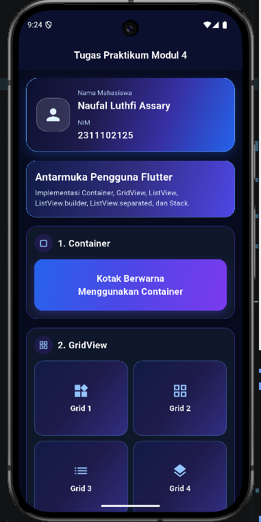
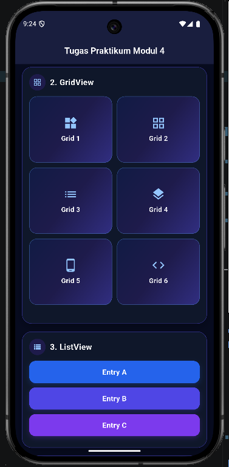
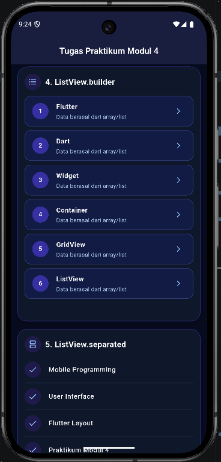
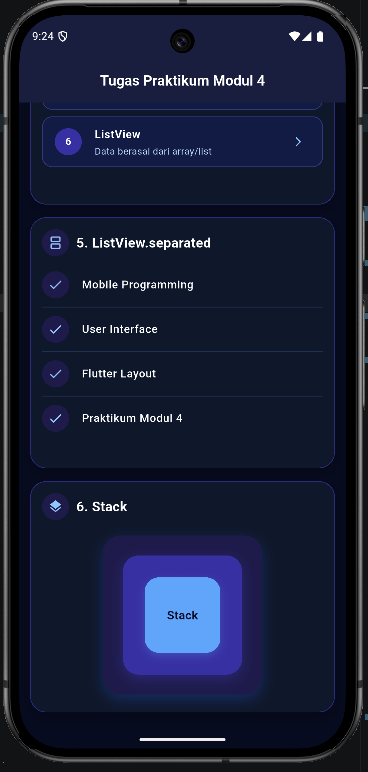

<div align="center">
  <br />
  <h1>LAPORAN PRAKTIKUM</h1>
  <h2>APLIKASI BERBASIS PLATFORM</h2>
  <br />
  <h3>Modul 3-4 Mobile</h3>
  <br />
  <br />
  
  <br />
  <br />
  <h3>Disusun Oleh :</h3>
  <p>
    <strong>NAUFAL LUTHFI ASSARY</strong><br>
    <strong>2311102125</strong><br>
    <strong>S1 IF-11-REG01</strong>
  </p>
  <br />
  <h3>Dosen Pengampu :</h3>
  <p>
    <strong>Dimas Fanny Hebrasianto Permadi, S.ST., M.Kom</strong>
  </p>
  <br />
  <h4>Asisten Praktikum :</h4>
  <p>
    <strong>Apri Pandu Wicaksono</strong><br>
    <strong>Rangga Pradarrell Fathi</strong>
  </p>
  <br />
  <h3>
    LABORATORIUM HIGH PERFORMANCE<br>
    FAKULTAS INFORMATIKA<br>
    UNIVERSITAS TELKOM PURWOKERTO<br>
    2026
  </h3>
</div>

---

## 1. Deskripsi Praktikum

Project Flutter ini dibuat untuk memenuhi Tugas Praktikum Modul 3 & 4. Aplikasi menampilkan beberapa widget UI dasar pada Flutter, yaitu:

1. Container → kotak berwarna

2. GridView → minimal 6 item dalam bentuk grid

3. ListView → 3 item A, B, C

4. ListView.builder → list dari data array

5. ListView.separated → list dengan garis pembatas

6. Stack → tampilan bertumpuk berupa kotak dan teks

---

## 2. Penjelasan Kode

### 2.1 Container → Kotak Berwarna

Pada source code, `Container` digunakan untuk membuat kotak berwarna pada bagian **1. Container**. Kotak ini memiliki ukuran tinggi `95`, lebar penuh menggunakan `width: double.infinity`, dan teks berada di tengah dengan `alignment: Alignment.center`.

```dart
            sectionCard(
              title: '1. Container',
              icon: Icons.crop_square,
              child: Container(
                width: double.infinity,
                height: 95,
                alignment: Alignment.center,
                decoration: BoxDecoration(
                  gradient: const LinearGradient(
                    colors: [
                      Color(0xFF2563EB),
                      Color(0xFF4F46E5),
                      Color(0xFF7C3AED),
                    ],
                    begin: Alignment.topLeft,
                    end: Alignment.bottomRight,
                  ),
                  borderRadius: BorderRadius.circular(16),
                  boxShadow: [
                    BoxShadow(
                      color: const Color(0xFF4F46E5).withOpacity(0.35),
                      blurRadius: 12,
                      offset: const Offset(0, 5),
                    ),
                  ],
                ),
                child: const Text(
                  'Kotak Berwarna\nMenggunakan Container',
                  textAlign: TextAlign.center,
                  style: TextStyle(
                    color: Colors.white,
                    fontSize: 17,
                    fontWeight: FontWeight.bold,
                  ),
                ),
              ),
            ),
```
Bagian BoxDecoration digunakan untuk mempercantik tampilan kotak. LinearGradient memberikan warna gradasi biru ke ungu, borderRadius membuat sudut kotak menjadi melengkung, dan boxShadow memberikan efek bayangan agar terlihat lebih modern.

### 2.2 GridView → Minimal 6 Item Grid

Pada source code, GridView.count digunakan untuk menampilkan data dalam bentuk grid. Grid ini memiliki 6 item, dibuat menggunakan `List.generate(6, ...)`.

```dart
            sectionCard(
              title: '2. GridView',
              icon: Icons.grid_view,
              child: GridView.count(
                crossAxisCount: 2,
                shrinkWrap: true,
                physics: const NeverScrollableScrollPhysics(),
                crossAxisSpacing: 10,
                mainAxisSpacing: 10,
                childAspectRatio: 1.25,
                children: List.generate(6, (index) {
                  return Container(
                    decoration: BoxDecoration(
                      gradient: const LinearGradient(
                        colors: [
                          Color(0xFF111B44),
                          Color(0xFF1E1B4B),
                          Color(0xFF312E81),
                        ],
                        begin: Alignment.topLeft,
                        end: Alignment.bottomRight,
                      ),
                      borderRadius: BorderRadius.circular(16),
                      border: Border.all(
                        color: const Color(0xFF60A5FA).withOpacity(0.35),
                      ),
                    ),
                    child: Column(
                      mainAxisAlignment: MainAxisAlignment.center,
                      children: [
                        Icon(
                          iconGrid[index],
                          size: 30,
                          color: const Color(0xFF93C5FD),
                        ),
                        const SizedBox(height: 7),
                        Text(
                          'Grid ${index + 1}',
                          style: const TextStyle(
                            color: Colors.white,
                            fontSize: 14,
                            fontWeight: FontWeight.bold,
                          ),
                        ),
                      ],
                    ),
                  );
                }),
              ),
            ),
```
crossAxisCount: 2 berarti grid ditampilkan dalam 2 kolom. Setiap item grid berisi ikon dari list iconGrid dan teks Grid 1 sampai Grid 6.

Pada kode ini juga digunakan shrinkWrap: true agar ukuran GridView menyesuaikan jumlah item, serta NeverScrollableScrollPhysics() karena halaman utama sudah menggunakan SingleChildScrollView.

### 2.3 ListView → 3 Item A, B, C

Pada source code, bagian ListView menampilkan 3 item yaitu Entry A, Entry B, dan Entry C.

```dart
            sectionCard(
              title: '3. ListView',
              icon: Icons.view_list,
              child: Column(
                children: [
                  kotakList('Entry A', const Color(0xFF2563EB)),
                  kotakList('Entry B', const Color(0xFF4F46E5)),
                  kotakList('Entry C', const Color(0xFF7C3AED)),
                ],
              ),
            ),
```
Meskipun bagian ini menggunakan Column, tampilannya tetap sesuai dengan konsep ListView sederhana karena menampilkan daftar item secara vertikal. Setiap item dibuat menggunakan fungsi kotakList() agar bentuk dan ukurannya seragam.

Fungsi kotakList() membuat setiap item berupa kotak berwarna dengan teks di tengah:
```dart
  Widget kotakList(String teks, Color warna) {
    return Container(
      height: 46,
      width: double.infinity,
      margin: const EdgeInsets.only(bottom: 9),
      alignment: Alignment.center,
      decoration: BoxDecoration(
        color: warna,
        borderRadius: BorderRadius.circular(13),
        boxShadow: [
          BoxShadow(
            color: warna.withOpacity(0.25),
            blurRadius: 8,
            offset: const Offset(0, 4),
          ),
        ],
      ),
      child: Text(
        teks,
        style: const TextStyle(
          color: Colors.white,
          fontSize: 15,
          fontWeight: FontWeight.bold,
        ),
      ),
    );
  }
```

### 2.4 ListView.builder → List dari Data Array

Pada source code, ListView.builder digunakan untuk menampilkan data dari array/list bernama dataBuilder.

```dart
            sectionCard(
              title: '4. ListView.builder',
              icon: Icons.format_list_bulleted,
              child: ListView.builder(
                shrinkWrap: true,
                physics: const NeverScrollableScrollPhysics(),
                itemCount: dataBuilder.length,
                itemBuilder: (context, index) {
                  return Card(
                    elevation: 0,
                    color: const Color(0xFF111B44),
                    margin: const EdgeInsets.only(bottom: 8),
                    shape: RoundedRectangleBorder(
                      borderRadius: BorderRadius.circular(13),
                      side: BorderSide(
                        color: const Color(0xFF818CF8).withOpacity(0.28),
                      ),
                    ),
                    child: ListTile(
                      dense: true,
                      leading: CircleAvatar(
                        radius: 17,
                        backgroundColor: const Color(0xFF3730A3),
                        child: Text(
                          '${index + 1}',
                          style: const TextStyle(
                            color: Colors.white,
                            fontWeight: FontWeight.bold,
                            fontSize: 13,
                          ),
                        ),
                      ),
                      title: Text(
                        dataBuilder[index],
                        style: const TextStyle(
                          color: Colors.white,
                          fontWeight: FontWeight.bold,
                          fontSize: 14,
                        ),
                      ),
                      subtitle: const Text(
                        'Data berasal dari array/list',
                        style: TextStyle(
                          color: Color(0xFFBFDBFE),
                          fontSize: 12,
                        ),
                      ),
                      trailing: const Icon(
                        Icons.arrow_forward_ios,
                        size: 14,
                        color: Color(0xFF93C5FD),
                      ),
                    ),
                  );
                },
              ),
            ),
```
itemCount: dataBuilder.length digunakan agar jumlah item mengikuti panjang data array. itemBuilder digunakan untuk membangun tampilan setiap item berdasarkan index. Hasilnya, data seperti Flutter, Dart, Widget, dan lainnya tampil otomatis dalam bentuk daftar.

### 2.5 ListView.separated → List + Garis Pembatas

Pada source code, ListView.separated digunakan untuk menampilkan list dengan garis pembatas antar item. Data yang digunakan berasal dari array dataSeparated.

```dart
            sectionCard(
              title: '5. ListView.separated',
              icon: Icons.splitscreen,
              child: ListView.separated(
                shrinkWrap: true,
                physics: const NeverScrollableScrollPhysics(),
                itemCount: dataSeparated.length,
                itemBuilder: (context, index) {
                  return ListTile(
                    dense: true,
                    contentPadding: EdgeInsets.zero,
                    leading: Container(
                      padding: const EdgeInsets.all(7),
                      decoration: const BoxDecoration(
                        color: Color(0xFF1E1B4B),
                        shape: BoxShape.circle,
                      ),
                      child: const Icon(
                        Icons.check,
                        color: Color(0xFF93C5FD),
                        size: 20,
                      ),
                    ),
                    title: Text(
                      dataSeparated[index],
                      style: const TextStyle(
                        color: Colors.white,
                        fontWeight: FontWeight.w500,
                        fontSize: 14,
                      ),
                    ),
                  );
                },
                separatorBuilder: (context, index) {
                  return Divider(
                    color: const Color(0xFF60A5FA).withOpacity(0.18),
                    thickness: 1,
                    height: 8,
                  );
                },
              ),
            ),
```
itemBuilder digunakan untuk membuat tampilan setiap item list, sedangkan separatorBuilder digunakan untuk menambahkan garis pembatas menggunakan widget Divider.

Dengan ListView.separated, setiap item list menjadi lebih rapi karena ada pemisah antar data.

### 2.6 Stack → Tampilan Bertumpuk

Pada source code, Stack digunakan untuk membuat tampilan widget yang saling bertumpuk. Bagian ini terdapat pada section 6. Stack.

```dart
            sectionCard(
              title: '6. Stack',
              icon: Icons.layers,
              child: Center(
                child: SizedBox(
                  width: 215,
                  height: 215,
                  child: Stack(
                    alignment: Alignment.center,
                    children: [
                      Container(
                        width: 200,
                        height: 200,
                        decoration: BoxDecoration(
                          color: const Color(0xFF1E1B4B),
                          borderRadius: BorderRadius.circular(22),
                          boxShadow: [
                            BoxShadow(
                              color: const Color(0xFF2563EB).withOpacity(0.28),
                              blurRadius: 14,
                              offset: const Offset(0, 6),
                            ),
                          ],
                        ),
                      ),
                      Container(
                        width: 150,
                        height: 150,
                        decoration: BoxDecoration(
                          color: const Color(0xFF3730A3),
                          borderRadius: BorderRadius.circular(20),
                          boxShadow: [
                            BoxShadow(
                              color: const Color(0xFF4F46E5).withOpacity(0.28),
                              blurRadius: 12,
                              offset: const Offset(0, 5),
                            ),
                          ],
                        ),
                      ),
                      Container(
                        width: 95,
                        height: 95,
                        alignment: Alignment.center,
                        decoration: BoxDecoration(
                          color: const Color(0xFF60A5FA),
                          borderRadius: BorderRadius.circular(18),
                          boxShadow: [
                            BoxShadow(
                              color: const Color(0xFF60A5FA).withOpacity(0.25),
                              blurRadius: 8,
                              offset: const Offset(0, 4),
                            ),
                          ],
                        ),
                        child: const Text(
                          'Stack',
                          style: TextStyle(
                            color: Color(0xFF0B102E),
                            fontSize: 15,
                            fontWeight: FontWeight.bold,
                          ),
                        ),
                      ),
                    ],
                  ),
                ),
              ),
            ),
```
Stack memiliki tiga Container dengan ukuran berbeda:

- Kotak pertama: 200 x 200
- Kotak kedua: 150 x 150
- Kotak ketiga: 95 x 95

Karena menggunakan alignment: Alignment.center, semua kotak ditumpuk di bagian tengah. Kotak terbesar berada di belakang, kotak sedang berada di tengah, dan kotak kecil berada di depan dengan teks Stack.

---

## 3. Screenshot Hasil






---

## 4. Referensi

- Flutter Docs: [https://docs.flutter.dev](https://docs.flutter.dev)
- Dart: [https://dart.dev](https://dart.dev)
