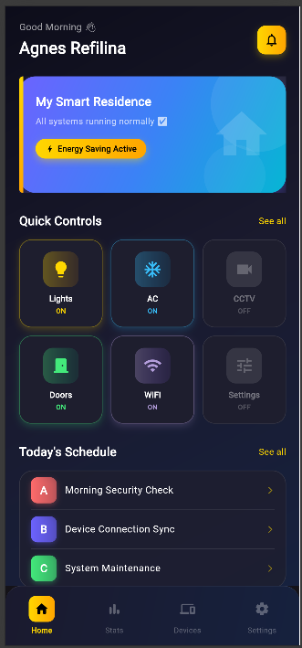
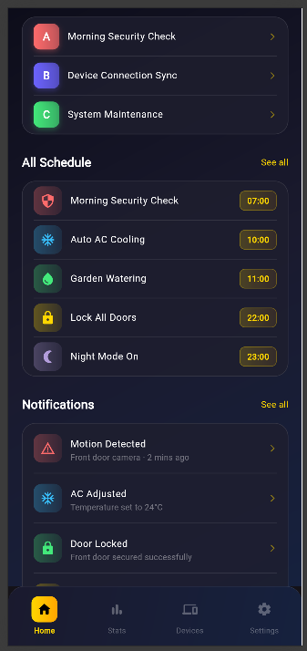
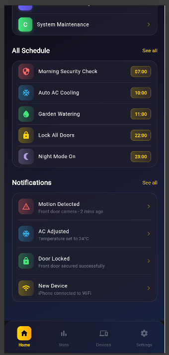

<div align="center">
  <br />

  <h1>LAPORAN PRAKTIKUM <br>
  APLIKASI BERBASIS PLATFORM
  </h1>

  <br />

  <h3>Modul 3-4 Flutter</h3>
Widget UI
  <br>
  
  </h3>

  <br />

  <p align="center">

</p>

  <br />
  <br />
  <br />

  <h3>Disusun Oleh :</h3>

  <p>
    <strong>Agnes Refilina Fiska </strong><br>
    <strong>2311102126</strong><br>
    <strong>S1 IF-11-REG01</strong>
  </p>

  <br />

  <h3>Dosen Pengampu :</h3>

  <p>
    <strong>Dimas Fanny Hebrasianto Permadi, S.ST., M.Kom</strong>
  </p>
  
  <br />
  <br />
    <h4>Asisten Praktikum :</h4>
    <strong>Apri Pandu Wicaksono </strong> <br>
    <strong>Rangga Pradarrell Fathi</strong>
  <br />

  <h3>LABORATORIUM HIGH PERFORMANCE
 <br>FAKULTAS INFORMATIKA <br>UNIVERSITAS TELKOM PURWOKERTO <br>2026</h3>
</div>

<hr>

### Dasar Teori
Flutter adalah framework pengembangan aplikasi modern yang berbasis bahasa Dart, dengan konsep inti bahwa seluruh komponen tampilan dibangun menggunakan widget. Dalam proses pembuatan aplikasi, penataan tata letak menjadi dasar yang sangat penting untuk menciptakan pengalaman pengguna yang nyaman dan intuitif. Salah satu widget fundamental yang sering digunakan adalah Container, yang berperan sebagai elemen pembungkus serbaguna untuk mengatur ukuran, tampilan visual, maupun jarak antar elemen. Di samping itu, widget Stack hadir sebagai solusi untuk menumpuk beberapa elemen secara berlapis, memberikan fleksibilitas tinggi dalam merancang antarmuka dengan komposisi visual yang lebih kompleks.
Tidak hanya untuk penataan posisi secara statis, Flutter turut menyediakan widget yang dirancang untuk menampilkan data dalam jumlah besar secara dinamis dan hemat sumber daya. ListView dan GridView menjadi dua widget andalan dalam mengelola konten yang dapat digulir. ListView menampilkan item secara berurutan dalam satu arah, sedangkan GridView menyusun elemen ke dalam format kisi baris dan kolom. Guna menjaga performa tetap optimal, penggunaan konstruktor seperti .builder dan .separated sangat direkomendasikan, karena keduanya hanya merender elemen yang tampak di layar sehingga konsumsi memori dapat ditekan meski data yang diproses bervolume besar. Penguasaan atas kombinasi widget-widget ini menjadi bekal penting bagi pengembang dalam membangun aplikasi yang tidak hanya berjalan dengan baik secara fungsional, tetapi juga efisien dan andal dari sisi performa.

## Container
Container adalah widget kotak yang dapat diberi warna, ukuran, border radius, shadow, dan berbagai dekorasi lainnya melalui BoxDecoration. Pada project Smart Home ini, Container digunakan untuk membuat Hero Banner dengan gradient biru-ungu, Energy Saving Badge dengan gradient gold, serta card-card pada Quick Controls.

## GridView
GridView adalah widget yang menampilkan item dalam format grid atau kotak berjajar dengan jumlah kolom yang dapat ditentukan melalui parameter crossAxisCount. Pada project ini, GridView.count digunakan untuk menampilkan 6 item Quick Controls (Lights, AC, CCTV, Doors, WiFi, Settings) dalam 3 kolom yang masing-masing memiliki icon berwarna dan status ON/OFF.

## ListView
ListView adalah widget yang menampilkan daftar item secara statis dan berurutan ke bawah. Widget ini cocok digunakan ketika jumlah item sudah diketahui dan bersifat tetap. Pada project ini, ListView digunakan untuk menampilkan Today's Schedule dengan 3 item statis yaitu item A (Morning Security Check), item B (Device Connection Sync), dan item C (System Maintenance).

## ListView.builder
ListView.builder adalah widget yang menampilkan daftar item secara dinamis dari sebuah data array menggunakan index. Widget ini lebih efisien dibandingkan ListView biasa karena hanya merender item yang sedang terlihat di layar. Pada project ini, ListView.builder digunakan untuk menampilkan All Schedule yang dibangun dari List scheduleData yang berisi 5 item jadwal.

## ListView.separated
ListView.separated adalah widget yang menampilkan daftar item dengan garis pembatas (separator) antar setiap item secara otomatis melalui separatorBuilder. Pada project ini, ListView.separated digunakan untuk menampilkan daftar Notifications dengan Divider berwarna putih transparan sebagai pemisah antar notifikasi.

## Stack
Stack adalah widget yang memungkinkan penumpukan beberapa widget di atas satu sama lain menggunakan widget Positioned untuk menentukan posisi setiap layer. Pada project ini, Stack digunakan untuk membuat Hero Banner yang terdiri dari 6 layer bertumpuk yaitu background gradient biru-ungu, decorative circle besar, decorative circle kecil, gold accent strip di sisi kiri, teks konten di tengah, dan icon rumah semi-transparan.

## Nama Projek
- Nama Projek : Smart Home App
- Tema        : Dark Mode Modern Minimalis
- Accent Color: Gold/Yellow (#FFD700)
- Background  : Gradient Dark Navy (0xFF0D0D1A → 0xFF1A1A2E → 0xFF16213E)

## Implementasi Tiap Widget
1. Container
Container digunakan sebagai wrapper dengan dekorasi BoxDecoration untuk background gradient, hero banner, gold badge, dan card controls.
```dart
Container(
  decoration: BoxDecoration(
    gradient: LinearGradient(
      colors: [Color(0xFF0D0D1A), Color(0xFF1A1A2E), Color(0xFF16213E)],
    ),
  ),
)
```
2. GridView
GridView.count menampilkan Quick Controls dalam format 3 kolom dengan 6 item berwarna-warni beserta status ON/OFF.
```dart
GridView.count(
  crossAxisCount: 3,
  shrinkWrap: true,
  physics: NeverScrollableScrollPhysics(),
)
```
3. ListView
ListView biasa untuk Today's Schedule dengan 3 item statis A, B, C menggunakan ListTile dengan leading bergradient berwarna.
```dart
ListView(
  shrinkWrap: true,
  physics: NeverScrollableScrollPhysics(),
  children: [
    _scheduleStatic('A', 'Morning Security Check', Color(0xFFFF6B6B)),
    _scheduleStatic('B', 'Device Connection Sync', Color(0xFF6C63FF)),
    _scheduleStatic('C', 'System Maintenance', Color(0xFF43E97B)),
  ],
)
```
4. ListView.builder
ListView.builder untuk All Schedule dari List scheduleData (5 item dinamis). Efisien karena hanya merender item yang terlihat.
```dart
ListView.builder(
  itemCount: scheduleData.length,
  itemBuilder: (context, index) {
    return ListTile(...);
  },
)
```
5. ListView.separated
ListView.separated untuk Notifications dengan Divider sebagai garis pembatas antar item secara otomatis.
```dart
ListView.separated(
  itemCount: notifications.length,
  separatorBuilder: (context, index) => Divider(
    color: Colors.white10, height: 1,
  ),
  itemBuilder: (context, index) => ListTile(...),
)
```
6. Stack
Stack untuk Hero Banner dengan 6 layer bertumpuk menggunakan Positioned: background gradient, 2 decorative circles, gold accent strip, teks konten, dan icon rumah.
```dart
Stack(
  children: [
    Container(...),           // Background gradient
    Positioned(...),          // Circle besar
    Positioned(...),          // Circle kecil
    Positioned(...),          // Gold accent strip
    Positioned(...),          // Teks konten
    Positioned(...),          // Icon rumah
  ],
)
```
## Kode Lengkap
```dart
// ignore_for_file: prefer_const_constructors, prefer_const_literals_to_create_immutables
import 'package:flutter/material.dart';

void main() {
  runApp(const MyApp());
}

class MyApp extends StatelessWidget {
  const MyApp({Key? key}) : super(key: key);

  @override
  Widget build(BuildContext context) {
    return MaterialApp(
      title: 'Smart Home',
      debugShowCheckedModeBanner: false,
      theme: ThemeData.dark(),
      home: const SmartHomePage(),
    );
  }
}

class SmartHomePage extends StatelessWidget {
  const SmartHomePage({Key? key}) : super(key: key);

  final List<Map<String, dynamic>> scheduleData = const [
    {'title': 'Morning Security Check', 'time': '07:00', 'icon': Icons.security, 'color': Color(0xFFFF6B6B)},
    {'title': 'Auto AC Cooling', 'time': '10:00', 'icon': Icons.ac_unit, 'color': Color(0xFF38BDF8)},
    {'title': 'Garden Watering', 'time': '11:00', 'icon': Icons.water_drop, 'color': Color(0xFF43E97B)},
    {'title': 'Lock All Doors', 'time': '22:00', 'icon': Icons.lock, 'color': Color(0xFFFFD700)},
    {'title': 'Night Mode On', 'time': '23:00', 'icon': Icons.nightlight_round, 'color': Color(0xFFB39DDB)},
  ];

  final List<Map<String, dynamic>> notifications = const [
    {'title': 'Motion Detected', 'desc': 'Front door camera - 2 mins ago', 'icon': Icons.warning_amber, 'color': Color(0xFFFF6B6B)},
    {'title': 'AC Adjusted', 'desc': 'Temperature set to 24°C', 'icon': Icons.ac_unit, 'color': Color(0xFF38BDF8)},
    {'title': 'Door Locked', 'desc': 'Front door secured successfully', 'icon': Icons.lock, 'color': Color(0xFF43E97B)},
    {'title': 'New Device', 'desc': 'iPhone connected to WiFi', 'icon': Icons.wifi, 'color': Color(0xFFFFD700)},
  ];

  @override
  Widget build(BuildContext context) {
    return Scaffold(
      body: Container(
        // GRADIENT BACKGROUND
        decoration: BoxDecoration(
          gradient: LinearGradient(
            begin: Alignment.topLeft,
            end: Alignment.bottomRight,
            colors: [
              Color(0xFF0D0D1A),
              Color(0xFF1A1A2E),
              Color(0xFF16213E),
            ],
          ),
        ),
        child: SafeArea(
          child: SingleChildScrollView(
            padding: EdgeInsets.all(20),
            child: Column(
              crossAxisAlignment: CrossAxisAlignment.start,
              children: [

                // ==================
                // HEADER
                // ==================
                Row(
                  mainAxisAlignment: MainAxisAlignment.spaceBetween,
                  children: [
                    Column(
                      crossAxisAlignment: CrossAxisAlignment.start,
                      children: [
                        Text(
                          'Good Morning 👋',
                          style: TextStyle(
                            color: Colors.white60,
                            fontSize: 14,
                          ),
                        ),
                        SizedBox(height: 4),
                        Text(
                          'Agnes Refilina',
                          style: TextStyle(
                            color: Colors.white,
                            fontSize: 24,
                            fontWeight: FontWeight.bold,
                          ),
                        ),
                      ],
                    ),
                    // Notification bell dengan gold accent
                    Container(
                      padding: EdgeInsets.all(10),
                      decoration: BoxDecoration(
                        gradient: LinearGradient(
                          colors: [Color(0xFFFFD700), Color(0xFFFFA500)],
                        ),
                        borderRadius: BorderRadius.circular(12),
                        boxShadow: [
                          BoxShadow(
                            color: Color(0xFFFFD700).withOpacity(0.3),
                            blurRadius: 8,
                            offset: Offset(0, 4),
                          ),
                        ],
                      ),
                      child: Icon(
                        Icons.notifications_outlined,
                        color: Colors.black,
                        size: 22,
                      ),
                    ),
                  ],
                ),
                SizedBox(height: 24),

                // ==================
                // 1. STACK + CONTAINER - Hero Banner
                // ==================
                Stack(
                  children: [
                    // Background gradient container
                    Container(
                      width: double.infinity,
                      height: 170,
                      decoration: BoxDecoration(
                        borderRadius: BorderRadius.circular(24),
                        gradient: LinearGradient(
                          colors: [
                            Color(0xFF6C63FF),
                            Color(0xFF3B82F6),
                            Color(0xFF06B6D4),
                          ],
                          begin: Alignment.topLeft,
                          end: Alignment.bottomRight,
                        ),
                        boxShadow: [
                          BoxShadow(
                            color: Color(0xFF6C63FF).withOpacity(0.4),
                            blurRadius: 20,
                            offset: Offset(0, 8),
                          ),
                        ],
                      ),
                    ),
                    // Decorative circle besar
                    Positioned(
                      right: -30,
                      top: -30,
                      child: Container(
                        width: 140,
                        height: 140,
                        decoration: BoxDecoration(
                          shape: BoxShape.circle,
                          color: Colors.white.withOpacity(0.07),
                        ),
                      ),
                    ),
                    // Decorative circle kecil
                    Positioned(
                      right: 30,
                      bottom: -20,
                      child: Container(
                        width: 90,
                        height: 90,
                        decoration: BoxDecoration(
                          shape: BoxShape.circle,
                          color: Colors.white.withOpacity(0.05),
                        ),
                      ),
                    ),
                    // Gold accent strip
                    Positioned(
                      top: 0,
                      left: 0,
                      child: Container(
                        width: 6,
                        height: 170,
                        decoration: BoxDecoration(
                          borderRadius: BorderRadius.only(
                            topLeft: Radius.circular(24),
                            bottomLeft: Radius.circular(24),
                          ),
                          gradient: LinearGradient(
                            begin: Alignment.topCenter,
                            end: Alignment.bottomCenter,
                            colors: [Color(0xFFFFD700), Color(0xFFFFA500)],
                          ),
                        ),
                      ),
                    ),
                    // Content
                    Positioned(
                      left: 24,
                      top: 24,
                      child: Column(
                        crossAxisAlignment: CrossAxisAlignment.start,
                        children: [
                          Text(
                            'My Smart Residence',
                            style: TextStyle(
                              color: Colors.white,
                              fontSize: 18,
                              fontWeight: FontWeight.bold,
                            ),
                          ),
                          SizedBox(height: 6),
                          Text(
                            'All systems running normally ✅',
                            style: TextStyle(
                              color: Colors.white70,
                              fontSize: 13,
                            ),
                          ),
                          SizedBox(height: 16),
                          // Gold badge
                          Container(
                            padding: EdgeInsets.symmetric(
                                horizontal: 14, vertical: 6),
                            decoration: BoxDecoration(
                              gradient: LinearGradient(
                                colors: [
                                  Color(0xFFFFD700),
                                  Color(0xFFFFA500)
                                ],
                              ),
                              borderRadius: BorderRadius.circular(20),
                              boxShadow: [
                                BoxShadow(
                                  color: Color(0xFFFFD700).withOpacity(0.4),
                                  blurRadius: 8,
                                  offset: Offset(0, 4),
                                ),
                              ],
                            ),
                            child: Row(
                              children: [
                                Icon(Icons.bolt,
                                    color: Colors.black, size: 14),
                                SizedBox(width: 4),
                                Text(
                                  'Energy Saving Active',
                                  style: TextStyle(
                                    color: Colors.black,
                                    fontSize: 12,
                                    fontWeight: FontWeight.bold,
                                  ),
                                ),
                              ],
                            ),
                          ),
                        ],
                      ),
                    ),
                    // House icon
                    Positioned(
                      right: 20,
                      top: 0,
                      bottom: 0,
                      child: Icon(
                        Icons.home,
                        size: 90,
                        color: Colors.white.withOpacity(0.15),
                      ),
                    ),
                  ],
                ),
                SizedBox(height: 28),

                // ==================
                // 2. GRIDVIEW - Quick Controls
                // ==================
                Row(
                  mainAxisAlignment: MainAxisAlignment.spaceBetween,
                  children: [
                    Text(
                      'Quick Controls',
                      style: TextStyle(
                        color: Colors.white,
                        fontSize: 18,
                        fontWeight: FontWeight.bold,
                      ),
                    ),
                    Text(
                      'See all',
                      style: TextStyle(
                        color: Color(0xFFFFD700),
                        fontSize: 13,
                      ),
                    ),
                  ],
                ),
                SizedBox(height: 14),
                GridView.count(
                  crossAxisCount: 3,
                  shrinkWrap: true,
                  physics: NeverScrollableScrollPhysics(),
                  crossAxisSpacing: 12,
                  mainAxisSpacing: 12,
                  childAspectRatio: 0.95,
                  children: [
                    _controlItem('Lights', Icons.lightbulb, Color(0xFFFFD700), Color(0xFFFFA500), true),
                    _controlItem('AC', Icons.ac_unit, Color(0xFF38BDF8), Color(0xFF0EA5E9), true),
                    _controlItem('CCTV', Icons.videocam, Color(0xFFFF6B6B), Color(0xFFEF4444), false),
                    _controlItem('Doors', Icons.door_front_door, Color(0xFF43E97B), Color(0xFF10B981), true),
                    _controlItem('WiFi', Icons.wifi, Color(0xFFB39DDB), Color(0xFF8B5CF6), true),
                    _controlItem('Settings', Icons.tune, Color(0xFF94A3B8), Color(0xFF64748B), false),
                  ],
                ),
                SizedBox(height: 28),

                // ==================
                // 3. LISTVIEW - Today's Schedule (A, B, C)
                // ==================
                _sectionTitle('Today\'s Schedule'),
                SizedBox(height: 14),
                Container(
                  decoration: BoxDecoration(
                    color: Color(0xFF1E1E2E).withOpacity(0.8),
                    borderRadius: BorderRadius.circular(20),
                    border: Border.all(color: Colors.white10),
                  ),
                  child: ListView(
                    shrinkWrap: true,
                    physics: NeverScrollableScrollPhysics(),
                    children: [
                      _scheduleStatic('A', 'Morning Security Check', Color(0xFFFF6B6B)),
                      _thinDivider(),
                      _scheduleStatic('B', 'Device Connection Sync', Color(0xFF6C63FF)),
                      _thinDivider(),
                      _scheduleStatic('C', 'System Maintenance', Color(0xFF43E97B)),
                    ],
                  ),
                ),
                SizedBox(height: 28),

                // ==================
                // 4. LISTVIEW BUILDER
                // ==================
                _sectionTitle('All Schedule'),
                SizedBox(height: 14),
                Container(
                  decoration: BoxDecoration(
                    color: Color(0xFF1E1E2E).withOpacity(0.8),
                    borderRadius: BorderRadius.circular(20),
                    border: Border.all(color: Colors.white10),
                  ),
                  child: ListView.builder(
                    shrinkWrap: true,
                    physics: NeverScrollableScrollPhysics(),
                    itemCount: scheduleData.length,
                    itemBuilder: (context, index) {
                      final item = scheduleData[index];
                      return Column(
                        children: [
                          ListTile(
                            contentPadding: EdgeInsets.symmetric(
                                horizontal: 16, vertical: 4),
                            leading: Container(
                              padding: EdgeInsets.all(10),
                              decoration: BoxDecoration(
                                gradient: LinearGradient(
                                  colors: [
                                    item['color'].withOpacity(0.3),
                                    item['color'].withOpacity(0.1),
                                  ],
                                ),
                                borderRadius: BorderRadius.circular(12),
                              ),
                              child: Icon(
                                item['icon'],
                                color: item['color'],
                                size: 22,
                              ),
                            ),
                            title: Text(
                              item['title'],
                              style: TextStyle(
                                color: Colors.white,
                                fontWeight: FontWeight.w500,
                                fontSize: 14,
                              ),
                            ),
                            trailing: Container(
                              padding: EdgeInsets.symmetric(
                                  horizontal: 10, vertical: 5),
                              decoration: BoxDecoration(
                                gradient: LinearGradient(
                                  colors: [
                                    Color(0xFFFFD700).withOpacity(0.2),
                                    Color(0xFFFFA500).withOpacity(0.1),
                                  ],
                                ),
                                borderRadius: BorderRadius.circular(8),
                                border: Border.all(
                                    color: Color(0xFFFFD700).withOpacity(0.3)),
                              ),
                              child: Text(
                                item['time'],
                                style: TextStyle(
                                  color: Color(0xFFFFD700),
                                  fontSize: 12,
                                  fontWeight: FontWeight.bold,
                                ),
                              ),
                            ),
                          ),
                          if (index < scheduleData.length - 1)
                            _thinDivider(),
                        ],
                      );
                    },
                  ),
                ),
                SizedBox(height: 28),

                // ==================
                // 5. LISTVIEW SEPARATED - Notifications
                // ==================
                _sectionTitle('Notifications'),
                SizedBox(height: 14),
                Container(
                  decoration: BoxDecoration(
                    color: Color(0xFF1E1E2E).withOpacity(0.8),
                    borderRadius: BorderRadius.circular(20),
                    border: Border.all(color: Colors.white10),
                  ),
                  child: ListView.separated(
                    shrinkWrap: true,
                    physics: NeverScrollableScrollPhysics(),
                    itemCount: notifications.length,
                    separatorBuilder: (context, index) => _thinDivider(),
                    itemBuilder: (context, index) {
                      final notif = notifications[index];
                      return ListTile(
                        contentPadding: EdgeInsets.symmetric(
                            horizontal: 16, vertical: 4),
                        leading: Container(
                          padding: EdgeInsets.all(10),
                          decoration: BoxDecoration(
                            gradient: LinearGradient(
                              colors: [
                                notif['color'].withOpacity(0.3),
                                notif['color'].withOpacity(0.1),
                              ],
                            ),
                            borderRadius: BorderRadius.circular(12),
                          ),
                          child: Icon(
                            notif['icon'],
                            color: notif['color'],
                            size: 22,
                          ),
                        ),
                        title: Text(
                          notif['title'],
                          style: TextStyle(
                            color: Colors.white,
                            fontWeight: FontWeight.w500,
                            fontSize: 14,
                          ),
                        ),
                        subtitle: Text(
                          notif['desc'],
                          style: TextStyle(
                            color: Colors.white38,
                            fontSize: 12,
                          ),
                        ),
                        trailing: Icon(
                          Icons.arrow_forward_ios,
                          size: 12,
                          color: Color(0xFFFFD700).withOpacity(0.5),
                        ),
                      );
                    },
                  ),
                ),
                SizedBox(height: 30),
              ],
            ),
          ),
        ),
      ),

      // BOTTOM NAV BAR
      bottomNavigationBar: Container(
        padding: EdgeInsets.symmetric(vertical: 14),
        decoration: BoxDecoration(
          gradient: LinearGradient(
            begin: Alignment.topLeft,
            end: Alignment.bottomRight,
            colors: [Color(0xFF1A1A2E), Color(0xFF16213E)],
          ),
          borderRadius: BorderRadius.vertical(top: Radius.circular(24)),
          border: Border(top: BorderSide(color: Colors.white10)),
        ),
        child: Row(
          mainAxisAlignment: MainAxisAlignment.spaceAround,
          children: [
            _navItem(Icons.home_rounded, 'Home', true),
            _navItem(Icons.bar_chart_rounded, 'Stats', false),
            _navItem(Icons.devices_rounded, 'Devices', false),
            _navItem(Icons.settings_rounded, 'Settings', false),
          ],
        ),
      ),
    );
  }

  // ==================
  // HELPER WIDGETS
  // ==================

  Widget _sectionTitle(String title) {
    return Row(
      mainAxisAlignment: MainAxisAlignment.spaceBetween,
      children: [
        Text(
          title,
          style: TextStyle(
            color: Colors.white,
            fontSize: 18,
            fontWeight: FontWeight.bold,
          ),
        ),
        Text(
          'See all',
          style: TextStyle(color: Color(0xFFFFD700), fontSize: 13),
        ),
      ],
    );
  }

  Widget _controlItem(String label, IconData icon,
      Color colorStart, Color colorEnd, bool isOn) {
    return Container(
      decoration: BoxDecoration(
        color: Color(0xFF1E1E2E),
        borderRadius: BorderRadius.circular(18),
        border: Border.all(
          color: isOn ? colorStart.withOpacity(0.4) : Colors.white10,
        ),
        boxShadow: isOn
            ? [
                BoxShadow(
                  color: colorStart.withOpacity(0.2),
                  blurRadius: 8,
                  offset: Offset(0, 4),
                )
              ]
            : [],
      ),
      child: Column(
        mainAxisAlignment: MainAxisAlignment.center,
        children: [
          Container(
            padding: EdgeInsets.all(12),
            decoration: BoxDecoration(
              gradient: isOn
                  ? LinearGradient(colors: [
                      colorStart.withOpacity(0.3),
                      colorEnd.withOpacity(0.1),
                    ])
                  : LinearGradient(
                      colors: [Colors.white10, Colors.white10]),
              borderRadius: BorderRadius.circular(14),
            ),
            child: Icon(
              icon,
              color: isOn ? colorStart : Colors.white24,
              size: 28,
            ),
          ),
          SizedBox(height: 8),
          Text(
            label,
            style: TextStyle(
              color: isOn ? Colors.white : Colors.white38,
              fontSize: 12,
              fontWeight: FontWeight.w600,
            ),
          ),
          SizedBox(height: 2),
          Text(
            isOn ? 'ON' : 'OFF',
            style: TextStyle(
              color: isOn ? colorStart : Colors.white24,
              fontSize: 10,
              fontWeight: FontWeight.bold,
            ),
          ),
        ],
      ),
    );
  }

  Widget _scheduleStatic(String label, String title, Color color) {
    return ListTile(
      contentPadding: EdgeInsets.symmetric(horizontal: 16, vertical: 4),
      leading: Container(
        width: 38,
        height: 38,
        decoration: BoxDecoration(
          gradient: LinearGradient(
            colors: [color, color.withOpacity(0.6)],
          ),
          borderRadius: BorderRadius.circular(10),
          boxShadow: [
            BoxShadow(
              color: color.withOpacity(0.3),
              blurRadius: 6,
              offset: Offset(0, 3),
            ),
          ],
        ),
        child: Center(
          child: Text(
            label,
            style: TextStyle(
              color: Colors.white,
              fontWeight: FontWeight.bold,
              fontSize: 16,
            ),
          ),
        ),
      ),
      title: Text(
        title,
        style: TextStyle(color: Colors.white, fontSize: 14),
      ),
      trailing: Icon(
        Icons.arrow_forward_ios,
        size: 12,
        color: Color(0xFFFFD700).withOpacity(0.5),
      ),
    );
  }

  Widget _thinDivider() {
    return Divider(
      color: Colors.white10,
      height: 1,
      indent: 16,
      endIndent: 16,
    );
  }

  Widget _navItem(IconData icon, String label, bool isActive) {
    return Column(
      mainAxisSize: MainAxisSize.min,
      children: [
        Container(
          padding: EdgeInsets.all(8),
          decoration: BoxDecoration(
            gradient: isActive
                ? LinearGradient(
                    colors: [Color(0xFFFFD700), Color(0xFFFFA500)])
                : LinearGradient(
                    colors: [Colors.transparent, Colors.transparent]),
            borderRadius: BorderRadius.circular(10),
          ),
          child: Icon(
            icon,
            color: isActive ? Colors.black : Colors.white30,
            size: 22,
          ),
        ),
        SizedBox(height: 4),
        Text(
          label,
          style: TextStyle(
            color: isActive ? Color(0xFFFFD700) : Colors.white30,
            fontSize: 11,
            fontWeight: isActive ? FontWeight.bold : FontWeight.normal,
          ),
        ),
      ],
    );
  }
}
```
## Screenshot Hasil Aplikasi
Berikut adalah hasil tampilan aplikasi Smart Home yang telah dibuat:





## Kesimpulan
Dari praktikum Modul 4 ini dapat disimpulkan bahwa:
- Flutter menyediakan berbagai widget layout yang mudah digunakan dan fleksibel
- Container sangat berguna untuk membuat tampilan dekoratif dengan BoxDecoration
- GridView cocok untuk tampilan berbentuk grid seperti menu atau katalog produk
- ListView digunakan untuk item statis, sedangkan ListView.builder lebih efisien untuk data dinamis
- ListView.separated memudahkan penambahan pemisah antar item secara otomatis
- Stack memungkinkan pembuatan tampilan kompleks dengan menumpuk widget secara bertingkat
- Kombinasi semua widget tersebut menghasilkan tampilan Smart Home yang profesional dan menarik
