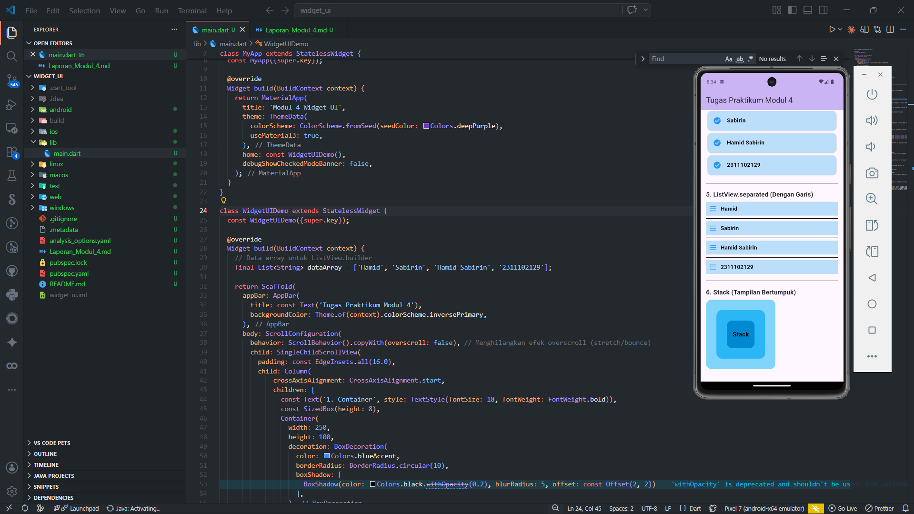

<div align="center">
  <br />
  <h1>LAPORAN PRAKTIKUM <br>APLIKASI BERBASIS PLATFORM</h1>
  <br />
  <h3>MODUL 4 <br> WIDGET UI</h3>
  <br />
   
  <br />
  <br />
  <br />
  <h3>Disusun Oleh :</h3>
  <p>
    <strong>HAMID SABIRIN</strong><br>
    <strong>2311102129</strong><br>
    <strong>S1 IF-11-REG01</strong>
  </p>
  <br />
  <br />
  <h3>Dosen Pengampu :</h3>
  <p>
    <strong>Dimas Fanny Hebrasianto Permadi, S.ST., M.Kom</strong>
  </p>
  <br />
  <br />
    <h4>Asisten Praktikum :</h4>
    <strong> Apri Pandu Wicaksono </strong> <br>
    <strong>Rangga Pradarrell Fathi</strong>
  <br />
  <h3>LABORATORIUM HIGH PERFORMANCE
 <br>FAKULTAS INFORMATIKA <br>UNIVERSITAS TELKOM PURWOKERTO <br>2026</h3>
</div>

---

## 1. Dasar Teori

Dalam pengembangan aplikasi dengan Flutter, **Widget** adalah elemen dasar pembangun antarmuka pengguna (UI). Semuanya di Flutter adalah widget, baik itu yang bersifat struktural (seperti tombol atau teks), layout (seperti *padding* atau margin), maupun efek visual.

Terdapat beberapa jenis widget dasar yang sering digunakan:
- **Container**: Widget multifungsi yang bisa digunakan untuk mengatur ukuran, *padding*, *margin*, serta dekorasi (seperti warna latar atau *border*).
- **GridView**: Widget untuk menampilkan sekumpulan data dalam bentuk tata letak *grid* dua dimensi (baris dan kolom) yang dapat di-scroll.
- **ListView**: Widget *layout* yang berfungsi menyusun daftar *child* (elemen) secara linear, baik vertikal maupun horizontal, dan otomatis menyediakan fitur *scroll*. *ListView* memiliki variasi seperti `.builder` untuk *generate* elemen secara dinamis sesuai ukuran *array*, serta `.separated` yang menambahkan elemen pemisah (garis antar baris).
- **Stack**: Widget yang digunakan untuk menumpuk elemen-elemen di atas satu sama lain. Widget yang ditulis pertama akan berada di tumpukan paling bawah, sedangkan yang terakhir berada paling atas.

---

## 2. Pembahasan Code dan Implementasi

Berikut adalah kode yang dibagi berdasarkan fungsi setiap widget pada modul ini. Data untuk *list* dinamis (seperti `ListView.builder` dan `ListView.separated`) diambil dari array berikut:
```dart
// Data array untuk ListView.builder
final List<String> dataArray = ['Hamid', 'Sabirin', 'Hamid Sabirin', '2311102129'];
```

### A. Container
```dart
const Text('1. Container', style: TextStyle(fontSize: 18, fontWeight: FontWeight.bold)),
const SizedBox(height: 8),
Container(
  width: 250,
  height: 100,
  decoration: BoxDecoration(
    color: Colors.blueAccent,
    borderRadius: BorderRadius.circular(10),
    boxShadow: [
      BoxShadow(color: Colors.black.withOpacity(0.2), blurRadius: 5, offset: const Offset(2, 2))
    ],
  ),
  child: const Center(
    child: Text('Container', style: TextStyle(color: Colors.black, fontWeight: FontWeight.bold), textAlign: TextAlign.center),
  ),
),
```
**Penjelasan:**  
Sebuah `Container` dibuat menjadi persegi panjang dengan lebar `250` dan tinggi `100`. Kami menambahkan `BoxDecoration` untuk memberikan warna dasar `Colors.blueAccent`, mengatur ujungnya agak melengkung (`borderRadius`), dan menyematkan efek bayangan sederhana. Teks disematkan dengan tipe *bold* serta di tengahkan menggunakan widget `Center`.

### B. GridView
```dart
const Text('2. GridView (Min 6 item)', style: TextStyle(fontSize: 18, fontWeight: FontWeight.bold)),
const SizedBox(height: 8),
GridView.count(
  crossAxisCount: 3,
  shrinkWrap: true, // Penting agar GridView bisa berada di dalam SingleChildScrollView
  physics: const NeverScrollableScrollPhysics(), // Mematikan scroll internal GridView
  mainAxisSpacing: 8,
  crossAxisSpacing: 8,
  childAspectRatio: 1.5,
  children: List.generate(6, (index) {
    return Container(
      decoration: BoxDecoration(
        color: Colors.blue.shade200,
        borderRadius: BorderRadius.circular(8),
      ),
      child: Center(
        child: Text('Item ${index + 1}', style: const TextStyle(fontWeight: FontWeight.bold, color: Colors.black)),
      ),
    );
  }),
),
```
**Penjelasan:**  
Kami membuat tampilan kotak-kotak terstruktur menggunakan `GridView.count` yang membagi lebarnya menjadi 3 kolom (`crossAxisCount: 3`). `shrinkWrap: true` beserta `NeverScrollableScrollPhysics()` diberikan agar tinggi grid menyesuaikan isinya dan tak menabrak *scroll* utama pembungkus layar. Data dikembangkan memakai iterasi `List.generate()` sejumlah 6 item bertema biru tebal.

### C. ListView (Statis)
```dart
const Text('3. ListView (Item A, B, C)', style: TextStyle(fontSize: 18, fontWeight: FontWeight.bold)),
const SizedBox(height: 8),
ListView(
  shrinkWrap: true,
  physics: const NeverScrollableScrollPhysics(),
  children: [
    Card(color: Colors.blue.shade100, child: const ListTile(leading: CircleAvatar(child: Text('1', style: TextStyle(fontWeight: FontWeight.bold))), title: Text('Hamid', style: TextStyle(color: Colors.black, fontWeight: FontWeight.bold)))),
    Card(color: Colors.blue.shade100, child: const ListTile(leading: CircleAvatar(child: Text('2', style: TextStyle(fontWeight: FontWeight.bold))), title: Text('Sabirin', style: TextStyle(color: Colors.black, fontWeight: FontWeight.bold)))),
    Card(color: Colors.blue.shade100, child: const ListTile(leading: CircleAvatar(child: Text('3', style: TextStyle(fontWeight: FontWeight.bold))), title: Text('Hamid Sabirin', style: TextStyle(color: Colors.black, fontWeight: FontWeight.bold)))),
    Card(color: Colors.blue.shade100, child: const ListTile(leading: CircleAvatar(child: Text('4', style: TextStyle(fontWeight: FontWeight.bold))), title: Text('2311102129', style: TextStyle(color: Colors.black, fontWeight: FontWeight.bold)))),
  ],
),
```
**Penjelasan:**  
ListView versi statis merangkai `ListTile` di dalam balutan `Card`. Penambahan komponen dilakukan secara sekuensial satu per satu secara manual.

### D. ListView.builder
```dart
const Text('4. ListView.builder (Dari Array)', style: TextStyle(fontSize: 18, fontWeight: FontWeight.bold)),
const SizedBox(height: 8),
ListView.builder(
  shrinkWrap: true,
  physics: const NeverScrollableScrollPhysics(),
  itemCount: dataArray.length,
  itemBuilder: (context, index) {
    return Card(
      color: Colors.blue.shade100,
      child: ListTile(
        leading: const Icon(Icons.check_circle, color: Colors.blue),
        title: Text(dataArray[index], style: const TextStyle(color: Colors.black, fontWeight: FontWeight.bold)),
      ),
    );
  },
),
```
**Penjelasan:**  
`ListView.builder` lebih direkomendasikan ketika data jumlahnya dinamis/banyak karena widget ini hanya melakukan render pada komponen yang ada di layar. Kami menarik nilai baris dari `dataArray`.

### E. ListView.separated
```dart
const Text('5. ListView.separated (Dengan Garis)', style: TextStyle(fontSize: 18, fontWeight: FontWeight.bold)),
const SizedBox(height: 8),
ListView.separated(
  shrinkWrap: true,
  physics: const NeverScrollableScrollPhysics(),
  itemCount: dataArray.length,
  separatorBuilder: (context, index) => const Divider(color: Colors.black, thickness: 2),
  itemBuilder: (context, index) {
    return Container(
      color: Colors.blue.shade100,
      padding: const EdgeInsets.symmetric(vertical: 8.0, horizontal: 8.0),
      child: Row(
        children: [
          const Icon(Icons.format_list_bulleted, color: Colors.blue),
          const SizedBox(width: 10),
          Text(dataArray[index], style: const TextStyle(fontSize: 16, color: Colors.black, fontWeight: FontWeight.bold)),
        ],
      ),
    );
  },
),
```
**Penjelasan:**  
Versi `separated` ini sama seperti `.builder`, namun kita dapat menambahkan opsi `separatorBuilder` di mana setiap peralihan antar komponen disisipkan elemen pembatas, yakni widget `Divider` bewarna hitam.

### F. Stack
```dart
const Text('6. Stack (Tampilan Bertumpuk)', style: TextStyle(fontSize: 18, fontWeight: FontWeight.bold)),
const SizedBox(height: 8),
Stack(
  alignment: Alignment.center,
  children: [
    Container(width: 200, height: 200, decoration: BoxDecoration(color: Colors.lightBlue.shade200, borderRadius: BorderRadius.circular(16))),
    Container(width: 140, height: 140, decoration: BoxDecoration(color: Colors.lightBlue.shade400, borderRadius: BorderRadius.circular(16))),
    Container(width: 80, height: 80, decoration: BoxDecoration(color: Colors.lightBlue.shade700, borderRadius: BorderRadius.circular(16))),
    const Text('Stack', style: TextStyle(color: Colors.black, fontSize: 18, fontWeight: FontWeight.bold)),
  ],
),
```
**Penjelasan:**  
Dalam implementasi `Stack`, item ditumpuk berdasarkan urutan array-nya. Elemen terbesar berada di index awal, dilanjut dengan kotak yang lebih kecil, lalu ditutup oleh sebuah teks berhuruf tebal `'Stack'` pada tumpukan terdepan. Posisi anak distel ke titik tengah melalui parameter `alignment: Alignment.center`.

---

## 3. Hasil Tampilan (*Output*)

Tampilan dari eksekusi *source code* di atas menghasilkan UI berbasis kolom (di-scroll menggunakan `SingleChildScrollView`).


