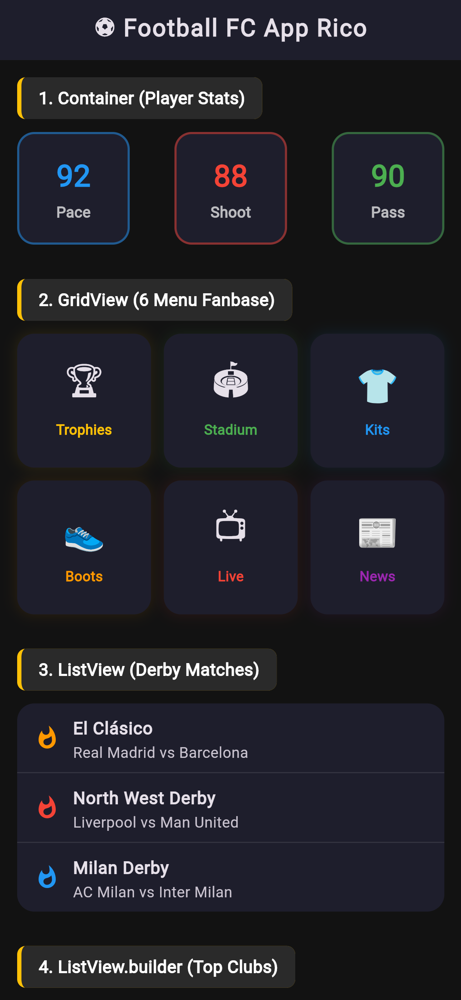
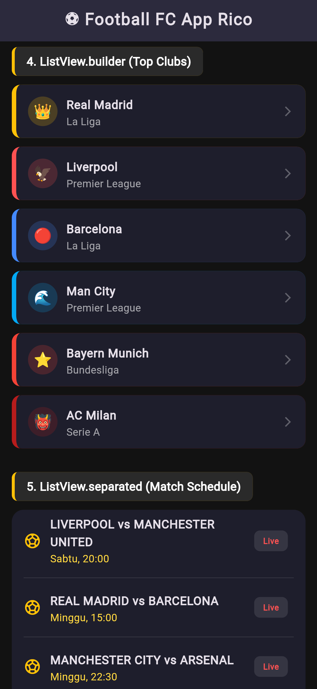
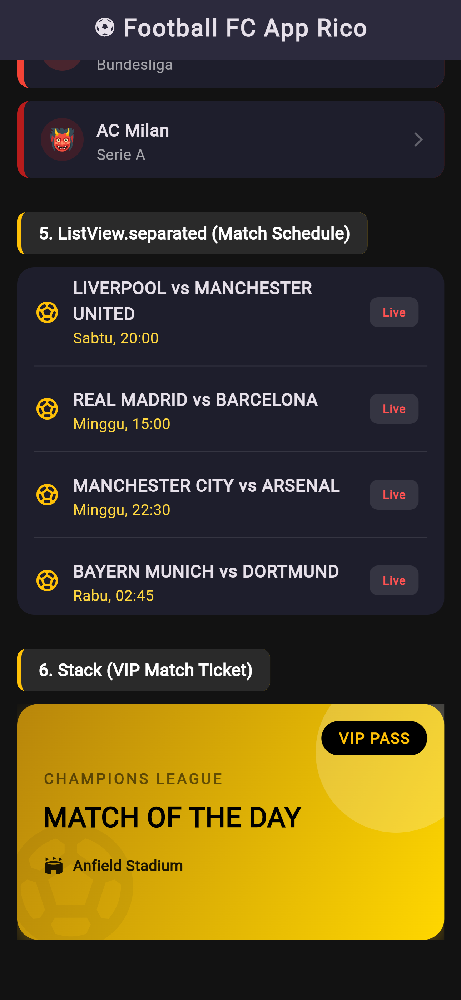

<div align="center">
   <h2>LAPORAN PRAKTIKUM<br>APLIKASI BERBASIS PLATFORM</h2>
   <h>
   <br>
   <h4>MODUL 03, 04 Mobile<br>Widget UI</h4>
   <br>
   
   <br><br>
 
**Disusun Oleh :**<br>
RICO ADE PRATAMA<br>
2311102138<br>
PS1IF-11-REG01
<br><br>
 
**Dosen Pengampu :**<br>
Dimas Fanny Hebrasianto Permadi, S.ST., M.Kom
<br><br>
 
**Assisten Praktikum :**<br>
Apri Pandu Wicaksono
<br>Rangga Pradarrell Fathi
<br><br>
 
PROGRAM STUDI S1 TEKNIK INFORMATIKA<br>
FAKULTAS INFORMATIKA<br>
UNIVERSITAS TELKOM PURWOKERTO<br>
2026

</div>

---

## 1. Dasar Teori

**Modul 3 (Pengenalan Widget dan Layout Dasar)**<br>
Pada pemrograman Flutter, konsep utama yang harus dipahami adalah "Everything is a Widget" (Segala sesuatunya adalah Widget). Widget merupakan blok pembangun dasar dari antarmuka pengguna (UI) pada aplikasi Flutter.

1. Konsep Dasar Widget
   Widget mendeskripsikan bagaimana tampilan aplikasi seharusnya terlihat berdasarkan konfigurasi dan state (status) saat ini. Ketika terjadi perubahan state, Flutter akan membandingkan widget lama dan baru, lalu memperbarui tampilan secara efisien. Terdapat dua jenis utama widget:
   - Stateless Widget: Widget yang tidak memiliki state internal yang bisa berubah setelah diinisialisasi. Cocok untuk tampilan statis seperti teks, ikon, atau tombol yang tidak berubah bentuk.

   - Stateful Widget: Widget yang sifatnya dinamis dan dapat berubah sewaktu-waktu selama aplikasi berjalan (misalnya karena interaksi pengguna atau penerimaan data dari internet).

2. Kerangka Aplikasi (MaterialApp & Scaffold)
   - MaterialApp: Widget pembungkus utama (biasanya di root aplikasi) yang menyediakan konfigurasi tema, navigasi (routing), dan standar desain Material Google.

   - Scaffold: Merupakan kerangka dasar visual dari Material Design. Scaffold menyediakan struktur tata letak default yang memiliki ruang untuk AppBar (header), body (konten utama), FloatingActionButton, hingga BottomNavigationBar.

3. Layouting Dasar (Row & Column)
   Untuk mengatur posisi banyak widget sekaligus, Flutter menggunakan widget layout:
   - Column: Menyusun anak-anak widget-nya (children) secara vertikal (dari atas ke bawah).

   - Row: Menyusun anak-anak widget-nya secara horizontal (dari kiri ke kanan).

**Modul 4 (Widget Lanjutan dan Pengelolaan Data)**<br>
Modul ini berfokus pada implementasi tata letak yang lebih kompleks, pengaturan ruang, serta bagaimana menangani daftar data yang panjang (scrolling behavior) secara efisien.

1. Container
   Container adalah widget yang paling sering digunakan untuk membungkus (wrapper) widget lain agar dapat diberikan gaya (styling). Container memungkinkan pengembang untuk mengatur width (lebar), height (tinggi), padding (jarak ke dalam), margin (jarak ke luar), warna latar belakang, serta dekorasi seperti sudut melengkung (border radius) dan bayangan (box shadow).

2. Menangani Data List (ListView)
   ListView adalah widget fundamental untuk membuat daftar elemen yang dapat di-scroll secara vertikal maupun horizontal. Terdapat beberapa variasi ListView berdasarkan kebutuhan:
   - ListView Standard: Cocok untuk menampilkan daftar item statis yang jumlahnya sedikit.

   - ListView.builder: Sangat efisien untuk menampilkan data dinamis (array/list) dalam jumlah besar. Widget ini hanya akan merender item yang saat itu terlihat di layar, sehingga sangat menghemat penggunaan memori perangkat.

   - ListView.separated: Memiliki fungsi yang sama dengan builder, namun dilengkapi dengan parameter separatorBuilder yang memungkinkan penyisipan widget pemisah (seperti garis Divider) di antara setiap item secara otomatis.

3. Tampilan Kisi (GridView)
   GridView digunakan untuk menampilkan sekumpulan data dalam tata letak kisi 2D (baris dan kolom) yang dapat di-scroll. GridView.count memungkinkan pengembang untuk menentukan jumlah kolom secara pasti (crossAxisCount), sehingga sangat cocok untuk membuat menu dashboard atau galeri foto.

4. Tampilan Bertumpuk (Stack & Positioned)
   Berbeda dengan Row atau Column yang menyusun elemen secara berurutan, Stack digunakan untuk menumpuk elemen secara z-axis (depan dan belakang).
   - Anak widget pertama di dalam Stack akan diletakkan di lapisan paling dasar (paling belakang).

   - Anak widget berikutnya akan menimpa widget sebelumnya.

   - Widget Positioned sering dikombinasikan di dalam Stack untuk memosisikan widget secara absolut (mengatur jarak spesifik dari atas, bawah, kiri, atau kanan layar).

## 2. Kode Program Unguided

📝 Tugas Praktikum Modul 4 Flutter

Buat 1 project Flutter yang menampilkan beberapa widget UI berikut:<br>
🔹 Yang harus ada:<br>
Container → kotak berwarna<br>
GridView → minimal 6 item (grid)<br>
ListView → 3 item (A, B, C)<br>
ListView.builder → list dari data array<br>
ListView.separated → list + garis pembatas<br>
Stack → tampilan bertumpuk (kotak / text)<br>

📦 Output yang dikumpulkan:<br>
Screenshot hasilnya<br>
Source code<br>
Penjelasan singkat tiap widget

### Struktur Project

```php
modul_03_04_mobile_2311102138/  # Folder utama proyek Flutter
│   └── lib/                # Direktori utama penyimpanan kode Dart
│       └── main.dart       # Titik awal eksekusi program
```

### Kode main.dart (Folder lib)

```dart
import 'package:flutter/material.dart';

void main() {
  runApp(const MyApp());
}

class MyApp extends StatelessWidget {
  const MyApp({super.key});

  @override
  Widget build(BuildContext context) {
    return MaterialApp(
      title: 'Modul 03 04 Mobile_2311102138_Rico Ade Pratama',
      debugShowCheckedModeBanner: false,
      // Menggunakan tema gelap (Dark Mode) agar lebih sporty dan modern
      theme: ThemeData.dark().copyWith(
        scaffoldBackgroundColor: const Color(0xFF121212),
        primaryColor: Colors.amberAccent,
        appBarTheme: const AppBarTheme(
          backgroundColor: Color(0xFF1E1E2C),
          elevation: 0,
          centerTitle: true,
        ),
      ),
      home: const HomePage(),
    );
  }
}

// ─────────────────────────────────────────
// Data untuk ListView.builder (Tema Klub Sepak Bola)
// ─────────────────────────────────────────
final List<Map<String, dynamic>> clubList = [
  {
    'nama': 'Real Madrid',
    'logo': '👑',
    'warna': Colors.amber,
    'liga': 'La Liga',
  },
  {
    'nama': 'Liverpool',
    'logo': '🦅',
    'warna': Colors.redAccent,
    'liga': 'Premier League',
  },
  {
    'nama': 'Barcelona',
    'logo': '🔴',
    'warna': Colors.blueAccent,
    'liga': 'La Liga',
  },
  {
    'nama': 'Man City',
    'logo': '🌊',
    'warna': Colors.lightBlue,
    'liga': 'Premier League',
  },
  {
    'nama': 'Bayern Munich',
    'logo': '⭐',
    'warna': Colors.red,
    'liga': 'Bundesliga',
  },
  {
    'nama': 'AC Milan',
    'logo': '👹',
    'warna': Colors.red.shade900,
    'liga': 'Serie A',
  },
];

// ─────────────────────────────────────────
// HomePage — semua widget di satu halaman
// ─────────────────────────────────────────
class HomePage extends StatelessWidget {
  const HomePage({super.key});

  @override
  Widget build(BuildContext context) {
    return Scaffold(
      appBar: AppBar(
        title: const Text(
          '⚽ Football FC App Rico',
          style: TextStyle(fontWeight: FontWeight.w900, letterSpacing: 1.2),
        ),
      ),
      body: SingleChildScrollView(
        padding: const EdgeInsets.all(16),
        child: Column(
          crossAxisAlignment: CrossAxisAlignment.start,
          children: [
            // ══════════════════════════════
            // 1. CONTAINER (Statistik Pemain)
            // ══════════════════════════════
            _sectionTitle('1. Container (Player Stats)'),
            const SizedBox(height: 12),
            Row(
              mainAxisAlignment: MainAxisAlignment.spaceBetween,
              children: [
                _buildStatContainer('Pace', '92', Colors.blue),
                _buildStatContainer('Shoot', '88', Colors.red),
                _buildStatContainer('Pass', '90', Colors.green),
              ],
            ),

            const SizedBox(height: 32),

            // ══════════════════════════════
            // 2. GRIDVIEW (Menu Aplikasi Sepak Bola)
            // ══════════════════════════════
            _sectionTitle('2. GridView (6 Menu Fanbase)'),
            const SizedBox(height: 12),
            GridView.count(
              crossAxisCount: 3,
              shrinkWrap: true,
              physics: const NeverScrollableScrollPhysics(),
              crossAxisSpacing: 12,
              mainAxisSpacing: 12,
              childAspectRatio: 1.0,
              children: [
                _gridItem('🏆', 'Trophies', Colors.amber),
                _gridItem('🏟️', 'Stadium', Colors.green),
                _gridItem('👕', 'Kits', Colors.blue),
                _gridItem('👟', 'Boots', Colors.orange),
                _gridItem('📺', 'Live', Colors.red),
                _gridItem('📰', 'News', Colors.purple),
              ],
            ),

            const SizedBox(height: 32),

            // ══════════════════════════════
            // 3. LISTVIEW (3 item statis: Match Ikonik)
            // ══════════════════════════════
            _sectionTitle('3. ListView (Derby Matches)'),
            const SizedBox(height: 12),
            Container(
              decoration: BoxDecoration(
                color: const Color(0xFF1E1E2C),
                borderRadius: BorderRadius.circular(16),
              ),
              child: ListView(
                shrinkWrap: true,
                physics: const NeverScrollableScrollPhysics(),
                children: const [
                  ListTile(
                    leading: Icon(Icons.whatshot, color: Colors.orange),
                    title: Text(
                      'El Clásico',
                      style: TextStyle(fontWeight: FontWeight.bold),
                    ),
                    subtitle: Text('Real Madrid vs Barcelona'),
                  ),
                  Divider(height: 1, color: Colors.white10),
                  ListTile(
                    leading: Icon(Icons.whatshot, color: Colors.red),
                    title: Text(
                      'North West Derby',
                      style: TextStyle(fontWeight: FontWeight.bold),
                    ),
                    subtitle: Text('Liverpool vs Man United'),
                  ),
                  Divider(height: 1, color: Colors.white10),
                  ListTile(
                    leading: Icon(Icons.whatshot, color: Colors.blue),
                    title: Text(
                      'Milan Derby',
                      style: TextStyle(fontWeight: FontWeight.bold),
                    ),
                    subtitle: Text('AC Milan vs Inter Milan'),
                  ),
                ],
              ),
            ),

            const SizedBox(height: 32),

            // ══════════════════════════════
            // 4. LISTVIEW.BUILDER (Daftar Klub)
            // ══════════════════════════════
            _sectionTitle('4. ListView.builder (Top Clubs)'),
            const SizedBox(height: 12),
            ListView.builder(
              shrinkWrap: true,
              physics: const NeverScrollableScrollPhysics(),
              itemCount: clubList.length,
              itemBuilder: (context, index) {
                final club = clubList[index];
                return Container(
                  margin: const EdgeInsets.only(bottom: 12),
                  decoration: BoxDecoration(
                    color: const Color(0xFF1E1E2C),
                    borderRadius: BorderRadius.circular(12),
                    border: Border(
                      left: BorderSide(color: club['warna'], width: 6),
                    ),
                  ),
                  child: ListTile(
                    contentPadding: const EdgeInsets.symmetric(
                      horizontal: 16,
                      vertical: 4,
                    ),
                    leading: CircleAvatar(
                      backgroundColor: (club['warna'] as Color).withOpacity(
                        0.2,
                      ),
                      child: Text(
                        club['logo'],
                        style: const TextStyle(fontSize: 20),
                      ),
                    ),
                    title: Text(
                      club['nama'],
                      style: const TextStyle(
                        fontWeight: FontWeight.bold,
                        fontSize: 16,
                      ),
                    ),
                    subtitle: Text(
                      club['liga'],
                      style: const TextStyle(color: Colors.white60),
                    ),
                    trailing: const Icon(
                      Icons.arrow_forward_ios,
                      size: 16,
                      color: Colors.white30,
                    ),
                  ),
                );
              },
            ),

            const SizedBox(height: 20),

            // ══════════════════════════════
            // 5. LISTVIEW.SEPARATED (Jadwal Liga)
            // ══════════════════════════════
            _sectionTitle('5. ListView.separated (Match Schedule)'),
            const SizedBox(height: 12),
            Container(
              decoration: BoxDecoration(
                color: const Color(0xFF1E1E2C),
                borderRadius: BorderRadius.circular(16),
              ),
              child: ListView.separated(
                shrinkWrap: true,
                physics: const NeverScrollableScrollPhysics(),
                itemCount: 4,
                separatorBuilder: (context, index) => const Divider(
                  color: Colors.white10,
                  thickness: 1,
                  indent: 16,
                  endIndent: 16,
                ),
                itemBuilder: (context, index) {
                  final days = [
                    'Sabtu, 20:00',
                    'Minggu, 15:00',
                    'Minggu, 22:30',
                    'Rabu, 02:45',
                  ];
                  final teams = [
                    'LIVERPOOL vs MANCHESTER UNITED',
                    'REAL MADRID vs BARCELONA',
                    'MANCHESTER CITY vs ARSENAL',
                    'BAYERN MUNICH vs DORTMUND',
                  ];
                  return ListTile(
                    leading: const Icon(
                      Icons.sports_soccer,
                      color: Colors.amber,
                    ),
                    title: Text(
                      teams[index],
                      style: const TextStyle(fontWeight: FontWeight.w900),
                    ),
                    subtitle: Text(
                      days[index],
                      style: const TextStyle(color: Colors.amberAccent),
                    ),
                    trailing: Container(
                      padding: const EdgeInsets.symmetric(
                        horizontal: 12,
                        vertical: 6,
                      ),
                      decoration: BoxDecoration(
                        color: Colors.white10,
                        borderRadius: BorderRadius.circular(8),
                      ),
                      child: const Text(
                        'Live',
                        style: TextStyle(
                          color: Colors.redAccent,
                          fontWeight: FontWeight.bold,
                        ),
                      ),
                    ),
                  );
                },
              ),
            ),

            const SizedBox(height: 32),

            // ══════════════════════════════
            // 6. STACK (Tiket VIP Pertandingan)
            // ══════════════════════════════
            _sectionTitle('6. Stack (VIP Match Ticket)'),
            const SizedBox(height: 12),
            Center(
              child: SizedBox(
                width: double.infinity,
                height: 220,
                child: Stack(
                  children: [
                    // Layer 1: Background Gradient Card
                    Container(
                      decoration: BoxDecoration(
                        gradient: const LinearGradient(
                          colors: [
                            Color(0xFFB8860B),
                            Color(0xFFFFD700),
                          ], // Warna Gold
                          begin: Alignment.topLeft,
                          end: Alignment.bottomRight,
                        ),
                        borderRadius: BorderRadius.circular(20),
                        boxShadow: [
                          BoxShadow(
                            color: Colors.amber.withOpacity(0.3),
                            blurRadius: 15,
                            offset: const Offset(0, 8),
                          ),
                        ],
                      ),
                    ),
                    // Layer 2: Ornamen Abstrak (Lingkaran)
                    Positioned(
                      right: -30,
                      top: -30,
                      child: Container(
                        width: 150,
                        height: 150,
                        decoration: BoxDecoration(
                          color: Colors.white.withOpacity(0.2),
                          shape: BoxShape.circle,
                        ),
                      ),
                    ),
                    // Layer 3: Watermark Bola Besar
                    Positioned(
                      left: -20,
                      bottom: -20,
                      child: Icon(
                        Icons.sports_soccer,
                        size: 140,
                        color: Colors.black.withOpacity(0.05),
                      ),
                    ),
                    // Layer 4: Konten Teks
                    Padding(
                      padding: const EdgeInsets.all(24.0),
                      child: Column(
                        crossAxisAlignment: CrossAxisAlignment.start,
                        mainAxisAlignment: MainAxisAlignment.center,
                        children: [
                          const Text(
                            'CHAMPIONS LEAGUE',
                            style: TextStyle(
                              color: Colors.black54,
                              fontWeight: FontWeight.bold,
                              letterSpacing: 2,
                            ),
                          ),
                          const SizedBox(height: 8),
                          const Text(
                            'MATCH OF THE DAY',
                            style: TextStyle(
                              color: Colors.black,
                              fontSize: 26,
                              fontWeight: FontWeight.w900,
                            ),
                          ),
                          const SizedBox(height: 16),
                          Row(
                            children: [
                              const Icon(
                                Icons.stadium,
                                color: Colors.black87,
                                size: 20,
                              ),
                              const SizedBox(width: 8),
                              const Text(
                                'Anfield Stadium',
                                style: TextStyle(
                                  color: Colors.black87,
                                  fontWeight: FontWeight.bold,
                                ),
                              ),
                            ],
                          ),
                        ],
                      ),
                    ),
                    // Layer 5: Badge VIP di pojok kanan atas
                    Positioned(
                      top: 16,
                      right: 16,
                      child: Container(
                        padding: const EdgeInsets.symmetric(
                          horizontal: 16,
                          vertical: 6,
                        ),
                        decoration: BoxDecoration(
                          color: Colors.black,
                          borderRadius: BorderRadius.circular(20),
                        ),
                        child: const Text(
                          'VIP PASS',
                          style: TextStyle(
                            color: Colors.amber,
                            fontWeight: FontWeight.bold,
                            letterSpacing: 1,
                          ),
                        ),
                      ),
                    ),
                  ],
                ),
              ),
            ),

            const SizedBox(height: 40),
          ],
        ),
      ),
    );
  }

  // ─────────────────────────────────────────
  // Helper Widgets
  // ─────────────────────────────────────────

  // Helper untuk Judul Section
  Widget _sectionTitle(String title) {
    return Container(
      padding: const EdgeInsets.symmetric(horizontal: 16, vertical: 8),
      decoration: BoxDecoration(
        color: Colors.white10,
        borderRadius: BorderRadius.circular(8),
        border: const Border(left: BorderSide(color: Colors.amber, width: 4)),
      ),
      child: Text(
        title,
        style: const TextStyle(
          color: Colors.white,
          fontWeight: FontWeight.bold,
          fontSize: 16,
        ),
      ),
    );
  }

  // Helper untuk Container Statistik
  Widget _buildStatContainer(String label, String value, Color color) {
    return Container(
      width: 105,
      height: 105,
      decoration: BoxDecoration(
        color: const Color(0xFF1E1E2C),
        borderRadius: BorderRadius.circular(16),
        border: Border.all(color: color.withOpacity(0.5), width: 2),
      ),
      child: Column(
        mainAxisAlignment: MainAxisAlignment.center,
        children: [
          Text(
            value,
            style: TextStyle(
              color: color,
              fontSize: 28,
              fontWeight: FontWeight.w900,
            ),
          ),
          const SizedBox(height: 4),
          Text(
            label,
            style: const TextStyle(
              color: Colors.white70,
              fontWeight: FontWeight.bold,
            ),
          ),
        ],
      ),
    );
  }

  // Helper untuk Item GridView
  Widget _gridItem(String emoji, String label, Color color) {
    return Container(
      decoration: BoxDecoration(
        color: const Color(0xFF1E1E2C),
        borderRadius: BorderRadius.circular(16),
        boxShadow: [
          BoxShadow(
            color: color.withOpacity(0.1),
            blurRadius: 10,
            spreadRadius: 1,
          ),
        ],
      ),
      child: Column(
        mainAxisAlignment: MainAxisAlignment.center,
        children: [
          Text(emoji, style: const TextStyle(fontSize: 32)),
          const SizedBox(height: 8),
          Text(
            label,
            style: TextStyle(
              color: color,
              fontWeight: FontWeight.w800,
              fontSize: 13,
            ),
          ),
        ],
      ),
    );
  }
}

```

### Hasil Output





### Penjelasan Kode

Program ini merupakan kode untuk membangun antarmuka aplikasi Flutter yang mengimplementasikan berbagai macam widget UI, bertema Football FC App Rico.

Penjelasan Singkat Tiap Widget:

1. `Container`<br>
   Merupakan widget dasar yang berfungsi seperti sebuah "kotak pembungkus" yang dapat dikustomisasi bentuk visualnya. Pada project ini, `Container` digunakan untuk membuat kotak Statistik Pemain (Pace, Shoot, Pass). Melalui properti `BoxDecoration`, widget ini diberikan warna latar belakang, sudut yang melengkung (border radius), serta garis tepi (border) berwarna.

2. `GridView`<br>
   Widget tata letak yang menyusun elemen-elemen di dalamnya ke dalam bentuk grid (baris dan kolom). Pada kode ini digunakan `GridView.count` dengan properti `crossAxisCount: 3`, yang artinya layar dibagi menjadi 3 kolom secara rata untuk menampilkan 6 ikon menu aplikasi secara rapi (Trophies, Stadium, Kits, dll).

3. `ListView (Biasa)`<br>
   Widget fundamental untuk membuat daftar elemen vertikal yang bisa di-scroll. `ListView` biasa ini digunakan pada bagian Derby Matches karena data yang ditampilkan bersifat statis, ditulis secara manual di dalam kode, dan jumlahnya sedikit (hanya 3 item pertandingan derby).

4. `ListView.builder`<br>
   Versi efisien dari `ListView` yang digunakan untuk merender data dinamis dalam bentuk array atau list. Pada project ini, `ListView.builder` digunakan untuk membaca array `clubList` dan menampilkannya sebagai daftar Top Clubs. Widget ini menghemat memori karena hanya membangun (build) item yang sedang terlihat di layar pengguna saja.

5. `ListView.separated`<br>
   Memiliki cara kerja yang sama persis dengan `ListView.builder`, namun memiliki fitur tambahan berupa penyekat antar baris. Pada bagian Match Schedule, widget ini menggunakan parameter wajib `separatorBuilder` untuk menyisipkan widget `Divider` (garis pembatas putih transparan) secara otomatis di antara setiap item jadwal pertandingan.

6. `Stack`<br>
   Widget tata letak unik yang tidak menyusun elemen secara vertikal atau horizontal, melainkan menumpuknya dari belakang ke depan (z-axis). Pada bagian VIP Match Ticket, `Stack` digunakan untuk menumpuk warna latar belakang gradien emas di lapisan terbawah, menimpanya dengan ikon bola transparan (sebagai watermark), meletakkan teks di atasnya, dan menempatkan label hitam "VIP PASS" di lapisan paling depan pada pojok kanan atas layar.

## 3. Kesimpulan dan Penutup

Tugas Praktikum Modul 03 dan 04 ini mengimplementasikan tata letak antarmuka aplikasi mobile menggunakan widget lanjutan Flutter. Fokus utamanya adalah penyusunan komponen visual yang responsif dan terstruktur melalui kombinasi Container, GridView, variasi ListView, serta Stack. Cocok digunakan sebagai pembelajaran praktikum bagi mahasiswa program studi Informatika untuk merancang UI aplikasi modern.

## 4. Referensi

- [1] [Materi Modul 03, 04 Mobile](https://telkomuniversityofficial-my.sharepoint.com/personal/dimasfhp_telkomuniversity_ac_id/_layouts/15/onedrive.aspx?id=%2Fpersonal%2Fdimasfhp_telkomuniversity_ac_id%2FDocuments%2FAplikasi+Berbasis+Platform%2FMODUL+PRAKTIKUM+Pemrograman+Perangkat+Bergerak+2024.pdf&parent=%2Fpersonal%2Fdimasfhp_telkomuniversity_ac_id%2FDocuments%2FAplikasi+Berbasis+Platform&ga=1)
