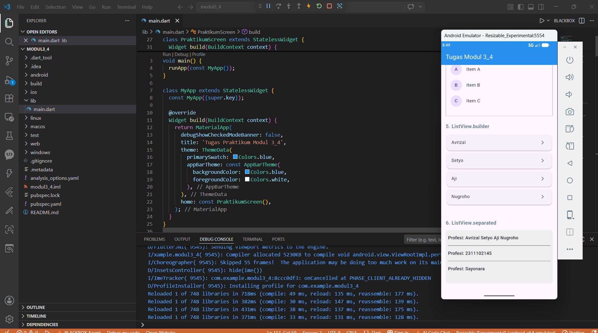

<div align="center">
  <br />
  <h1>LAPORAN PRAKTIKUM</h1>
  <h2>APLIKASI BERBASIS PLATFORM</h2>
  <br />
  <h3>Flutter Modul3&4</h3>
  <br />
  <br />
  
  <br />
  <br />
  <h3>Disusun Oleh :</h3>
  <p>
    <strong>AVRIZAL SETYO AJI NUGROHO</strong><br>
    <strong>2311102145</strong><br>
    <strong>S1 IF-11-REG01</strong>
  </p>
  <br />
  <h3>Dosen Pengampu :</h3>
  <p>
    <strong>Dimas Fanny Hebrasianto Permadi, S.ST., M.Kom</strong>
  </p>
  <br />
  <h4>Asisten Praktikum :</h4>
  <p>
    <strong>Apri Pandu Wicaksono</strong><br>
    <strong>Rangga Pradarrell Fathi</strong>
  </p>
  <br />
  <h3>
    LABORATORIUM HIGH PERFORMANCE<br>
    FAKULTAS INFORMATIKA<br>
    UNIVERSITAS TELKOM PURWOKERTO<br>
    2026
  </h3>
</div>

---

## 1. Dasar Teori

Widget merupakan unit fundamental dalam pengembangan antarmuka pengguna (UI) menggunakan Flutter. Hampir seluruh elemen di Flutter adalah widget, mencakup komponen struktural (seperti tombol dan teks), komponen tata letak (seperti padding dan margin), hingga komponen efek visual.

Berikut adalah ringkasan konsep dasar untuk 6 widget UI utama dalam Flutter:

* **Container**: Sebuah kotak serbaguna untuk mengatur tata letak dan dekorasi. Digunakan untuk membuat kotak berwarna, mengatur ukuran (panjang/lebar), jarak (padding/margin), dan bentuk sudut (border radius).
* **GridView**: Widget untuk menampilkan data dalam bentuk kisi-kisi (grid) 2 dimensi (baris dan kolom). Sangat cocok untuk menampilkan galeri atau menu yang berisi banyak elemen (misal: 6 item atau lebih) secara proporsional.
* **ListView**: Daftar statis yang dapat digulir (scrollable) secara vertikal atau horizontal. Digunakan jika item yang ditampilkan jumlahnya sedikit dan sudah pasti (misal: hanya 3 item A, B, dan C).
* **ListView.builder**: Versi dinamis dari ListView. Digunakan untuk membuat daftar dari data array/list. Widget ini sangat hemat memori karena hanya memuat item yang sedang terlihat di layar (lazy loading).
* **ListView.separated**: Fungsinya sama persis dengan ListView.builder, namun memiliki fitur tambahan otomatis untuk menyisipkan garis pembatas (divider) atau jarak di antara setiap item list.
* **Stack**: Widget untuk menyusun elemen secara bertumpuk (sumbu Z). Elemen pertama berada di urutan paling bawah (background), dan elemen berikutnya akan menumpuk di atasnya (misal: teks di atas kotak berwarna).

---

## 2. Penjelasan Kode

### 2.1 container

```dart
const SectionTitle(title: '1. Container'),
            Container(
              height: 80,
              width: double.infinity,
              decoration: BoxDecoration(
                color: Colors.blueAccent,
                borderRadius: BorderRadius.circular(15),
              ),
              alignment: Alignment.center,
              child: const Text(
                'Ini adalah Container Berwarna',
                style: TextStyle(
                  color: Colors.white,
                  fontSize: 16,
                  fontWeight: FontWeight.bold,
                ),
              ),
            ),
            const SizedBox(height: 24),
```
penjelasan
Container: Merupakan widget dasar serbaguna layaknya "kotak kosong". Digunakan untuk mengatur tata letak, ukuran (width/height), memberi padding dan margin, serta memberikan dekorasi seperti warna background atau sudut yang melengkung (border radius).
### 2.2 stack

```dart
const SectionTitle(title: '2. Stack'),
            Center(
              child: Stack(
                alignment: Alignment.center,
                children: [
                  Container(
                    width: 150,
                    height: 150,
                    decoration: BoxDecoration(
                      color: Colors.amber,
                      borderRadius: BorderRadius.circular(10),
                    ),
                  ),
                  Container(
                    width: 100,
                    height: 100,
                    decoration: const BoxDecoration(
                      color: Colors.redAccent,
                      shape: BoxShape.circle,
                    ),
                  ),
                  const Text(
                    'Stack Cihuy',
                    style: TextStyle(
                      color: Colors.white,
                      fontWeight: FontWeight.bold,
                    ),
                  ),
                ],
              ),
            ),
            const SizedBox(height: 24),
```
penjelasan
Stack: Widget yang memungkinkan kita untuk menempatkan beberapa widget secara bertumpuk (sepanjang sumbu Z). Widget yang ditulis pertama di dalam children akan berada di lapisan paling bawah (background), sedangkan yang terakhir akan berada di posisi paling atas (foreground).
### 2.3 gridview

```dart
 const SectionTitle(title: '3. GridView'),
            GridView.count(
              shrinkWrap: true, // Wajib jika di dalam SingleChildScrollView
              physics:
                  const NeverScrollableScrollPhysics(), // Scroll mengikuti layar utama
              crossAxisCount: 3,
              crossAxisSpacing: 10,
              mainAxisSpacing: 10,
              children: List.generate(6, (index) {
                return Container(
                  color: Colors.teal[(index % 9 + 1) * 100],
                  alignment: Alignment.center,
                  child: Text(
                    'Grid ${index + 1}',
                    style: const TextStyle(fontWeight: FontWeight.bold),
                  ),
                );
              }),
            ),
            const SizedBox(height: 24),
```
penjelasan
GridView: Digunakan untuk menampilkan sekumpulan widget (biasanya list data) dalam bentuk grid (dua dimensi, yaitu baris dan kolom). Pada kode di atas digunakan GridView.count untuk menentukan jumlah kolom secara spesifik (3 kolom).
### 2.4 List View

```dart
const SectionTitle(title: '4. ListView Biasa'),
            Container(
              decoration: BoxDecoration(border: Border.all(color: Colors.grey)),
              child: ListView(
                shrinkWrap: true,
                physics: const NeverScrollableScrollPhysics(),
                children: const [
                  ListTile(
                    leading: CircleAvatar(child: Text('A')),
                    title: Text('Item A'),
                  ),
                  ListTile(
                    leading: CircleAvatar(child: Text('B')),
                    title: Text('Item B'),
                  ),
                  ListTile(
                    leading: CircleAvatar(child: Text('C')),
                    title: Text('Item C'),
                  ),
                ],
              ),
            ),
            const SizedBox(height: 24),
```
penjelasan
ListView: Widget dasar untuk menampilkan daftar item secara berurutan yang dapat di-scroll. Cocok digunakan jika jumlah datanya sedikit (statis), karena semua item akan dimuat ke memori sekaligus.
### 2.4 List View.builder

```dart
const SectionTitle(title: '5. ListView.builder'),
            ListView.builder(
              shrinkWrap: true,
              physics: const NeverScrollableScrollPhysics(),
              itemCount: dataBuilder.length,
              itemBuilder: (context, index) {
                return Card(
                  elevation: 2,
                  child: ListTile(
                    title: Text(dataBuilder[index]),
                    trailing: const Icon(Icons.arrow_forward_ios, size: 16),
                  ),
                );
              },
            ),
            const SizedBox(height: 24),
```
penjelasan
ListView.builder: Digunakan untuk membuat list data yang dinamis dan panjang (berasal dari array/database). Widget ini sangat optimal karena menggunakan konsep lazy loading, di mana item hanya akan di-render (dimuat ke memori) ketika muncul di layar.
### 2.4 List View.separated

```dart
const SectionTitle(title: '6. ListView.separated'),
            Container(
              padding: const EdgeInsets.all(8),
              decoration: BoxDecoration(
                color: Colors.grey.shade200,
                borderRadius: BorderRadius.circular(10),
              ),
              child: ListView.separated(
                shrinkWrap: true,
                physics: const NeverScrollableScrollPhysics(),
                itemCount: dataSeparated.length,
                separatorBuilder: (context, index) =>
                    const Divider(color: Colors.black54, thickness: 1),
                itemBuilder: (context, index) {
                  return Padding(
                    padding: const EdgeInsets.symmetric(vertical: 8.0),
                    child: Text(
                      'Profesi: ${dataSeparated[index]}',
                      style: const TextStyle(
                        fontSize: 16,
                        fontWeight: FontWeight.w500,
                      ),
                    ),
                  );
                },
              ),
            ),
            const SizedBox(height: 40),
```
penjelasan
ListView.separated: Memiliki fungsi dan performa yang sama dengan ListView.builder, namun memiliki fitur tambahan separatorBuilder. Fitur ini secara otomatis membuat widget pemisah (contohnya garis Divider) di antara tiap item list.

---

## 3. Screenshot Hasil



---

## 4. Referensi

- Dart: [https://dart.dev](https://dart.dev)
- Flutter Docs: [https://docs.flutter.dev](https://docs.flutter.dev)
