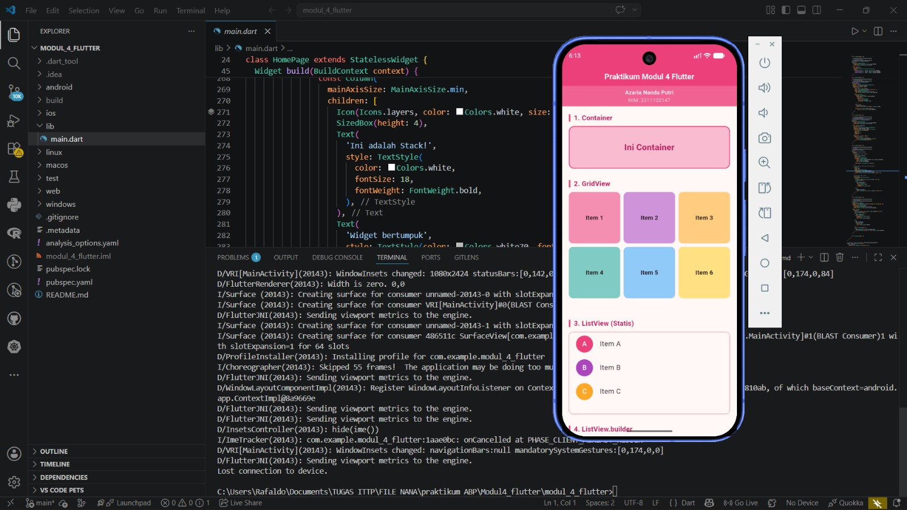
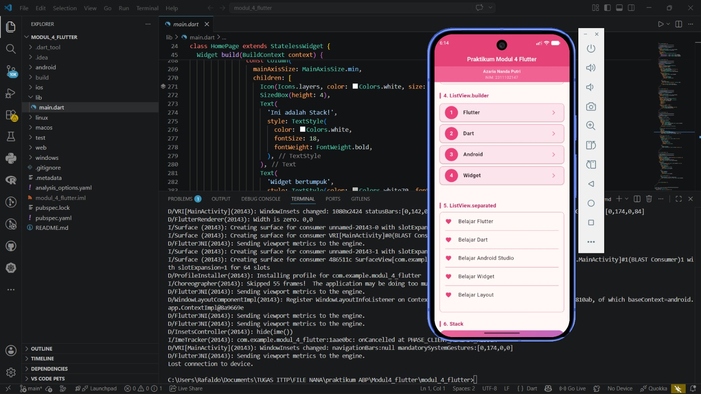
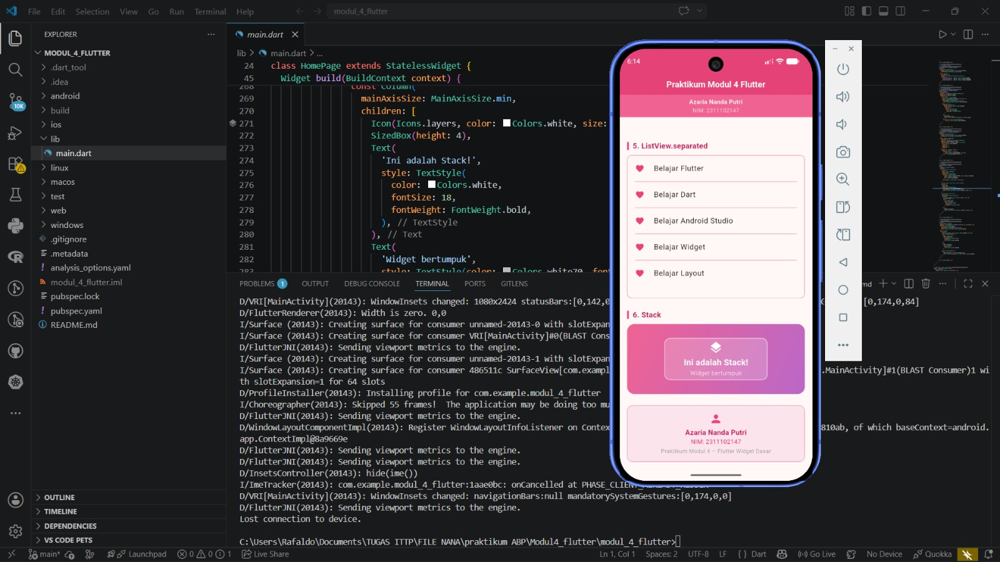

<div align="center">
  <br />
  <h1>LAPORAN PRAKTIKUM <br>APLIKASI BERBASIS PLATFORM</h1>
  <br />
  <h2>MODUL 4 FLUTTER WIDGET<br></h2>
  <br /><br />

  

  <br /><br /><br />

  <h3>Disusun Oleh :</h3>

  <p>
    <strong>Azaria Nanda Putri</strong><br>
    <strong>2311102147</strong><br>
    <strong>S1 IF-11-REG 01</strong>
  </p>

  <br />

  <h3>Dosen Pengampu :</h3>

  <p>
    <strong>Dimas Fanny Hebrasianto Permadi, S.ST., M.Kom</strong>
  </p>

  <br /><br />

  <h4>Asisten Praktikum :</h4>

  <p>
    <strong>Apri Pandu Wicaksono</strong><br>
    <strong>Rangga Pradarrell Fathi</strong>
  </p>

  <br />

  <h2>
  LABORATORIUM HIGH PERFORMANCE <br>
  FAKULTAS INFORMATIKA <br>
  UNIVERSITAS TELKOM PURWOKERTO <br>
  2026
  </h2>
</div>

---

## 1. Pendahuluan

Flutter merupakan framework yang digunakan untuk membangun aplikasi multiplatform dengan satu basis kode. Dalam pengembangan aplikasi Flutter, tampilan antarmuka dibangun menggunakan susunan widget. Widget menjadi komponen utama yang membentuk elemen visual seperti teks, tombol, daftar, kotak, ikon, layout, hingga struktur halaman aplikasi.

Pada praktikum ini, fokus utama kegiatan adalah mencoba membuat beberapa widget UI dasar pada Flutter. Widget yang digunakan antara lain `Container`, `GridView`, `ListView`, `ListView.builder`, `ListView.separated`, dan `Stack`. Selain itu, aplikasi juga menggunakan beberapa widget pendukung seperti `MaterialApp`, `Scaffold`, `AppBar`, `SingleChildScrollView`, `Column`, `Text`, `Card`, `ListTile`, `CircleAvatar`, `Icon`, `Divider`, dan `SizedBox`.

Aplikasi yang dibuat menggunakan tema warna pink dan menampilkan identitas praktikan, yaitu Azaria Nanda Putri dengan NIM 2311102147. Identitas tersebut ditampilkan pada bagian bawah `AppBar` dan juga pada bagian footer aplikasi.

---

## 2. Tujuan Praktikum

Tujuan dari praktikum ini adalah sebagai berikut.

1. Memahami konsep dasar pembuatan antarmuka aplikasi menggunakan Flutter.
2. Mengetahui fungsi beberapa widget UI dasar pada Flutter.
3. Mampu membuat tampilan aplikasi menggunakan `Container`, `GridView`, `ListView`, dan `Stack`.
4. Mampu menggunakan `SingleChildScrollView` agar halaman dapat digulir.
5. Mampu membedakan penggunaan `ListView` statis, `ListView.builder`, dan `ListView.separated`.
6. Mampu membuat tampilan aplikasi yang memuat identitas praktikan.
7. Mampu menggunakan helper function untuk membuat kode lebih rapi dan mudah dipahami.

---

## 3. Dasar Teori

### 3.1 Flutter

Flutter adalah framework UI yang digunakan untuk membangun aplikasi pada berbagai platform, seperti Android, iOS, web, dan desktop. Flutter menggunakan bahasa pemrograman Dart dan memiliki pendekatan pengembangan berbasis widget. Dengan pendekatan ini, setiap bagian tampilan aplikasi disusun dari kumpulan widget yang saling berkaitan.

Dalam Flutter, tampilan aplikasi dibangun melalui struktur yang disebut *widget tree*. Widget paling luar biasanya menjadi akar aplikasi, kemudian di dalamnya terdapat widget lain sebagai anak. Semakin dalam struktur widget, semakin spesifik pula bagian tampilan yang dibentuk.

### 3.2 Dart

Dart adalah bahasa pemrograman yang digunakan dalam pengembangan aplikasi Flutter. Dart mendukung konsep pemrograman berorientasi objek sehingga cocok digunakan untuk menyusun aplikasi yang terstruktur. Pada Flutter, Dart digunakan untuk menulis logika aplikasi sekaligus membangun tampilan antarmuka.

Kode Flutter umumnya dimulai dari fungsi `main()`. Fungsi ini menjadi titik awal aplikasi ketika dijalankan. Di dalam fungsi `main()`, biasanya terdapat pemanggilan `runApp()` untuk menjalankan widget utama aplikasi.

### 3.3 Widget

Widget adalah komponen dasar dalam Flutter. Hampir semua bagian tampilan Flutter merupakan widget, mulai dari teks, ikon, gambar, tombol, halaman, hingga layout. Widget dapat digunakan untuk menampilkan data, mengatur posisi, memberi warna, membuat daftar, atau membentuk struktur halaman.

Pada praktikum ini, beberapa widget utama yang digunakan adalah sebagai berikut.

1. `Container`, digunakan untuk membuat kotak atau area tampilan yang dapat diberi ukuran, warna, border, radius, dan dekorasi.
2. `GridView`, digunakan untuk menampilkan data dalam bentuk grid atau kisi.
3. `ListView`, digunakan untuk menampilkan data dalam bentuk daftar vertikal.
4. `ListView.builder`, digunakan untuk membuat daftar secara dinamis berdasarkan jumlah data.
5. `ListView.separated`, digunakan untuk membuat daftar dengan pemisah antar-item.
6. `Stack`, digunakan untuk menumpuk beberapa widget dalam satu area.
7. `SingleChildScrollView`, digunakan agar halaman dapat digulir ketika isi melebihi tinggi layar.
8. `Card`, digunakan untuk membungkus item daftar agar tampil lebih rapi.
9. `CircleAvatar`, digunakan untuk membuat ikon berbentuk lingkaran pada item daftar.
10. `Icon`, digunakan untuk menampilkan ikon visual pada aplikasi.

### 3.4 StatelessWidget

`StatelessWidget` adalah jenis widget yang tampilannya tidak berubah selama aplikasi berjalan. Widget ini cocok digunakan untuk tampilan statis atau tampilan yang tidak membutuhkan perubahan data secara langsung. Pada praktikum ini, class `MyApp` dan `HomePage` menggunakan `StatelessWidget` karena tampilan yang dibuat tidak memiliki proses perubahan state.

### 3.5 MaterialApp

`MaterialApp` adalah widget utama yang biasanya digunakan pada aplikasi Flutter berbasis Material Design. Widget ini berfungsi sebagai pembungkus aplikasi dan dapat mengatur beberapa konfigurasi seperti judul aplikasi, tema, halaman awal, dan pengaturan banner debug.

Pada praktikum ini, `MaterialApp` digunakan untuk menentukan judul aplikasi, menonaktifkan banner debug, mengatur tema warna menggunakan `ColorScheme.fromSeed`, dan menampilkan halaman utama melalui properti `home`.

### 3.6 Scaffold

`Scaffold` adalah widget yang menyediakan kerangka dasar halaman aplikasi. Dengan `Scaffold`, pengembang dapat membuat struktur halaman yang terdiri dari `AppBar`, `body`, drawer, floating action button, dan elemen lain. Pada praktikum ini, `Scaffold` digunakan untuk menampilkan `AppBar` dan isi halaman utama pada bagian `body`.

### 3.7 AppBar

`AppBar` digunakan untuk membuat bagian atas aplikasi. Biasanya `AppBar` berisi judul halaman atau menu navigasi. Pada praktikum ini, `AppBar` diberi warna pink, judul `Praktikum Modul 4 Flutter`, dan posisi teks judul dibuat berada di tengah.

Selain itu, `AppBar` juga menggunakan `bottom` dengan `PreferredSize`. Bagian ini digunakan untuk menampilkan identitas praktikan, yaitu nama Azaria Nanda Putri dan NIM 2311102147.

### 3.8 SingleChildScrollView

`SingleChildScrollView` adalah widget yang digunakan agar suatu halaman dapat digulir. Widget ini penting ketika isi halaman cukup panjang dan tidak dapat ditampilkan seluruhnya dalam satu layar. Pada praktikum ini, `SingleChildScrollView` membungkus `Column` yang berisi beberapa bagian widget UI.

### 3.9 Column

`Column` digunakan untuk menyusun widget secara vertikal dari atas ke bawah. Pada praktikum ini, `Column` digunakan untuk menempatkan setiap bagian widget secara berurutan, mulai dari `Container`, `GridView`, `ListView`, `ListView.builder`, `ListView.separated`, `Stack`, hingga footer identitas.

### 3.10 Container

`Container` adalah widget serbaguna yang dapat digunakan untuk membuat area tampilan dengan ukuran, warna, margin, padding, border, dan dekorasi tertentu. Pada praktikum ini, `Container` digunakan untuk membuat kotak dengan warna pink muda, border pink, sudut melengkung, serta teks di bagian tengah.

`Container` juga digunakan pada bagian footer identitas untuk menampilkan nama, NIM, dan keterangan praktikum.

### 3.11 GridView

`GridView` digunakan untuk menampilkan item dalam bentuk grid. Pada praktikum ini, `GridView.count` digunakan dengan jumlah kolom sebanyak tiga. Setiap item grid dibuat menggunakan helper function `_gridItem()` agar kode menjadi lebih ringkas dan rapi.

### 3.12 ListView

`ListView` digunakan untuk menampilkan daftar item secara vertikal. Pada praktikum ini terdapat tiga jenis penggunaan `ListView`, yaitu `ListView` statis, `ListView.builder`, dan `ListView.separated`.

`ListView` statis digunakan ketika jumlah item sudah diketahui dan ditulis langsung di dalam kode. `ListView.builder` digunakan ketika item dibuat berdasarkan data list, sehingga lebih efisien untuk jumlah data yang banyak. `ListView.separated` digunakan ketika setiap item dalam daftar perlu diberi pemisah seperti garis `Divider`.

### 3.13 Stack

`Stack` adalah widget yang digunakan untuk menumpuk beberapa widget dalam satu area. Widget yang diletakkan lebih awal berada di lapisan bawah, sedangkan widget berikutnya berada di lapisan atas. Pada praktikum ini, `Stack` digunakan untuk membuat tampilan kotak gradasi pink dan ungu, kotak transparan di tengah, ikon, dan teks yang saling bertumpuk.

### 3.14 Helper Function

Helper function adalah fungsi bantuan yang dibuat untuk menghindari penulisan kode yang berulang. Pada praktikum ini terdapat beberapa helper function, yaitu `_sectionTitle()`, `_gridItem()`, dan `_staticListTile()`.

Fungsi `_sectionTitle()` digunakan untuk membuat judul setiap bagian. Fungsi `_gridItem()` digunakan untuk membuat item pada `GridView`. Fungsi `_staticListTile()` digunakan untuk membuat item pada `ListView` statis. Dengan helper function, kode menjadi lebih rapi, mudah dibaca, dan lebih mudah dikembangkan.

---

## 4. Unguided

### 4.1 Membuat Proyek Flutter

Langkah pertama adalah membuat proyek Flutter baru melalui terminal atau Visual Studio Code. Proyek Flutter dibuat agar memiliki struktur folder dan file utama seperti `lib/main.dart`.

Contoh perintah pembuatan proyek:

```bash
flutter create praktikum_modul_4
```

Setelah proyek dibuat, masuk ke dalam folder proyek:

```bash
cd praktikum_modul_4
```

### 4.2 Membuka Proyek di Visual Studio Code

Setelah proyek dibuat, proyek dibuka menggunakan Visual Studio Code. File utama yang digunakan dalam praktikum ini adalah:

```text
lib/main.dart
```

File tersebut digunakan untuk menulis kode utama aplikasi Flutter.

### 4.3 Menulis Struktur Dasar Aplikasi

Struktur dasar aplikasi dimulai dengan mengimpor package Material Flutter, kemudian membuat fungsi `main()` dan menjalankan class utama `MyApp`.

```dart
import 'package:flutter/material.dart';

void main() {
  runApp(const MyApp());
}
```

Kode tersebut menunjukkan bahwa aplikasi Flutter dijalankan melalui fungsi `runApp()` dengan `MyApp` sebagai widget utama.

### 4.4 Membuat Class MyApp

Class `MyApp` dibuat dengan turunan `StatelessWidget`. Di dalamnya terdapat widget `MaterialApp` yang menjadi pembungkus utama aplikasi.

```dart
class MyApp extends StatelessWidget {
  const MyApp({super.key});

  @override
  Widget build(BuildContext context) {
    return MaterialApp(
      title: 'Praktikum Modul 4 Flutter',
      debugShowCheckedModeBanner: false,
      theme: ThemeData(
        colorScheme: ColorScheme.fromSeed(seedColor: Colors.pink),
        useMaterial3: true,
      ),
      home: const HomePage(),
    );
  }
}
```

Pada kode tersebut, `debugShowCheckedModeBanner` diberi nilai `false` agar label debug tidak ditampilkan. Tema aplikasi dibuat menggunakan warna dasar pink. Halaman utama aplikasi diarahkan ke class `HomePage`.

### 4.5 Membuat Data List

Pada class `HomePage`, dibuat dua buah data list. Data pertama digunakan untuk `ListView.builder`, sedangkan data kedua digunakan untuk `ListView.separated`.

```dart
final List<String> builderItems = const [
  'Flutter',
  'Dart',
  'Android',
  'Widget',
];

final List<String> separatedItems = const [
  'Belajar Flutter',
  'Belajar Dart',
  'Belajar Android Studio',
  'Belajar Widget',
  'Belajar Layout',
];
```

Data list ini digunakan agar tampilan daftar dapat dibuat secara lebih dinamis.

### 4.6 Membuat Struktur Halaman dengan Scaffold

Halaman utama dibuat menggunakan `Scaffold`. Pada bagian atas halaman terdapat `AppBar`, sedangkan bagian isi halaman diletakkan pada properti `body`.

```dart
return Scaffold(
  appBar: AppBar(
    backgroundColor: Colors.pink.shade400,
    title: const Text(
      'Praktikum Modul 4 Flutter',
      style: TextStyle(
        color: Colors.white,
        fontWeight: FontWeight.bold,
        fontSize: 18,
      ),
    ),
    centerTitle: true,
  ),
  body: SingleChildScrollView(
    padding: const EdgeInsets.all(16.0),
    child: Column(
      crossAxisAlignment: CrossAxisAlignment.start,
      children: [
        // Isi widget diletakkan di sini
      ],
    ),
  ),
);
```

Pada kode tersebut, `SingleChildScrollView` digunakan agar seluruh konten dapat digulir. Widget `Column` digunakan untuk menyusun seluruh bagian secara vertikal.

### 4.7 Menambahkan Identitas pada AppBar

Identitas praktikan ditambahkan pada bagian bawah `AppBar` menggunakan properti `bottom`. Widget yang digunakan adalah `PreferredSize` dan `Container`.

```dart
bottom: PreferredSize(
  preferredSize: const Size.fromHeight(36),
  child: Container(
    color: Colors.pink.shade300,
    padding: const EdgeInsets.symmetric(vertical: 6),
    width: double.infinity,
    child: const Column(
      children: [
        Text(
          'Azaria Nanda Putri',
          textAlign: TextAlign.center,
          style: TextStyle(
            color: Colors.white,
            fontWeight: FontWeight.w600,
            fontSize: 13,
          ),
        ),
        Text(
          'NIM: 2311102147',
          textAlign: TextAlign.center,
          style: TextStyle(
            color: Colors.white70,
            fontSize: 12,
          ),
        ),
      ],
    ),
  ),
),
```

Bagian ini membuat identitas praktikan tampil langsung di bawah judul aplikasi.

### 4.8 Membuat Widget Container

Bagian pertama pada halaman adalah `Container`. Widget ini diberi ukuran tinggi, warna, border, radius, dan teks di bagian tengah.

```dart
Container(
  width: double.infinity,
  height: 100,
  decoration: BoxDecoration(
    color: Colors.pink.shade100,
    border: Border.all(color: Colors.pink.shade400, width: 2),
    borderRadius: BorderRadius.circular(12),
  ),
  alignment: Alignment.center,
  child: Text(
    'Ini Container',
    style: TextStyle(
      fontSize: 20,
      fontWeight: FontWeight.bold,
      color: Colors.pink.shade700,
    ),
  ),
),
```

`width: double.infinity` membuat `Container` memenuhi lebar layar. Properti `decoration` digunakan untuk memberikan warna, garis tepi, dan sudut melengkung.

### 4.9 Membuat Widget GridView

Bagian kedua adalah `GridView`. Widget ini digunakan untuk menampilkan enam item dalam bentuk grid dengan tiga kolom.

```dart
GridView.count(
  crossAxisCount: 3,
  shrinkWrap: true,
  physics: const NeverScrollableScrollPhysics(),
  crossAxisSpacing: 8,
  mainAxisSpacing: 8,
  children: [
    _gridItem('Item 1', Colors.pink.shade200),
    _gridItem('Item 2', Colors.purple.shade200),
    _gridItem('Item 3', Colors.orange.shade200),
    _gridItem('Item 4', Colors.teal.shade200),
    _gridItem('Item 5', Colors.blue.shade200),
    _gridItem('Item 6', Colors.amber.shade200),
  ],
),
```

Properti `crossAxisCount: 3` digunakan untuk menentukan jumlah kolom. Properti `shrinkWrap: true` digunakan agar tinggi `GridView` menyesuaikan isi. Properti `NeverScrollableScrollPhysics()` digunakan karena halaman sudah memiliki scroll utama dari `SingleChildScrollView`.

### 4.10 Membuat ListView Statis

Bagian ketiga adalah `ListView` statis. Item daftar dibuat menggunakan helper function `_staticListTile()`.

```dart
Container(
  decoration: BoxDecoration(
    border: Border.all(color: Colors.pink.shade200),
    borderRadius: BorderRadius.circular(10),
  ),
  child: ListView(
    shrinkWrap: true,
    physics: const NeverScrollableScrollPhysics(),
    children: [
      _staticListTile('A', 'Item A', Colors.pink.shade400),
      _staticListTile('B', 'Item B', Colors.purple.shade400),
      _staticListTile('C', 'Item C', Colors.orange.shade400),
    ],
  ),
),
```

Pada bagian ini, daftar dibungkus menggunakan `Container` yang memiliki border. Setiap item menggunakan `ListTile` yang dibuat melalui helper function.

### 4.11 Membuat ListView.builder

Bagian keempat adalah `ListView.builder`. Widget ini digunakan untuk membuat daftar berdasarkan data yang terdapat pada `builderItems`.

```dart
ListView.builder(
  shrinkWrap: true,
  physics: const NeverScrollableScrollPhysics(),
  itemCount: builderItems.length,
  itemBuilder: (context, index) {
    return Card(
      color: Colors.pink.shade50,
      margin: const EdgeInsets.symmetric(vertical: 4),
      shape: RoundedRectangleBorder(
        borderRadius: BorderRadius.circular(10),
        side: BorderSide(color: Colors.pink.shade200),
      ),
      child: ListTile(
        leading: CircleAvatar(
          backgroundColor: Colors.pink.shade400,
          child: Text(
            '${index + 1}',
            style: const TextStyle(
              color: Colors.white,
              fontWeight: FontWeight.bold,
            ),
          ),
        ),
        title: Text(
          builderItems[index],
          style: const TextStyle(fontWeight: FontWeight.w600),
        ),
        trailing: Icon(
          Icons.arrow_forward_ios,
          size: 16,
          color: Colors.pink.shade300,
        ),
      ),
    );
  },
),
```

`itemCount` menentukan jumlah item yang ditampilkan. `itemBuilder` berfungsi membuat tampilan item berdasarkan indeks. Dengan cara ini, daftar dapat dibuat lebih fleksibel karena data berasal dari list.

### 4.12 Membuat ListView.separated

Bagian kelima adalah `ListView.separated`. Widget ini digunakan untuk membuat daftar dengan pemisah antar-item.

```dart
Container(
  decoration: BoxDecoration(
    border: Border.all(color: Colors.pink.shade200),
    borderRadius: BorderRadius.circular(10),
  ),
  child: ListView.separated(
    shrinkWrap: true,
    physics: const NeverScrollableScrollPhysics(),
    itemCount: separatedItems.length,
    separatorBuilder: (context, index) => Divider(
      color: Colors.pink.shade200,
      thickness: 1,
      indent: 16,
      endIndent: 16,
      height: 0,
    ),
    itemBuilder: (context, index) {
      return ListTile(
        leading: Icon(
          Icons.favorite,
          color: Colors.pink.shade400,
          size: 20,
        ),
        title: Text(separatedItems[index]),
      );
    },
  ),
),
```

`separatorBuilder` digunakan untuk membuat pemisah antar-item. Pada kode ini, pemisah yang digunakan adalah `Divider` berwarna pink. Setiap item juga diberi ikon `favorite`.

### 4.13 Membuat Widget Stack

Bagian keenam adalah `Stack`. Widget ini digunakan untuk membuat tampilan yang terdiri dari beberapa lapisan.

```dart
Stack(
  alignment: Alignment.center,
  children: [
    Container(
      width: double.infinity,
      height: 150,
      decoration: BoxDecoration(
        gradient: LinearGradient(
          colors: [Colors.pink.shade300, Colors.purple.shade300],
          begin: Alignment.topLeft,
          end: Alignment.bottomRight,
        ),
        borderRadius: BorderRadius.circular(16),
      ),
    ),
    Container(
      width: 220,
      height: 90,
      decoration: BoxDecoration(
        color: Colors.white.withOpacity(0.2),
        borderRadius: BorderRadius.circular(12),
        border: Border.all(color: Colors.white54, width: 1.5),
      ),
    ),
    const Column(
      mainAxisSize: MainAxisSize.min,
      children: [
        Icon(Icons.layers, color: Colors.white, size: 30),
        SizedBox(height: 4),
        Text(
          'Ini adalah Stack!',
          style: TextStyle(
            color: Colors.white,
            fontSize: 18,
            fontWeight: FontWeight.bold,
          ),
        ),
        Text(
          'Widget bertumpuk',
          style: TextStyle(color: Colors.white70, fontSize: 13),
        ),
      ],
    ),
  ],
),
```

Pada kode tersebut, lapisan pertama adalah `Container` dengan gradasi warna pink dan ungu. Lapisan kedua adalah `Container` transparan. Lapisan ketiga adalah `Column` berisi ikon dan teks. Semua widget disusun bertumpuk dengan posisi tengah menggunakan `alignment: Alignment.center`.

### 4.14 Membuat Footer Identitas

Pada bagian bawah halaman, dibuat footer identitas menggunakan `Container`. Footer ini menampilkan ikon, nama, NIM, dan keterangan praktikum.

```dart
Container(
  width: double.infinity,
  padding: const EdgeInsets.symmetric(vertical: 14, horizontal: 16),
  decoration: BoxDecoration(
    color: Colors.pink.shade50,
    borderRadius: BorderRadius.circular(12),
    border: Border.all(color: Colors.pink.shade200),
  ),
  child: Column(
    children: [
      Icon(Icons.person, color: Colors.pink.shade400, size: 28),
      const SizedBox(height: 4),
      Text(
        'Azaria Nanda Putri',
        style: TextStyle(
          fontWeight: FontWeight.bold,
          fontSize: 15,
          color: Colors.pink.shade700,
        ),
      ),
      Text(
        'NIM: 2311102147',
        style: TextStyle(
          fontSize: 13,
          color: Colors.pink.shade500,
        ),
      ),
      const SizedBox(height: 2),
      Text(
        'Praktikum Modul 4 — Flutter Widget Dasar',
        style: TextStyle(fontSize: 12, color: Colors.grey.shade500),
      ),
    ],
  ),
),
```

Footer ini membuat tampilan aplikasi menjadi lebih lengkap karena identitas praktikan juga ditampilkan pada bagian akhir halaman.

### 4.15 Membuat Helper Section Title

Untuk membuat judul pada setiap bagian, dibuat fungsi `_sectionTitle()`. Fungsi ini mengembalikan widget `Padding` yang berisi `Row`, kotak kecil sebagai aksen, dan teks judul.

```dart
Widget _sectionTitle(String title) {
  return Padding(
    padding: const EdgeInsets.only(bottom: 8.0),
    child: Row(
      children: [
        Container(
          width: 4,
          height: 18,
          decoration: BoxDecoration(
            color: Colors.pink.shade400,
            borderRadius: BorderRadius.circular(4),
          ),
        ),
        const SizedBox(width: 8),
        Text(
          title,
          style: TextStyle(
            fontSize: 16,
            fontWeight: FontWeight.bold,
            color: Colors.pink.shade700,
          ),
        ),
      ],
    ),
  );
}
```

Fungsi ini membuat judul setiap bagian terlihat lebih menarik dan konsisten.

### 4.16 Membuat Helper Grid Item

Helper function `_gridItem()` digunakan untuk membuat item pada `GridView`.

```dart
Widget _gridItem(String label, Color color) {
  return Container(
    decoration: BoxDecoration(
      color: color,
      borderRadius: BorderRadius.circular(10),
    ),
    alignment: Alignment.center,
    child: Text(
      label,
      style: const TextStyle(fontWeight: FontWeight.bold, fontSize: 14),
    ),
  );
}
```

Dengan fungsi ini, pembuatan item grid menjadi lebih sederhana karena hanya perlu memasukkan label dan warna.

### 4.17 Membuat Helper Static List Tile

Helper function `_staticListTile()` digunakan untuk membuat item pada `ListView` statis.

```dart
Widget _staticListTile(String avatar, String title, Color color) {
  return ListTile(
    leading: CircleAvatar(
      backgroundColor: color,
      child: Text(avatar, style: const TextStyle(color: Colors.white)),
    ),
    title: Text(title),
  );
}
```

Fungsi ini membantu mengurangi pengulangan kode saat membuat beberapa item daftar yang memiliki struktur sama.

---

## 5. Source Code Lengkap

Berikut adalah kode lengkap pada file `lib/main.dart`.

```dart
import 'package:flutter/material.dart';

void main() {
  runApp(const MyApp());
}

class MyApp extends StatelessWidget {
  const MyApp({super.key});

  @override
  Widget build(BuildContext context) {
    return MaterialApp(
      title: 'Praktikum Modul 4 Flutter',
      debugShowCheckedModeBanner: false,
      theme: ThemeData(
        colorScheme: ColorScheme.fromSeed(seedColor: Colors.pink),
        useMaterial3: true,
      ),
      home: const HomePage(),
    );
  }
}

class HomePage extends StatelessWidget {
  const HomePage({super.key});

  // Data untuk ListView.builder
  final List<String> builderItems = const [
    'Flutter',
    'Dart',
    'Android',
    'Widget',
  ];

  // Data untuk ListView.separated
  final List<String> separatedItems = const [
    'Belajar Flutter',
    'Belajar Dart',
    'Belajar Android Studio',
    'Belajar Widget',
    'Belajar Layout',
  ];

  @override
  Widget build(BuildContext context) {
    return Scaffold(
      // ─── AppBar ───────────────────────────────────────────────
      appBar: AppBar(
        backgroundColor: Colors.pink.shade400,
        title: const Text(
          'Praktikum Modul 4 Flutter',
          style: TextStyle(
            color: Colors.white,
            fontWeight: FontWeight.bold,
            fontSize: 18,
          ),
        ),
        centerTitle: true,
        bottom: PreferredSize(
          preferredSize: const Size.fromHeight(36),
          child: Container(
            color: Colors.pink.shade300,
            padding: const EdgeInsets.symmetric(vertical: 6),
            width: double.infinity,
            child: const Column(
              children: [
                Text(
                  'Azaria Nanda Putri',
                  textAlign: TextAlign.center,
                  style: TextStyle(
                    color: Colors.white,
                    fontWeight: FontWeight.w600,
                    fontSize: 13,
                  ),
                ),
                Text(
                  'NIM: 2311102147',
                  textAlign: TextAlign.center,
                  style: TextStyle(
                    color: Colors.white70,
                    fontSize: 12,
                  ),
                ),
              ],
            ),
          ),
        ),
      ),

      // ─── Body: SingleChildScrollView ──────────────────────────
      body: SingleChildScrollView(
        padding: const EdgeInsets.all(16.0),
        child: Column(
          crossAxisAlignment: CrossAxisAlignment.start,
          children: [
            // ════════════════════════════════════════
            // 1. CONTAINER
            // ════════════════════════════════════════
            _sectionTitle('1. Container'),
            Container(
              width: double.infinity,
              height: 100,
              decoration: BoxDecoration(
                color: Colors.pink.shade100,
                border: Border.all(color: Colors.pink.shade400, width: 2),
                borderRadius: BorderRadius.circular(12),
              ),
              alignment: Alignment.center,
              child: Text(
                'Ini Container',
                style: TextStyle(
                  fontSize: 20,
                  fontWeight: FontWeight.bold,
                  color: Colors.pink.shade700,
                ),
              ),
            ),

            const SizedBox(height: 24),

            // ════════════════════════════════════════
            // 2. GRIDVIEW
            // ════════════════════════════════════════
            _sectionTitle('2. GridView'),
            GridView.count(
              crossAxisCount: 3,
              shrinkWrap: true,
              physics: const NeverScrollableScrollPhysics(),
              crossAxisSpacing: 8,
              mainAxisSpacing: 8,
              children: [
                _gridItem('Item 1', Colors.pink.shade200),
                _gridItem('Item 2', Colors.purple.shade200),
                _gridItem('Item 3', Colors.orange.shade200),
                _gridItem('Item 4', Colors.teal.shade200),
                _gridItem('Item 5', Colors.blue.shade200),
                _gridItem('Item 6', Colors.amber.shade200),
              ],
            ),

            const SizedBox(height: 24),

            // ════════════════════════════════════════
            // 3. LISTVIEW (statis)
            // ════════════════════════════════════════
            _sectionTitle('3. ListView (Statis)'),
            Container(
              decoration: BoxDecoration(
                border: Border.all(color: Colors.pink.shade200),
                borderRadius: BorderRadius.circular(10),
              ),
              child: ListView(
                shrinkWrap: true,
                physics: const NeverScrollableScrollPhysics(),
                children: [
                  _staticListTile('A', 'Item A', Colors.pink.shade400),
                  _staticListTile('B', 'Item B', Colors.purple.shade400),
                  _staticListTile('C', 'Item C', Colors.orange.shade400),
                ],
              ),
            ),

            const SizedBox(height: 24),

            // ════════════════════════════════════════
            // 4. LISTVIEW.BUILDER
            // ════════════════════════════════════════
            _sectionTitle('4. ListView.builder'),
            ListView.builder(
              shrinkWrap: true,
              physics: const NeverScrollableScrollPhysics(),
              itemCount: builderItems.length,
              itemBuilder: (context, index) {
                return Card(
                  color: Colors.pink.shade50,
                  margin: const EdgeInsets.symmetric(vertical: 4),
                  shape: RoundedRectangleBorder(
                    borderRadius: BorderRadius.circular(10),
                    side: BorderSide(color: Colors.pink.shade200),
                  ),
                  child: ListTile(
                    leading: CircleAvatar(
                      backgroundColor: Colors.pink.shade400,
                      child: Text(
                        '${index + 1}',
                        style: const TextStyle(
                          color: Colors.white,
                          fontWeight: FontWeight.bold,
                        ),
                      ),
                    ),
                    title: Text(
                      builderItems[index],
                      style: const TextStyle(fontWeight: FontWeight.w600),
                    ),
                    trailing: Icon(Icons.arrow_forward_ios,
                        size: 16, color: Colors.pink.shade300),
                  ),
                );
              },
            ),

            const SizedBox(height: 24),

            // ════════════════════════════════════════
            // 5. LISTVIEW.SEPARATED
            // ════════════════════════════════════════
            _sectionTitle('5. ListView.separated'),
            Container(
              decoration: BoxDecoration(
                border: Border.all(color: Colors.pink.shade200),
                borderRadius: BorderRadius.circular(10),
              ),
              child: ListView.separated(
                shrinkWrap: true,
                physics: const NeverScrollableScrollPhysics(),
                itemCount: separatedItems.length,
                separatorBuilder: (context, index) => Divider(
                  color: Colors.pink.shade200,
                  thickness: 1,
                  indent: 16,
                  endIndent: 16,
                  height: 0,
                ),
                itemBuilder: (context, index) {
                  return ListTile(
                    leading: Icon(Icons.favorite,
                        color: Colors.pink.shade400, size: 20),
                    title: Text(separatedItems[index]),
                  );
                },
              ),
            ),

            const SizedBox(height: 24),

            // ════════════════════════════════════════
            // 6. STACK
            // ════════════════════════════════════════
            _sectionTitle('6. Stack'),
            Stack(
              alignment: Alignment.center,
              children: [
                // Layer bawah: kotak gradasi
                Container(
                  width: double.infinity,
                  height: 150,
                  decoration: BoxDecoration(
                    gradient: LinearGradient(
                      colors: [Colors.pink.shade300, Colors.purple.shade300],
                      begin: Alignment.topLeft,
                      end: Alignment.bottomRight,
                    ),
                    borderRadius: BorderRadius.circular(16),
                  ),
                ),
                // Layer tengah: kotak putih semi-transparan
                Container(
                  width: 220,
                  height: 90,
                  decoration: BoxDecoration(
                    color: Colors.white.withOpacity(0.2),
                    borderRadius: BorderRadius.circular(12),
                    border: Border.all(color: Colors.white54, width: 1.5),
                  ),
                ),
                // Layer atas: teks & icon
                const Column(
                  mainAxisSize: MainAxisSize.min,
                  children: [
                    Icon(Icons.layers, color: Colors.white, size: 30),
                    SizedBox(height: 4),
                    Text(
                      'Ini adalah Stack!',
                      style: TextStyle(
                        color: Colors.white,
                        fontSize: 18,
                        fontWeight: FontWeight.bold,
                      ),
                    ),
                    Text(
                      'Widget bertumpuk',
                      style: TextStyle(color: Colors.white70, fontSize: 13),
                    ),
                  ],
                ),
              ],
            ),

            const SizedBox(height: 24),

            // ════════════════════════════════════════
            // Footer identitas
            // ════════════════════════════════════════
            Container(
              width: double.infinity,
              padding: const EdgeInsets.symmetric(vertical: 14, horizontal: 16),
              decoration: BoxDecoration(
                color: Colors.pink.shade50,
                borderRadius: BorderRadius.circular(12),
                border: Border.all(color: Colors.pink.shade200),
              ),
              child: Column(
                children: [
                  Icon(Icons.person, color: Colors.pink.shade400, size: 28),
                  const SizedBox(height: 4),
                  Text(
                    'Azaria Nanda Putri',
                    style: TextStyle(
                      fontWeight: FontWeight.bold,
                      fontSize: 15,
                      color: Colors.pink.shade700,
                    ),
                  ),
                  Text(
                    'NIM: 2311102147',
                    style: TextStyle(
                      fontSize: 13,
                      color: Colors.pink.shade500,
                    ),
                  ),
                  const SizedBox(height: 2),
                  Text(
                    'Praktikum Modul 4 — Flutter Widget Dasar',
                    style: TextStyle(fontSize: 12, color: Colors.grey.shade500),
                  ),
                ],
              ),
            ),

            const SizedBox(height: 24),
          ],
        ),
      ),
    );
  }

  // ─── Helper: judul setiap bagian ──────────────────────────────
  Widget _sectionTitle(String title) {
    return Padding(
      padding: const EdgeInsets.only(bottom: 8.0),
      child: Row(
        children: [
          Container(
            width: 4,
            height: 18,
            decoration: BoxDecoration(
              color: Colors.pink.shade400,
              borderRadius: BorderRadius.circular(4),
            ),
          ),
          const SizedBox(width: 8),
          Text(
            title,
            style: TextStyle(
              fontSize: 16,
              fontWeight: FontWeight.bold,
              color: Colors.pink.shade700,
            ),
          ),
        ],
      ),
    );
  }

  // ─── Helper: item GridView ─────────────────────────────────────
  Widget _gridItem(String label, Color color) {
    return Container(
      decoration: BoxDecoration(
        color: color,
        borderRadius: BorderRadius.circular(10),
      ),
      alignment: Alignment.center,
      child: Text(
        label,
        style: const TextStyle(fontWeight: FontWeight.bold, fontSize: 14),
      ),
    );
  }

  // ─── Helper: item ListView statis ─────────────────────────────
  Widget _staticListTile(String avatar, String title, Color color) {
    return ListTile(
      leading: CircleAvatar(
        backgroundColor: color,
        child: Text(avatar, style: const TextStyle(color: Colors.white)),
      ),
      title: Text(title),
    );
  }
}

```

---
 ## 5. Output
  
  
  

## Referensi

1. Flutter Documentation. *Flutter Documentation*. https://docs.flutter.dev/
2. Flutter Documentation. *Building user interfaces with Flutter*. https://docs.flutter.dev/ui
3. Flutter API Documentation. *MaterialApp class*. https://api.flutter.dev/flutter/material/MaterialApp-class.html
4. Flutter API Documentation. *Scaffold class*. https://api.flutter.dev/flutter/material/Scaffold-class.html
5. Flutter API Documentation. *AppBar class*. https://api.flutter.dev/flutter/material/AppBar-class.html
6. Flutter API Documentation. *Container class*. https://api.flutter.dev/flutter/widgets/Container-class.html
7. Flutter API Documentation. *GridView class*. https://api.flutter.dev/flutter/widgets/GridView-class.html
8. Flutter API Documentation. *ListView class*. https://api.flutter.dev/flutter/widgets/ListView-class.html
9. Flutter API Documentation. *Stack class*. https://api.flutter.dev/flutter/widgets/Stack-class.html
10. Dart Documentation. *Dart Overview*. https://dart.dev/overview
