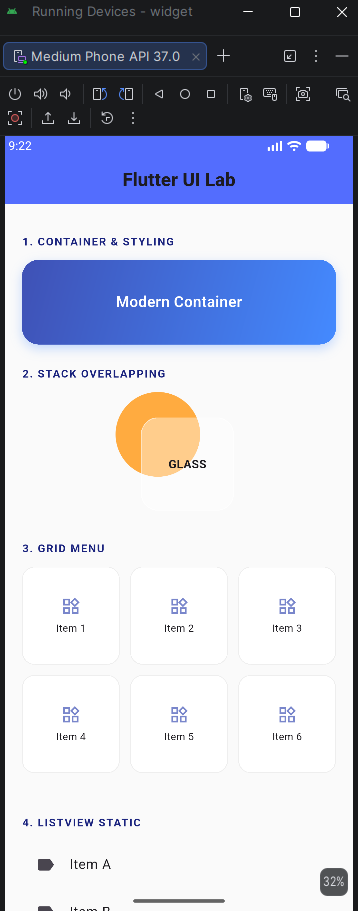
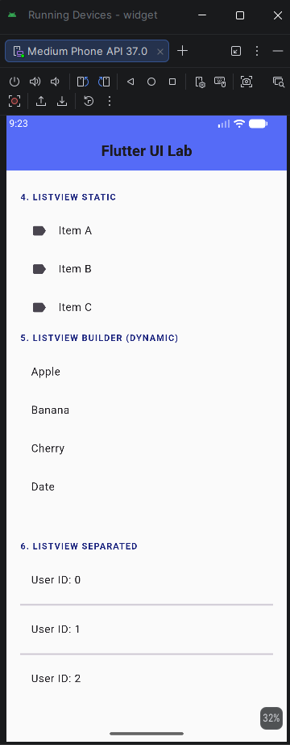

<div align="center">
  <br />
  <h1>LAPORAN PRAKTIKUM <br>APLIKASI BERBASIS PLATFORM</h1>
  <br />
  <h2>MODUL 3,4 <br>Mobile - Widget UI Dasar</h2>
  <br />
  <br />
   
  <br />
  <br />
  <br />
  <h3>Disusun Oleh :</h3>
  <p>
    <strong>Satrio Wibowo</strong><br>
    <strong>2311102149</strong><br>
    <strong>S1 IF-11-REG 01</strong>
  </p>
  <br />
  <h3>Dosen Pengampu :</h3>
  <p>
    <strong>Dimas Fanny Hebrasianto Permadi, S.ST., M.Kom</strong>
  </p>
  <br />
  <br />
    <h4>Asisten Praktikum :</h4>
    <strong> Apri Pandu Wicaksono </strong> <br>
    <strong>Rangga Pradarrell Fathi</strong>
  <br />
  <h2>LABORATORIUM HIGH PERFORMANCE
 <br>FAKULTAS INFORMATIKA <br>UNIVERSITAS TELKOM PURWOKERTO <br>2026</h2>
</div>


---

---

## 1. Dasar Teori
**Widget** merupakan komponen inti dalam pembangunan antarmuka (UI) pada Flutter. Prinsip utama Flutter adalah *"Everything is a Widget"*. Widget mendefinisikan tampilan serta konfigurasi elemen seperti teks, gambar, hingga pengaturan tata letak (*layout*).

Beberapa widget utama yang diimplementasikan pada praktikum ini meliputi:
- **Container**: Widget serbaguna untuk membungkus elemen lain dengan kemampuan pengaturan dekorasi seperti *gradient*, *box shadow*, dan *border radius*.
- **Stack**: Widget yang memungkinkan penumpukan elemen secara berlapis (z-axis). Elemen yang ditulis terakhir akan muncul di posisi paling depan/atas.
- **GridView**: Digunakan untuk menyusun elemen dalam format grid (baris dan kolom). Sangat efektif untuk tampilan menu atau galeri.
- **ListView**: Media dasar untuk menampilkan daftar item secara linear yang dapat digulir (*scrollable*).
- **ListView.builder**: Versi dinamis dari ListView yang lebih efisien memori karena hanya merender item yang terlihat di layar.
- **ListView.separated**: Pengembangan dari builder yang secara otomatis menyisipkan widget pemisah (*divider*) di antara item daftar.

---

## 2. Struktur Project
```
lib/
├── main.dart
├── screen/
│   └── homepage.dart
└── widget/
    ├── ContainerWidget.dart
    ├── GridviewWidget.dart
    ├── ListviewWidget.dart
    ├── ListviewBuilderWidget.dart
    ├── ListviewSeparatedWidget.dart
    └── StackWidget.dart
```

## 3. Pembahasan Code dan Implementasi

### A. Container dengan Gradient (`ContainerWidget.dart`)
`ContainerWidget` diimplementasikan dengan tampilan modern menggunakan gradien warna `indigo` ke `blueAccent`. Penambahan `BoxShadow` memberikan efek kedalaman (*depth*) pada kartu.

```dart
import 'package:flutter/material.dart';

class ContainerWidget extends StatelessWidget {
  const ContainerWidget({super.key});
  @override
  Widget build(BuildContext context) {
    return Container(
      height: 100,
      width: double.infinity,
      decoration: BoxDecoration(
        gradient: const LinearGradient(
          colors: [Colors.indigo, Colors.blueAccent],
          begin: Alignment.topLeft,
          end: Alignment.bottomRight,
        ),
        borderRadius: BorderRadius.circular(20),
        boxShadow: [
          BoxShadow(
            color: Colors.blueAccent.withOpacity(0.3),
            blurRadius: 10,
            offset: const Offset(0, 5),
          ),
        ],
      ),
      child: const Center(
        child: Text(
          "Modern Container",
          style: TextStyle(color: Colors.white, fontSize: 18, fontWeight: FontWeight.w600),
        ),
      ),
    );
  }
}
```

### B. Stack Layering (StackWidget.dart)
Mendemonstrasikan teknik layering di mana sebuah kontainer transparan (efek glassmorphism) diletakkan di atas lingkaran dekoratif menggunakan posisi yang bertumpuk.
```dart
import 'package:flutter/material.dart';

class StackWidget extends StatelessWidget {
  const StackWidget({super.key});
  @override
  Widget build(BuildContext context) {
    return Center(
      child: SizedBox(
        height: 150,
        width: 150,
        child: Stack(
          children: [
            Positioned(
              top: 0, left: 0,
              child: Container(width: 100, height: 100, decoration: const BoxDecoration(color: Colors.orangeAccent, shape: BoxShape.circle)),
            ),
            Positioned(
              bottom: 10, right: 10,
              child: Container(
                width: 110, height: 110,
                decoration: BoxDecoration(
                  color: Colors.white.withOpacity(0.4),
                  borderRadius: BorderRadius.circular(20),
                  border: Border.all(color: Colors.white.withOpacity(0.5)),
                ),
                child: const Center(child: Text("GLASS", style: TextStyle(fontWeight: FontWeight.bold))),
              ),
            ),
          ],
        ),
      ),
    );
  }
}
```
### C. GridView Menu (GridviewWidget.dart)
Menggunakan `GridView.builder` dengan `SliverGridDelegateWithFixedCrossAxisCount` untuk membagi layar menjadi 3 kolom secara presisi. Setiap item grid dibungkus dengan dekorasi border tipis yang bersih.

```dart
import 'package:flutter/material.dart';

class GridviewWidget extends StatelessWidget {
  const GridviewWidget({super.key});
  @override
  Widget build(BuildContext context) {
    return GridView.builder(
      shrinkWrap: true,
      physics: const NeverScrollableScrollPhysics(),
      gridDelegate: const SliverGridDelegateWithFixedCrossAxisCount(
        crossAxisCount: 3,
        mainAxisSpacing: 12,
        crossAxisSpacing: 12,
      ),
      itemCount: 6,
      itemBuilder: (context, index) {
        return Container(
          decoration: BoxDecoration(
            color: Colors.white,
            borderRadius: BorderRadius.circular(15),
            border: Border.all(color: Colors.grey[200]!),
          ),
          child: Column(
            mainAxisAlignment: MainAxisAlignment.center,
            children: [
              Icon(Icons.widgets_outlined, color: Colors.indigo[300]),
              const SizedBox(height: 5),
              Text("Item ${index + 1}", style: const TextStyle(fontSize: 12)),
            ],
          ),
        );
      },
    );
  }
}
```

### D. ListView Manual (ListviewWidget.dart)
Menampilkan elemen statis (A, B, C) menggunakan widget `ListTile`. Widget ini memiliki properti `leading` untuk ikon dan `title` untuk label teks utama.

```dart
import 'package:flutter/material.dart';

class ListviewWidget extends StatelessWidget {
  const ListviewWidget({super.key});
  @override
  Widget build(BuildContext context) {
    return SizedBox(
      height: 150,
      child: ListView(
        children: const [
          ListTile(title: Text("Item A"), leading: Icon(Icons.label)),
          ListTile(title: Text("Item B"), leading: Icon(Icons.label)),
          ListTile(title: Text("Item C"), leading: Icon(Icons.label)),
        ],
      ),
    );
  }
}
```
### E. ListView Builder (ListviewBuilderWidget.dart)
Mengambil data dari sebuah `List<String>` dan merendernya secara dinamis. Widget ini menggunakan `shrinkWrap: true` agar ukurannya menyesuaikan isi di dalam `SingleChildScrollView` pada halaman utama.

```dart
import 'package:flutter/material.dart';

class ListviewBuilderWidget extends StatelessWidget {
  const ListviewBuilderWidget({super.key});
  @override
  Widget build(BuildContext context) {
    final List<String> data = ["Apple", "Banana", "Cherry", "Date"];
    return ListView.builder(
      shrinkWrap: true,
      physics: const NeverScrollableScrollPhysics(),
      itemCount: data.length,
      itemBuilder: (context, index) => ListTile(title: Text(data[index])),
    );
  }
}
```
### E. ListView Builder (ListviewBuilderWidget.dart)
Memanfaatkan `separatorBuilder` untuk memberikan garis pembatas `(Divider)` antar item secara otomatis, sehingga meningkatkan aspek visual dan pemisahan informasi bagi pengguna.


## 4. Hasil Tampilan (Output)
Tampilan akhir aplikasi menggunakan tema modern dengan dominasi warna indigo, sudut melengkung (rounded corners), dan tata letak yang responsif.



