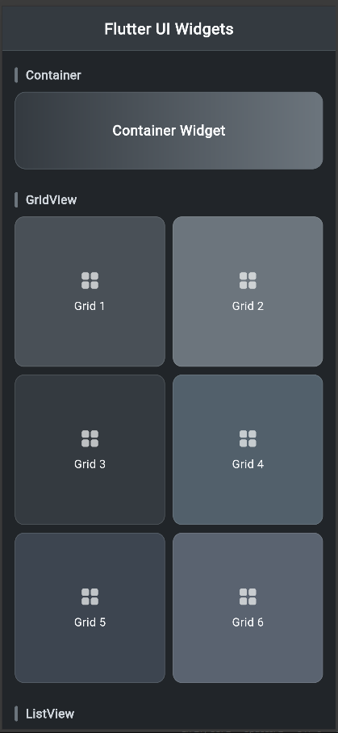
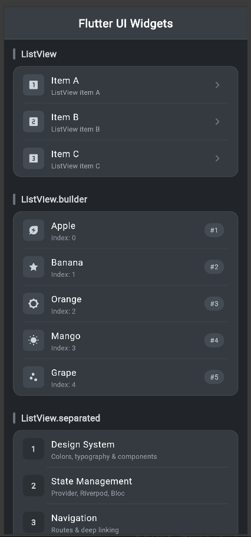
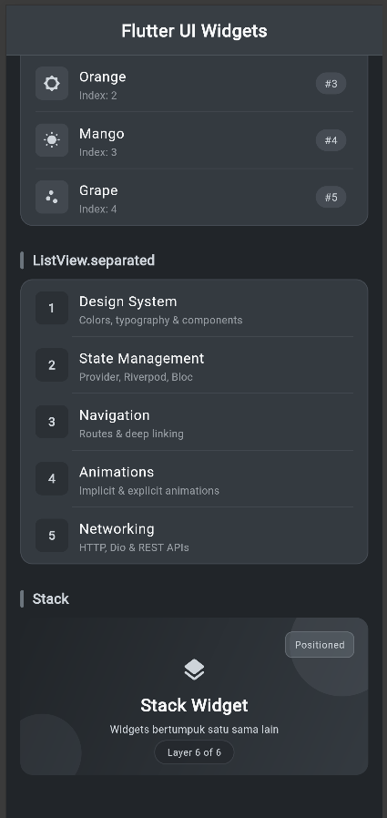

<div align="center">

<br>

# LAPORAN PRAKTIKUM  
# APLIKASI BERBASIS PLATFORM

<br>

## MODUL 4  
## Mobile - Widget

<br>


<br><br>

### Disusun Oleh

**Yoga Hogantara**  
**2311102153**  
**S1 IF-11-REG01**

<br>

### Dosen Pengampu

**Dimas Fanny Hebrasianto Permadi, S.ST., M.Kom**

<br>

### Asisten Praktikum

**Apri Pandu Wicaksono**  
**Rangga Pradarrell Fathi**

<br><br>

### LABORATORIUM HIGH PERFORMANCE  
### FAKULTAS INFORMATIKA  
### UNIVERSITAS TELKOM PURWOKERTO  
### 2026

</div>

---

## 1. Dasar Teori
**Widget** adalah elemen dasar pembangun antarmuka pengguna (UI). Semuanya di Flutter adalah widget, baik itu yang bersifat struktural (seperti tombol atau teks), layout (seperti *padding* atau margin), maupun efek visual.
 
Terdapat beberapa jenis widget dasar yang sering digunakan:
- **Container**: Widget multifungsi yang bisa digunakan untuk mengatur ukuran, *padding*, *margin*, serta dekorasi (seperti warna latar, *gradient*, atau *border*).
- **GridView**: Widget untuk menampilkan sekumpulan data dalam bentuk tata letak *grid* dua dimensi (baris dan kolom) yang dapat di-*scroll*.
- **ListView**: Widget *layout* yang berfungsi menyusun daftar *child* (elemen) secara linear, baik vertikal maupun horizontal, dan otomatis menyediakan fitur *scroll*. *ListView* memiliki variasi seperti `.builder` untuk *generate* elemen secara dinamis sesuai ukuran *array*, serta `.separated` yang menambahkan elemen pemisah (garis antar baris).
- **Stack**: Widget yang digunakan untuk menumpuk elemen-elemen di atas satu sama lain. Widget yang ditulis pertama akan berada di tumpukan paling bawah, sedangkan yang terakhir berada paling atas. Posisi elemen dapat dikontrol menggunakan widget `Positioned`.
Pada praktikum ini, seluruh widget diorganisasi ke dalam file terpisah di folder `widget/`, kemudian dipanggil dari `HomePage` yang berada di `screen/homepage.dart`. Tema warna yang digunakan adalah palet gelap (*dark theme*) berbasis abu-abu charcoal.
 
---
 
## 2. Struktur Project
 
```
lib/
├── main.dart
├── screen/
│   └── homepage.dart
└── widget/
    ├── ContainerWidget.dart
    ├── GridviewWidget.dart
    ├── ListviewWidget.dart
    ├── ListviewBuilderWidget.dart
    ├── ListviewSeparatedWidget.dart
    └── StackWidget.dart
```
 
### Color Palette (`AppColors`)
 
Didefinisikan di `homepage.dart` dan digunakan bersama seluruh widget:
 
```dart
class AppColors {
  static const brightSnow  = Color(0xFFF8F9FA); 
  static const paleSlate   = Color(0xFFCED4DA); 
  static const slateGrey   = Color(0xFF6C757D); 
  static const gunmetal    = Color(0xFF343A40); 
  static const carbonBlack = Color(0xFF212529); 
}
```
 
---
 
## 3. Pembahasan Code dan Implementasi
 
### A. Container (`ContainerWidget.dart`)
 
```dart
import 'package:flutter/material.dart';
import '/screen/homepage.dart';
 
class ContainerWidget extends StatelessWidget {
  const ContainerWidget({super.key});
 
  @override
  Widget build(BuildContext context) {
    return Container(
      height: 100,
      width: double.infinity,
      decoration: BoxDecoration(
        gradient: const LinearGradient(
          colors: [AppColors.gunmetal, AppColors.slateGrey],
          begin: Alignment.centerLeft,
          end: Alignment.centerRight,
        ),
        borderRadius: BorderRadius.circular(14),
        border: Border.all(
          color: AppColors.slateGrey.withOpacity(0.5),
          width: 1,
        ),
      ),
      alignment: Alignment.center,
      child: const Text(
        'Container Widget',
        style: TextStyle(
          color: AppColors.brightSnow,
          fontSize: 18,
          fontWeight: FontWeight.w600,
          letterSpacing: 0.5,
        ),
      ),
    );
  }
}
```
 
**Penjelasan:**  
`ContainerWidget` menampilkan sebuah kotak dengan lebar penuh (`double.infinity`) dan tinggi `100`. Dekorasi menggunakan `LinearGradient` dari warna `gunmetal` ke `slateGrey` secara horizontal, sudut melengkung (`borderRadius: 14`), dan garis tepi tipis semi-transparan. Teks "Container Widget" ditempatkan di tengah dengan gaya *bold*.
 
---
 
### B. GridView (`GridviewWidget.dart`)
 
```dart
import 'package:flutter/material.dart';
import '/screen/homepage.dart';
 
class GridViewWidget extends StatelessWidget {
  const GridViewWidget({super.key});
 
  static const List<Color> _gridColors = [
    Color(0xFF495057),
    Color(0xFF6C757D),
    Color(0xFF343A40),
    Color(0xFF52606B),
    Color(0xFF3D4550),
    Color(0xFF5A6370),
  ];
 
  @override
  Widget build(BuildContext context) {
    return GridView.count(
      crossAxisCount: 2,
      crossAxisSpacing: 10,
      mainAxisSpacing: 10,
      shrinkWrap: true,
      physics: const NeverScrollableScrollPhysics(),
      children: List.generate(6, (index) {
        return Container(
          decoration: BoxDecoration(
            color: _gridColors[index],
            borderRadius: BorderRadius.circular(12),
            border: Border.all(
              color: AppColors.paleSlate.withOpacity(0.15),
              width: 1,
            ),
          ),
          alignment: Alignment.center,
          child: Column(
            mainAxisAlignment: MainAxisAlignment.center,
            children: [
              Icon(
                Icons.grid_view_rounded,
                color: AppColors.brightSnow.withOpacity(0.7),
                size: 28,
              ),
              const SizedBox(height: 8),
              Text(
                'Grid ${index + 1}',
                style: const TextStyle(
                  color: AppColors.brightSnow,
                  fontSize: 15,
                  fontWeight: FontWeight.w500,
                ),
              ),
            ],
          ),
        );
      }),
    );
  }
}
```
 
**Penjelasan:**  
`GridViewWidget` menggunakan `GridView.count` dengan 2 kolom (`crossAxisCount: 2`) dan menghasilkan 6 item menggunakan `List.generate`. Setiap sel memiliki warna abu-abu yang berbeda (dari `_gridColors`), sudut melengkung, serta menampilkan ikon `grid_view_rounded` dan label "Grid N". `shrinkWrap: true` bersama `NeverScrollableScrollPhysics` memastikan grid tidak membuat *scroll* independen di dalam `SingleChildScrollView` halaman utama.
 
---
 
### C. ListView Statis (`ListviewWidget.dart`)
 
```dart
import 'package:flutter/material.dart';
import '/screen/homepage.dart';
 
class ListViewWidget extends StatelessWidget {
  const ListViewWidget({super.key});
 
  static const List<Map<String, dynamic>> _items = [
    {'label': 'A', 'icon': Icons.looks_one_rounded},
    {'label': 'B', 'icon': Icons.looks_two_rounded},
    {'label': 'C', 'icon': Icons.looks_3_rounded},
  ];
 
  @override
  Widget build(BuildContext context) {
    return Container(
      decoration: BoxDecoration(
        color: AppColors.gunmetal,
        borderRadius: BorderRadius.circular(14),
        border: Border.all(color: AppColors.slateGrey.withOpacity(0.3), width: 1),
      ),
      child: ListView(
        shrinkWrap: true,
        physics: const NeverScrollableScrollPhysics(),
        children: _items.asMap().entries.map((entry) {
          final isLast = entry.key == _items.length - 1;
          final item = entry.value;
          return Column(
            children: [
              ListTile(
                leading: Container(
                  width: 38, height: 38,
                  decoration: BoxDecoration(
                    color: AppColors.slateGrey.withOpacity(0.3),
                    borderRadius: BorderRadius.circular(8),
                  ),
                  child: Icon(item['icon'] as IconData,
                      color: AppColors.paleSlate, size: 20),
                ),
                title: Text('Item ${item['label']}',
                    style: const TextStyle(
                        color: AppColors.brightSnow,
                        fontWeight: FontWeight.w500)),
                subtitle: Text('ListView item ${item['label']}',
                    style: TextStyle(
                        color: AppColors.paleSlate.withOpacity(0.7),
                        fontSize: 12)),
                trailing: Icon(Icons.chevron_right_rounded,
                    color: AppColors.slateGrey),
              ),
              if (!isLast)
                Divider(
                    color: AppColors.slateGrey.withOpacity(0.2),
                    height: 1, indent: 16, endIndent: 16),
            ],
          );
        }).toList(),
      ),
    );
  }
}
```
 
**Penjelasan:**  
`ListViewWidget` menampilkan tiga item statis (A, B, C) yang didefinisikan langsung di `_items`. Setiap item menggunakan `ListTile` dengan ikon angka di *leading*, label teks di *title*, subjudul di *subtitle*, serta ikon panah di *trailing*. Pembatas antar item dibuat dengan `Divider`, kecuali setelah item terakhir.
 
---
 
### D. ListView.builder (`ListviewBuilderWidget.dart`)
 
```dart
import 'package:flutter/material.dart';
import '/screen/homepage.dart';
 
class ListViewBuilderWidget extends StatelessWidget {
  const ListViewBuilderWidget({super.key});
 
  static const List<String> _fruits = [
    'Apple', 'Banana', 'Orange', 'Mango', 'Grape',
  ];
 
  static const List<IconData> _icons = [
    Icons.energy_savings_leaf_rounded,
    Icons.star_rounded,
    Icons.brightness_5_rounded,
    Icons.wb_sunny_rounded,
    Icons.scatter_plot_rounded,
  ];
 
  @override
  Widget build(BuildContext context) {
    return Container(
      decoration: BoxDecoration(
        color: AppColors.gunmetal,
        borderRadius: BorderRadius.circular(14),
        border: Border.all(color: AppColors.slateGrey.withOpacity(0.3), width: 1),
      ),
      child: ListView.builder(
        itemCount: _fruits.length,
        shrinkWrap: true,
        physics: const NeverScrollableScrollPhysics(),
        itemBuilder: (context, index) {
          final isLast = index == _fruits.length - 1;
          return Column(
            children: [
              ListTile(
                leading: Container(
                  width: 38, height: 38,
                  decoration: BoxDecoration(
                    color: AppColors.slateGrey.withOpacity(0.25),
                    borderRadius: BorderRadius.circular(8),
                  ),
                  child: Icon(_icons[index],
                      color: AppColors.paleSlate, size: 20),
                ),
                title: Text(_fruits[index],
                    style: const TextStyle(
                        color: AppColors.brightSnow,
                        fontWeight: FontWeight.w500)),
                subtitle: Text('Index: $index',
                    style: TextStyle(
                        color: AppColors.paleSlate.withOpacity(0.6),
                        fontSize: 12)),
                trailing: Container(
                  padding: const EdgeInsets.symmetric(
                      horizontal: 10, vertical: 4),
                  decoration: BoxDecoration(
                    color: AppColors.slateGrey.withOpacity(0.3),
                    borderRadius: BorderRadius.circular(20),
                  ),
                  child: Text('#${index + 1}',
                      style: const TextStyle(
                          color: AppColors.paleSlate,
                          fontSize: 12,
                          fontWeight: FontWeight.w500)),
                ),
              ),
              if (!isLast)
                Divider(
                    color: AppColors.slateGrey.withOpacity(0.2),
                    height: 1, indent: 16, endIndent: 16),
            ],
          );
        },
      ),
    );
  }
}
```
 
**Penjelasan:**  
`ListViewBuilderWidget` menggunakan `ListView.builder` untuk merender daftar dari array `_fruits` (Apple, Banana, Orange, Mango, Grape) secara dinamis. Setiap item menampilkan ikon unik dari `_icons`, nama buah, nomor indeks di *subtitle*, serta *badge* nomor urut di *trailing*. Pendekatan `.builder` lebih efisien untuk daftar panjang karena hanya merender item yang tampak di layar.
 
---
 
### E. ListView.separated (`ListviewSeparatedWidget.dart`)
 
```dart
import 'package:flutter/material.dart';
import '/screen/homepage.dart';
 
class ListViewSeparatedWidget extends StatelessWidget {
  const ListViewSeparatedWidget({super.key});
 
  static const List<Map<String, String>> _items = [
    {'title': 'Design System',     'subtitle': 'Colors, typography & components'},
    {'title': 'State Management',  'subtitle': 'Provider, Riverpod, Bloc'},
    {'title': 'Navigation',        'subtitle': 'Routes & deep linking'},
    {'title': 'Animations',        'subtitle': 'Implicit & explicit animations'},
    {'title': 'Networking',        'subtitle': 'HTTP, Dio & REST APIs'},
  ];
 
  @override
  Widget build(BuildContext context) {
    return Container(
      decoration: BoxDecoration(
        color: AppColors.gunmetal,
        borderRadius: BorderRadius.circular(14),
        border: Border.all(color: AppColors.slateGrey.withOpacity(0.3), width: 1),
      ),
      child: ClipRRect(
        borderRadius: BorderRadius.circular(14),
        child: ListView.separated(
          shrinkWrap: true,
          physics: const NeverScrollableScrollPhysics(),
          itemCount: _items.length,
          separatorBuilder: (_, __) => Divider(
            color: AppColors.slateGrey.withOpacity(0.25),
            height: 1, indent: 58, endIndent: 16,
          ),
          itemBuilder: (context, index) {
            return ListTile(
              leading: Container(
                width: 38, height: 38,
                decoration: BoxDecoration(
                  color: AppColors.carbonBlack.withOpacity(0.5),
                  borderRadius: BorderRadius.circular(8),
                ),
                child: Center(
                  child: Text('${index + 1}',
                      style: const TextStyle(
                          color: AppColors.paleSlate,
                          fontWeight: FontWeight.bold,
                          fontSize: 14)),
                ),
              ),
              title: Text(_items[index]['title']!,
                  style: const TextStyle(
                      color: AppColors.brightSnow,
                      fontWeight: FontWeight.w500)),
              subtitle: Text(_items[index]['subtitle']!,
                  style: TextStyle(
                      color: AppColors.paleSlate.withOpacity(0.65),
                      fontSize: 12)),
            );
          },
        ),
      ),
    );
  }
}
```
 
**Penjelasan:**  
`ListViewSeparatedWidget` menampilkan 5 topik Flutter menggunakan `ListView.separated`. Perbedaan utama dari `.builder` adalah adanya parameter `separatorBuilder` yang menyisipkan widget `Divider` di antara setiap item secara otomatis — tanpa perlu pengecekan `isLast` secara manual. *Leading* menampilkan nomor urut, sedangkan *title* dan *subtitle* berasal dari `_items`.
 
---
 
### F. Stack (`StackWidget.dart`)
 
```dart
import 'package:flutter/material.dart';
import '/screen/homepage.dart';
 
class StackWidget extends StatelessWidget {
  const StackWidget({super.key});
 
  @override
  Widget build(BuildContext context) {
    return ClipRRect(
      borderRadius: BorderRadius.circular(14),
      child: SizedBox(
        height: 180,
        width: double.infinity,
        child: Stack(
          children: [
            // Layer 1: Background gradient
            Container(
              width: double.infinity,
              height: double.infinity,
              decoration: const BoxDecoration(
                gradient: LinearGradient(
                  colors: [AppColors.carbonBlack, AppColors.gunmetal],
                  begin: Alignment.topLeft,
                  end: Alignment.bottomRight,
                ),
              ),
            ),
 
            // Layer 2: Lingkaran dekoratif (kanan atas)
            Positioned(
              top: -30, right: -30,
              child: Container(
                width: 120, height: 120,
                decoration: BoxDecoration(
                  shape: BoxShape.circle,
                  color: AppColors.slateGrey.withOpacity(0.2),
                ),
              ),
            ),
 
            // Layer 3: Lingkaran dekoratif (kiri bawah)
            Positioned(
              bottom: -20, left: -20,
              child: Container(
                width: 90, height: 90,
                decoration: BoxDecoration(
                  shape: BoxShape.circle,
                  color: AppColors.slateGrey.withOpacity(0.15),
                ),
              ),
            ),
 
            // Layer 4: Badge "Positioned" (kanan atas)
            Positioned(
              top: 16, right: 16,
              child: Container(
                padding: const EdgeInsets.symmetric(horizontal: 10, vertical: 6),
                decoration: BoxDecoration(
                  color: AppColors.slateGrey.withOpacity(0.4),
                  borderRadius: BorderRadius.circular(8),
                  border: Border.all(
                      color: AppColors.paleSlate.withOpacity(0.2), width: 1),
                ),
                child: const Text('Positioned',
                    style: TextStyle(
                        color: AppColors.paleSlate,
                        fontSize: 11,
                        fontWeight: FontWeight.w500,
                        letterSpacing: 0.5)),
              ),
            ),
 
            // Layer 5: Konten teks tengah
            const Center(
              child: Column(
                mainAxisSize: MainAxisSize.min,
                children: [
                  Icon(Icons.layers_rounded,
                      color: AppColors.paleSlate, size: 32),
                  SizedBox(height: 10),
                  Text('Stack Widget',
                      style: TextStyle(
                          color: AppColors.brightSnow,
                          fontSize: 20,
                          fontWeight: FontWeight.bold,
                          letterSpacing: 0.5)),
                  SizedBox(height: 4),
                  Text('Widgets bertumpuk satu sama lain',
                      style: TextStyle(
                          color: AppColors.paleSlate, fontSize: 12)),
                ],
              ),
            ),
 
            // Layer 6: Tag bawah
            Positioned(
              bottom: 12, left: 0, right: 0,
              child: Center(
                child: Container(
                  padding: const EdgeInsets.symmetric(
                      horizontal: 14, vertical: 5),
                  decoration: BoxDecoration(
                    color: AppColors.carbonBlack.withOpacity(0.6),
                    borderRadius: BorderRadius.circular(20),
                    border: Border.all(
                        color: AppColors.slateGrey.withOpacity(0.3), width: 1),
                  ),
                  child: const Text('Layer 6 of 6',
                      style: TextStyle(
                          color: AppColors.paleSlate,
                          fontSize: 11,
                          letterSpacing: 0.4)),
                ),
              ),
            ),
          ],
        ),
      ),
    );
  }
}
```
 
**Penjelasan:**  
`StackWidget` mendemonstrasikan penumpukan 6 layer dalam satu `Stack`:
- **Layer 1** – latar belakang gradasi gelap
- **Layer 2 & 3** – lingkaran dekoratif di sudut, menggunakan `Positioned` agar meluber keluar batas
- **Layer 4** – *badge* teks "Positioned" di pojok kanan atas
- **Layer 5** – ikon dan teks utama di tengah menggunakan `Center`
- **Layer 6** – tag keterangan di bagian bawah
`ClipRRect` di luar `Stack` memastikan elemen-elemen yang meluber terpotong rapi sesuai `borderRadius` kartu.
 
---
 
### G. HomePage & Entri Utama
 
**`homepage.dart`** merangkai semua widget di atas dalam satu halaman menggunakan `SingleChildScrollView` + `Column`. Setiap seksi diawali dengan `_SectionTitle`, yaitu widget lokal yang menampilkan garis vertikal kecil dan label nama widget.
 
**`main.dart`** menginisialisasi aplikasi dengan tema gelap (`scaffoldBackgroundColor: Color(0xFF212529)`) dan `debugShowCheckedModeBanner: false`.
 
---
 
# 4. Hasil Tampilan (*Output*)
 
Tampilan dari eksekusi *source code* di atas menghasilkan UI berbasis kolom yang di-*scroll* menggunakan `SingleChildScrollView`, dengan tema warna gelap (dark mode) dan palet abu-abu charcoal yang konsisten di seluruh widget.
 




---