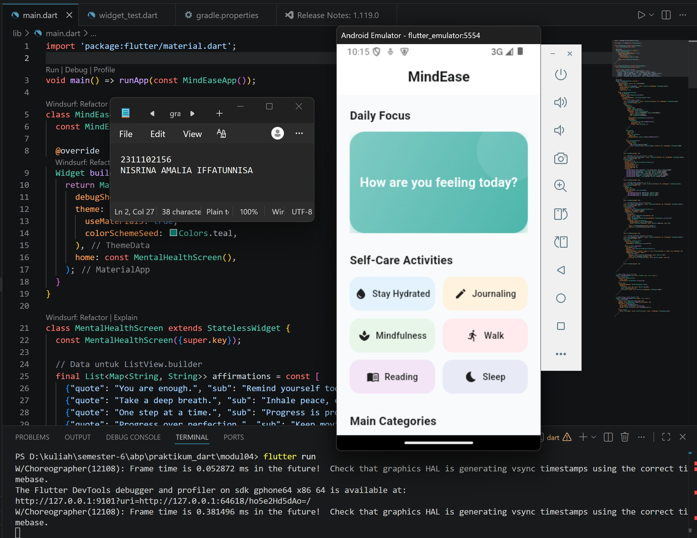
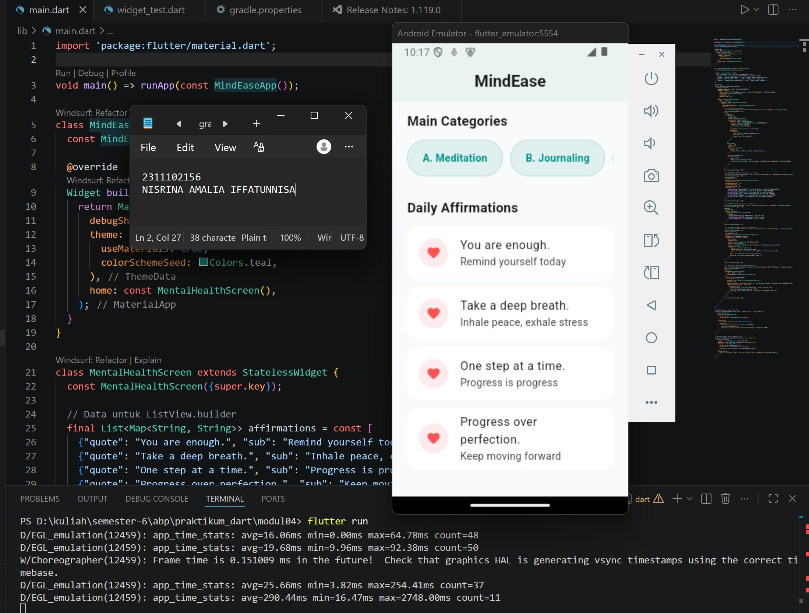
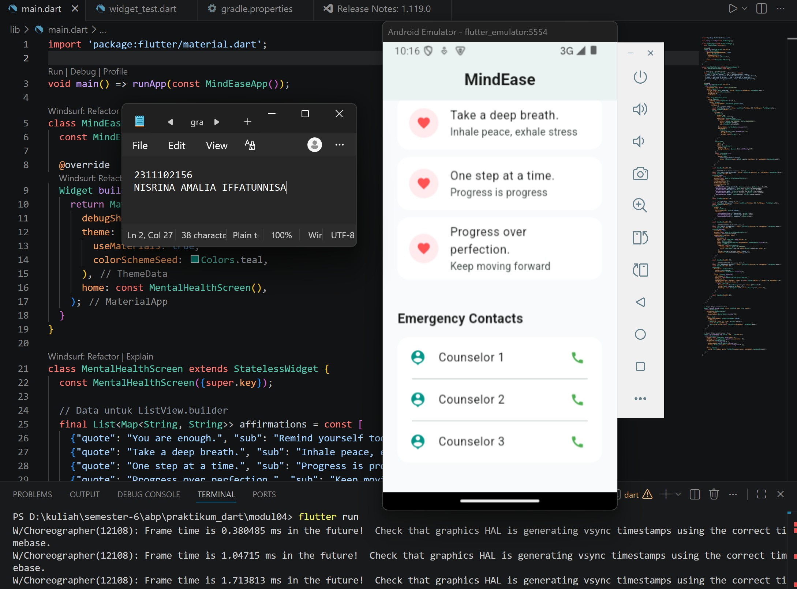

<div align="center">
  <br />
  <h1>LAPORAN PRAKTIKUM <br>APLIKASI BERBASIS PLATFORM</h1>
  <br />
  <h3> Modul 04 Mobile <br> Widget UI </h3>
  <br />
   
  <br />
  <br />
  <br />
  <h3>Disusun Oleh :</h3>
  <p>
    <strong>Nisrina Amalia Iffatunnisa</strong><br>
    <strong>2311102156</strong><br>
    <strong>S1 IF-11-01</strong>
  </p>
  <br />
  <h3>Dosen Pengampu :</h3>
  <p>
    <strong>Dimas Fanny Hebrasianto Permadi, S.ST., M.Kom</strong>
  </p>
  <br />
  <br />
    <h4>Asisten Praktikum :</h4>
    <strong> Apri Pandu Wicaksono </strong> <br>
    <strong>Rangga Pradarrell Fathi</strong>
  <br />
  <h3>LABORATORIUM HIGH PERFORMANCE
 <br>FAKULTAS INFORMATIKA <br>UNIVERSITAS TELKOM PURWOKERTO <br>2026</h3>
</div>


## 1. Latar Belakang

### A. Flutter dan Widget
Flutter adalah kerangka kerja sumber terbuka yang dikembangkan dan didukung oleh Google. Developer frontend dan full-stack menggunakan Flutter untuk membangun antarmuka pengguna (UI) aplikasi untuk beberapa platform dengan kode program tunggal. Saat Flutter diluncurkan pada tahun 2018, Flutter terutama mendukung pengembangan aplikasi seluler. Flutter kini mendukung pengembangan aplikasi di enam platform, yaitu iOS, Android, web, Windows, MacOS, dan Linux

Keuntungan Flutter
- Performa yang mendekati aslinya. Flutter menggunakan bahasa pemrograman Dart dan dikompilasi menjadi kode mesin. Perangkat host memahami kode ini sehingga memastikan performa yang cepat dan efektif.
- Rendering yang cepat, konsisten, dan dapat disesuaikan. Alih-alih mengandalkan alat rendering khusus platform, Flutter menggunakan pustaka grafis Skia sumber terbuka milik Google untuk me-render UI. Keuntungan ini memberi pengguna visual yang konsisten, apa pun platform yang digunakan untuk mengakses aplikasi. 
- Alat yang ramah developer. Google membuat Flutter dengan mengutamakan pada kemudahan penggunaan. Dengan alat seperti hot reload, developer dapat melihat seperti apa perubahan kode tanpa kehilangan status. Alat lain seperti pemeriksa widget memudahkan dalam memvisualisasikan dan memecahkan masalah tata letak UI.

Flutter menggunakan bahasa pemrograman sumber terbuka Dart, yang juga dikembangkan oleh Google. Dart dioptimalkan untuk membangun UI. Flutter berjalan menggunakan Dart Virtual Machine (VM) di sistem operasi Windows, Linux, dan macOS. Dart VM menggunakan kompilasi kode just-in-time (JIT) yang menyediakan fitur hot-reload untuk menghemat waktu pengembangan. Di Flutter, developer membuat tata letak UI dengan menggunakan widget. Widget Flutter didesain agar developer dapat dengan mudah menyesuaikannya. Flutter mencapai tujuan ini melalui pendekatan komposisi. Artinya, sebagian besar widget terbuat dari widget yang lebih kecil, dan sebagian besar widget dasar memiliki tujuan tertentu. Hal ini memungkinkan developer untuk menggabungkan atau mengedit widget untuk membuat widget yang baru.

widget merupakan fondasi utama yang mendeskripsikan konfigurasi tetap dari setiap elemen antarmuka pengguna. Seluruh komponen visual, mulai dari teks sederhana dan bentuk geometris hingga animasi yang kompleks, dibangun sepenuhnya menggunakan widget. Widget didesain untuk bersifat modular, dapat menciptakan antarmuka yang canggih dengan cara memadukan berbagai widget sederhana ke dalam satu kesatuan. Untuk mendukung estetika yang konsisten, framework Flutter juga telah menyediakan dua set widget utama yang disesuaikan dengan bahasa desain populer, yaitu Material Design untuk gaya khas Google dan Cupertino untuk tampilan yang menyerupai sistem operasi iOS.

## 2. Soal Penugasan
📝 Tugas Praktikum Modul 4 Flutter

Buat 1 project Flutter yang menampilkan beberapa widget UI berikut:

🔹 Yang harus ada:
- Container → kotak berwarna
- GridView → minimal 6 item (grid)
- ListView → 3 item (A, B, C)
- ListView.builder → list dari data array
- ListView.separated → list + garis pembatas
- Stack → tampilan bertumpuk (kotak / text)

📦 Output yang dikumpulkan:
- Screenshot hasilnya
- Source code
- Penjelasan singkat tiap widget

## 3. Sourcecode 

### Sourcecode main.dart
``` Dart
import 'package:flutter/material.dart';

void main() => runApp(const MindEaseApp());

class MindEaseApp extends StatelessWidget {
  const MindEaseApp({super.key});

  @override
  Widget build(BuildContext context) {
    return MaterialApp(
      debugShowCheckedModeBanner: false,
      theme: ThemeData(
        useMaterial3: true,
        colorSchemeSeed: Colors.teal,
      ),
      home: const MentalHealthScreen(),
    );
  }
}

class MentalHealthScreen extends StatelessWidget {
  const MentalHealthScreen({super.key});

  // Data untuk ListView.builder
  final List<Map<String, String>> affirmations = const [
    {"quote": "You are enough.", "sub": "Remind yourself today"},
    {"quote": "Take a deep breath.", "sub": "Inhale peace, exhale stress"},
    {"quote": "One step at a time.", "sub": "Progress is progress"},
    {"quote": "Progress over perfection.", "sub": "Keep moving forward"},
  ];

  @override
  Widget build(BuildContext context) {
    return Scaffold(
      backgroundColor: const Color(0xFFF8FAFB),
      appBar: AppBar(
        title: const Text("MindEase", style: TextStyle(fontWeight: FontWeight.bold)),
        backgroundColor: Colors.white,
        elevation: 0,
        centerTitle: true,
      ),
      body: SingleChildScrollView(
        child: Padding(
          padding: const EdgeInsets.all(20.0),
          child: Column(
            crossAxisAlignment: CrossAxisAlignment.start,
            children: [
              // 1. STACK (Banner Modern)
              const Text("Daily Focus", style: TextStyle(fontSize: 18, fontWeight: FontWeight.bold)),
              const SizedBox(height: 12),
              Stack(
                children: [
                  Container(
                    height: 160,
                    width: double.infinity,
                    decoration: BoxDecoration(
                      gradient: const LinearGradient(
                        colors: [Color(0xFF80CBC4), Color(0xFF4DB6AC)],
                        begin: Alignment.topLeft,
                        end: Alignment.bottomRight,
                      ),
                      borderRadius: BorderRadius.circular(24),
                      boxShadow: [
                        BoxShadow(
                          color: Colors.teal.withOpacity(0.3),
                          blurRadius: 15,
                          offset: const Offset(0, 8),
                        )
                      ],
                    ),
                  ),
                  Positioned(
                    right: -20,
                    top: -20,
                    child: CircleAvatar(
                      radius: 50,
                      backgroundColor: Colors.white.withOpacity(0.1),
                    ),
                  ),
                  const Positioned.fill(
                    child: Center(
                      child: Text(
                        "How are you feeling today?",
                        style: TextStyle(color: Colors.white, fontSize: 20, fontWeight: FontWeight.w600),
                      ),
                    ),
                  ),
                ],
              ),
              const SizedBox(height: 30),

              // 2. GRIDVIEW (Self-Care Activities - 6 Item)
              const Text("Self-Care Activities", style: TextStyle(fontSize: 18, fontWeight: FontWeight.bold)),
              const SizedBox(height: 12),
              GridView.count(
                shrinkWrap: true,
                physics: const NeverScrollableScrollPhysics(),
                crossAxisCount: 2,
                childAspectRatio: 2.5,
                mainAxisSpacing: 12,
                crossAxisSpacing: 12,
                children: [
                  _buildGridItem("Stay Hydrated", Icons.water_drop, Colors.blue.shade50),
                  _buildGridItem("Journaling", Icons.edit, Colors.orange.shade50),
                  _buildGridItem("Mindfulness", Icons.spa, Colors.green.shade50),
                  _buildGridItem("Walk", Icons.directions_run, Colors.red.shade50),
                  _buildGridItem("Reading", Icons.menu_book, Colors.purple.shade50),
                  _buildGridItem("Sleep", Icons.bedtime, Colors.indigo.shade50),
                ],
              ),
              const SizedBox(height: 30),

              // 3. LISTVIEW (Main Categories - A, B, C)
              const Text("Main Categories", style: TextStyle(fontSize: 18, fontWeight: FontWeight.bold)),
              const SizedBox(height: 12),
              SizedBox(
                height: 50,
                child: ListView(
                  scrollDirection: Axis.horizontal,
                  children: [
                    _buildCategoryChip("A. Meditation", Colors.teal),
                    _buildCategoryChip("B. Journaling", Colors.teal),
                    _buildCategoryChip("C. Breathing", Colors.teal),
                  ],
                ),
              ),
              const SizedBox(height: 30),

              // 4. LISTVIEW.BUILDER (Daily Affirmations)
              const Text("Daily Affirmations", style: TextStyle(fontSize: 18, fontWeight: FontWeight.bold)),
              const SizedBox(height: 12),
              ListView.builder(
                shrinkWrap: true,
                physics: const NeverScrollableScrollPhysics(),
                itemCount: affirmations.length,
                itemBuilder: (context, index) {
                  return Card(
                    elevation: 0,
                    margin: const EdgeInsets.only(bottom: 10),
                    color: Colors.white,
                    shape: RoundedRectangleBorder(borderRadius: BorderRadius.circular(16)),
                    child: ListTile(
                      leading: const CircleAvatar(
                        backgroundColor: Color(0xFFFFEBEE),
                        child: Icon(Icons.favorite, color: Colors.redAccent, size: 20),
                      ),
                      title: Text(affirmations[index]['quote']!),
                      subtitle: Text(affirmations[index]['sub']!),
                    ),
                  );
                },
              ),
              const SizedBox(height: 30),

              // 5. LISTVIEW.SEPARATED (Emergency Contacts)
              const Text("Emergency Contacts", style: TextStyle(fontSize: 18, fontWeight: FontWeight.bold)),
              const SizedBox(height: 12),
              Container(
                decoration: BoxDecoration(
                  color: Colors.white,
                  borderRadius: BorderRadius.circular(16),
                ),
                child: ListView.separated(
                  shrinkWrap: true,
                  physics: const NeverScrollableScrollPhysics(),
                  itemCount: 3,
                  separatorBuilder: (context, index) => const Divider(height: 1, indent: 20, endIndent: 20),
                  itemBuilder: (context, index) {
                    return ListTile(
                      leading: const Icon(Icons.person_pin, color: Colors.teal),
                      title: Text("Counselor ${index + 1}"),
                      trailing: const Icon(Icons.call, color: Colors.green, size: 20),
                    );
                  },
                ),
              ),
              const SizedBox(height: 20),
            ],
          ),
        ),
      ),
    );
  }

  // Widget Helper untuk Grid Item
  Widget _buildGridItem(String title, IconData icon, Color color) {
    return Container(
      decoration: BoxDecoration(
        color: color,
        borderRadius: BorderRadius.circular(16),
      ),
      child: Row(
        mainAxisAlignment: MainAxisAlignment.center,
        children: [
          Icon(icon, size: 20, color: Colors.black87),
          const SizedBox(width: 8),
          Text(title, style: const TextStyle(fontWeight: FontWeight.w500)),
        ],
      ),
    );
  }

  // Widget Helper untuk Category Chip
  Widget _buildCategoryChip(String label, Color color) {
    return Container(
      margin: const EdgeInsets.only(right: 10),
      padding: const EdgeInsets.symmetric(horizontal: 20),
      decoration: BoxDecoration(
        color: color.withOpacity(0.1),
        borderRadius: BorderRadius.circular(25),
        border: Border.all(color: color.withOpacity(0.2)),
      ),
      child: Center(
        child: Text(label, style: TextStyle(color: color, fontWeight: FontWeight.bold)),
      ),
    );
  }
}
```

### Hasil Penugasan




## 4. Penjelasan dan Kesimpulan
a. Container<br>
Secara umum, Container adalah widget dekoratif yang paling fleksibel mampu mengatur padding, margin, ukuran, hingga dekorasi visual seperti warna latar belakang dan border radius. Dalam penugasan ini, Container diimplementasikan di beberapa tempat kunci untuk membangun estetika aplikasi. Contoh utamanya terdapat pada Banner "Daily Focus" yang menggunakan BoxDecoration untuk memberikan warna gradient teal dan efek box shadow, serta pada Grid Item dan Category Chips sebagai wadah kotak berwarna yang membungkus teks dan ikon agar terlihat lebih rapi dan terstruktur.

b. Stack<br>
Stack adalah widget layout untuk menumpuk satu widget di atas widget lainnya berdasarkan sumbu Z (kedalaman). Widget pertama dalam daftar children akan berada di lapisan paling bawah, sementara widget berikutnya akan menimpa di atasnya. Pada tugas ini, Stack digunakan untuk membuat Banner Modern di bagian atas. Di dalamnya, terdapat sebuah Container gradient sebagai latar belakang, yang kemudian ditumpuk dengan CircleAvatar transparan di posisi pojok kanan atas (menggunakan Positioned), dan ditutup dengan teks utama "How are you feeling today?" yang diletakkan tepat di tengah menggunakan Positioned.fill dan Center.

c. GridView <br>
GridView merupakan widget yang digunakan untuk menampilkan data dalam bentuk kisi (grid) dua dimensi, baik secara vertikal maupun horizontal. Widget ini sangat efektif untuk menyusun elemen yang memiliki ukuran seragam dalam kolom dan baris. Dalam aplikasi ini, GridView.count diterapkan pada bagian "Self-Care Activities" dengan parameter crossAxisCount: 2. Hasilnya, terdapat 6 item aktivitas (seperti Stay Hydrated, Journaling, Mindfulness, dll.) yang disusun rapi menjadi dua kolom, lengkap dengan ikon dan warna latar belakang yang berbeda untuk setiap kotaknya.

d. ListView <br>
ListView adalah widget yang paling umum digunakan untuk membuat daftar linier yang dapat digulir (scrollable). Jika isinya sedikit, bisa langsung memasukkan widget ke dalam properti children. Pada tugas ini, ListView digunakan untuk menampilkan "Main Categories" (A. Meditation, B. Journaling, C. Breathing). Berbeda dengan list standar, di sini diterapkan scrollDirection: Axis.horizontal sehingga ketiga item tersebut tampil menyamping dan dapat digeser ke kanan-kiri, menyerupai barisan chips atau kategori produk.

e. ListView.builder <br>
ListView.builder merupakan teknik pembuatan daftar yang lebih efisien dibandingkan ListView biasa karena ia hanya membangun item yang benar-benar muncul di layar (lazy loading). Widget ini sangat bergantung pada indeks data dari sebuah array. Dalam penugasan ini, ListView.builder digunakan untuk menampilkan daftar "Daily Affirmations". Data diambil secara dinamis dari array affirmations yang berisi objek kutipan (seperti "You are enough"). Setiap data dipetakan ke dalam widget Card dan ListTile secara otomatis sesuai dengan jumlah (itemCount) yang ada di dalam list tersebut.

f. ListView.separated <br>
ListView.separated memiliki fungsi yang hampir sama dengan builder, namun memiliki keunggulan tambahan berupa parameter separatorBuilder yang memungkinkan penyisipan widget pemisah di antara setiap elemen list. Dalam kode ini, ListView.separated diimplementasikan pada bagian "Emergency Contacts" untuk menampilkan tiga kontak konselor. Di antara setiap nama konselor, terdapat widget Divider (garis tipis horizontal) yang berfungsi sebagai garis pembatas otomatis, memberikan kesan visual yang lebih profesional dan terorganisir pada daftar kontak tersebut.

Secara keseluruhan, proyek praktikum ini berhasil membuat berbagai jenis widget layouting Flutter, seperti Stack dan Container memberikan tampilan visual yang modern, sementara variasi ListView dan GridView memastikan penyajian informasi tersusun secara rapi dan terorganisir. Implementasi ListView.builder dan ListView.separated juga menunjukkan pemahaman yang baik mengenai efisiensi pengelolaan data dinamis di dalam aplikasi. Dengan demikian, seluruh kriteria tugas modul 4 telah terpenuhi melalui perpaduan struktur kode yang bersih dan desain UI yang responsif.

### 5. Daftar Pustaka
[1] Al Ayyubi, R. A., Nastiti, F. E., & Oktaviani, I. (2024). Inovasi Pembayaran Indekos Digital Menggunakan Framework Flutter Untuk Meningkatkan Efisiensi Transaksi. JEKIN-Jurnal Teknik Informatika, 4(3), 408-419.

[2] Maulana, R., Andrianto, R., Nasution, A., Hasibuan, H. A., Siregar, A. R. R., & Hasibuan, A. H. (2023). Penerapan Flutter Dalam Pengembangan Aplikasi Mobile Resep Kue Indonesia. Jurnal Penelitian Teknologi Informasi dan Sains, 1(3), 103-110.

