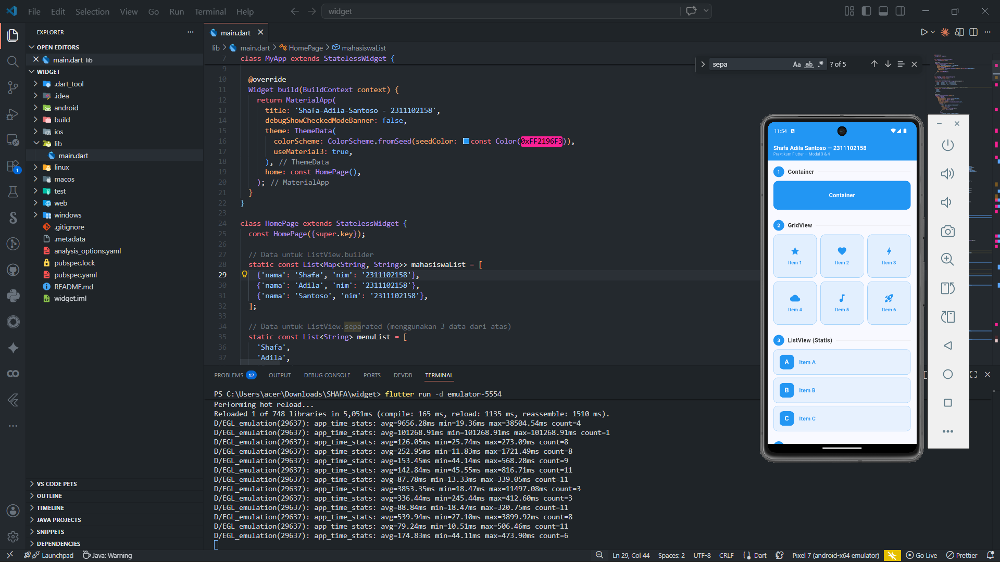
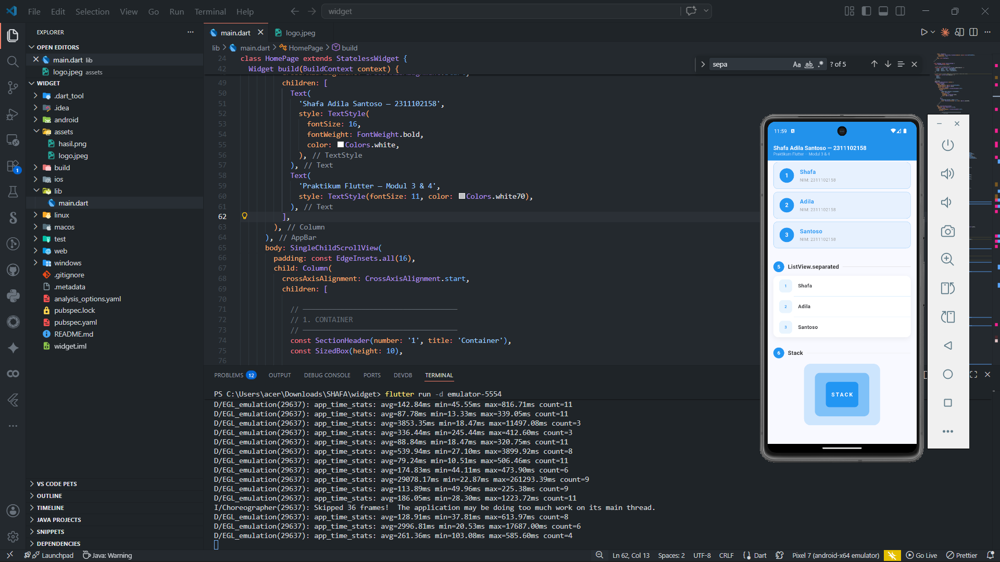

<div align="center">
  <br />
  <h1>LAPORAN PRAKTIKUM <br>APLIKASI BERBASIS PLATFORM</h1>
  <br />
  <h3>MODUL 3 & 4</h3>
  <h3>WIDGET</h3>
  <br />
   
  <br />
  <br />
  <br />
  <h3>Disusun Oleh :</h3>
  <p>
    <strong>SHAFA ADILA SANTOSO</strong><br>
    <strong>2311102158</strong><br>
    <strong>S1 IF-11-REG01</strong>
  </p>
  <br />
  <br />
  <h3>Dosen Pengampu :</h3>
  <p>
    <strong>Dimas Fanny Hebrasianto Permadi, S.ST., M.Kom</strong>
  </p>
  <br />
  <br />
    <h4>Asisten Praktikum :</h4>
    <strong> Apri Pandu Wicaksono </strong> <br>
    <strong>Rangga Pradarrell Fathi</strong>
  <br />
  <h3>LABORATORIUM HIGH PERFORMANCE
 <br>FAKULTAS INFORMATIKA <br>UNIVERSITAS TELKOM PURWOKERTO <br>2026</h3>
</div>

---

## 1. Dasar Teori

Dalam pengembangan aplikasi dengan Flutter, **Widget** adalah elemen dasar pembangun antarmuka pengguna (UI). Semuanya di Flutter adalah widget, baik itu yang bersifat struktural (seperti tombol atau teks), layout (seperti *padding* atau margin), maupun efek visual.

Terdapat beberapa jenis widget dasar yang sering digunakan:

- **Container**: Widget multifungsi yang bisa digunakan untuk mengatur ukuran, *padding*, *margin*, serta dekorasi (seperti warna latar atau *border*).
- **GridView**: Widget untuk menampilkan sekumpulan data dalam bentuk tata letak *grid* dua dimensi (baris dan kolom) yang dapat di-scroll.
- **ListView**: Widget *layout* yang berfungsi menyusun daftar *child* (elemen) secara linear, baik vertikal maupun horizontal, dan otomatis menyediakan fitur *scroll*. *ListView* memiliki variasi seperti `.builder` untuk *generate* elemen secara dinamis sesuai ukuran *array*, serta `.separated` yang menambahkan elemen pemisah (garis antar baris).
- **Stack**: Widget yang digunakan untuk menumpuk elemen-elemen di atas satu sama lain. Widget yang ditulis pertama akan berada di tumpukan paling bawah, sedangkan yang terakhir berada paling atas.

---

## 2. Penjelasan Code

Berikut adalah kode dari implementasi fungsi setiap widget pada modul ini. Data statis yang digunakan untuk mengisi *list* dinamis diambil dari *array* berikut:

```dart
// Data array untuk ListView.builder
static const List<Map<String, String>> mahasiswaList = [
  {'nama': 'Shafa', 'nim': '2311102158'},
  {'nama': 'Adila', 'nim': '2311102158'},
  {'nama': 'Santoso', 'nim': '2311102158'},
];

// Data untuk ListView.separated
static const List<String> menuList = ['Shafa', 'Adila', 'Santoso'];
```

### A. Container

```dart
Container(
  width: double.infinity,
  height: 80,
  decoration: BoxDecoration(
    color: const Color(0xFF2196F3),
    borderRadius: BorderRadius.circular(14),
  ),
  alignment: Alignment.center,
  child: const Text(
    'Container',
    style: TextStyle(
      color: Colors.white,
      fontSize: 16,
      fontWeight: FontWeight.bold,
    ),
  ),
)
```

**Penjelasan:**
Pada potongan kode di atas, kami mendefinisikan sebuah `Container` yang lebarnya memenuhi rentang layar (dengan `double.infinity`) dan tinggi tetap di `80`. Menggunakan parameter `decoration` dan `BoxDecoration`, kami memberikan tema warna biru solid (`Color(0xFF2196F3)`) serta memberikan lengkungan yang lembut di sudutnya (`borderRadius`). Properti `alignment: Alignment.center` digunakan agar tulisan teks di dalamnya otomatis berada presisi di tengah.

### B. GridView

```dart
GridView.count(
  crossAxisCount: 3,
  crossAxisSpacing: 10,
  mainAxisSpacing: 10,
  shrinkWrap: true,
  physics: const NeverScrollableScrollPhysics(),
  children: [
    _gridItem('Item 1', Icons.star, const Color(0xFF2196F3)),
    _gridItem('Item 2', Icons.favorite, const Color(0xFF2196F3)),
    _gridItem('Item 3', Icons.bolt, const Color(0xFF2196F3)),
    _gridItem('Item 4', Icons.cloud, const Color(0xFF2196F3)),
    _gridItem('Item 5', Icons.music_note, const Color(0xFF2196F3)),
    _gridItem('Item 6', Icons.rocket_launch, const Color(0xFF2196F3)),
  ],
)
```

**Penjelasan:**
`GridView.count` membagi layout tampilan menjadi bentuk kotak-kotak berkolom (`crossAxisCount: 3`), sehingga elemen ditampilkan berjajar menyamping dengan maksimal 3 elemen dalam satu baris. Parameter `shrinkWrap: true` dan `physics: const NeverScrollableScrollPhysics()` secara khusus ditambahkan di sini karena GridView tersebut dibungkus oleh `SingleChildScrollView`, sehingga menghindari bentrok mekanisme *scroll* antara *parent* dan *child*.

### C. ListView (Statis)

```dart
ListView(
  shrinkWrap: true,
  physics: const NeverScrollableScrollPhysics(),
  children: [
    _listStaticItem('A', 'Item A', const Color(0xFF2196F3)),
    const SizedBox(height: 8),
    _listStaticItem('B', 'Item B', const Color(0xFF2196F3)),
    const SizedBox(height: 8),
    _listStaticItem('C', 'Item C', const Color(0xFF2196F3)),
  ],
)
```

**Penjelasan:**
ListView standar/statis akan menumpuk widget-widgetnya (`_listStaticItem`) ke bawah dalam proporsi vertikal. Pada jenis widget ini, data disematkan langsung (secara *hardcode*) di dalam atribut `children`. Spasi antar item kami buat menggunakan elemen `SizedBox`.

### D. ListView.builder

```dart
ListView.builder(
  shrinkWrap: true,
  physics: const NeverScrollableScrollPhysics(),
  itemCount: mahasiswaList.length,
  itemBuilder: (context, index) {
    final color = const Color(0xFF2196F3);
    final data = mahasiswaList[index];
    return Container(
      margin: const EdgeInsets.only(bottom: 8),
      decoration: BoxDecoration(
        color: color.withOpacity(0.08),
        borderRadius: BorderRadius.circular(12),
        border: Border.all(color: color.withOpacity(0.3)),
      ),
      child: ListTile(
        leading: CircleAvatar(
          backgroundColor: color,
          child: Text('${index + 1}', style: const TextStyle(color: Colors.white)),
        ),
        title: Text(data['nama']!, style: TextStyle(fontWeight: FontWeight.bold, color: color)),
        subtitle: Text('NIM: ${data['nim']}', style: const TextStyle(fontSize: 12, color: Colors.grey)),
      ),
    );
  },
)
```

**Penjelasan:**
Widget `ListView.builder` digunakan untuk data yang bersifat koleksi secara dinamis. Panjang list disesuaikan dengan isi koleksi (`itemCount: mahasiswaList.length`). Di dalam parameter `itemBuilder`, sistem hanya merender widget per basis indeks iterasi yang sedang dimuat, lalu diletakkan ke dalam balutan `ListTile` dan kotak hiasan dengan *border* tipis.

### E. ListView.separated

```dart
ListView.separated(
  shrinkWrap: true,
  physics: const NeverScrollableScrollPhysics(),
  itemCount: menuList.length,
  separatorBuilder: (context, index) => Divider(
    height: 1,
    color: const Color(0xFF2196F3).withOpacity(0.15),
    indent: 56,
  ),
  itemBuilder: (context, index) {
    return ListTile(
      leading: Container(
        width: 36, height: 36,
        decoration: BoxDecoration(color: const Color(0xFF2196F3).withOpacity(0.1), borderRadius: BorderRadius.circular(10)),
        alignment: Alignment.center,
        child: Text('${index + 1}', style: const TextStyle(fontWeight: FontWeight.bold, color: Color(0xFF2196F3))),
      ),
      title: Text(menuList[index], style: const TextStyle(fontWeight: FontWeight.w600, fontSize: 14)),
    );
  },
)
```

**Penjelasan:**
Hampir serupa dengan format sebelumnya, akan tetapi `ListView.separated` memanfaatkan satu tambahan properti `separatorBuilder`. Pada baris ini, properti tersebut dikembalikan sebagai widget `Divider` bewarna tipis transparan dengan *indent* untuk mendefinisikan sekat atau garis pembatas visual antar barisan komponen data, tanpa tanda ikon panah di sebelahnya (karena sudah dihapus).

### F. Stack

```dart
Stack(
  alignment: Alignment.center,
  children: [
    Container(
      width: 210,
      height: 170,
      decoration: BoxDecoration(
        color: const Color(0xFF2196F3).withOpacity(0.2),
        borderRadius: BorderRadius.circular(18),
      ),
    ),
    Container(
      width: 150,
      height: 120,
      decoration: BoxDecoration(
        color: const Color(0xFF2196F3).withOpacity(0.45),
        borderRadius: BorderRadius.circular(14),
      ),
    ),
    Container(
      width: 90,
      height: 70,
      decoration: BoxDecoration(
        color: const Color(0xFF2196F3),
        borderRadius: BorderRadius.circular(10),
      ),
    ),
    const Text(
      'STACK',
      style: TextStyle(
        color: Colors.white,
        fontWeight: FontWeight.bold,
        fontSize: 15,
        letterSpacing: 3,
      ),
    ),
  ],
)
```

**Penjelasan:**
Pada implementasi kode di atas, widget `Stack` dimanfaatkan untuk menumpuk 3 elemen persegi (*Container*) dengan ukuran yang bertahap makin mengecil. Posisi *stack* ini memusat secara proporsional berkat adanya instruksi `alignment: Alignment.center`. Teks bertuliskan "STACK" diletakkan pada akhir kumpulan item (`children`), sehingga secara visual posisinya menjadi penampakan terdepan di layar, persis di atas kotak yang paling tebal warnanya.

---

## 3. Hasil Tampilan (*Output*)




