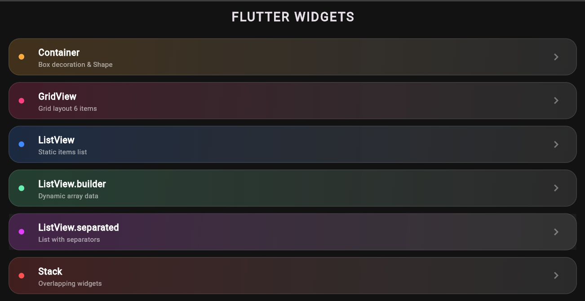
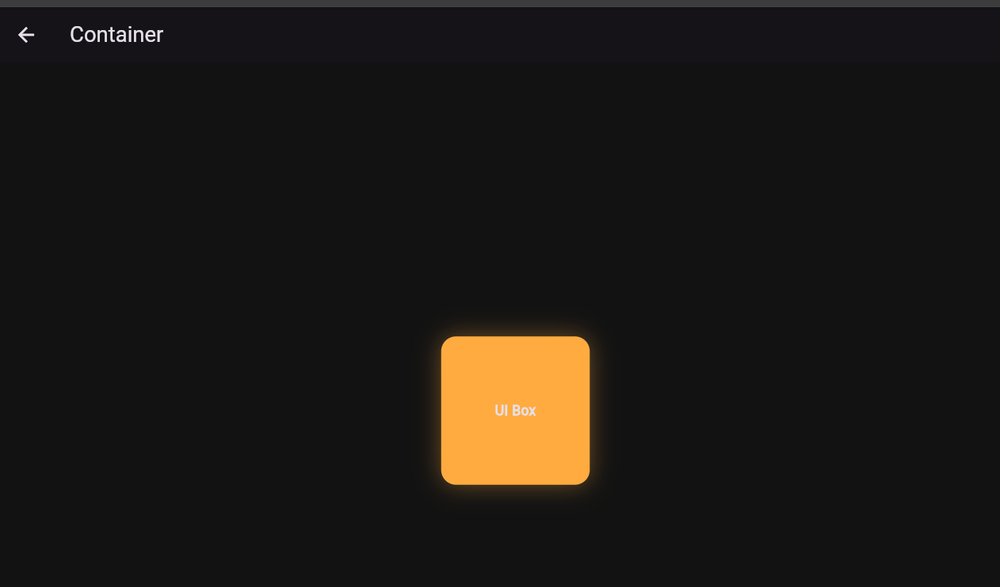
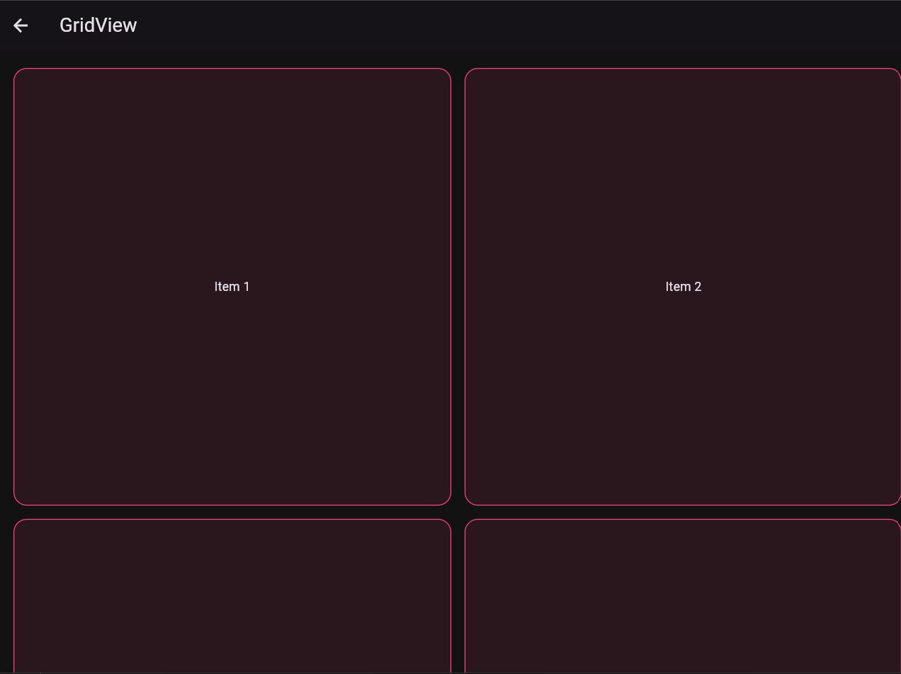

<div align="center">
  <br />

  <h1>LAPORAN PRAKTIKUM <br>
  APLIKASI BERBASIS PLATFORM
  </h1>

  <br />

  <h3>MODUL 3 & 4 <br>
  MOBILE
  </h3>

  <br />

  


  <br />
  <br />
  <br />

  <h3>Disusun Oleh :</h3>

  <p>
    <strong>Mohammad Alfan Naraya</strong><br>
    <strong>2311102170</strong><br>
    <strong>S1 IF-11-01</strong>
  </p>

  <br />

  <h3>Dosen Pengampu :</h3>

  <p>
    <strong>Dimas Fanny Hebrasianto Permadi, S.ST., M.Kom</strong>
  </p>
  
  <br />
  <br />
    <h4>Asisten Praktikum :</h4>
    <strong>Apri Pandu Wicaksono </strong> <br>
    <strong>Rangga Pradarrell Fathi</strong>
  <br />

  <h3>LABORATORIUM HIGH PERFORMANCE
 <br>FAKULTAS INFORMATIKA <br>UNIVERSITAS TELKOM PURWOKERTO <br>2026</h3>
</div>

<hr>

## 💻 Source Code

### Struktur Project

```
praktikum_modul_04/
├── lib/
│   └── main.dart          
├── assets/                
├── .gitignore             
└── pubspec.yaml           
```

### `lib/main.dart`

```dart
import 'package:flutter/material.dart';

void main() {
  runApp(const MyApp());
}

class MyApp extends StatelessWidget {
  const MyApp({super.key});

  @override
  Widget build(BuildContext context) {
    return MaterialApp(
      debugShowCheckedModeBanner: false,
      title: 'Alfan Lab Modul 4',
      theme: ThemeData.dark().copyWith(
        scaffoldBackgroundColor: const Color(0xFF121212),
        colorScheme: ColorScheme.fromSeed(seedColor: Colors.deepPurple, brightness: Brightness.dark),
      ),
      home: const MainDashboard(),
    );
  }
}

class MainDashboard extends StatelessWidget {
  const MainDashboard({super.key});

  @override
  Widget build(BuildContext context) {
    return Scaffold(
      appBar: AppBar(
        title: const Text("FLUTTER WIDGETS", style: TextStyle(letterSpacing: 2, fontWeight: FontWeight.bold)),
        centerTitle: true,
        backgroundColor: Colors.transparent,
        elevation: 0,
      ),
      body: Padding(
        padding: const EdgeInsets.symmetric(horizontal: 16),
        child: Column(
          children: [
            const SizedBox(height: 10),
            _buildTile(context, "Container", "Box decoration & Shape", Colors.orangeAccent, const PageContainer()),
            _buildTile(context, "GridView", "Grid layout 6 items", Colors.pinkAccent, const PageGrid()),
            _buildTile(context, "ListView", "Static items list", Colors.blueAccent, const PageListStatic()),
            _buildTile(context, "ListView.builder", "Dynamic array data", Colors.greenAccent, const PageListBuilder()),
            _buildTile(context, "ListView.separated", "List with separators", Colors.purpleAccent, const PageListSeparated()),
            _buildTile(context, "Stack", "Overlapping widgets", Colors.redAccent, const PageStack()),
          ],
        ),
      ),
    );
  }

  Widget _buildTile(BuildContext context, String title, String sub, Color color, Widget target) {
    return Container(
      margin: const EdgeInsets.only(bottom: 12),
      decoration: BoxDecoration(
        borderRadius: BorderRadius.circular(20),
        gradient: LinearGradient(
          colors: [color.withOpacity(0.2), Colors.white10],
          begin: Alignment.topLeft,
          end: Alignment.bottomRight,
        ),
        border: Border.all(color: Colors.white12),
      ),
      child: ListTile(
        onTap: () => Navigator.push(context, MaterialPageRoute(builder: (context) => target)),
        leading: Icon(Icons.circle, color: color, size: 12),
        title: Text(title, style: const TextStyle(fontWeight: FontWeight.bold, color: Colors.white)),
        subtitle: Text(sub, style: const TextStyle(color: Colors.white60, fontSize: 12)),
        trailing: const Icon(Icons.keyboard_arrow_right, color: Colors.white38),
      ),
    );
  }
}

// --- DETAIL PAGES ---

class PageContainer extends StatelessWidget {
  const PageContainer({super.key});
  @override
  Widget build(BuildContext context) {
    return Scaffold(
      appBar: AppBar(title: const Text("Container")),
      body: Center(
        child: Container(
          width: 150, height: 150,
          decoration: BoxDecoration(
            color: Colors.orangeAccent,
            borderRadius: BorderRadius.circular(15),
            boxShadow: [BoxShadow(color: Colors.orangeAccent.withOpacity(0.4), blurRadius: 20)],
          ),
          child: const Center(child: Text("UI Box", style: TextStyle(fontWeight: FontWeight.bold))),
        ),
      ),
    );
  }
}

class PageGrid extends StatelessWidget {
  const PageGrid({super.key});
  @override
  Widget build(BuildContext context) {
    return Scaffold(
      appBar: AppBar(title: const Text("GridView")),
      body: GridView.count(
        crossAxisCount: 2,
        padding: const EdgeInsets.all(20),
        mainAxisSpacing: 15,
        crossAxisSpacing: 15,
        children: List.generate(6, (i) => Container(
          decoration: BoxDecoration(color: Colors.pinkAccent.withOpacity(0.1), borderRadius: BorderRadius.circular(15), border: Border.all(color: Colors.pinkAccent)),
          child: Center(child: Text("Item ${i+1}")),
        )),
      ),
    );
  }
}

class PageListStatic extends StatelessWidget {
  const PageListStatic({super.key});
  @override
  Widget build(BuildContext context) {
    return Scaffold(
      appBar: AppBar(title: const Text("Standard List")),
      body: ListView(
        children: const [
          ListTile(title: Text("A"), trailing: Icon(Icons.star_border)),
          ListTile(title: Text("B"), trailing: Icon(Icons.star_border)),
          ListTile(title: Text("C"), trailing: Icon(Icons.star_border)),
        ],
      ),
    );
  }
}

class PageListBuilder extends StatelessWidget {
  const PageListBuilder({super.key});
  @override
  Widget build(BuildContext context) {
    final items = ["PHP", "SQL", "JavaScript", "Dart", "C++"];
    return Scaffold(
      appBar: AppBar(title: const Text("Builder List")),
      body: ListView.builder(
        itemCount: items.length,
        itemBuilder: (ctx, i) => ListTile(title: Text(items[i]), leading: const Icon(Icons.code)),
      ),
    );
  }
}

class PageListSeparated extends StatelessWidget {
  const PageListSeparated({super.key});
  @override
  Widget build(BuildContext context) {
    return Scaffold(
      appBar: AppBar(title: const Text("Separated List")),
      body: ListView.separated(
        itemCount: 4,
        separatorBuilder: (ctx, i) => const Divider(color: Colors.purpleAccent, indent: 20, endIndent: 20),
        itemBuilder: (ctx, i) => ListTile(title: Text("Separated Row $i")),
      ),
    );
  }
}

class PageStack extends StatelessWidget {
  const PageStack({super.key});
  @override
  Widget build(BuildContext context) {
    return Scaffold(
      appBar: AppBar(title: const Text("Stack Widget")),
      body: Center(
        child: Stack(
          alignment: Alignment.center,
          children: [
            Container(width: 200, height: 200, color: Colors.grey[900]),
            Container(width: 100, height: 100, color: Colors.redAccent.withOpacity(0.5)),
            const Text("Layered", style: TextStyle(letterSpacing: 4)),
          ],
        ),
      ),
    );
  }
}
```

## Penjelasan Widget

### 1. Container

```dart
class PageContainer extends StatelessWidget {
  const PageContainer({super.key});
  @override
  Widget build(BuildContext context) {
    return Scaffold(
      appBar: AppBar(title: const Text("Container")),
      body: Center(
        child: Container(
          width: 150, 
          height: 150,
          decoration: BoxDecoration(
            color: Colors.orangeAccent,
            borderRadius: BorderRadius.circular(15),
            boxShadow: [
              BoxShadow(
                color: Colors.orangeAccent.withOpacity(0.4), 
                blurRadius: 20
              )
            ],
          ),
          child: const Center(
            child: Text("UI Box", style: TextStyle(fontWeight: FontWeight.bold))
          ),
        ),
      ),
    );
  }
}
```

**Container** Widget Container pada kode tersebut berfungsi sebagai elemen tata letak utama yang memiliki dimensi tetap sebesar 150x150 piksel. Melalui properti BoxDecoration, Container ini diberi warna orangeAccent, sudut yang melengkung menggunakan borderRadius, serta efek bayangan boxShadow untuk memberikan kesan visual yang lebih modern. Di dalamnya terdapat widget Text yang diposisikan di tengah menggunakan widget Center sebagai konten utama dari kotak tersebut. Secara fungsional, implementasi ini menunjukkan bagaimana Container digunakan dalam Flutter untuk membungkus, menghias, dan mengatur posisi elemen visual dalam satu unit komponen.

---

### 2. GridView

```dart
class PageGrid extends StatelessWidget {
  const PageGrid({super.key});
  @override
  Widget build(BuildContext context) {
    return Scaffold(
      appBar: AppBar(title: const Text("GridView")),
      body: GridView.count(
        crossAxisCount: 2,
        padding: const EdgeInsets.all(20),
        mainAxisSpacing: 15,
        crossAxisSpacing: 15,
        children: List.generate(6, (i) => Container(
          decoration: BoxDecoration(
            color: Colors.pinkAccent.withOpacity(0.1), 
            borderRadius: BorderRadius.circular(15), 
            border: Border.all(color: Colors.pinkAccent)
          ),
          child: Center(child: Text("Item ${i+1}")),
        )),
      ),
    );
  }
}
```

**GridView** Widget GridView.count pada kode ini digunakan untuk menyusun elemen dalam bentuk baris dan kolom, dengan jumlah kolom tetap sebanyak dua buah melalui properti crossAxisCount. Tata letaknya diatur menggunakan mainAxisSpacing dan crossAxisSpacing sebesar 15 unit untuk memberikan jarak antar item, serta padding di sekeliling grid agar tampilan tidak menyentuh tepi layar. Setiap item di dalam grid dihasilkan secara dinamis menggunakan List.generate sebanyak enam buah, di mana masing-masing item berupa Container dengan dekorasi garis tepi (border) berwarna pink dan teks yang diposisikan di tengah. Secara keseluruhan, implementasi ini menunjukkan bagaimana Flutter mengelola tata letak dua dimensi yang responsif dan teratur.

---

### 3. ListView

```dart
ListView(
  children: const [
    ListTile(
      leading: CircleAvatar(backgroundColor: Colors.indigo, ...),
      title: Text('Item A'),
      subtitle: Text('Deskripsi item pertama'),
    ),
    Divider(height: 1),
    // ... item lainnya
  ],
)
```

**ListView** menampilkan kumpulan widget secara berurutan (vertikal atau horizontal). Dalam contoh ini, ListView membungkus beberapa widget ListTile statis. ListTile adalah widget standar Flutter yang memudahkan pembuatan daftar dengan ikon di kiri (leading), judul, dan subjudul.

---

### 4. ListView.builder

```dart
class PageListBuilder extends StatelessWidget {
  const PageListBuilder({super.key});
  @override
  Widget build(BuildContext context) {
    final items = ["PHP", "SQL", "JavaScript", "Dart", "C++"];
    return Scaffold(
      appBar: AppBar(title: const Text("Builder List")),
      body: ListView.builder(
        itemCount: items.length,
        itemBuilder: (ctx, i) => ListTile(title: Text(items[i]), leading: const Icon(Icons.code)),
      ),
    );
  }
}
```

**ListView.builder** digunakan untuk menampilkan daftar data secara dinamis dengan lebih efisien karena hanya merender item yang muncul pada area pandang layar saja. Pada kode ini, builder mengambil data dari sebuah array yang berisi nama-nama bahasa pemrograman seperti PHP dan SQL, kemudian secara otomatis memetakan setiap elemen menjadi widget ListTile lengkap dengan ikon kode sebagai penanda. Metode ini sangat ideal digunakan untuk menangani kumpulan data dalam jumlah besar karena dapat menghemat penggunaan memori perangkat secara signifikan.

### 5. ListView.separated

```dart
class PageListSeparated extends StatelessWidget {
  const PageListSeparated({super.key});
  @override
  Widget build(BuildContext context) {
    return Scaffold(
      appBar: AppBar(title: const Text("Separated List")),
      body: ListView.separated(
        itemCount: 4,
        separatorBuilder: (ctx, i) => const Divider(color: Colors.purpleAccent, indent: 20, endIndent: 20),
        itemBuilder: (ctx, i) => ListTile(title: Text("Separated Row $i")),
      ),
    );
  }
}
```

**ListView.separated** Widget ListView.separated memiliki cara kerja yang serupa dengan tipe builder, namun ditambahkan dengan fungsi separatorBuilder untuk menyisipkan elemen dekoratif di antara setiap item. Dalam implementasi tugas ini, pemisah yang digunakan adalah widget Divider berwarna ungu (purpleAccent) yang memberikan batas visual yang tegas dan rapi antar baris. Pendekatan ini memastikan bahwa elemen pembatas tidak muncul di awal atau akhir daftar, melainkan tepat berada di tengah sebagai pemisah antar komponen data.

### 6. Stack

```dart
class PageStack extends StatelessWidget {
  const PageStack({super.key});
  @override
  Widget build(BuildContext context) {
    return Scaffold(
      appBar: AppBar(title: const Text("Stack Widget")),
      body: Center(
        child: Stack(
          alignment: Alignment.center,
          children: [
            Container(width: 200, height: 200, color: Colors.grey[900]),
            Container(width: 100, height: 100, color: Colors.redAccent.withOpacity(0.5)),
            const Text("Layered", style: TextStyle(letterSpacing: 4)),
          ],
        ),
      ),
    );
  }
}
```

**Stack** Widget Stack pada kode tersebut digunakan untuk menempatkan beberapa widget secara berlapis satu di atas yang lain dalam urutan indeks dari bawah ke atas. Implementasi ini menggunakan properti alignment: Alignment.center untuk memastikan semua elemen di dalamnya, mulai dari kotak dasar berwarna abu-abu gelap, kotak merah transparan di lapisan tengah, hingga teks "Layered" di lapisan paling depan, berada tepat di titik tengah layar. Penggunaan Stack ini mendemonstrasikan cara membuat tata letak yang kompleks di mana elemen-elemen dapat saling bertumpuk untuk menciptakan efek visual yang lebih dalam dan bervariasi.
---

## Screenshot Hasil





