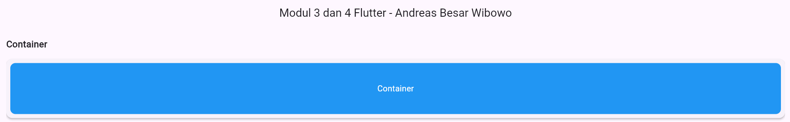
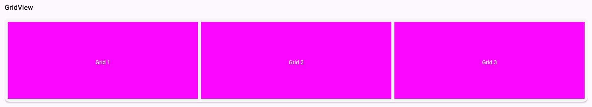
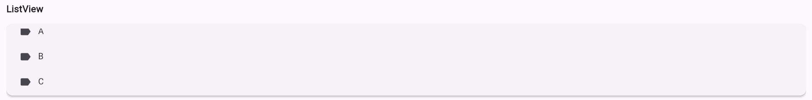
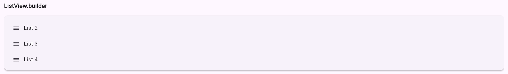
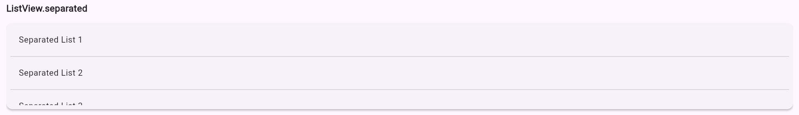
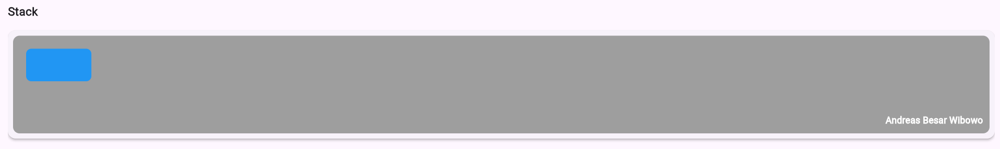

<div align="center">
  <br />

  <h1>LAPORAN PRAKTIKUM <br>
  APLIKASI BERBASIS PLATFORM
  </h1>

  <br />

  <h3>MODUL III & IV 

  PENGENALAN DART & ANTARMUKA PENGGUNA
  </h3>

  <br />

  

  <br />
  <br />
  <br />

  <h3>Disusun Oleh :</h3>

  <p>
    <strong>Andreas Besar Wibowo</strong><br>
    <strong>2311102198</strong><br>
    <strong>S1 IF-11-REG01</strong>
  </p>

  <br />

  <h3>Dosen Pengampu :</h3>

  <p>
    <strong>Dimas Fanny Hebrasianto Permadi, S.ST., M.Kom</strong>
  </p>
  
  <br />
    <h4>Asisten Praktikum :</h4>
    <strong>Apri Pandu Wicaksono </strong> <br>
    <strong>Rangga Pradarrell Fathi</strong>
  <br />

  <h3>LABORATORIUM HIGH PERFORMANCE
 <br>FAKULTAS INFORMATIKA <br>UNIVERSITAS TELKOM PURWOKERTO <br>2026</h3>
</div>

<hr>

## Dasar Teori
### Pengenalan Dart
Untuk belajar flutter, tidak perlu terlalu fasih untuk mempelajari bahasa dart. Terdapat fundamental yang perlu dipelajari seperti variable, statement control, looping, array, fungsi, dsb. Karakteristik bahasa dart mirip dengan bahasa C ataupun Java. Wajib menggunakan titik koma diakhir codingan.

#### Variable
Untuk penggunaan variable di dart, terdapat beberapa cara, yaitu dengan var, type annotation dan multiple variable.
```dart
// var
var <variable_name>;
var <name> = <expression>;

// type annotation
<type> <variable_name>;
<type> <name> = <expression>;

// multiple variable
<type> <var1, var2, ... varN>;
```

Variable primitif yang tersedia di dart:
1. Integer
2. Double
3. String
4. Boolean

#### Statement Control 
Terdapat beberapa cara untuk mendeklarasikan statement control, yaitu if, if else, if else if, switch case.
- IF Statement
```dart
// IF STATEMENT
if(condition){
    // statements
}
```

- IF ELSE Statement
```dart
// IF ELSE STATEMENT
if(condition){
    // statements
} else {
    // statements
}
```

- IF ELSE IF Statement
```dart
 // IF ELSE IF STATEMENT
 if (condition1) {
     // statement(s)
 } else if (condition2) {
     // statement(s)
 } else if (conditionN) {
     // statement(s)
 } else {
     // statement(s)
 }
```

- SWITCH CASE Statement
```dart
 // SWITCH CASE
 switch (expression) {
     case value1: {
         // statements
         break;
     }
     case value2: {
         // statements
         break;
     }
     default: {
         // statements
         break;
     }
 }
```

#### Looping
Secara umum, terdapat dua cara untuk melakukan looping di dart, yaitu menggunakan for loop dan while loop.

- For Loops

Gunakan for loop saat kondisinya tau persis seberapa banyak looping akan dilakukan, contohnya melakukan perulangan sebanyak 10 kali dengan iterasi sebanyak 1 tingkat atau 1 kali.
```dart
for (initial_count_value; termination-condition; step) { 
 //statements 
}
```

- While Loops

Gunakan while loop saat kondisinya tidak tahu kapan perulangan akan berhenti, contohnya sediakan input angka hingga user menginput tanda "-".
```dart
while (expression) {
 // Statement(s) to be executed if expression is true 
}
```

#### List
Secara umum, kumpulan banyak data dalam satu variable disibut array. Tetapi beberapa bahasa pemrograman menyebutnya dengan list, termasuk bahasa dart ini. List memiliki 2 tipe, yaitu Fixed Length List dan Growable List.

- Fixed Length List

Dari namanya bisa diketahui bahwa tipe list ini memiliki panjang index yang tetap dan tidak dapat bertambah banyak.
```dart
// Mendeklarasikan list
var list_name = new List(initial_size);

// Menginisialisasikan list
list_name[index] = value;

// Contohnya
var newList = new List(3);
newList[0] = 12;
newList[1] = 13;
newList[2] = 11;
```

- Growable List

Gunakan growable list apabila memiliki banyak object yang tidak menentu atau banyaknya object yang terus bertambah.
```dart
// Mendeklarasikan list
var list_name = new List();

// Menginisialisasikan list
list_name[index] = value;

// Contohnya
var newList = new List(3);
newList[0] = 12;
newList[1] = 13;
newList[2] = 11;
```

#### Fungsi
Pada bahasa pemrograman yang mendukung Object Oriented Programming, fungsi atau prosedur memilki peranan yang sangat penting. Untuk menghasilkan kualitas kode yang sangat baik, programmer bisa menggunakan beberapa prinsip pemrograman yang umum digunakan seperti SOLID, KISS, YAGNI, dsb. Semua prinsip tersebut menjunjung tinggi separation of concern yang artinya setiap kodingan memiliki tanggung jawabnya sendiri dan mengurangi sebanyak mungkin boilerplate code.

- Mendefinisikan Fungsi
```dart
void function_name() { 
 //statements 
}
```
- Memanggil Fungsi
```dart
void main() {
  print(factorial(6));
}
```
- Mengembalikan Nilai

Tambahkan return apabila anda mendefinisikan sebuah fungsi, contohnya ada pada codingan dibawah yang bisa mengembalikan nilai faktorial dari angka yang sudah ditentukan.
```dart
factorial(number) {
    if (number <= 0) {
        // termination case
        return 1;
    } else {
        // function invokes itself
        return number * factorial(number - 1);
    }
}
```
- Menambah Parameter

Fungsi memiliki scope yang terbatas, tentunya fungsi butuh input dari luar agar program didalamnya bisa memproses tugasnya.
```dart
factorial(number) {
    if (number <= 0) {
        // termination case
        return 1;
    } else {
        return number * factorial(number - 1);
        // function invokes itself
    }
}
```
Pada fungsi diatas, number merupakan parameter. Variable diluar fungsi yang dibuat agar dapat digunakan didalam fungsi.

### Pengenalan Widget
Flutter dibuat oleh google yang terinspirasi oleh Reactjs. Pada dasarnya semua tampilan akan dipecah menjadi komponen-komponen yang kecil dan memiliki environment sendiri untuk mengelola dirinya. Komponen tersebut dinamai Widget pada Flutter. Masing-masing widget memiliki state dan konfigurasinya sendiri, sehingga ketika state pada widget berubah, widget akan membuat ulang dirinya agar selalu update dengan perubahan yang terjadi.

Berikut contoh penerapan HelloWorld pada Flutter:
```dart
import 'package:flutter/material.dart';

void main() {
    runApp(
        const Center(
            child: Text(
                'Hello, world!',
                textDirection: TextDirection.ltr,
            ),
        ),
    );
}
```

### Container
Layout pertama yang harus dipahami adalah Container. Container merupakan widget untuk membuat elemen visual seperti kotak. Container dapat didekorasi menggunakan BoxDecoration seperti background, border, atau shadow. Container memiliki margin dan padding untuk memberikan jarak antara komponen satu dengan komponen yang lainnya. Berikut cara penerapan Container pada Flutter:

Tambahkan kode berikut pada:
```dart
import 'package:flutter/material.dart';

void main() {
    runApp(
        Center(
            child: Container(
                margin: const EdgeInsets.all(10.0),
                color: Colors.amber[600],
                width: 48.0,
                height: 48.0,
            ),
        ),
    );
}
```
### GridView
GridView merupakan widget yang serupa dengan Array 2D dalam bahasa pemrograman apapun. Widget tersebut digunakan ketika harus menampilkan sesuatu pada Grid tersebut, seperti menampilkan images, text, icons, dll. Berikut contoh penerapan GridView:

Tambahkan kode berikut di dalam kurung runApp()
```dart
GridView.count(
    primary: false,
    padding: const EdgeInsets.all(20),
    crossAxisSpacing: 10,
    mainAxisSpacing: 10,
    crossAxisCount: 2,
    children: <Widget>[
        Container(
            padding: const EdgeInsets.all(8),
            child: const Text("He'd have you all unravel at the"),
            color: Colors.teal[100],
        ),
        Container(
            padding: const EdgeInsets.all(8),
            child: const Text('Heed not the rabble'),
            color: Colors.teal[200],
        ),
        Container(
            padding: const EdgeInsets.all(8),
            child: const Text('Sound of screams but the'),
            color: Colors.teal[300],
        ),
        Container(
            padding: const EdgeInsets.all(8),
            child: const Text('Who scream'),
            color: Colors.teal[400],
        ),
        Container(
            padding: const EdgeInsets.all(8),
            child: const Text('Revolution is coming...'),
            color: Colors.teal[500],
        ),
        Container(
            padding: const EdgeInsets.all(8),
            child: const Text('Revolution, they...'),
            color: Colors.teal[600],
        ),
    ],
)
```
### ListView
ListView merupakan widget scroll yang paling umum digunakan. Widget ini dapat menampilkan lebih dari satu komponen atau widget melalui variabel children.

Pada pembahasan kali ini akan menggunakan ListView default dengan variabel children pada widget tersebut List`<Widget>`. Cara penggunaan ListView ini dengan memasukkan widget yang ingin disusun sebagai children dari ListView.

Berikut contoh penerapan ListView:
```dart
ListView(
    padding: const EdgeInsets.all(8),
    children: <Widget>[
        Container(
            height: 50,
            color: Colors.amber[600],
            child: const Center(child: Text('Entry A')),
        ),
        Container(
            height: 50,
            color: Colors.amber[500],
            child: const Center(child: Text('Entry B')),
        ),
        Container(
            height: 50,
            color: Colors.amber[100],
            child: const Center(child: Text('Entry C')),
        ),
    ],
)
```
#### ListView.builder
Widget ini cocok digunakan ketika memiliki data list yang lebih besar. ListView.builder membutuhkan itemBuilder dan itemCount. Parameter itemBuilder merupakan fungsi yang mengembalikan widget untuk ditampilkan. Sedangkan itemCount kita isi dengan jumlah seluruh item yang ingin ditampilkan.

Berikut ini adalah contoh penerapan ListView.builder
```dart
final List<String> entries = <String>['A', 'B', 'C'];
final List<int> colorCodes = <int>[600, 500, 100];

ListView.builder(
    padding: const EdgeInsets.all(8),
    itemCount: entries.length,
    itemBuilder: (BuildContext context, int index) {
        return Container(
            height: 50,
            color: Colors.amber[colorCodes[index]],
            child: Center(
                child: Text('Entry ${entries[index]}'),
            ),
        );
    },
);
```
#### ListView.separated
ListView jenis ini akan menampilkan daftar item yang dipisahkan dengan separator. Penggunaan ListView.separated mirip dengan builder, yang membedakan adalah terdapat satu parameter tambahan wajib yaitu separatorBuilder yang mengembalikan Widget yang akan berperan sebagai separator.

Berikut contoh penerapan ListView.separated:
```dart
final List<String> entries = <String>['A', 'B', 'C'];
final List<int> colorCodes = <int>[600, 500, 100];

ListView.separated(
    padding: const EdgeInsets.all(8),
    itemCount: entries.length,
    itemBuilder: (BuildContext context, int index) {
        return Container(
            height: 50,
            color: Colors.amber[colorCodes[index]],
            child: Center(
                child: Text('Entry ${entries[index]}'),
            ),
        );
    },
    separatorBuilder: (BuildContext context, int index) =>
        const Divider(),
);
```
### Stack
Widget ini merupakan widget yang saling tumpang tindih terhadap widget lain. Seperti image dan text yang saling bertumpuk, atau overlay yang terdapat button dan widget lainnya.

Dengan menggunakan Stack dapat memposisikan widget satu sama lain dan bertumpukan antar widget.

Berikut contoh penerapan Stack:
```dart
Stack(
    children: <Widget>[
        Container(
            width: 100,
            height: 100,
            color: Colors.red,
        ),
        Container(
            width: 90,
            height: 90,
            color: Colors.green,
        ),
        Container(
            width: 80,
            height: 80,
            color: Colors.blue,
        ),
    ],
)
```
Selanjutnya adalah penerapan Stack dengan text dan ditambahkan dengan background gradient di belakangnya. Berikut contoh penerapannya:
```dart
SizedBox(
    width: 250,
    height: 250,
    child: Stack(
        children: <Widget>[
            Container(
                width: 250,
                height: 250,
                color: Colors.white,
            ),
            Container(
                padding: const EdgeInsets.all(5.0),
                alignment: Alignment.bottomCenter,
                decoration: BoxDecoration(
                    gradient: LinearGradient(
                        begin: Alignment.topCenter,
                        end: Alignment.bottomCenter,
                        colors: <Color>[
                            Colors.black.withAlpha(0),
                            Colors.black12,
                            Colors.black45,
                        ],
                    ),
                ),
                child: const Text(
                    'Foreground Text',
                    style: TextStyle(
                        color: Colors.white,
                        fontSize: 20.0,
                    ),
                ),
            ),
        ],
    ),
)
```
## Tugas
**📝 Tugas Praktikum Modul 3 dan 4 Flutter**

Buat 1 project Flutter yang menampilkan beberapa widget UI berikut:

🔹 Yang harus ada:
- Container → kotak berwarna
- GridView → minimal 6 item (grid)
- ListView → 3 item (A, B, C)
- ListView.builder → list dari data array
- ListView.separated → list + garis pembatas
- Stack → tampilan bertumpuk (kotak / text)

📦 Output yang dikumpulkan:
- Screenshot hasilnya
- Source code
- Penjelasan singkat tiap widget

## Hasil
### Output
**Container**


**GridView**


**ListView**


**ListView.builder**


**ListView.separated**


**Stack**


### Source Code
```dart
// Andreas Besar Wibowo - 2311102198
// Modul 3 dan 4 Flutter - Container, GridView, ListView, Stack

import 'package:flutter/material.dart';

void main() {
  runApp(MyApp());
}

class MyApp extends StatelessWidget {
  final List<String> data = ["List 1", "List 2", "List 3", "List 4"];

  Widget sectionTitle(String title) {
    return Padding(
      padding: const EdgeInsets.symmetric(vertical: 8),
      child: Text(
        title,
        style: TextStyle(fontSize: 18, fontWeight: FontWeight.bold),
      ),
    );
  }

  Widget cardWrapper(Widget child) {
    return Card(
      elevation: 3,
      shape: RoundedRectangleBorder(borderRadius: BorderRadius.circular(12)),
      margin: EdgeInsets.symmetric(vertical: 8),
      child: Padding(padding: const EdgeInsets.all(8.0), child: child),
    );
  }

  @override
  Widget build(BuildContext context) {
    return MaterialApp(
      debugShowCheckedModeBanner: false,
      home: Scaffold(
        appBar: AppBar(title: Text("Modul 3 dan 4 Flutter - Andreas Besar Wibowo"), centerTitle: true),
        body: Padding(
          padding: const EdgeInsets.all(12),
          child: SingleChildScrollView(
            child: Column(
              crossAxisAlignment: CrossAxisAlignment.start,
              children: [
                // Container
                sectionTitle("Container"),
                cardWrapper(
                  Container(
                    height: 100,
                    decoration: BoxDecoration(
                      color: Colors.blue,
                      borderRadius: BorderRadius.circular(10),
                    ),
                    alignment: Alignment.center,
                    child: Text(
                      "Container",
                      style: TextStyle(color: Colors.white, fontSize: 16),
                    ),
                  ),
                ),

                // GridView
                sectionTitle("GridView"),
                cardWrapper(
                  SizedBox(
                    height: 200,
                    child: GridView.builder(
                      itemCount: 9,
                      gridDelegate: SliverGridDelegateWithFixedCrossAxisCount(
                        crossAxisCount: 3,
                        crossAxisSpacing: 8,
                        mainAxisSpacing: 8,
                      ),
                      itemBuilder: (context, index) {
                        return Container(
                          decoration: BoxDecoration(
                            color: const Color.fromARGB(255, 249, 8, 253),
                            borderRadius: BorderRadius.circular(10),
                          ),
                          child: Center(
                            child: Text(
                              "Grid ${index + 1}",
                              style: TextStyle(color: Colors.white),
                            ),
                          ),
                        );
                      },
                    ),
                  ),
                ),

                // ListView
                sectionTitle("ListView"),
                cardWrapper(
                  SizedBox(
                    height: 120,
                    child: ListView(
                      children: ["A", "B", "C", "D"]
                          .map(
                            (e) => ListTile(
                              leading: Icon(Icons.label),
                              title: Text(e),
                            ),
                          )
                          .toList(),
                    ),
                  ),
                ),

                // ListView.builder
                sectionTitle("ListView.builder"),
                cardWrapper(
                  SizedBox(
                    height: 150,
                    child: ListView.builder(
                      itemCount: data.length,
                      itemBuilder: (context, index) {
                        return ListTile(
                          leading: Icon(Icons.list),
                          title: Text(data[index]),
                        );
                      },
                    ),
                  ),
                ),

                // ListView.separated
                sectionTitle("ListView.separated"),
                cardWrapper(
                  SizedBox(
                    height: 150,
                    child: ListView.separated(
                      itemCount: data.length,
                      itemBuilder: (context, index) {
                        return ListTile(
                          title: Text("Separated ${data[index]}"),
                        );
                      },
                      separatorBuilder: (_, __) => Divider(),
                    ),
                  ),
                ),

                // Stack
                sectionTitle("Stack"),
                cardWrapper(
                  SizedBox(
                    height: 150,
                    child: Stack(
                      children: [
                        Container(
                          decoration: BoxDecoration(
                            color: Colors.grey,
                            borderRadius: BorderRadius.circular(10),
                          ),
                        ),
                        Positioned(
                          top: 20,
                          left: 20,
                          child: Container(
                            width: 100,
                            height: 50,
                            decoration: BoxDecoration(
                              color: Colors.blue,
                              borderRadius: BorderRadius.circular(8),
                            ),
                          ),
                        ),
                        Positioned(
                          bottom: 10,
                          right: 10,
                          child: Text(
                            "Andreas Besar Wibowo",
                            style: TextStyle(
                              color: Colors.white,
                              fontWeight: FontWeight.bold,
                            ),
                          ),
                        ),
                      ],
                    ),
                  ),
                ),
              ],
            ),
          ),
        ),
      ),
    );
  }
}

```

### Penjelasan Singkat
**Container**

Container menampilkan kotak biru dengan tulisan "Container". Container digunakan untuk membuat sebuah kotak dengan properti seperti:
- warna (color)
- ukuran (width, height)
- margin & padding
- alignment

**GridView**

GridView digunakan untuk menampilkan data dalam bentuk grid (baris & kolom).
- Menggunakan GridView.count
- Menampilkan 9 item
- 3 kolom (crossAxisCount: 3)

**ListView**

ListView digunakan untuk menampilkan data dalam bentuk list (vertikal).
- Menampilkan 3 item: A, B, C
- Menggunakan ListTile

**ListView.builder**

Digunakan untuk membuat list secara dinamis dari data array.

**ListView.separated**

Digunakan untuk membuat list dengan pemisah antar item.
- Menggunakan `Divider()` sebagai garis pembatas

**Stack**

Stack digunakan untuk menumpuk widget.
- Background abu-abu
- Kotak merah di atasnya
- Text di pojok kanan bawah