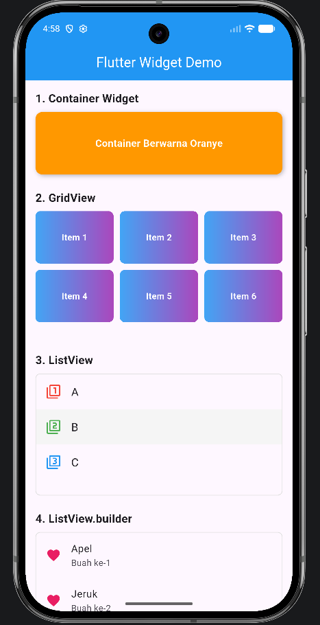
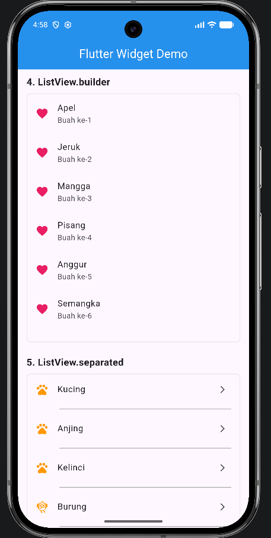
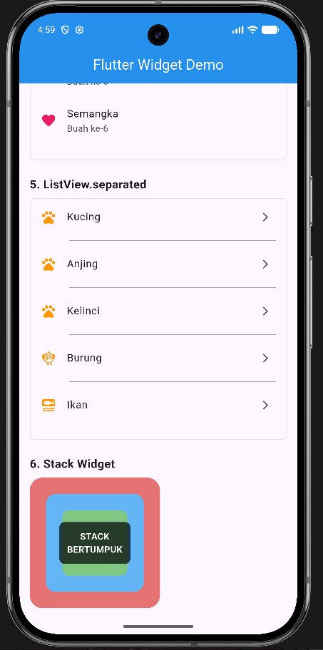

<div align="center">
  <br>

  <h1>LAPORAN PRAKTIKUM <br>
  APLIKASI BERBASIS PLATFORM
  </h1>

  <br>

  <h3>03-04 Mobile</h3>

  <br>

  


  <br>
  <br>
  <br>

  <h3>Disusun Oleh :</h3>

  <p>
    <strong>Irshad Benaya Fardeca</strong><br>
    <strong>2311102199</strong><br>
    <strong>S1 IF-11-REG01</strong>
  </p>

  <br>

  <h3>Dosen Pengampu :</h3>

  <p>
    <strong>Dimas Fanny Hebrasianto Permadi, S.ST., M.Kom</strong>
  </p>
  
  <br>
  <br>
    <h4>Asisten Praktikum :</h4>
    <strong>Apri Pandu Wicaksono </strong> <br>
    <strong>Rangga Pradarrell Fathi</strong>
  <br>

  <h3>LABORATORIUM HIGH PERFORMANCE
 <br>FAKULTAS INFORMATIKA <br>UNIVERSITAS TELKOM PURWOKERTO <br>2026</h3>
</div>
<hr>

# Tugas 03-04 Mobile
Buat 1 project Flutter yang menampilkan beberapa widget UI berikut
Yang harus ada:
1. Container → kotak berwarna
2. GridView → minimal 6 item (grid)
3. ListView → 3 item (A, B, C)
4. ListView.builder → list dari data array
5. ListView.separated → list + garis pembatas
6. Stack → tampilan bertumpuk (kotak / text)

## Source Code
### 1. Container
Fungsi: Widget serbaguna untuk membuat kotak dengan berbagai dekorasi (warna, border, bayangan, dll)
```dart
Container(
  width: double.infinity,
  height: 100,
  decoration: BoxDecoration(
    color: Colors.orange,
    borderRadius: BorderRadius.circular(12),
    boxShadow: const [
      BoxShadow(
        color: Colors.black26,
        blurRadius: 5,
        offset: Offset(2, 2),
      ),
    ],
  ),
  child: const Center(
    child: Text(
      'Container Berwarna Oranye',
      style: TextStyle(
        color: Colors.white,
        fontSize: 16,
        fontWeight: FontWeight.bold,
      ),
    ),
  ),
)
```

### 2. GridView
Fungsi: Menampilkan widget dalam bentuk grid/table (baris & kolom)
```dart
SizedBox(
  height: 200,
  child: GridView.count(
    crossAxisCount: 3,  // 3 kolom
    crossAxisSpacing: 10,
    mainAxisSpacing: 10,
    childAspectRatio: 1.5,
    children: List.generate(6, (index) {
      return Container(
        decoration: BoxDecoration(
          gradient: LinearGradient(
            colors: [Colors.blue.shade400, Colors.purple.shade400],
          ),
          borderRadius: BorderRadius.circular(8),
        ),
        child: Center(
          child: Text(
            'Item ${index + 1}',
            style: const TextStyle(
              color: Colors.white,
              fontWeight: FontWeight.bold,
            ),
          ),
        ),
      );
    }),
  ),
)
```

### 3. ListView
Fungsi: Menampilkan daftar widget secara vertikal (item terbatas)
```dart
ListView(
  shrinkWrap: true,  // Mengikuti tinggi konten
  physics: const NeverScrollableScrollPhysics(),  // Nonaktifkan scroll
  children: [
    const ListTile(
      leading: Icon(Icons.filter_1, color: Colors.red),
      title: Text('A', style: TextStyle(fontSize: 18)),
    ),
    Container(
      color: Colors.grey.shade100,
      child: const ListTile(
        leading: Icon(Icons.filter_2, color: Colors.green),
        title: Text('B', style: TextStyle(fontSize: 18)),
      ),
    ),
    const ListTile(
      leading: Icon(Icons.filter_3, color: Colors.blue),
      title: Text('C', style: TextStyle(fontSize: 18)),
    ),
  ],
)
```

### 4. ListView.builder
Fungsi: Membuat list secara efisien untuk data dalam jumlah besar (hanya me-render item yang terlihat)
```dart
ListView.builder(
  shrinkWrap: true,
  physics: const NeverScrollableScrollPhysics(),
  itemCount: fruits.length,  // Jumlah item dari array
  itemBuilder: (context, index) {
    return ListTile(
      leading: const Icon(Icons.favorite, color: Colors.pink),
      title: Text(fruits[index]),
      subtitle: Text('Buah ke-${index + 1}'),
    );
  },
)

// Data array
const List<String> fruits = [
  'Apel', 'Jeruk', 'Mangga', 'Pisang', 'Anggur', 'Semangka',
];
```

### 5. ListView.separated
Fungsi: Sama seperti ListView.builder tapi dengan widget pemisah (divider) di antara item
```dart
ListView.separated(
  shrinkWrap: true,
  physics: const NeverScrollableScrollPhysics(),
  itemCount: animals.length,
  separatorBuilder: (context, index) {
    return const Divider(
      color: Colors.grey,
      thickness: 1,
      indent: 60,
      endIndent: 16,
    );
  },
  itemBuilder: (context, index) {
    return ListTile(
      leading: Icon(animalIcons[index], color: Colors.orange),
      title: Text(animals[index]),
      trailing: const Icon(Icons.arrow_forward_ios, size: 16),
    );
  },
)

// Data array
const List<String> animals = ['Kucing', 'Anjing', 'Kelinci', 'Burung', 'Ikan'];
```

### 6. Stack
Fungsi: Menumpuk beberapa widget di atas satu sama lain (seperti layer/lapisan)
```dart
SizedBox(
  height: 200,
  child: Stack(
    alignment: Alignment.center,
    children: [
      // Layer 1 (paling bawah)
      Container(
        width: 200,
        height: 200,
        decoration: BoxDecoration(
          color: Colors.red.shade300,
          borderRadius: BorderRadius.circular(20),
        ),
      ),
      // Layer 2
      Container(
        width: 150,
        height: 150,
        decoration: BoxDecoration(
          color: Colors.blue.shade300,
          borderRadius: BorderRadius.circular(15),
        ),
      ),
      // Layer 3
      Container(
        width: 100,
        height: 100,
        decoration: BoxDecoration(
          color: Colors.green.shade300,
          borderRadius: BorderRadius.circular(10),
        ),
      ),
      // Layer 4 (paling atas)
      Container(
        padding: const EdgeInsets.all(12),
        decoration: BoxDecoration(
          color: Colors.black.withOpacity(0.7),
          borderRadius: BorderRadius.circular(8),
        ),
        child: const Text(
          'STACK\nBERTUMPUK',
          textAlign: TextAlign.center,
          style: TextStyle(
            color: Colors.white,
            fontWeight: FontWeight.bold,
            fontSize: 14,
          ),
        ),
      ),
    ],
  ),
)
```

---
## Output


<br>



<br>


