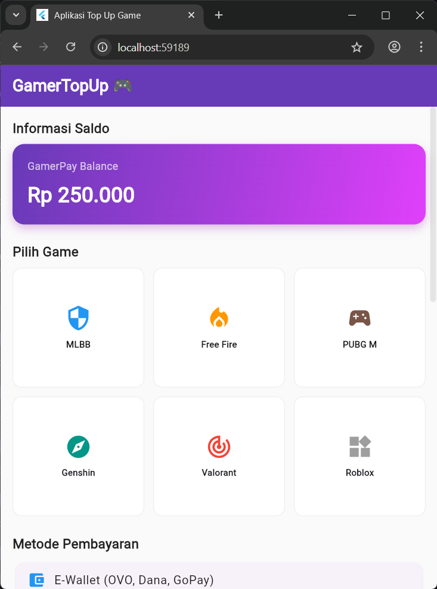
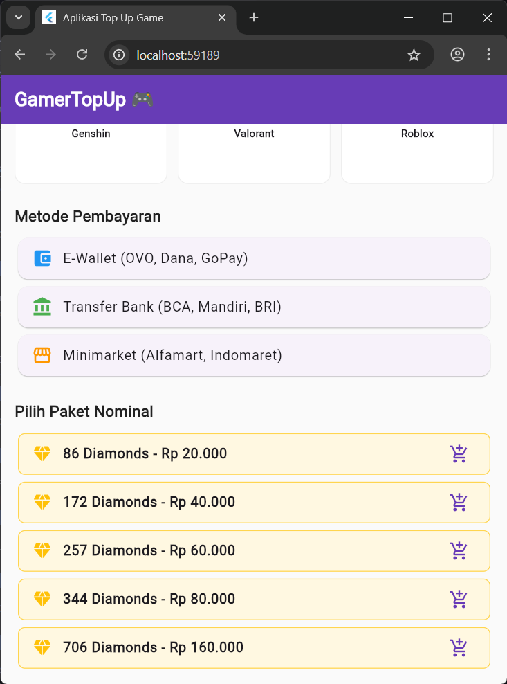
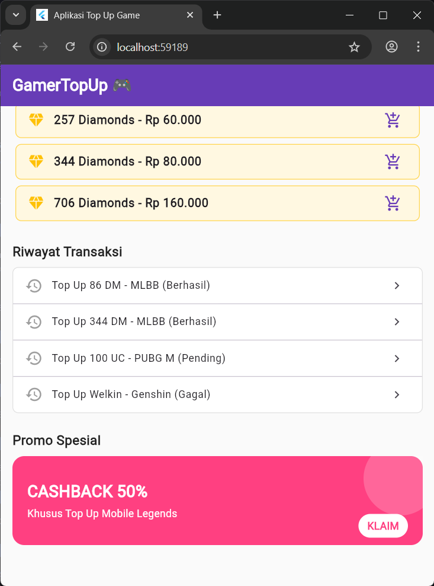

<div align="center">
   <h2>LAPORAN PRAKTIKUM<br>APLIKASI BERBASIS PLATFORM</h2>
   <h>
   <br>
   <h4>MODUL 03, 04 Mobile<br>Widget UI</h4>
   <br>
   
   <br><br>
 
**Disusun Oleh :**<br>
Dheva Dewa Septiantoni<br>
2311102324<br>
IF-11-01
<br><br>
 
**Dosen Pengampu :**<br>
Dimas Fanny Hebrasianto Permadi, S.ST., M.Kom
<br><br>
 
**Assisten Praktikum :**<br>
Apri Pandu Wicaksono
<br>Rangga Pradarrell Fathi
<br><br>
 
PROGRAM STUDI S1 TEKNIK INFORMATIKA<br>
FAKULTAS INFORMATIKA<br>
UNIVERSITAS TELKOM PURWOKERTO<br>
2026

</div>

## Dasar Teori
#### Modul 3 (Pengenalan Widget dan Layout Dasar)
Pada pemrograman Flutter, konsep utama yang harus dipahami adalah "Everything is a Widget" (Segala sesuatunya adalah Widget). Widget merupakan blok pembangun dasar dari antarmuka pengguna (UI) pada aplikasi Flutter.

1. Konsep Dasar Widget Widget mendeskripsikan bagaimana tampilan aplikasi seharusnya terlihat berdasarkan konfigurasi dan state (status) saat ini. Ketika terjadi perubahan state, Flutter akan membandingkan widget lama dan baru, lalu memperbarui tampilan secara efisien. Terdapat dua jenis utama widget:

    * Stateless Widget: Widget yang tidak memiliki state internal yang bisa berubah setelah diinisialisasi. Cocok untuk tampilan statis seperti teks, ikon, atau tombol yang tidak berubah bentuk.

    * Stateful Widget: Widget yang sifatnya dinamis dan dapat berubah sewaktu-waktu selama aplikasi berjalan (misalnya karena interaksi pengguna atau penerimaan data dari internet).

2. Kerangka Aplikasi (MaterialApp & Scaffold)

    * MaterialApp: Widget pembungkus utama (biasanya di root aplikasi) yang menyediakan konfigurasi tema, navigasi (routing), dan standar desain Material Google.

    * Scaffold: Merupakan kerangka dasar visual dari Material Design. Scaffold menyediakan struktur tata letak default yang memiliki ruang untuk AppBar (header), body (konten utama), FloatingActionButton, hingga BottomNavigationBar.

3. Layouting Dasar (Row & Column) Untuk mengatur posisi banyak widget sekaligus, Flutter menggunakan widget layout:

    * Column: Menyusun anak-anak widget-nya (children) secara vertikal (dari atas ke bawah).

    * Row: Menyusun anak-anak widget-nya secara horizontal (dari kiri ke kanan).

#### Modul 4 (Widget Lanjutan dan Pengelolaan Data)
Modul ini berfokus pada implementasi tata letak yang lebih kompleks, pengaturan ruang, serta bagaimana menangani daftar data yang panjang (scrolling behavior) secara efisien.

1. Container Container adalah widget yang paling sering digunakan untuk membungkus (wrapper) widget lain agar dapat diberikan gaya (styling). Container memungkinkan pengembang untuk mengatur width (lebar), height (tinggi), padding (jarak ke dalam), margin (jarak ke luar), warna latar belakang, serta dekorasi seperti sudut melengkung (border radius) dan bayangan (box shadow).

2. Menangani Data List (ListView) ListView adalah widget fundamental untuk membuat daftar elemen yang dapat di-scroll secara vertikal maupun horizontal. Terdapat beberapa variasi ListView berdasarkan kebutuhan:

    * ListView Standard: Cocok untuk menampilkan daftar item statis yang jumlahnya sedikit.

    * ListView.builder: Sangat efisien untuk menampilkan data dinamis (array/list) dalam jumlah besar. Widget ini hanya akan merender item yang saat itu terlihat di layar, sehingga sangat menghemat penggunaan memori perangkat.

    * ListView.separated: Memiliki fungsi yang sama dengan builder, namun dilengkapi dengan parameter separatorBuilder yang memungkinkan penyisipan widget pemisah (seperti garis Divider) di antara setiap item secara otomatis.

3. Tampilan Kisi (GridView) GridView digunakan untuk menampilkan sekumpulan data dalam tata letak kisi 2D (baris dan kolom) yang dapat di-scroll. GridView.count memungkinkan pengembang untuk menentukan jumlah kolom secara pasti (crossAxisCount), sehingga sangat cocok untuk membuat menu dashboard atau galeri foto.

4. Tampilan Bertumpuk (Stack & Positioned) Berbeda dengan Row atau Column yang menyusun elemen secara berurutan, Stack digunakan untuk menumpuk elemen secara z-axis (depan dan belakang).

    * Anak widget pertama di dalam Stack akan diletakkan di lapisan paling dasar (paling belakang).

    * Anak widget berikutnya akan menimpa widget sebelumnya.

    * Widget Positioned sering dikombinasikan di dalam Stack untuk memosisikan widget secara absolut (mengatur jarak spesifik dari atas, bawah, kiri, atau kanan layar).

## Source Code 
```dart
import 'package:flutter/material.dart';

void main() {
  runApp(const MyApp());
}

class MyApp extends StatelessWidget {
  const MyApp({super.key});

  @override
  Widget build(BuildContext context) {
    return MaterialApp(
      title: 'Aplikasi Top Up Game',
      debugShowCheckedModeBanner: false,
      theme: ThemeData(
        primarySwatch: Colors.deepPurple,
        scaffoldBackgroundColor: Colors.grey.shade50,
      ),
      home: const PraktikumScreen(),
    );
  }
}

class PraktikumScreen extends StatelessWidget {
  const PraktikumScreen({super.key});

  @override
  Widget build(BuildContext context) {
    // Data array untuk ListView.builder (Paket Top Up)
    final List<String> paketTopUp = [
      '86 Diamonds - Rp 20.000',
      '172 Diamonds - Rp 40.000',
      '257 Diamonds - Rp 60.000',
      '344 Diamonds - Rp 80.000',
      '706 Diamonds - Rp 160.000'
    ];

    // Data dummy game untuk GridView
    final List<Map<String, dynamic>> games = [
      {'nama': 'MLBB', 'icon': Icons.security, 'color': Colors.blue},
      {'nama': 'Free Fire', 'icon': Icons.local_fire_department, 'color': Colors.orange},
      {'nama': 'PUBG M', 'icon': Icons.sports_esports, 'color': Colors.brown},
      {'nama': 'Genshin', 'icon': Icons.explore, 'color': Colors.teal},
      {'nama': 'Valorant', 'icon': Icons.track_changes, 'color': Colors.red},
      {'nama': 'Roblox', 'icon': Icons.widgets, 'color': Colors.grey},
    ];

    // Data dummy riwayat untuk ListView.separated
    final List<String> riwayat = [
      'Top Up 86 DM - MLBB (Berhasil)',
      'Top Up 344 DM - MLBB (Berhasil)',
      'Top Up 100 UC - PUBG M (Pending)',
      'Top Up Welkin - Genshin (Gagal)',
    ];

    return Scaffold(
      appBar: AppBar(
        title: const Text('GamerTopUp 🎮', style: TextStyle(fontWeight: FontWeight.bold)),
        backgroundColor: Colors.deepPurple,
        foregroundColor: Colors.white,
        elevation: 0,
      ),
      body: SingleChildScrollView(
        padding: const EdgeInsets.all(16.0),
        child: Column(
          crossAxisAlignment: CrossAxisAlignment.start,
          children: [
            // ==========================================
            // 1. Container (Kartu Saldo)
            // ==========================================
            const SectionTitle(title: 'Informasi Saldo'),
            Container(
              width: double.infinity,
              padding: const EdgeInsets.all(20),
              decoration: BoxDecoration(
                gradient: const LinearGradient(
                  colors: [Colors.deepPurple, Colors.purpleAccent],
                  begin: Alignment.topLeft,
                  end: Alignment.bottomRight,
                ),
                borderRadius: BorderRadius.circular(16),
                boxShadow: [
                  BoxShadow(color: Colors.purple.withOpacity(0.3), blurRadius: 10, offset: const Offset(0, 5)),
                ],
              ),
              child: const Column(
                crossAxisAlignment: CrossAxisAlignment.start,
                children: [
                  Text('GamerPay Balance', style: TextStyle(color: Colors.white70, fontSize: 14)),
                  SizedBox(height: 8),
                  Text('Rp 250.000', style: TextStyle(color: Colors.white, fontSize: 28, fontWeight: FontWeight.bold)),
                ],
              ),
            ),
            const SizedBox(height: 24),

            // ==========================================
            // 2. GridView (Daftar Game)
            // ==========================================
            const SectionTitle(title: 'Pilih Game'),
            GridView.count(
              shrinkWrap: true,
              physics: const NeverScrollableScrollPhysics(),
              crossAxisCount: 3,
              crossAxisSpacing: 12,
              mainAxisSpacing: 12,
              childAspectRatio: 1.1,
              children: List.generate(games.length, (index) {
                return Container(
                  decoration: BoxDecoration(
                    color: Colors.white,
                    borderRadius: BorderRadius.circular(12),
                    border: Border.all(color: Colors.grey.shade200),
                  ),
                  child: Column(
                    mainAxisAlignment: MainAxisAlignment.center,
                    children: [
                      Icon(games[index]['icon'], color: games[index]['color'], size: 36),
                      const SizedBox(height: 8),
                      Text(games[index]['nama'], style: const TextStyle(fontSize: 12, fontWeight: FontWeight.bold)),
                    ],
                  ),
                );
              }),
            ),
            const SizedBox(height: 24),

            // ==========================================
            // 3. ListView (Metode Pembayaran)
            // ==========================================
            const SectionTitle(title: 'Metode Pembayaran'),
            ListView(
              shrinkWrap: true,
              physics: const NeverScrollableScrollPhysics(),
              children: const [
                Card(child: ListTile(leading: Icon(Icons.account_balance_wallet, color: Colors.blue), title: Text('E-Wallet (OVO, Dana, GoPay)'))),
                Card(child: ListTile(leading: Icon(Icons.account_balance, color: Colors.green), title: Text('Transfer Bank (BCA, Mandiri, BRI)'))),
                Card(child: ListTile(leading: Icon(Icons.storefront, color: Colors.orange), title: Text('Minimarket (Alfamart, Indomaret)'))),
              ],
            ),
            const SizedBox(height: 24),

            // ==========================================
            // 4. ListView.builder (Paket Top Up)
            // ==========================================
            const SectionTitle(title: 'Pilih Paket Nominal'),
            ListView.builder(
              shrinkWrap: true,
              physics: const NeverScrollableScrollPhysics(),
              itemCount: paketTopUp.length,
              itemBuilder: (context, index) {
                return Card(
                  color: Colors.amber.shade50,
                  elevation: 0,
                  shape: RoundedRectangleBorder(
                    side: BorderSide(color: Colors.amber.shade300, width: 1),
                    borderRadius: BorderRadius.circular(8),
                  ),
                  child: ListTile(
                    leading: const Icon(Icons.diamond, color: Colors.amber),
                    title: Text(paketTopUp[index], style: const TextStyle(fontWeight: FontWeight.w600)),
                    trailing: const Icon(Icons.add_shopping_cart, color: Colors.deepPurple),
                  ),
                );
              },
            ),
            const SizedBox(height: 24),

            // ==========================================
            // 5. ListView.separated (Riwayat Transaksi)
            // ==========================================
            const SectionTitle(title: 'Riwayat Transaksi'),
            Container(
              decoration: BoxDecoration(
                color: Colors.white,
                border: Border.all(color: Colors.grey.shade300),
                borderRadius: BorderRadius.circular(8),
              ),
              child: ListView.separated(
                shrinkWrap: true,
                physics: const NeverScrollableScrollPhysics(),
                itemCount: riwayat.length,
                separatorBuilder: (context, index) => const Divider(height: 1, thickness: 1),
                itemBuilder: (context, index) {
                  return ListTile(
                    leading: const Icon(Icons.history, color: Colors.grey),
                    title: Text(riwayat[index], style: const TextStyle(fontSize: 14)),
                    trailing: const Icon(Icons.chevron_right, size: 20),
                  );
                },
              ),
            ),
            const SizedBox(height: 24),

            // ==========================================
            // 6. Stack (Banner Promo)
            // ==========================================
            const SectionTitle(title: 'Promo Spesial'),
            Center(
              child: Stack(
                alignment: Alignment.centerLeft,
                children: [
                  // Latar Belakang Kartu Promo
                  Container(
                    width: double.infinity,
                    height: 120,
                    decoration: BoxDecoration(
                      color: Colors.pinkAccent,
                      borderRadius: BorderRadius.circular(16),
                    ),
                  ),
                  // Dekorasi lingkaran di belakang
                  Positioned(
                    right: -20,
                    top: -20,
                    child: Container(
                      width: 100,
                      height: 100,
                      decoration: BoxDecoration(color: Colors.white.withOpacity(0.2), shape: BoxShape.circle),
                    ),
                  ),
                  // Teks Promo
                  const Padding(
                    padding: EdgeInsets.symmetric(horizontal: 20),
                    child: Column(
                      crossAxisAlignment: CrossAxisAlignment.start,
                      children: [
                        Text('CASHBACK 50%', style: TextStyle(color: Colors.white, fontSize: 22, fontWeight: FontWeight.bold)),
                        SizedBox(height: 4),
                        Text('Khusus Top Up Mobile Legends', style: TextStyle(color: Colors.white, fontSize: 14)),
                      ],
                    ),
                  ),
                  // Ikon / Badge melayang
                  Positioned(
                    right: 20,
                    bottom: 10,
                    child: Container(
                      padding: const EdgeInsets.symmetric(horizontal: 12, vertical: 6),
                      decoration: BoxDecoration(color: Colors.white, borderRadius: BorderRadius.circular(20)),
                      child: const Text('KLAIM', style: TextStyle(color: Colors.pinkAccent, fontWeight: FontWeight.bold)),
                    ),
                  )
                ],
              ),
            ),
            const SizedBox(height: 40),
          ],
        ),
      ),
    );
  }
}

// Widget Bantuan untuk Judul Bagian
class SectionTitle extends StatelessWidget {
  final String title;
  const SectionTitle({super.key, required this.title});

  @override
  Widget build(BuildContext context) {
    return Padding(
      padding: const EdgeInsets.only(bottom: 8.0),
      child: Text(
        title,
        style: const TextStyle(fontSize: 18, fontWeight: FontWeight.bold, color: Colors.black87),
      ),
    );
  }
}
```
## Penjelasan Kode 

Berikut adalah penjelasan fungsi dari widget-widget yang digunakan dalam aplikasi Flutter di atas:

1. Container

Widget serbaguna yang digunakan untuk membungkus (wrapping) elemen UI lainnya. Dengan Container, kita bisa mengatur styling dasar seperti memberi warna background, padding, margin, border, dan ukuran tinggi/lebar suatu elemen. Pada tugas ini, digunakan untuk membuat kotak berwarna biru.

2. GridView

Widget yang digunakan untuk menampilkan sekumpulan data atau children dalam format grid dua dimensi (baris dan kolom). Sangat cocok untuk menampilkan UI seperti galeri foto, menu berbentuk ubin (tiles), dan sejenisnya. Dalam kode ini digunakan GridView.count untuk menampilkan 6 item berbentuk kotak dengan 3 kolom.

3. ListView

Widget scrollable dasar yang digunakan untuk menyusun elemen UI secara berurutan dalam satu arah (secara default vertikal). ListView standar paling cocok digunakan jika jumlah item yang ditampilkan statis dan relatif sedikit. Pada kode ini digunakan untuk membuat daftar berurut secara manual: Item A, B, dan C.

4. ListView.builder

Versi dari ListView yang lebih efisien dalam manajemen memori (lazy loading). Ia hanya akan merender widget atau item yang saat itu benar-benar terlihat di layar device. Ini sangat wajib digunakan apabila kita harus melakukan looping tampilan dari sumber data array dinamis dengan jumlah besar.

5. ListView.separated

Secara konsep kerja sama persis dengan ListView.builder (mendukung rendering dinamis/lazy load). Namun, widget ini memiliki keunggulan parameter tambahan bernama separatorBuilder, yang berfungsi untuk memberikan elemen sisipan secara otomatis di antara daftar item. Pada tugas ini digunakan untuk menyelipkan garis pembatas (Divider) berwarna merah antar item list-nya.

6. Stack

Widget unik yang menyusun anak-anaknya (children) secara vertikal menembus layar (z-axis/bertumpuk tumpang tindih). Elemen pertama yang dideklarasikan akan berada di tumpukan paling bawah (background), dan elemen yang ditulis lebih akhir akan berada di tumpukan paling atas. Berguna untuk membuat desain yang elemen-elemennya bertabrakan seperti teks di atas gambar atau lencana/notifikasi (badges).

## Dokumentasi Screenshoot




## Kesimpulan dan Penutup
Tugas Praktikum Modul 03 dan 04 ini mengimplementasikan tata letak antarmuka aplikasi mobile menggunakan widget lanjutan Flutter. Fokus utamanya adalah penyusunan komponen visual yang responsif dan terstruktur melalui kombinasi Container, GridView, variasi ListView, serta Stack. Cocok digunakan sebagai pembelajaran praktikum bagi mahasiswa program studi Informatika untuk merancang UI aplikasi modern