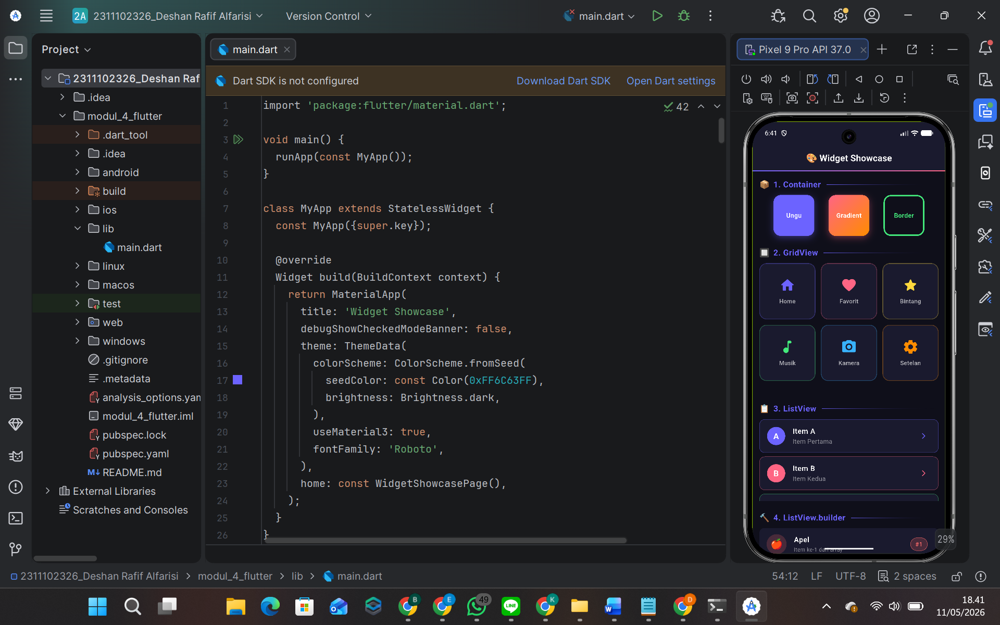

<div align="center">
  <br />
  <h1>LAPORAN PRAKTIKUM <br>APLIKASI BERBASIS PLATFORM</h1>
  <br />
  <h2>MODUL 4 FLUTTER <br>WIDGET SHOWCASE</h2>
  <br /><br />

  

  <br /><br /><br />

  <h3>Disusun Oleh :</h3>

  <p>
    <strong>Deshan Rafif Alfarisi</strong><br>
    <strong>2311102326</strong><br>
    <strong>S1 IF-11-REG 01</strong>
  </p>

  <br />

  <h3>Dosen Pengampu :</h3>

  <p>
    <strong>Dimas Fanny Hebrasianto Permadi, S.ST., M.Kom</strong>
  </p>

  <br /><br />

  <h4>Asisten Praktikum :</h4>

  <p>
    <strong>Apri Pandu Wicaksono</strong><br>
    <strong>Rangga Pradarrell Fathi</strong>
  </p>

  <br />

  <h2>
  LABORATORIUM HIGH PERFORMANCE <br>
  FAKULTAS INFORMATIKA <br>
  UNIVERSITAS TELKOM PURWOKERTO <br>
  2026
  </h2>
</div>

---

## 1. Pendahuluan

Flutter merupakan framework yang dikembangkan oleh Google untuk membangun aplikasi multiplatform yang dapat berjalan di berbagai perangkat seperti Android, iOS, Web, dan Desktop dengan menggunakan satu basis kode. Dalam praktikum ini, fokus utama adalah mengembangkan pemahaman mendalam tentang penggunaan berbagai widget dasar Flutter untuk membangun antarmuka pengguna yang menarik dan responsif.

Praktikum Modul 4 Flutter ini berfokus pada Widget Showcase, sebuah aplikasi yang dirancang untuk menampilkan dan mendemonstrasikan penggunaan berbagai widget penting dalam Flutter. Aplikasi ini menggabungkan konsep-konsep seperti `ListView`, `GridView`, `Stack`, `Container`, dan widget-widget lainnya dalam satu antarmuka yang kohesif dan menarik secara visual.

Tujuan utama dari praktikum ini adalah memberikan pengalaman praktis kepada mahasiswa dalam mengintegrasikan berbagai widget Flutter untuk menciptakan aplikasi dengan tampilan yang professional dan user experience yang baik.

---

## 2. Tujuan Praktikum

Tujuan dari praktikum ini adalah sebagai berikut:

1. Memahami dan menguasai berbagai widget dasar yang tersedia dalam Flutter.
2. Mampu mengintegrasikan multiple widget untuk membentuk aplikasi yang kompleks dan fungsional.
3. Memahami konsep Material Design dan menerapkannya dalam pembuatan antarmuka.
4. Mampu menggunakan widget seperti `ListView.builder`, `GridView`, `Stack`, dan `Container` secara efektif.
5. Mengembangkan kemampuan dalam styling dan customization widget untuk menciptakan tampilan visual yang menarik.
6. Memahami konsep state management dan data handling dalam aplikasi Flutter.

---

## 3. Dasar Teori

### 3.1 Flutter Framework

Flutter adalah framework UI open-source yang dikembangkan oleh Google untuk membangun aplikasi mobile, web, dan desktop yang native dan cepat. Flutter menggunakan bahasa pemrograman Dart dan memiliki filosofi "Everything is a Widget" yang menjadi fondasi dari pengembangan aplikasi Flutter.

Keunggulan Flutter mencakup:
- Hot Reload untuk pengembangan yang lebih cepat
- Rich set of pre-designed widgets yang mengikuti Material Design dan Cupertino design
- Performance yang tinggi dengan rendering yang smooth
- Single codebase untuk multiple platforms

### 3.2 Widget

Widget adalah blok building fundamental dalam Flutter. Setiap elemen UI dalam Flutter adalah widget, mulai dari yang sederhana seperti `Text` dan `Button` hingga yang kompleks seperti `ListView` dan `GridView`. Widget dapat dibagi menjadi dua kategori utama: StatelessWidget dan StatefulWidget.

**StatelessWidget** adalah widget yang tidak mengubah state selama aplikasi berjalan. Widget ini ideal untuk menampilkan konten statis yang tidak perlu diupdate.

**StatefulWidget** adalah widget yang dapat mengubah tampilan berdasarkan perubahan internal state-nya. Widget ini digunakan ketika ada kebutuhan untuk merespons user input atau perubahan data.

### 3.3 MaterialApp dan Scaffold

`MaterialApp` adalah widget yang membungkus aplikasi Flutter dan menyediakan Material Design theming dan navigation. `Scaffold` adalah widget yang menyediakan struktur dasar halaman dengan AppBar, body, dan floating action button.

### 3.4 Container

`Container` adalah widget versatile yang dapat digunakan untuk styling, positioning, dan sizing konten. Widget ini menerima properties seperti color, padding, margin, decoration, dan constraints.

### 3.5 ListView

`ListView` adalah widget untuk menampilkan daftar item yang dapat discroll. Terdapat beberapa varian ListView:

- `ListView` biasa: untuk daftar kecil dengan jumlah item yang terbatas
- `ListView.builder`: untuk daftar besar yang dibangun secara dinamis berdasarkan data
- `ListView.separated`: untuk daftar dengan separator antar item

### 3.6 GridView

`GridView` adalah widget untuk menampilkan item dalam format grid atau kisi. Widget ini memungkinkan penampilan data dalam kolom dan baris yang teratur.

### 3.7 Stack

`Stack` adalah widget untuk menumpuk widget-widget di atas satu sama lain. Widget pertama ditempatkan di bagian bawah dan widget terakhir di atas, menciptakan efek layering.

### 3.8 AppBar

`AppBar` adalah widget untuk menampilkan bagian atas aplikasi yang biasanya berisi judul, icon, dan aksi tombol. AppBar menyediakan visual consistency dengan Material Design.

---

## 4. Implementasi

### 4.1 Struktur Dasar Aplikasi

Aplikasi Widget Showcase dibangun dengan struktur berikut:

```dart
import 'package:flutter/material.dart';

void main() {
  runApp(const MyApp());
}
```

Struktur ini memastikan bahwa aplikasi dimulai dengan menjalankan widget utama `MyApp`.

### 4.2 MyApp dan Theming

```dart
class MyApp extends StatelessWidget {
  const MyApp({super.key});

  @override
  Widget build(BuildContext context) {
    return MaterialApp(
      title: 'Widget Showcase',
      debugShowCheckedModeBanner: false,
      theme: ThemeData(
        colorScheme: ColorScheme.fromSeed(
          seedColor: const Color(0xFF6C63FF),
          brightness: Brightness.dark,
        ),
        useMaterial3: true,
        fontFamily: 'Roboto',
      ),
      home: const WidgetShowcasePage(),
    );
  }
}
```

Pada bagian ini, aplikasi dikonfigurasi dengan:
- Tema dark dengan warna primer ungu (0xFF6C63FF)
- Material Design 3 untuk tampilan modern
- Font Roboto untuk konsistensi typografi

### 4.3 Data Struktur

Data untuk ListView.builder didefinisikan sebagai list of maps:

```dart
final List<Map<String, dynamic>> buahList = [
  {'nama': 'Apel', 'emoji': '🍎', 'warna': Color(0xFFFF6B6B)},
  {'nama': 'Pisang', 'emoji': '🍌', 'warna': Color(0xFFFFD93D)},
  {'nama': 'Mangga', 'emoji': '🥭', 'warna': Color(0xFFFF8C00)},
  {'nama': 'Anggur', 'emoji': '🍇', 'warna': Color(0xFF9B59B6)},
  {'nama': 'Stroberi', 'emoji': '🍓', 'warna': Color(0xFFE91E63)},
];
```

Struktur data ini memudahkan pengaksesan informasi tentang buah-buahan untuk ditampilkan dalam ListView.

### 4.4 Halaman Utama dengan Scaffold

Halaman utama menggunakan `Scaffold` untuk struktur dasar dengan `AppBar` yang menarik dan `body` yang berisi konten utama.

### 4.5 Implementasi ListView.builder

Widget `ListView.builder` digunakan untuk menampilkan daftar buah-buahan secara dinamis berdasarkan data yang tersedia. Setiap item dibangun menggunakan `itemBuilder` callback yang menghasilkan widget untuk setiap indeks.

### 4.6 Implementasi GridView

GridView digunakan untuk menampilkan widget dalam format grid dengan jumlah kolom yang dapat dikonfigurasi. GridView.count dengan crossAxisCount memungkinkan pengaturan jumlah kolom secara fleksibel.

### 4.7 Implementasi Stack

Stack digunakan untuk membuat efek layering, memungkinkan positioning widget secara absolut dan relatif untuk menciptakan tampilan visual yang kompleks dan menarik.

---

## 5. Hasil Praktikum

Setelah mengimplementasikan semua widget yang dipelajari, aplikasi berhasil menampilkan:

1. **Halaman Showcase** dengan AppBar yang custom dan menarik
2. **ListView.builder** yang menampilkan daftar buah-buahan dengan emoji dan warna yang sesuai
3. **GridView** untuk menampilkan item-item dalam format kisi
4. **Stack** untuk membuat efek visual yang kompleks dengan layering widget
5. **Custom Styling** dengan menggunakan Container dan decoration untuk menciptakan visual yang konsisten dengan tema aplikasi

Aplikasi menunjukkan integrasi yang baik dari berbagai widget Flutter dan mendemonstrasikan penggunaan Material Design yang tepat.



---

## 6. Pembahasan

Praktikum ini memberikan insight yang mendalam tentang cara kerja berbagai widget dalam Flutter. Beberapa poin penting yang dapat didiskusikan:

**Efektivitas ListView.builder** dibandingkan dengan ListView biasa terletak pada efisiensi memori. Dengan menggunakan builder pattern, hanya widget-widget yang visible pada layar yang di-render, sehingga sangat efisien untuk daftar yang besar.

**GridView vs ListView** memiliki use case yang berbeda. GridView lebih cocok untuk menampilkan item-item yang memiliki visual yang penting, sementara ListView lebih cocok untuk daftar yang linear dan berbentuk panjang.

**Stack untuk Layering** memberikan flexibility dalam positioning widget yang tidak dapat dicapai dengan widget seperti Column atau Row. Ini memungkinkan kreativitas dalam desain UI yang kompleks.

**Theme dan Styling** yang konsisten menggunakan ColorScheme dan Material3 membuat aplikasi terlihat modern dan professional.

Integrasi dari berbagai widget ini menunjukkan bahwa Flutter menyediakan toolkit yang comprehensive untuk membangun aplikasi yang sophisticated dan user-friendly.

---

## 7. Kesimpulan

Berdasarkan praktikum yang telah dilakukan, dapat disimpulkan bahwa:

1. Flutter menyediakan widget-widget yang powerful dan fleksibel untuk membangun antarmuka aplikasi.
2. Pemahaman yang baik tentang berbagai widget seperti ListView, GridView, Stack, dan Container adalah fundamental dalam pengembangan aplikasi Flutter.
3. Material Design 3 dalam Flutter memudahkan pengembang untuk membuat aplikasi yang visually appealing dan consistent.
4. Integrasi multiple widget dapat dilakukan dengan smooth untuk menciptakan aplikasi yang kompleks namun tetap maintainable.
5. Data-driven approach menggunakan list of maps memudahkan management data dan rendering dinamis.

Praktikum ini telah memberikan pengalaman yang valuable dalam mengembangkan aplikasi Flutter yang memadukan berbagai widget dan konsep yang telah dipelajari.

---

## Referensi

1. Flutter Official Documentation. *Introduction to Widgets*. https://docs.flutter.dev/development/ui/widgets-intro
2. Flutter Official Documentation. *Material Components*. https://docs.flutter.dev/development/ui/widgets/material
3. Flutter Official Documentation. *ListView class*. https://api.flutter.dev/flutter/widgets/ListView-class.html
4. Flutter Official Documentation. *GridView class*. https://api.flutter.dev/flutter/widgets/GridView-class.html
5. Flutter Official Documentation. *Stack class*. https://api.flutter.dev/flutter/widgets/Stack-class.html
6. Dart Official Website. *Dart Documentation*. https://dart.dev/guides
7. Telkom University Modul Praktikum Pemrograman Perangkat Bergerak 2024

---

**Tanggal Pengumpulan:** 11 Mei 2026
